# 🚀 项目驱动的 Vue 3 学习体系

> **一个项目，四个阶段，从零到全栈。**
> 不是零散的 demo，而是在同一个产品上持续演进——Todo → 任务管理系统 → 全栈电商 → 原理深潜。

## 📋 课程总览

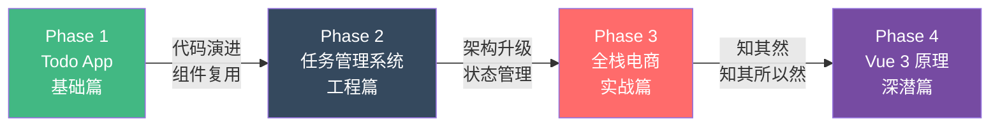

## 🧭 学习契约

每节课严格遵守以下格式：

```
🎯 本节目标：做什么（一句话说清）
📦 本节产出：得到什么（可运行的代码 / 可演示的功能）
🔗 前置钩子：依赖哪节课的产出
🔗 后续钩子：为哪节课铺路
```

## ⚡ 立场声明：全程 Composition API

> **本教程主线实战代码全程采用 Composition API + `<script setup>` 语法糖。**
> 对比分析和设计哲学章节（D01、L37）会展示少量 Options API 示例以帮助理解差异。详见深度专题 D01。

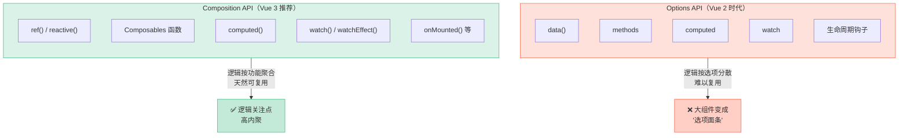

---

## Phase 1：Todo App（基础篇）

> **目标产物：** 一个功能完整、支持筛选和本地持久化的 Todo 应用
> **预计时长：** 12-16 小时 | **课时：** 8 节

### 课程依赖图

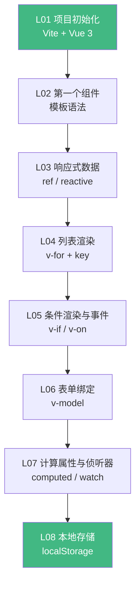

### L01 · 项目脚手架 + 开发环境

```
🎯 本节目标：用 Vite 创建 Vue 3 项目，理解项目结构
📦 本节产出：可运行的 Hello World 项目 + 配置好的开发环境
🔗 前置钩子：无（起点）
🔗 后续钩子：L02 将在此项目基础上创建第一个组件
```

**核心内容：**
- `npm create vue@latest` 脚手架解析
- Vite 为什么快：ESM 原生模块 vs Webpack 打包
- 项目目录结构：`src/`、`public/`、`vite.config.ts`
- SFC 单文件组件 `.vue` 的三段式结构
- `<script setup>` 语法糖 —— 为什么不用 `export default`

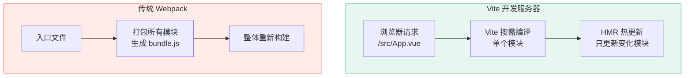

### L02 · 第一个组件：TodoItem

```
🎯 本节目标：创建 TodoItem 组件，理解 Props 单向数据流
📦 本节产出：可渲染静态 Todo 项的组件
🔗 前置钩子：L01 的项目结构
🔗 后续钩子：L03 将为组件注入响应式数据
```

**核心内容：**
- 组件定义与注册（`<script setup>` 中自动注册）
- `defineProps()` 类型声明
- Props 单向数据流原则
- 模板插值 `{{ }}` 与属性绑定 `:bind`

### L03 · 响应式数据：让 Todo 动起来

```
🎯 本节目标：掌握 ref() 和 reactive()，理解 Vue 3 响应式心智模型
📦 本节产出：可动态添加 Todo 的应用
🔗 前置钩子：L02 的 TodoItem 组件
🔗 后续钩子：L04 将用 v-for 渲染 Todo 列表
```

**核心内容：**
- `ref()` 用于原始值，`reactive()` 用于对象
- `.value` 的存在理由（参见深度专题 D05）
- 响应式心智模型：数据变 → 视图自动变
- DevTools 中观察响应式数据

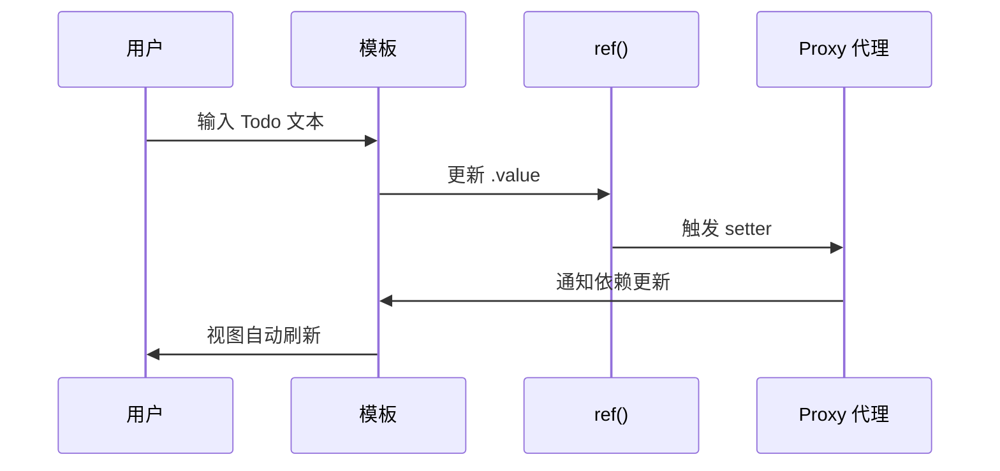

### L04 · 列表渲染：v-for 与 key 的秘密

```
🎯 本节目标：用 v-for 渲染 Todo 列表，理解 key 在 diff 算法中的角色
📦 本节产出：可展示多条 Todo 的列表视图
🔗 前置钩子：L03 的响应式 Todo 数组
🔗 后续钩子：L05 将为列表添加条件渲染和事件处理
```

**核心内容：**
- `v-for` 渲染数组与对象
- `key` 的作用：给 Virtual DOM diff 提供身份标识
- 为什么不要用 `index` 作为 key（动画/表单状态丢失）
- 数组变更检测：`push`/`splice` vs 直接赋值

### L05 · 条件渲染与事件：完成 / 删除

```
🎯 本节目标：实现 Todo 的完成切换和删除功能
📦 本节产出：可完成、可删除的 Todo 应用
🔗 前置钩子：L04 的 Todo 列表
🔗 后续钩子：L06 将用 v-model 实现编辑功能
```

**核心内容：**
- `v-if` / `v-else` / `v-show` 的区别与选择
- `@click` 事件绑定与 `$emit` 子向父通信
- `defineEmits()` 类型声明
- CSS 过渡：`<Transition>` 组件入门

### L06 · 表单与 v-model：双向绑定

```
🎯 本节目标：用 v-model 实现 Todo 内联编辑，理解双向绑定本质
📦 本节产出：支持内联编辑的 Todo 应用
🔗 前置钩子：L05 的事件系统
🔗 后续钩子：L07 将基于数据添加筛选和统计功能
```

**核心内容：**
- `v-model` 是 `:value` + `@input` 的语法糖
- 组件上的 `v-model`（`defineModel()`）
- 修饰符：`.trim`、`.lazy`、`.number`
- 表单验证基础

### L07 · computed 与 watch：筛选 + 统计

```
🎯 本节目标：用 computed 实现智能筛选，用 watch 实现副作用
📦 本节产出：支持 全部/进行中/已完成 筛选 + 统计面板的 Todo App
🔗 前置钩子：L06 的完整 Todo CRUD
🔗 后续钩子：L08 将把数据持久化到 localStorage
```

**核心内容：**
- `computed()` 的缓存机制（vs 方法调用）
- `watch()` 与 `watchEffect()` 的区别
- 筛选逻辑：`computed` + `Array.filter`
- 统计面板：完成率、剩余数量

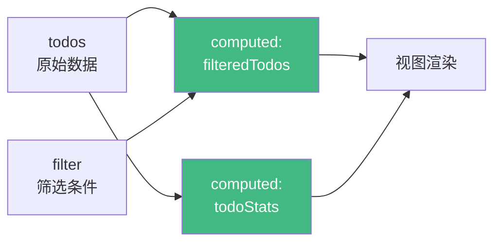

### L08 · 本地持久化：localStorage + Composable

```
🎯 本节目标：将 Todo 数据持久化到 localStorage，并抽取第一个 Composable
📦 本节产出：刷新不丢失数据的 Todo App + useLocalStorage composable
🔗 前置钩子：L07 的完整筛选逻辑
🔗 后续钩子：Phase 2 将在此基础上升级为任务管理系统
```

**核心内容：**
- `watch` 深度监听 + `JSON.stringify` 序列化
- 抽取 `useLocalStorage()` composable
- Composable 命名规范与设计原则
- Phase 1 总结：回顾所有概念的关联

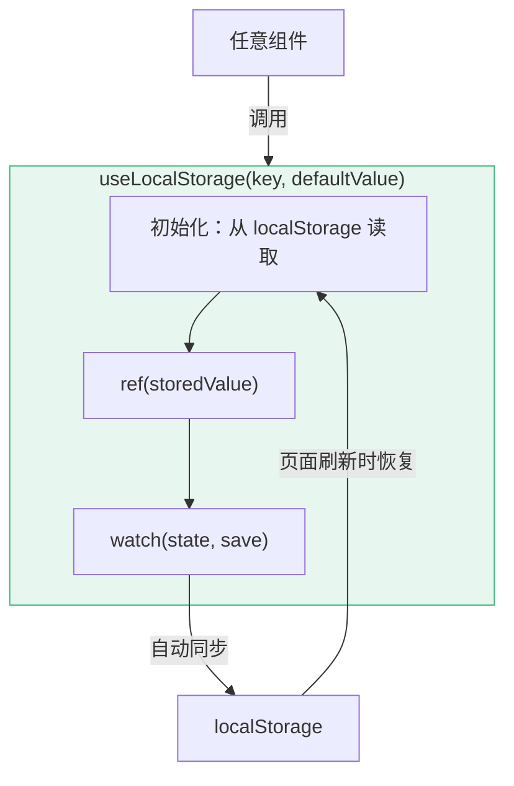

---

## Phase 2：任务管理系统（工程篇）

> **目标产物：** 在 Todo App 基础上演进为支持分类、拖拽、路由、状态管理的任务管理系统
> **预计时长：** 20-28 小时 | **课时：** 10 节

### 课程依赖图

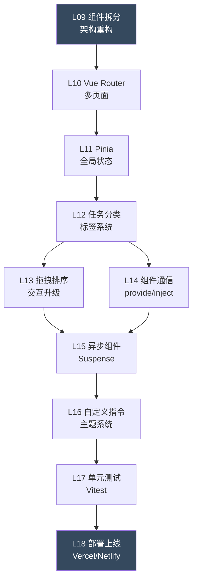

### L09 · 架构升级：从单文件到工程化

```
🎯 本节目标：将 Phase 1 的单文件 Todo 重构为多组件架构
📦 本节产出：按功能拆分的组件树 + 清晰的目录结构
🔗 前置钩子：Phase 1 的完整 Todo App（L08 产出）
🔗 后续钩子：L10 将为拆分后的组件添加路由
```

**核心内容：**
- 组件粒度划分原则（容器组件 vs 展示组件）
- 目录结构设计：`components/`、`composables/`、`stores/`、`views/`
- Slots 插槽：`<slot>`、具名插槽、作用域插槽
- `<KeepAlive>` 组件缓存

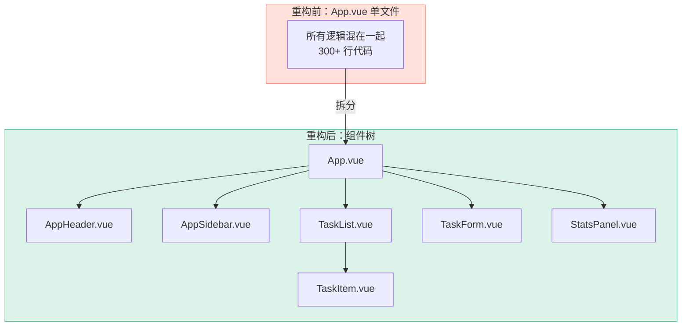

### L10 · Vue Router：从单页到多页

```
🎯 本节目标：集成 Vue Router，实现任务视图、统计视图、设置页面的路由
📦 本节产出：支持多视图切换的 SPA + 路由守卫登录模拟
🔗 前置钩子：L09 拆分后的组件架构
🔗 后续钩子：L11 将引入 Pinia 管理跨路由的共享状态
```

**核心内容：**
- `createRouter` + `createWebHistory`
- 路由配置：静态路由、动态路由 `:id`、嵌套路由
- `<RouterView>` 与 `<RouterLink>`
- 路由守卫：`beforeEach` 实现权限控制
- 路由懒加载：`() => import('./views/xxx.vue')`

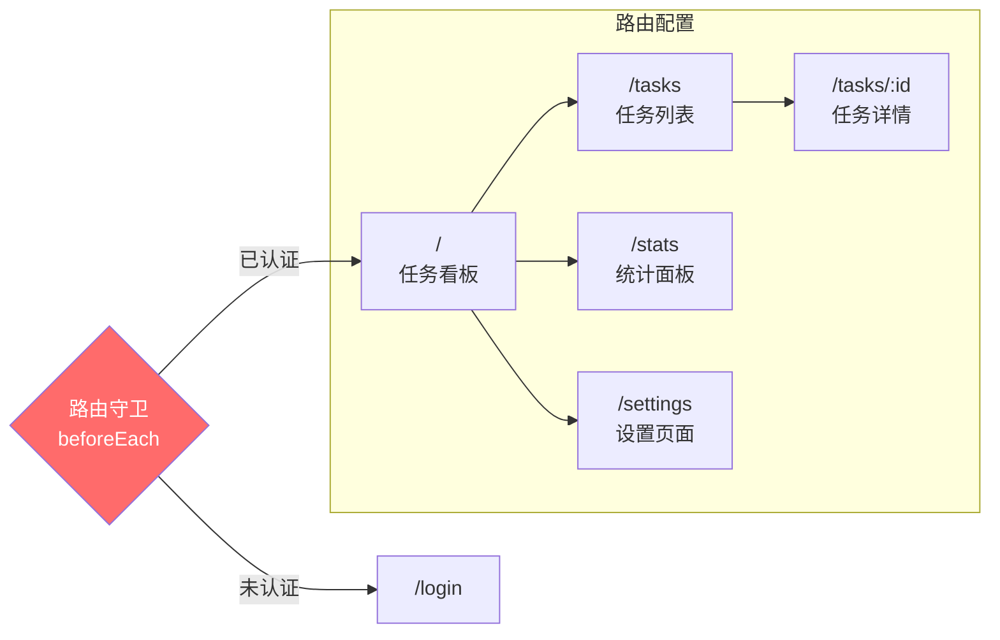

### L11 · Pinia：全局状态管理

```
🎯 本节目标：用 Pinia 替代 localStorage composable，实现跨组件状态共享
📦 本节产出：完整的 Pinia store 架构 + 持久化插件
🔗 前置钩子：L10 的多路由架构（跨路由共享数据的需求出现）
🔗 后续钩子：L12 将在 store 基础上实现标签分类系统
```

**核心内容：**
- `defineStore` 的 Setup 语法（与 Composition API 一致）
- State / Getters / Actions 对应 `ref` / `computed` / 函数
- Store 组合：`useTaskStore` 引用 `useUserStore`
- `pinia-plugin-persistedstate` 持久化
- 为什么选 Pinia 而不是 Vuex 4（参见深度专题 D08）

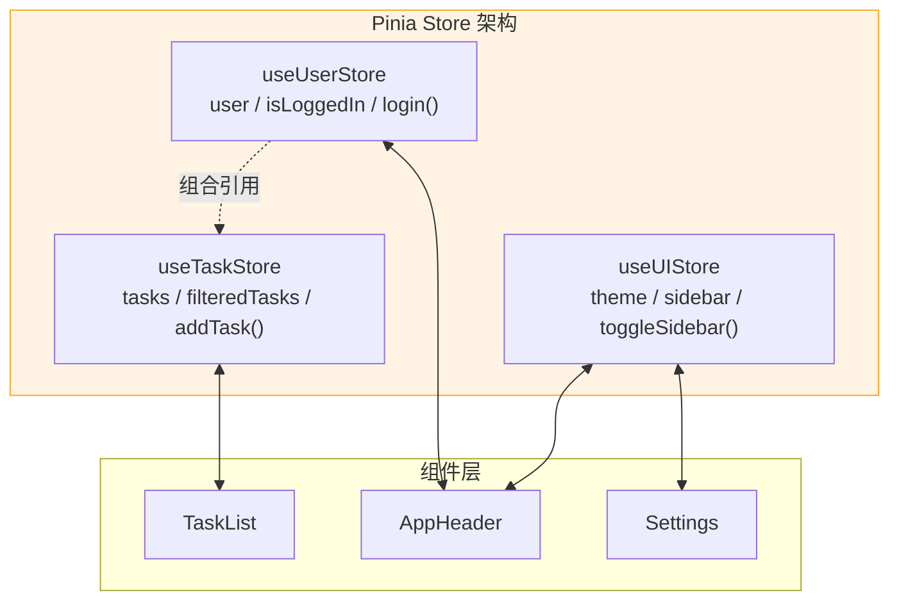

### L12 · 任务分类与标签系统

```
🎯 本节目标：为任务添加分类、优先级和标签系统
📦 本节产出：支持多维度筛选和标签管理的任务系统
🔗 前置钩子：L11 的 Pinia store
🔗 后续钩子：L13 将在分类基础上添加拖拽排序
```

### L13 · 拖拽排序：交互升级

```
🎯 本节目标：实现任务的拖拽排序和跨分类移动
📦 本节产出：支持 Drag & Drop 的看板视图
🔗 前置钩子：L12 的任务分类
🔗 后续钩子：L15 将处理拖拽后的异步数据同步
```

**核心内容：**
- HTML5 Drag and Drop API
- `vuedraggable`（SortableJS）集成
- 看板视图（Kanban Board）实现
- 拖拽状态管理与动画过渡

### L14 · 组件通信全景：provide/inject + defineExpose

```
🎯 本节目标：掌握 Vue 3 全部组件通信方式，在正确场景用正确方案
📦 本节产出：组件通信方式速查表 + 重构现有通信逻辑
🔗 前置钩子：L12 的多层组件嵌套（通信痛点出现）
🔗 后续钩子：L15 的异步组件需要更灵活的通信
```

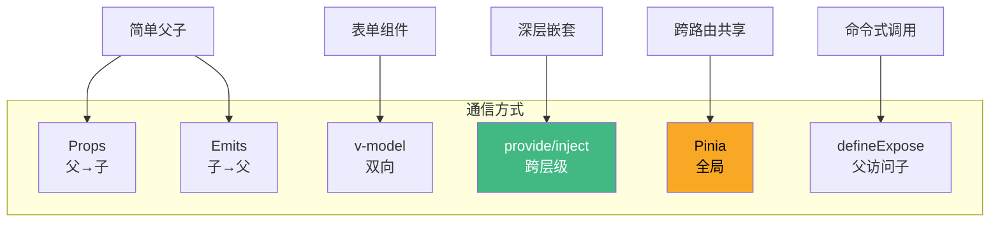

### L15 · 异步组件与 Suspense

```
🎯 本节目标：理解异步组件加载和 Suspense 的使用与限制
📦 本节产出：带优雅 Loading 状态的异步页面
🔗 前置钩子：L13 拖拽后的数据同步需求 + L14 的通信方式
🔗 后续钩子：L16 将在此基础上添加自定义指令
```

### L16 · 自定义指令 + 主题系统

```
🎯 本节目标：创建自定义指令（v-focus、v-permission），实现暗色主题切换
📦 本节产出：支持明/暗主题的任务管理系统 + 自定义指令库
🔗 前置钩子：L15 的完整功能集
🔗 后续钩子：L17 将为所有功能编写测试
```

### L17 · 单元测试：Vitest + Vue Test Utils

```
🎯 本节目标：为核心组件和 Composable 编写单元测试
📦 本节产出：覆盖率 > 80% 的测试套件
🔗 前置钩子：L16 的完整功能集
🔗 后续钩子：L18 将基于测试通过的代码部署
```

**核心内容：**
- Vitest 配置与运行
- `@vue/test-utils`：`mount`、`shallowMount`
- 组件测试：Props、Events、Slots
- Composable 测试：独立于组件的逻辑测试
- Store 测试：Pinia `createTestingPinia`

### L18 · 部署上线：CI/CD

```
🎯 本节目标：将应用部署到 Vercel，配置 GitHub Actions CI
📦 本节产出：线上可访问的任务管理系统 + CI/CD 流水线
🔗 前置钩子：L17 的测试套件（CI 需要跑测试）
🔗 后续钩子：Phase 3 将在此基础上添加后端 API
```

---

## Phase 3：全栈电商（实战篇）

> **目标产物：** 在任务管理系统架构基础上，演进为全栈电商应用（前端 Vue 3 + 后端 Node.js/Express + 数据库）
> **预计时长：** 30-40 小时 | **课时：** 12 节
> **核心升级：** 从纯前端 → 前后端分离 → 全栈

### 课程依赖图

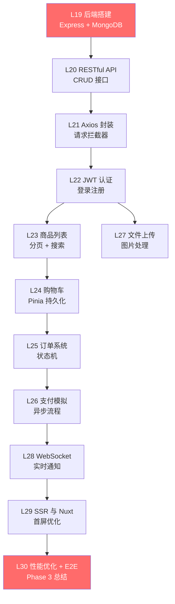

### L19 · 后端搭建：Express + MongoDB

```
🎯 本节目标：搭建 Node.js 后端服务，连接 MongoDB 数据库
📦 本节产出：可运行的 Express 服务 + 数据库连接 + 基础数据模型
🔗 前置钩子：Phase 2 的完整前端架构（L18 产出）
🔗 后续钩子：L20 将基于数据模型实现 RESTful API
```

**核心内容：**
- Express 项目结构：`routes/`、`controllers/`、`models/`、`middleware/`
- MongoDB + Mongoose ODM
- 环境变量管理：`.env` + `dotenv`
- CORS 配置：前后端分离的跨域问题

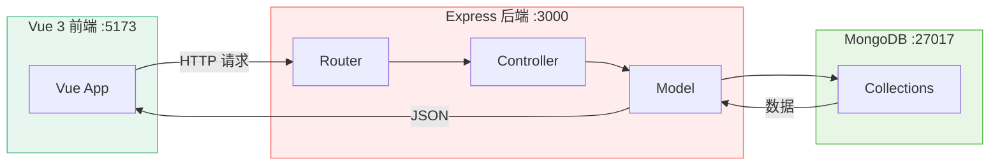

### L20 · RESTful API：CRUD 全流程

```
🎯 本节目标：实现商品和用户的完整 CRUD API
📦 本节产出：Postman/Bruno 测试通过的 RESTful API 集
🔗 前置钩子：L19 的数据库模型
🔗 后续钩子：L21 将在前端封装 Axios 调用这些 API
```

### L21 · Axios 封装：请求层抽象

```
🎯 本节目标：封装 Axios 实例，实现请求/响应拦截器
📦 本节产出：统一的 API 调用层 + 错误处理 + Loading 状态管理
🔗 前置钩子：L20 的 RESTful API
🔗 后续钩子：L22 将在拦截器中注入 JWT Token
```

**核心内容：**
- Axios 实例化 + `baseURL` 配置
- 请求拦截器：注入 Token、显示 Loading
- 响应拦截器：统一错误处理、Token 过期刷新
- `useRequest()` composable：封装 loading / error / data 三态

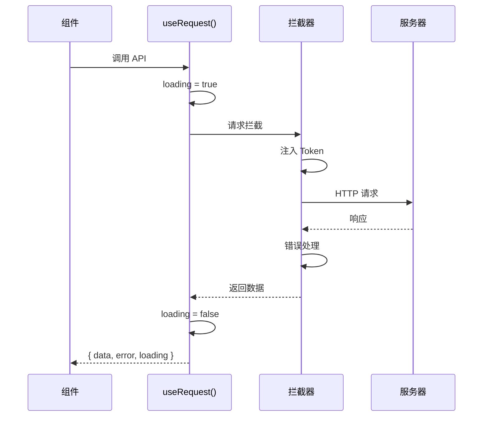

### L22 · JWT 认证：登录注册

```
🎯 本节目标：实现完整的 JWT 认证流程（注册、登录、Token 刷新）
📦 本节产出：安全的登录注册系统 + 路由守卫鉴权
🔗 前置钩子：L21 的 Axios 拦截器
🔗 后续钩子：L23-L28 所有需要鉴权的功能
```

**核心内容：**
- JWT 原理：Header.Payload.Signature
- bcrypt 密码加密
- Access Token + Refresh Token 双 Token 策略
- 前端 Token 存储：localStorage vs httpOnly Cookie
- 深度专题参考：D14（JWT vs Session 对比）

### L23 · 商品列表：分页 + 搜索 + 筛选

```
🎯 本节目标：实现商品列表的服务端分页、搜索和多条件筛选
📦 本节产出：高性能商品列表页 + 防抖搜索 + URL 同步筛选条件
🔗 前置钩子：L22 的认证系统
🔗 后续钩子：L24 将从商品列表添加到购物车
```

**核心内容：**
- 服务端分页 vs 前端分页
- 防抖搜索：`useDebouncedRef()` composable
- URL Query 同步筛选状态（`useRoute` + `router.push`）
- 请求竞态处理（参见深度专题 D13）
- 虚拟滚动：`vue-virtual-scroller`

### L24 · 购物车：复杂状态管理

```
🎯 本节目标：实现购物车的添加、删除、数量修改、全选、合计
📦 本节产出：完整购物车功能 + 多 Store 协同
🔗 前置钩子：L23 的商品列表
🔗 后续钩子：L25 将基于购物车数据创建订单
```

### L25 · 订单系统：状态机设计

```
🎯 本节目标：实现订单创建、支付、发货、收货的状态流转
📦 本节产出：订单列表 + 订单详情 + 状态流转可视化
🔗 前置钩子：L24 的购物车结算
🔗 后续钩子：L26 将对接支付流程
```

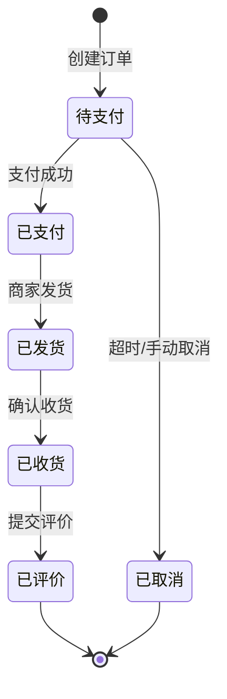

### L26 · 支付模拟：异步流程编排

```
🎯 本节目标：模拟支付流程，掌握复杂异步状态管理
📦 本节产出：支付页面 + 支付状态轮询 + 超时处理
🔗 前置钩子：L25 的订单系统
🔗 后续钩子：L28 将用 WebSocket 替代轮询
```

### L27 · 文件上传：图片处理

```
🎯 本节目标：实现商品图片的上传、预览、裁剪
📦 本节产出：图片上传组件 + 拖拽上传 + 进度条
🔗 前置钩子：L22 的认证系统（需要鉴权）
🔗 后续钩子：可复用于任何需要上传的场景
```

### L28 · WebSocket：实时通知

```
🎯 本节目标：用 WebSocket 实现订单状态实时推送
📦 本节产出：实时通知系统 + 消息列表 + 未读计数
🔗 前置钩子：L26 的支付状态（替代轮询方案）
🔗 后续钩子：L29 将优化整体性能
```

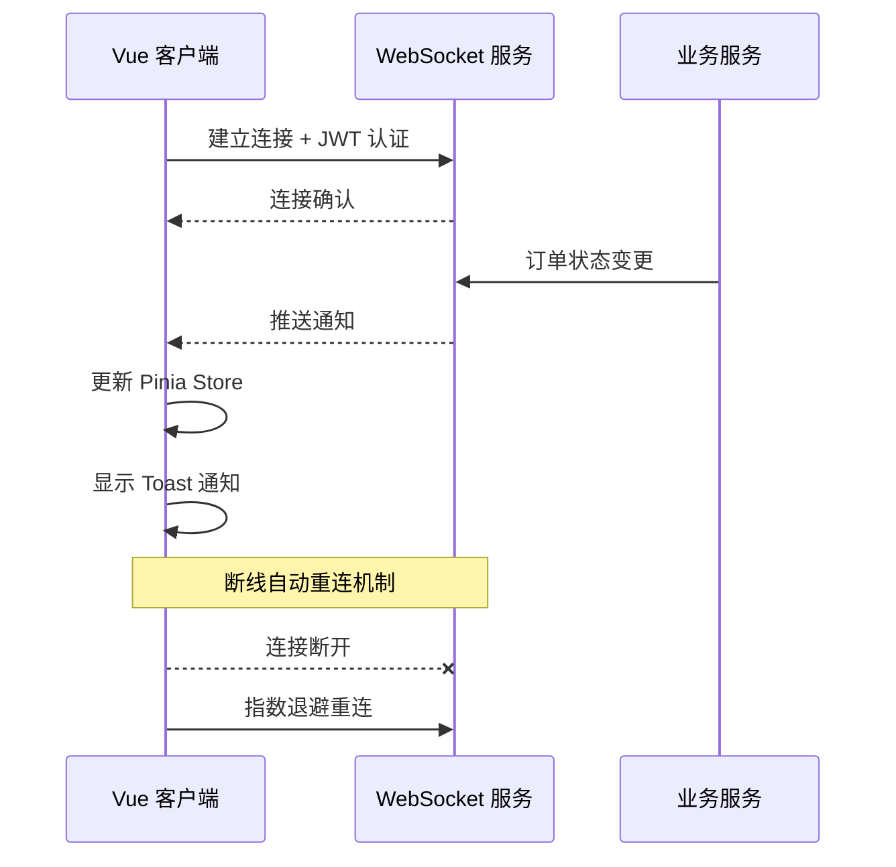

### L29 · SSR 与 Nuxt：首屏优化

```
🎯 本节目标：理解 SSR 原理，用 Nuxt 实现服务端渲染
📦 本节产出：SSR 渲染流程理解 + Nuxt 项目配置 + SEO 优化
🔗 前置钩子：L28 的完整功能集
🔗 后续钩子：L30 将优化性能并进行 E2E 测试
```

**核心内容：**
- CSR vs SSR vs SSG 对比
- Nuxt 3 项目结构与自动路由
- `useAsyncData` / `useFetch` 服务端数据获取
- SEO 优化：`useHead`、meta 标签
- Hydration 原理与常见问题

### L30 · 性能优化 + E2E 测试 + Phase 3 总结

```
🎯 本节目标：前后端性能优化 + Playwright E2E 测试 + Phase 3 完整回顾
📦 本节产出：性能优化清单 + E2E 测试套件 + Phase 3 总结
🔗 前置钩子：L29 的 SSR/Nuxt
🔗 后续钩子：Phase 4 将深入 Vue 3 内部原理
```

---

## Phase 4：Vue 3 原理（深潜篇）

> **目标产物：** 理解 Vue 3 核心机制的实现原理，能手写简化版响应式系统
> **预计时长：** 20-24 小时 | **课时：** 8 节
> **这不是"照着敲代码"，而是理解"为什么这样设计"**

### 课程依赖图

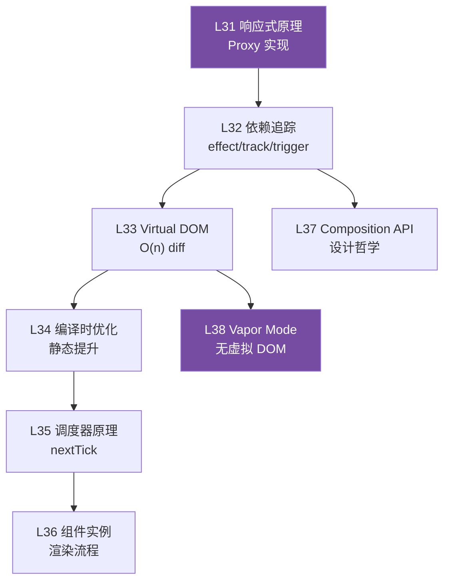

### L31 · 响应式原理：Proxy vs Object.defineProperty

```
🎯 本节目标：手写简化版响应式系统，理解 Proxy 相比 defineProperty 的优势
📦 本节产出：可运行的 mini-reactivity 库（100 行代码）
🔗 前置钩子：Phase 1-3 中对响应式的大量使用（知其然）
🔗 后续钩子：L32 将在此基础上实现依赖追踪
```

**核心内容：**

| 特性 | Object.defineProperty (Vue 2) | Proxy (Vue 3) |
|------|------|------|
| 数组索引变更 | ❌ 无法检测 | ✅ 自动检测 |
| 对象属性添加 | ❌ 需要 `$set` | ✅ 自动检测 |
| 性能 | 递归遍历所有属性 | 惰性代理（访问时才递归） |
| Map/Set 支持 | ❌ | ✅ |

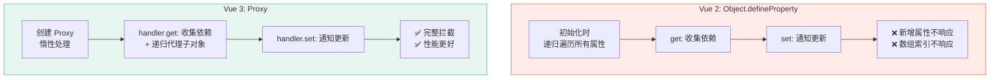

### L32 · 依赖追踪：effect、track、trigger

```
🎯 本节目标：实现 effect/track/trigger 三件套，理解自动依赖收集机制
📦 本节产出：带自动依赖追踪的响应式系统
🔗 前置钩子：L31 的 Proxy 基础
🔗 后续钩子：L33 将理解这些依赖是如何驱动 DOM 更新的
```

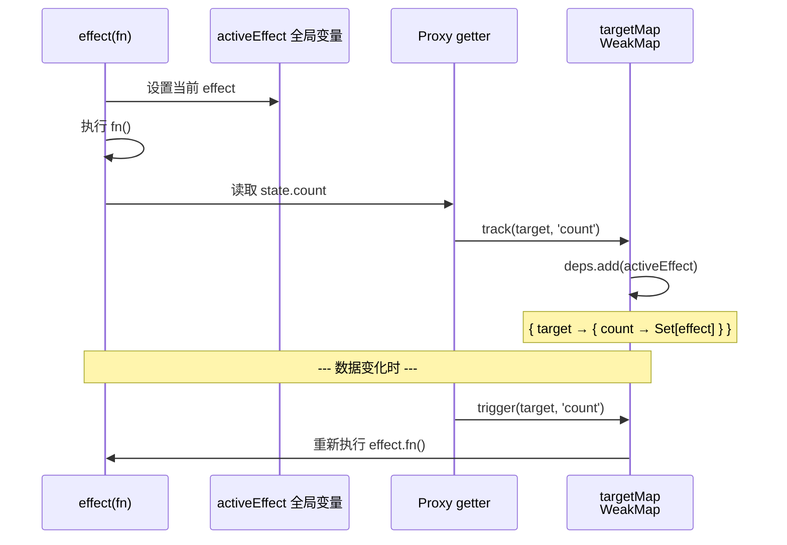

### L33 · Virtual DOM：O(n) diff 算法

```
🎯 本节目标：理解 Vue 3 的 VNode 结构和 patch 算法，能解释 key 的本质作用
📦 本节产出：手写简化版 diff 算法 + 性能对比实验
🔗 前置钩子：L32 的依赖追踪（知道什么时候触发更新）
🔗 后续钩子：L34 将看 Vue 3 如何在编译时优化 diff
```

**核心内容：**
- VNode 数据结构：`{ type, props, children, patchFlag }`
- patch 过程：`isSameVNodeType` → `patchElement` / `mountElement`
- 文本节点 / 元素节点 / 组件节点 的不同处理
- 子节点 diff：双端对比 + 最长递增子序列（LIS）
- key 的本质：帮助 diff 算法建立新旧节点的映射关系

```mermaid
flowchart TB
    patch["patch(n1, n2)"]
    same{"isSameVNodeType?"}
    unmount["卸载 n1\n挂载 n2"]
    patchEl["patchElement"]
    patchProps["对比 Props"]
    patchChildren["patchChildren"]

    keyed{"有 key?"}
    keyedDiff["双端对比\n+ LIS 优化"]
    unkeyedDiff["逐个替换\n（低效）"]

    patch --> same
    same -->|"否"| unmount
    same -->|"是"| patchEl
    patchEl --> patchProps
    patchEl --> patchChildren
    patchChildren --> keyed
    keyed -->|"是"| keyedDiff
    keyed -->|"否"| unkeyedDiff

    style keyedDiff fill:#42b883,color:#fff
    style unkeyedDiff fill:#ff6347,color:#fff
```

### L34 · 编译时优化：静态提升 + 靶向更新

```
🎯 本节目标：理解 Vue 3 编译器的静态分析优化，解释 Block Tree 和 PatchFlags
📦 本节产出：能在 Vue SFC Playground 上分析编译输出
🔗 前置钩子：L33 的 diff 算法（理解优化的目标）
🔗 后续钩子：L35 将看更新是如何被调度的
```

**核心内容：**
- 静态提升（Static Hoisting）：静态节点只创建一次
- PatchFlags 靶向更新：`1 = TEXT`、`2 = CLASS`、`4 = STYLE`…
- Block Tree：跳过静态子树的 diff
- 缓存事件处理函数：避免子组件无意义 re-render
- Vue SFC Playground 实验：观察编译后的 render 函数

```mermaid
flowchart LR
    subgraph Before["未优化的 diff"]
        diff1["对比每个节点\n包括静态内容"]
        cost1["O(整棵树)"]
    end

    subgraph After["Vue 3 编译优化"]
        block["Block 收集动态节点"]
        flag["PatchFlag 标记变化类型"]
        diff2["只对比动态节点\n只更新变化的属性"]
        cost2["O(动态节点数)"]
    end

    Before -->|"Vue 3 编译器"| After

    style Before fill:#ff634720,stroke:#ff6347
    style After fill:#42b88320,stroke:#42b883
```

### L35 · 调度器原理：nextTick 与批量更新

```
🎯 本节目标：理解 Vue 3 的异步更新队列和 nextTick 实现
📦 本节产出：能解释为什么数据变化后 DOM 不会立即更新
🔗 前置钩子：L34 的编译优化（更新的输入）
🔗 后续钩子：L36 将整体串联组件的渲染流程
```

**核心内容：**
- 同步修改 N 次数据，只触发一次 DOM 更新（批量合并）
- 微任务队列：`Promise.then()` → `queueJob` → `flushJobs`
- `nextTick()` 的实现：只是在微任务队列尾部追加回调
- 闭包陷阱：为什么在 `setTimeout` 里拿到的是旧值

```mermaid
sequenceDiagram
    participant Code as 用户代码
    participant Queue as 更新队列
    participant Microtask as 微任务
    participant DOM as DOM

    Code->>Code: count.value = 1
    Code->>Queue: queueJob(effect)
    Code->>Code: count.value = 2
    Code->>Queue: 去重（已在队列中）
    Code->>Code: count.value = 3
    Code->>Queue: 去重（已在队列中）

    Note over Code: 同步代码执行完毕

    Microtask->>Queue: flushJobs()
    Queue->>DOM: 批量更新（只执行一次）
    Note over DOM: count: 0 → 3（一步到位）
```

### L36 · 组件实例与渲染流程

```
🎯 本节目标：理解 Vue 3 组件从创建到销毁的完整生命周期
📦 本节产出：组件生命周期全景图 + 渲染管线示意
🔗 前置钩子：L35 的调度器原理
🔗 后续钩子：L37 将解释 Composition API 如何嵌入这个流程
```

```mermaid
flowchart TD
    create["createApp(App)"]
    mount[".mount('#app')"]
    createVNode["创建根 VNode"]
    setupComponent["setupComponent()\n执行 script setup"]
    setupRenderEffect["setupRenderEffect()\n创建响应式 effect"]
    render["调用 render()\n生成 VNode 树"]
    patch["patch()\n挂载到真实 DOM"]
    mounted["onMounted() 触发"]

    update["数据变化"]
    rerender["重新执行 render()"]
    diff["patch() diff"]
    updated["onUpdated() 触发"]

    unmount["组件卸载"]
    cleanup["onUnmounted() 触发\n清理副作用"]

    create --> mount --> createVNode --> setupComponent
    setupComponent --> setupRenderEffect --> render --> patch --> mounted
    mounted -.-> update --> rerender --> diff --> updated
    updated -.-> unmount --> cleanup

    style create fill:#42b883,color:#fff
    style mounted fill:#42b883,color:#fff
    style cleanup fill:#ff6b6b,color:#fff
```

### L37 · Composition API 设计哲学

```
🎯 本节目标：从语言设计层面理解 Composition API 的取舍
📦 本节产出：Options vs Composition 技术决策文档
🔗 前置钩子：L32 的响应式原理 + 全部实战经验
🔗 后续钩子：与 React Hooks 的对比思考
```

**核心内容：**
- 闭包模型 vs 实例模型：React Hooks 每次渲染重新执行 vs Vue setup 只执行一次
- Composable 的组合优势：可以在 composable 里调用其他 composable
- `ref` vs `reactive` 的本质区别与选择哲学（详见深度专题 D05）
- TypeScript 类型推断：Composition API 天生友好

### L38 · Vapor Mode：无虚拟 DOM 的未来

```
🎯 本节目标：理解 Vue Vapor Mode 的设计目标与实现思路
📦 本节产出：Vapor vs VDOM 渲染对比实验 + 性能基准测试
🔗 前置钩子：L33 的 Virtual DOM 原理（理解 Vapor 在替代什么）
🔗 后续钩子：无（终点）
```

**核心内容：**
- Vapor Mode 的设计动机：消除 Virtual DOM 的运行时开销
- 编译到直接 DOM 操作：类似 Svelte/Solid 的思路
- 与 Virtual DOM 模式的性能对比
- 渐进式采用：可以在同一个应用中混用 Vapor 和 VDOM 组件
- 当前状态与限制（实验性功能）

```mermaid
flowchart LR
    subgraph VDOM["传统 Virtual DOM 模式"]
        template1["模板"] --> render1["render() 函数"]
        render1 --> vnode["生成 VNode 树"]
        vnode --> diff["diff 对比"]
        diff --> domOp1["DOM 操作"]
    end

    subgraph Vapor["Vapor Mode 无虚拟 DOM"]
        template2["模板"] --> compile["编译为\n直接 DOM 操作"]
        compile --> domOp2["精确 DOM 操作\n无中间层"]
    end

    style VDOM fill:#35495e20,stroke:#35495e
    style Vapor fill:#42b88320,stroke:#42b883
```

---

## 🔬 深度专题索引

> 深度专题穿插在课程中，通过交叉引用连接。每个专题讲的不是"怎么用"，而是"为什么这样设计"。

| 编号 | 专题 | 关联课时 | 核心问题 |
|------|------|---------|---------|
| D01 | Options API vs Composition API | L01, L37 | 为什么全程 Composition API？转型的真正理由 |
| D02 | Vue 3 响应式调度器 + nextTick | L35 | 为什么修改数据后 DOM 不立即更新？ |
| D03 | Proxy vs Object.defineProperty | L31 | Vue 3 为什么必须放弃 IE11？ |
| D04 | 编译时优化：静态提升 + 靶向更新 | L34 | Vue 3 凭什么比 React 快？ |
| D05 | ref vs reactive + .value 为什么存在 | L03, L32 | 为什么不能像 Svelte 那样直接赋值？ |
| D06 | 依赖追踪：effect / track / trigger | L32 | computed 的缓存到底怎么实现的？ |
| D07 | 单向数据流 vs v-model 双向绑定 | L06, L14 | v-model 违反了单向数据流吗？ |
| D08 | Pinia vs Vuex 4 设计决策 | L11 | 为什么 Pinia 成为了官方推荐？ |
| D09 | Composables vs React Hooks | L08, L37 | 同样是"钩子"，为什么心智模型完全不同？ |
| D10 | Suspense 现状与限制 | L15 | 为什么 Suspense 仍是实验性功能？ |
| D11 | Virtual DOM 的 O(n) diff | L33 | 为什么 key 不能用 index？ |
| D12 | 闭包陷阱 | L37 | setTimeout 里为什么拿到旧值？ |
| D13 | 请求竞态处理 | L23 | 快速切换页面时如何避免数据错乱？ |
| D14 | JWT vs Session | L22 | 无状态认证的代价是什么？ |
| D15 | Vapor Mode 原理 | L38 | 没有虚拟 DOM 的 Vue 还是 Vue 吗？ |

### 深度专题示例：D05 · ref vs reactive + .value 为什么存在

> **核心矛盾：** 为什么 `ref` 需要 `.value`，而不能像 Svelte 那样 `count = 1` 直接触发更新？

```mermaid
flowchart TB
    subgraph Problem["问题：JavaScript 按值传递"]
        let_num["let count = 0"]
        assign["count = 1"]
        lost["❌ 函数参数拿到的是\n值的副本，追不到"]
    end

    subgraph Solution["解法：包一层对象"]
        ref_obj["const count = ref(0)\n// 实际上是 { value: 0 }"]
        ref_assign["count.value = 1"]
        tracked["✅ Proxy 拦截对象属性\n的读写，追踪依赖"]
    end

    Problem -->|".value 的本质"| Solution

    style Problem fill:#ff634720,stroke:#ff6347
    style Solution fill:#42b88320,stroke:#42b883
```

**关键推导：**
1. JavaScript 原始值（number、string）是**按值传递**的
2. Proxy 只能代理**对象**，不能代理原始值
3. 所以必须把原始值包进一个对象：`{ value: 0 }`
4. 因此访问时需要 `.value` —— 这不是设计缺陷，而是**语言限制的必然结果**
5. 模板中自动解包是编译器的语法糖，但 JS 层面无法省略

### 深度专题示例：D09 · Composables vs React Hooks

```mermaid
flowchart TB
    subgraph React["React Hooks"]
        render_cycle["每次渲染重新执行\n组件函数"]
        closure["闭包捕获当前渲染的值"]
        rules["规则约束：\n不能条件调用\n不能循环调用"]
        stale["常见陷阱：\n闭包过期值"]
    end

    subgraph Vue["Vue Composables"]
        setup_once["setup() 只执行一次"]
        reactive_ref["返回响应式引用\n始终指向最新值"]
        freedom["无调用顺序限制\n可以条件调用"]
        no_stale["无闭包过期问题\n ref.value 永远是最新的"]
    end

    React -->|"每次渲染 = 新闭包"| closure
    Vue -->|"一次 setup = 稳定引用"| reactive_ref

    style React fill:#61dafb20,stroke:#61dafb
    style Vue fill:#42b88320,stroke:#42b883
```

---

## 📊 课程全景图

```mermaid
flowchart TB
    subgraph P1["Phase 1: Todo App (8节)"]
        direction LR
        L01_s["L01-L08"]
    end

    subgraph P2["Phase 2: 任务管理 (10节)"]
        direction LR
        L09_s["L09-L18"]
    end

    subgraph P3["Phase 3: 全栈电商 (12节)"]
        direction LR
        L19_s["L19-L30"]
    end

    subgraph P4["Phase 4: 原理深潜 (8节)"]
        direction LR
        L31_s["L31-L38"]
    end

    subgraph DT["深度专题 (15个)"]
        direction LR
        D_s["D01-D15"]
    end

    P1 -->|"代码基础\n直接演进"| P2
    P2 -->|"架构复用\n添加后端"| P3
    P3 -->|"知其然后\n知其所以然"| P4
    DT -.->|"穿插引用"| P1
    DT -.->|"穿插引用"| P2
    DT -.->|"穿插引用"| P3
    DT -.->|"穿插引用"| P4

    style P1 fill:#42b883,color:#fff
    style P2 fill:#35495e,color:#fff
    style P3 fill:#ff6b6b,color:#fff
    style P4 fill:#764ba2,color:#fff
    style DT fill:#f9a825,color:#000
```

| 阶段 | 课时 | 预计时长 | 难度 | 关键技能 |
|------|------|---------|------|---------|
| Phase 1 | 8 节 | 12-16h | ⭐⭐ | 响应式基础、组件、模板语法 |
| Phase 2 | 10 节 | 20-28h | ⭐⭐⭐ | Router、Pinia、测试、部署 |
| Phase 3 | 12 节 | 30-40h | ⭐⭐⭐⭐ | 全栈开发、认证、WebSocket |
| Phase 4 | 8 节 | 20-24h | ⭐⭐⭐⭐⭐ | 源码级原理、手写实现 |
| 深度专题 | 15 个 | 穿插 | 🔬 | 设计决策、原理对比 |

**总计：38 节课 + 15 个深度专题 ≈ 80-108 小时**

---

## 🛠️ 技术栈

| 类别 | 技术选型 |
|------|---------|
| 框架 | Vue 3.5+ (Composition API + `<script setup>`) |
| 构建 | Vite 6 |
| 路由 | Vue Router 4 |
| 状态 | Pinia 3 |
| 类型 | TypeScript 5 |
| 测试 | Vitest + Vue Test Utils |
| 后端 | Node.js + Express |
| 数据库 | MongoDB + Mongoose |
| 部署 | Docker + Nginx + Vercel |

---

> **设计理念：** 学完不是终点，做出来才是。每一节课的产出物都是你简历上的真实项目。
