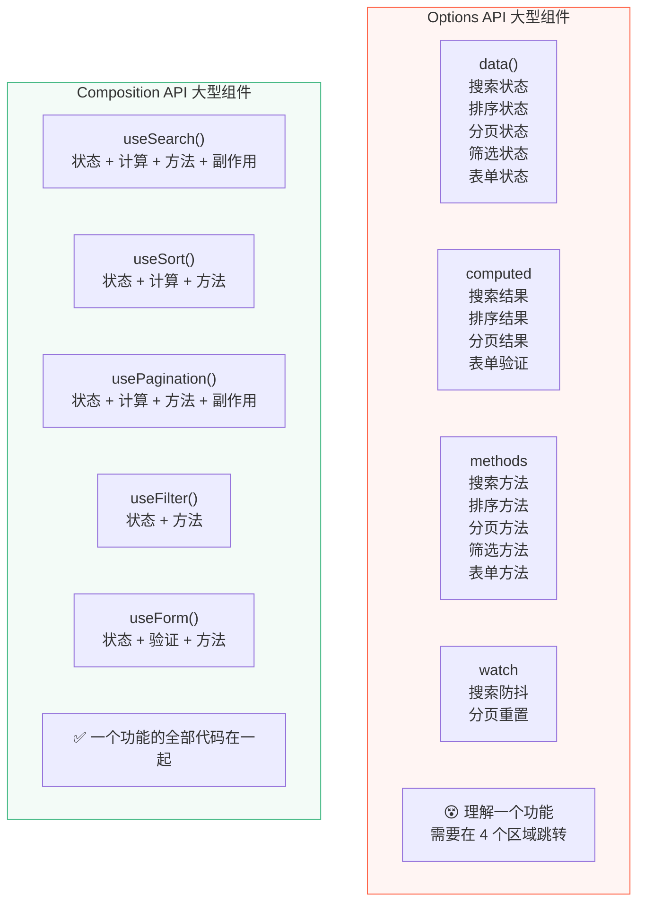

# D01 · Options API vs Composition API

> **对应主课：** L37 Composition API 设计哲学
> **最后核对：** 2026-04-01

---

## 1. 核心区别

| 维度 | Options API | Composition API |
|------|------------|----------------|
| 代码组织 | 按**选项类型**分组 (data/computed/methods) | 按**功能逻辑**分组 |
| 逻辑复用 | Mixins（命名冲突/来源不明） | Composables（函数组合） |
| TypeScript | 类型推断差 | 完美类型推断 |
| this 依赖 | 依赖 `this` 上下文 | 不依赖 `this` |
| 学习曲线 | 更平缓（模板式结构） | 需理解响应式 API |
| Tree-shaking | 不好（整个组件选项打包） | 好（按需导入） |

---

## 2. 同一功能的两种写法

### Options API

```vue
<script>
export default {
  data() {
    return {
      count: 0,
      doubleCount: 0,
      history: [],
    }
  },
  computed: {
    isEven() {
      return this.count % 2 === 0
    },
  },
  watch: {
    count(newVal, oldVal) {
      this.history.push({ from: oldVal, to: newVal, time: Date.now() })
    },
  },
  methods: {
    increment() {
      this.count++
    },
    decrement() {
      if (this.count > 0) this.count--
    },
    reset() {
      this.count = 0
      this.history = []
    },
  },
  mounted() {
    console.log('组件已挂载')
  },
}
</script>
```

### Composition API

```vue
<script setup>
import { ref, computed, watch, onMounted } from 'vue'

// 所有相关代码在一起
const count = ref(0)
const history = ref([])

const isEven = computed(() => count.value % 2 === 0)

watch(count, (newVal, oldVal) => {
  history.value.push({ from: oldVal, to: newVal, time: Date.now() })
})

function increment() { count.value++ }
function decrement() { if (count.value > 0) count.value-- }
function reset() {
  count.value = 0
  history.value = []
}

onMounted(() => {
  console.log('组件已挂载')
})
</script>
```

---

## 3. 逻辑复用对比

### Mixins 的三大问题

```javascript
// mixin-a.js
export default {
  data() { return { loading: false } },       // ← 和 mixin-b 冲突！
  methods: { start() { this.loading = true } },
}

// mixin-b.js
export default {
  data() { return { loading: false } },       // ← 命名冲突
  methods: { fetchData() { /* ... */ } },
}

// 组件中使用
export default {
  mixins: [mixinA, mixinB],
  // 问题 1: loading 来自哪个 mixin？
  // 问题 2: 谁覆盖了谁？
  // 问题 3: IDE 无法推断类型
}
```

### Composable 解决所有问题

```typescript
// composables/useLoading.ts
export function useLoading() {
  const loading = ref(false)
  function start() { loading.value = true }
  function stop() { loading.value = false }
  return { loading, start, stop }
}

// 组件中使用
const { loading: loadingA, start: startA } = useLoading()
const { loading: loadingB, start: startB } = useLoading()
// ✅ 没有冲突，来源清晰，调用者命名
```

---

## 4. 大型组件的可维护性



---

## 5. TypeScript 支持

```typescript
// Options API：this 的类型推断有限
export default {
  data() {
    return { count: 0 }
  },
  methods: {
    // this.count 的类型需要额外声明才能推断
    increment() {
      this.count++  // TS 可能报错或推断为 any
    },
  },
}

// Composition API：天然完美推断
const count = ref(0)           // Ref<number>
const double = computed(() => count.value * 2)  // ComputedRef<number>

function increment() {
  count.value++  // ✅ 自动推断为 number
}
```

---

## 6. 何时用哪个

| 场景 | 推荐 |
|------|------|
| 简单展示组件（< 50 行） | 两者都行 |
| 需要逻辑复用 | ✅ Composition |
| TypeScript 项目 | ✅ Composition |
| 大型复杂组件 | ✅ Composition |
| 团队新手为主 | Options 入门更快 |
| 渐进迁移老项目 | 混用（同一组件可混用） |

---

## 7. 总结

- Options API 不会被废弃，仍是一等公民
- Composition API 解决了三个核心问题：**代码组织、逻辑复用、类型推断**
- 新项目推荐 `<script setup>` + Composition API
- `<script setup>` 是 Composition API 的语法糖，编译后就是 `setup()` 函数
