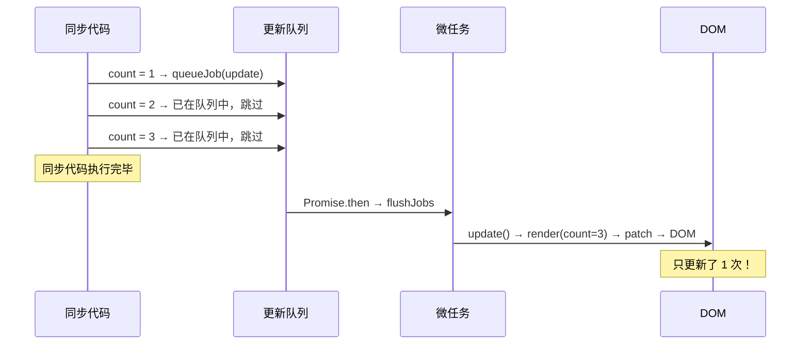
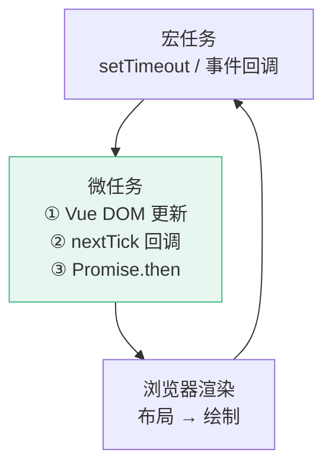
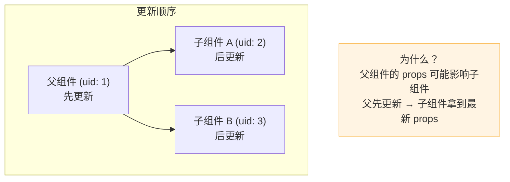
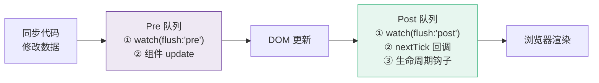

# D02 · 调度器与 nextTick

> **对应主课：** L35 调度器原理
> **最后核对：** 2026-04-01

---

## 1. 为什么需要异步更新

```javascript
const count = ref(0)

// 连续修改 3 次
count.value = 1
count.value = 2
count.value = 3

// 如果同步更新 → render 执行 3 次 → DOM 更新 3 次
// 异步批量更新 → render 只执行 1 次，直接用最终值 3
```

Vue 的策略：**数据变化不立即更新 DOM，而是在当前同步代码执行完后，通过微任务批量更新。**

---

## 2. 更新队列

```typescript
const queue = new Set<Function>()  // Set 自动去重
let isFlushing = false

function queueJob(job: Function) {
  queue.add(job)  // 同一个组件的 update 函数只会入队一次
  if (!isFlushing) {
    isFlushing = true
    Promise.resolve().then(flushJobs)  // 微任务中执行
  }
}

function flushJobs() {
  for (const job of queue) { job() }
  queue.clear()
  isFlushing = false
}
```



---

## 3. nextTick 详解

```typescript
const resolvedPromise = Promise.resolve()

function nextTick(fn?: () => void): Promise<void> {
  return fn ? resolvedPromise.then(fn) : resolvedPromise
}
```

**执行顺序：**

```
同步代码（修改数据）
  ↓
微任务 1：flushJobs（DOM 更新）
  ↓
微任务 2：nextTick 回调
  ↓
浏览器渲染
```

### 使用场景

```typescript
// 1. 修改数据后读取 DOM
count.value = 100
await nextTick()
console.log(el.textContent)  // '100'

// 2. 列表新增后滚动到底部
items.value.push(newItem)
await nextTick()
container.scrollTop = container.scrollHeight

// 3. v-if 切换后聚焦
showInput.value = true
await nextTick()
inputRef.value?.focus()
```

---

## 4. 事件循环中的位置



---

## 5. watch 的 flush 选项

```typescript
// flush: 'pre'（默认）— DOM 更新之前
watch(source, callback)

// flush: 'post' — DOM 更新之后
watch(source, callback, { flush: 'post' })
// 简写：watchPostEffect(() => { /* DOM 已更新 */ })

// flush: 'sync' — 同步执行（不推荐）
watch(source, callback, { flush: 'sync' })
```

## 6. 动手实验：mini 调度器

在浏览器控制台运行，体验"批量异步更新"：

```javascript
// ===== Mini Scheduler（可直接运行） =====
const queue = new Set()
let isFlushing = false
let flushCount = 0

function queueJob(job) {
  queue.add(job)  // Set 自动去重
  if (!isFlushing) {
    isFlushing = true
    Promise.resolve().then(() => {
      flushCount++
      console.log(`\n🔄 第 ${flushCount} 次 flush，队列中有 ${queue.size} 个任务`)
      for (const job of queue) job()
      queue.clear()
      isFlushing = false
    })
  }
}

// 模拟组件 A 的 update 函数
const updateA = () => console.log('  🖥️ 组件 A 更新，count =', countA)
// 模拟组件 B 的 update 函数
const updateB = () => console.log('  🖥️ 组件 B 更新，name =', nameB)

// 模拟连续修改
let countA = 0, nameB = 'Vue'
console.log('--- 开始同步修改 ---')

countA = 1; queueJob(updateA)  // 入队
countA = 2; queueJob(updateA)  // Set 自动跳过（已存在）
countA = 3; queueJob(updateA)  // Set 自动跳过
nameB = 'Vue 3'; queueJob(updateB)  // 入队（不同任务）

console.log('--- 同步修改结束，此时 DOM 尚未更新 ---')
// 微任务执行后才会看到：
// 🔄 第 1 次 flush，队列中有 2 个任务
// 🖥️ 组件 A 更新，count = 3     ← 只更新一次，直接用最终值
// 🖥️ 组件 B 更新，name = Vue 3
```

---

## 7. 组件更新顺序

Vue 按组件的 **uid（创建顺序）** 排序更新队列，确保父组件先于子组件更新：



```typescript
// Vue 源码简化：flush 前排序
function flushJobs() {
  queue.sort((a, b) => a.id - b.id)  // uid 升序 → 父先子后
  for (const job of queue) {
    job()
  }
}
```

---

## 8. Pre 队列 vs Post 队列

Vue 内部实际有两个队列：



这就是为什么 `flush: 'post'` 的 watch 可以安全地操作 DOM。

---

## 9. 常见陷阱

### 陷阱 1：修改数据后立即读 DOM

```typescript
const count = ref(0)
count.value = 100

// ❌ 此时 DOM 还没更新！
console.log(el.textContent)  // 仍然是 '0'

// ✅ 等待 DOM 更新
await nextTick()
console.log(el.textContent)  // '100'
```

### 陷阱 2：在 nextTick 里修改数据引发连锁更新

```typescript
watch(count, async () => {
  await nextTick()
  count.value++  // ⚠️ 再次触发更新 → 再次 nextTick → 再次修改...
  // 不会死循环（Vue 有递归限制），但性能差
})
```

### 陷阱 3：flush: 'sync' 的性能问题

```typescript
// ❌ 同步 watch — 每次修改都立即执行回调
watch(count, callback, { flush: 'sync' })
count.value = 1  // callback 执行 1 次
count.value = 2  // callback 执行 1 次
count.value = 3  // callback 执行 1 次
// 共 3 次！没有批量优化

// ✅ 默认异步 — 批量执行
watch(count, callback)
count.value = 1
count.value = 2
count.value = 3
// 只执行 1 次 callback，值为 3
```

---

## 10. 总结

- 批量更新 = Set 去重 + Promise 微任务
- nextTick = 在 DOM 更新之后的微任务
- 父组件先于子组件更新（uid 排序）
- Vue 有 Pre 和 Post 两个队列，分别在 DOM 更新前后执行
- `flush: 'post'` 的 watch 可以安全访问更新后的 DOM
- 避免在 nextTick 中再修改数据，避免使用 `flush: 'sync'`
