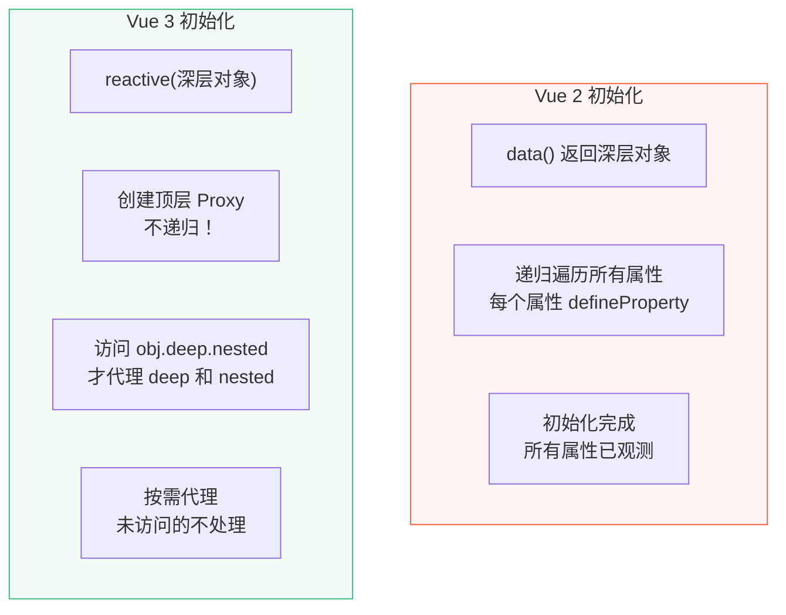
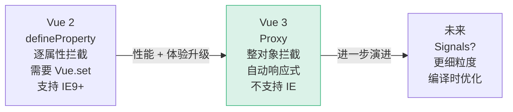

# D03 · Proxy vs Object.defineProperty

> **对应主课：** L31 Proxy 响应式原理
> **最后核对：** 2026-04-01

---

## 1. 核心区别

| 维度 | Object.defineProperty (Vue 2) | Proxy (Vue 3) |
|------|------------------------------|---------------|
| 拦截粒度 | 只能拦截**已定义的属性** | 拦截**整个对象**的所有操作 |
| 新增属性 | ❌ 需要 `Vue.set()` | ✅ 自动拦截 |
| 删除属性 | ❌ 需要 `Vue.delete()` | ✅ 自动拦截 |
| 数组索引 | ❌ 不触发 | ✅ 自动拦截 |
| 数组 length | ❌ 不触发 | ✅ 自动拦截 |
| 初始化性能 | 差（递归遍历所有属性） | 好（惰性代理） |
| 浏览器支持 | IE9+ | 不支持 IE |

---

## 2. Vue 2 的 defineProperty

```javascript
// Vue 2 源码简化
function defineReactive(obj, key, val) {
  const dep = new Dep()

  Object.defineProperty(obj, key, {
    get() {
      if (Dep.target) {
        dep.depend()  // 收集依赖
      }
      return val
    },
    set(newVal) {
      if (newVal === val) return
      val = newVal
      dep.notify()  // 通知更新
    },
  })
}

// 初始化：必须递归遍历所有属性
function observe(obj) {
  for (const key in obj) {
    defineReactive(obj, key, obj[key])
    if (typeof obj[key] === 'object') {
      observe(obj[key])  // 递归！
    }
  }
}
```

### Vue 2 的已知限制

```javascript
// ❌ 新增属性不触发视图更新
this.obj.newKey = 'value'  // 不是响应式的！
// 必须用 Vue.set
Vue.set(this.obj, 'newKey', 'value')  // ✅

// ❌ 数组索引赋值不触发
this.arr[0] = 'new'  // 不触发！
// 必须用 Vue.set 或 splice
Vue.set(this.arr, 0, 'new')  // ✅
this.arr.splice(0, 1, 'new')  // ✅

// ❌ 修改数组 length 不触发
this.arr.length = 0  // 不触发！

// ❌ 删除属性不触发
delete this.obj.key  // 不触发！
Vue.delete(this.obj, 'key')  // ✅
```

---

## 3. Vue 3 的 Proxy

```javascript
// Vue 3 源码简化
function reactive(target) {
  return new Proxy(target, {
    get(target, key, receiver) {
      track(target, key)  // 收集依赖
      const result = Reflect.get(target, key, receiver)
      if (typeof result === 'object' && result !== null) {
        return reactive(result)  // 惰性代理：访问时才代理
      }
      return result
    },
    set(target, key, value, receiver) {
      const oldValue = Reflect.get(target, key, receiver)
      const result = Reflect.set(target, key, value, receiver)
      if (oldValue !== value) {
        trigger(target, key)  // 触发更新
      }
      return result
    },
    deleteProperty(target, key) {
      const result = Reflect.deleteProperty(target, key)
      if (result) trigger(target, key)
      return result
    },
    has(target, key) {
      track(target, key)
      return Reflect.has(target, key)
    },
    ownKeys(target) {
      track(target, Symbol('iterate'))
      return Reflect.ownKeys(target)
    },
  })
}
```

### Vue 3 全部解决

```javascript
const state = reactive({ name: 'Vue' })

// ✅ 新增属性 → 自动响应式
state.newKey = 'value'

// ✅ 删除属性 → 自动触发
delete state.name

const arr = reactive([1, 2, 3])

// ✅ 索引赋值
arr[0] = 10

// ✅ 修改 length
arr.length = 0

// ✅ in 操作符
'name' in state  // 触发 has trap → track

// ✅ for...in 枚举
for (const key in state) { /* ... */ }  // 触发 ownKeys trap → track
```

---

## 4. 性能对比

### 初始化性能



```javascript
// 性能测试
const bigObj = {}
for (let i = 0; i < 10000; i++) {
  bigObj[`key${i}`] = { nested: { value: i } }
}

// Vue 2: observe(bigObj)
// → 遍历 10000 个属性 × 每个有 2 层嵌套
// → defineProperty 调用 ~30000 次

// Vue 3: reactive(bigObj)
// → 创建 1 个 Proxy
// → 如果只访问 bigObj.key0，只额外创建 2 个 Proxy
```

### 内存占用

| | Vue 2 | Vue 3 |
|-|-------|-------|
| 有 10000 个属性的对象 | 10000 个 Dep 实例 + 10000 个 getter/setter | 1 个 Proxy + 按需 |
| 深层嵌套但只用顶层 | 全部递归观测 | 只代理顶层 |

---

## 5. 为什么 Vue 3 不支持 IE

Proxy 是 ES2015 规范的一部分，**无法被 polyfill**。

```javascript
// defineProperty 可以被 polyfill（因为 IE9 已支持）
// 但 Proxy 不行：
// - Proxy 需要引擎级支持
// - 无法在 JS 层面模拟"拦截所有属性访问"
// - 所有 polyfill 只能模拟部分功能（如已知的属性）
```

Vue 3 选择了 Proxy 意味着放弃 IE 支持。这是一个**正确的取舍**：
- IE 全球市场份额 < 1%
- 换来了更好的性能和开发体验
- 消除了 `Vue.set` / `Vue.delete` 等反直觉 API

---

## 6. 动手实验：浏览器控制台对比

把下面代码粘贴到浏览器控制台，亲手体验两种方案的差异：

```javascript
// ===== 实验 1：defineProperty 无法拦截新增属性 =====
const obj1 = { name: 'Vue 2' }
Object.defineProperty(obj1, 'name', {
  get() { console.log('🔍 [defineProperty] 读取 name'); return 'Vue 2' },
  set(v) { console.log('✏️ [defineProperty] 设置 name =', v) }
})
obj1.name              // ✅ 触发 get
obj1.name = 'updated'  // ✅ 触发 set
obj1.age = 25          // ❌ 无任何输出！新属性没被监控

// ===== 实验 2：Proxy 自动拦截一切 =====
const obj2 = new Proxy({ name: 'Vue 3' }, {
  get(t, k) { console.log('🔍 [Proxy] 读取', k); return t[k] },
  set(t, k, v) { console.log('✏️ [Proxy] 设置', k, '=', v); t[k] = v; return true },
  deleteProperty(t, k) { console.log('🗑️ [Proxy] 删除', k); delete t[k]; return true }
})
obj2.name              // ✅ 触发 get
obj2.name = 'updated'  // ✅ 触发 set
obj2.age = 25          // ✅ 触发 set — 新属性也被拦截！
delete obj2.name       // ✅ 触发 deleteProperty

// ===== 实验 3：惰性代理性能对比 =====
console.time('defineProperty 10000 属性')
const big1 = {}; for (let i = 0; i < 10000; i++) big1[`k${i}`] = i
for (const k in big1) Object.defineProperty(big1, k, { get() { return 0 }, set() {} })
console.timeEnd('defineProperty 10000 属性')

console.time('Proxy 10000 属性')
const big2 = {}; for (let i = 0; i < 10000; i++) big2[`k${i}`] = i
const p = new Proxy(big2, { get(t,k) { return t[k] }, set(t,k,v) { t[k]=v; return true } })
console.timeEnd('Proxy 10000 属性')
// Proxy 通常快 5-50 倍
```

---

## 7. 总结



- Proxy **一次性解决**了 Vue 2 的所有响应式缺陷
- 代价是失去 IE 支持（合理取舍）
- 惰性代理策略让初始化速度大幅优于 Vue 2

