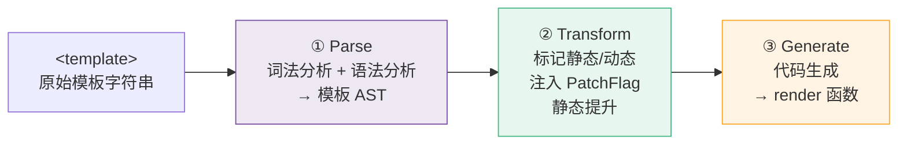
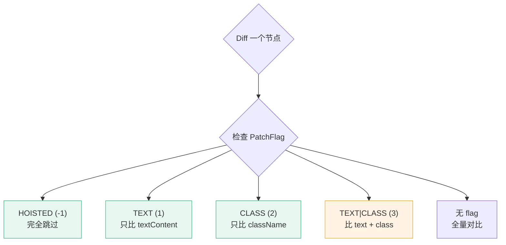
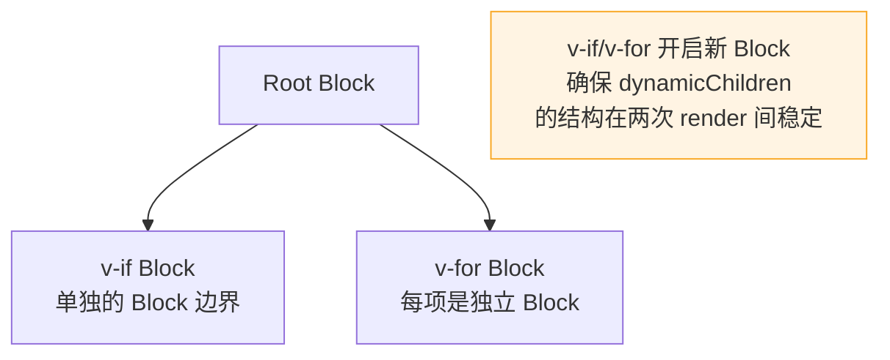

# D04 · 编译优化：PatchFlag 与 Block Tree

> **对应主课：** L34 编译器优化
> **最后核对：** 2026-04-01
> **与 L34 的关系：** L34 侧重"看懂编译输出"，本篇侧重"为什么这样编译"和"动手验证"

---

## 1. Vue 3 编译器三阶段

Vue 3 的模板编译器不是简单的字符串替换，而是完整的三阶段编译流水线：



```vue
<template>
  <div class="card">
    <h3>标题</h3>                    <!-- 静态 -->
    <p>{{ description }}</p>         <!-- 动态文本 -->
    <span :class="statusClass">ok</span>  <!-- 动态 class -->
  </div>
</template>
```

**编译产物：**

```javascript
const _hoisted_1 = createVNode("h3", null, "标题", -1 /* HOISTED */)

function render() {
  return openBlock(), createBlock("div", { class: "card" }, [
    _hoisted_1,  // 静态提升：复用同一个 VNode 对象
    createVNode("p", null, toDisplayString(ctx.description), 1 /* TEXT */),
    createVNode("span", { class: normalizeClass(ctx.statusClass) }, "ok", 2 /* CLASS */),
  ])
}
```

---

## 2. PatchFlag 全量表

| Flag | 值 | 二进制 | 含义 | diff 范围 |
|------|----|--------|------|----------|
| `HOISTED` | -1 | — | 静态提升 | 完全跳过 |
| `TEXT` | 1 | `0000 0001` | 动态文本 | 只对比 textContent |
| `CLASS` | 2 | `0000 0010` | 动态 class | 只对比 className |
| `STYLE` | 4 | `0000 0100` | 动态 style | 只对比 style |
| `PROPS` | 8 | `0000 1000` | 动态 props | 只对比指定属性 |
| `FULL_PROPS` | 16 | `0001 0000` | 含动态 key | 全量对比 props |
| `NEED_HYDRATION` | 32 | `0010 0000` | SSR | 需要水合 |
| `STABLE_FRAGMENT` | 64 | `0100 0000` | 稳定排序 | 子节点不增减 |

### 位运算组合

PatchFlag 使用位运算组合多种动态性：

```javascript
// 同时有动态文本 + 动态 class
// TEXT(1) | CLASS(2) = 3
createVNode("p", { class: cls }, text, 3 /* TEXT | CLASS */)

// diff 时用位与检查
if (patchFlag & 1) { /* 更新 textContent */ }
if (patchFlag & 2) { /* 更新 className */ }
// 互不影响，一次位运算就能判断
```



---

## 3. 静态提升

```javascript
// 没有提升：每次 render 都创建新对象
function render() {
  return h('h3', null, '标题')  // 每次新对象 → GC 压力
}

// 有提升：提到外层，只创建一次
const _hoisted = h('h3', null, '标题')
function render() {
  return _hoisted  // 引用同一个对象 → 0 开销
}
```

**提升范围不只元素节点：**
- 静态属性对象 `{ class: "card", id: "main" }`
- 纯静态事件处理器 `@click="handleClick"`（如果 handleClick 不依赖动态数据）
- 静态文本内容

---

## 4. Block Tree

Block 收集所有动态子孙节点到 `dynamicChildren` 数组，diff 时只遍历动态节点：

```
页面有 100 个节点，3 个是动态的：

传统 diff → 遍历 100 个节点
Block diff → 只遍历 3 个 dynamicChildren
```

### Block 的结构不稳定问题

`v-if`、`v-for` 会破坏 Block 的结构稳定性（子节点数量会变），Vue 3 的解决方案：



---

## 5. 动手实验：Vue Playground 验证

### 实验 1：观察 PatchFlag

1. 打开 [Vue SFC Playground](https://play.vuejs.org/)
2. 右上角切换到 `JS` 标签
3. 输入以下模板，观察编译输出中的数字注释：

```vue
<script setup>
import { ref } from 'vue'
const msg = ref('hello')
const cls = ref('active')
</script>

<template>
  <div>
    <h1>静态标题</h1>
    <p>{{ msg }}</p>
    <span :class="cls">文字</span>
    <a :href="'/page/' + msg" :class="cls">链接</a>
  </div>
</template>
```

**预期观察：**
- `h1` → `HOISTED (-1)`，被提升到 render 函数外
- `p` → `TEXT (1)`，只有文本是动态的
- `span` → `CLASS (2)`，只有 class 是动态的
- `a` → `PROPS|CLASS (10)`，即 `8 + 2`，href 和 class 都是动态的

### 实验 2：对比有无 PatchFlag 的性能

```javascript
// 在浏览器控制台运行
const iterations = 100000

// 模拟无 PatchFlag：全量对比 5 个属性
console.time('无 PatchFlag')
for (let i = 0; i < iterations; i++) {
  const old = { class: 'a', id: 'b', style: 'c', href: 'd', title: 'e' }
  const cur = { class: 'x', id: 'b', style: 'c', href: 'd', title: 'e' }
  for (const key in cur) { if (old[key] !== cur[key]) { /* patch */ } }
}
console.timeEnd('无 PatchFlag')

// 模拟有 PatchFlag (CLASS=2)：只对比 class
console.time('有 PatchFlag')
for (let i = 0; i < iterations; i++) {
  const oldClass = 'a', newClass = 'x'
  if (oldClass !== newClass) { /* patch class only */ }
}
console.timeEnd('有 PatchFlag')
// 通常快 3-10 倍
```

---

## 6. 性能实际影响

| 场景 | 无优化 | 有 PatchFlag + Block | 提升 |
|------|--------|---------------------|------|
| 100 节点，3 动态 | diff 100 个 | diff 3 个 | ~33x |
| 动态文本 + 5 props | 对比 5 个属性 | 只比 textContent | ~5x |
| 静态列表头 | 每次创建 VNode | 复用 hoisted | ~0 开销 |
| 大型表格 1000 行 | diff 1000×5 | diff 动态列 | 10-50x |

---

## 7. 总结

- PatchFlag 让 diff **精确到属性级别**，用位运算组合多种动态性
- 静态提升减少 VNode 创建和 GC 开销
- Block Tree 让 diff 从 O(全部节点) 变为 O(动态节点)
- `v-if`/`v-for` 开启新 Block 边界解决结构不稳定
- 这些优化是编译时完成的，开发者无需关心
- 用 Vue SFC Playground 可以实时验证编译输出
