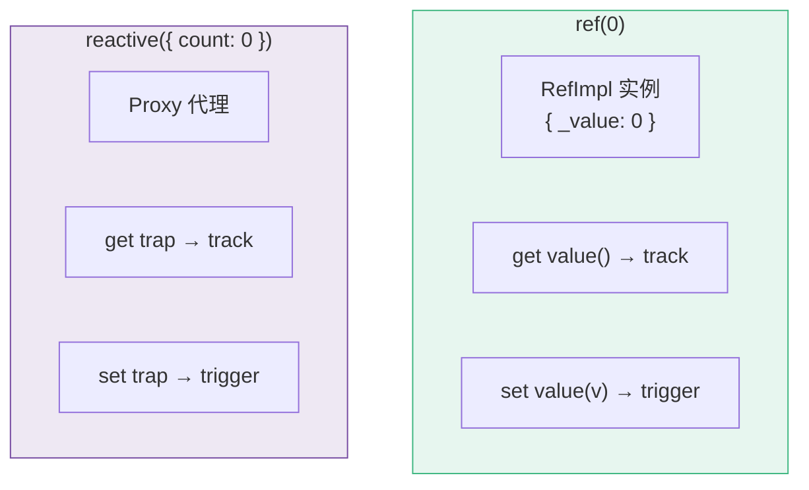
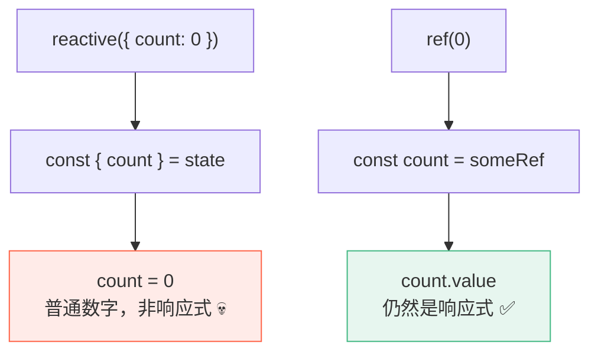
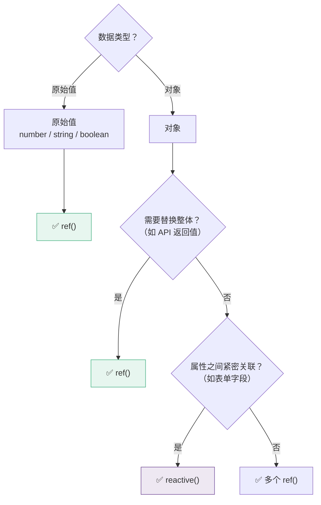

# D05 · ref vs reactive：如何选择

> **对应主课：** L03 响应式基础、L32 依赖追踪原理
> **最后核对：** 2026-04-01

---

## 1. 机制区别



| 维度 | `ref()` | `reactive()` |
|------|---------|-------------|
| 接受值类型 | 任意类型 | 仅对象 |
| 访问方式 | `.value` | 直接访问属性 |
| 拦截机制 | getter/setter | Proxy |
| 解构 | ✅ 保持响应式 | ❌ 失去响应式 |
| 替换整体 | ✅ `ref.value = newObj` | ❌ 替换后断连 |
| 模板中 | 自动解包（不需要 .value） | 直接用 |

---

## 2. 解构问题

```typescript
// ── reactive 的解构陷阱 ──
const state = reactive({ count: 0, name: 'Vue' })

// ❌ 解构后失去响应式
const { count, name } = state
count++  // 这是修改局部变量，不触发更新！

// ✅ 用 toRefs 保持响应式
const { count, name } = toRefs(state)
count.value++  // 修改原始 state.count

// ── ref 没有这个问题 ──
const count = ref(0)
const name = ref('Vue')
// 它们本身就是独立的响应式容器
```



---

## 3. 替换整体

```typescript
// ── ref 可以替换整个值 ──
const user = ref({ name: 'Vue', age: 3 })
user.value = { name: 'Vite', age: 1 }  // ✅ 完全替换，仍然响应式

// ── reactive 不能替换整个对象 ──
let state = reactive({ name: 'Vue', age: 3 })
state = reactive({ name: 'Vite', age: 1 })
// ❌ 模板中仍然绑定旧的 state

// 只能逐属性修改
Object.assign(state, { name: 'Vite', age: 1 })  // ✅ 但不优雅
```

这就是为什么 API 请求的返回值通常用 `ref` 而不是 `reactive`：

```typescript
// ✅ 推荐
const products = ref<Product[]>([])
products.value = await api.getProducts()  // 直接替换

// ❌ 不推荐
const products = reactive<Product[]>([])
// products = await api.getProducts()  // 不行！
products.splice(0, products.length, ...await api.getProducts())  // 太丑了
```

---

## 4. 选择指南



### 简单原则

```typescript
// 原则 1: 原始值 → ref
const count = ref(0)
const name = ref('')
const isOpen = ref(false)

// 原则 2: 需要替换整体的对象 → ref
const user = ref<User | null>(null)
const apiData = ref<Product[]>([])

// 原则 3: 紧密关联的表单字段 → reactive
const form = reactive({
  username: '',
  password: '',
  confirmPassword: '',
})

// 原则 4: 不确定时 → ref（更安全、更灵活）
```

---

## 5. 内部关系

```typescript
// ref(对象) 内部会调用 reactive()
const obj = ref({ name: 'Vue' })
// 等价于：
// obj._value = reactive({ name: 'Vue' })

// 两种访问方式效果相同：
obj.value.name = 'Vite'  // ref + reactive
// 和
const state = reactive({ name: 'Vue' })
state.name = 'Vite'       // 纯 reactive
```

---

## 6. 总结

| 推荐 ref 的场景 | 推荐 reactive 的场景 |
|-----------------|-------------------|
| 原始值 | 表单对象 |
| API 返回值 | 配置对象 |
| 可能被替换的对象 | 状态紧密关联的分组 |
| 从 composable 返回 | 组件内局部状态分组 |
| 不确定时的默认选择 | |

**Vue 团队官方建议：优先使用 `ref()`**，因为它更灵活、更安全、不需要担心解构丢失响应式。
