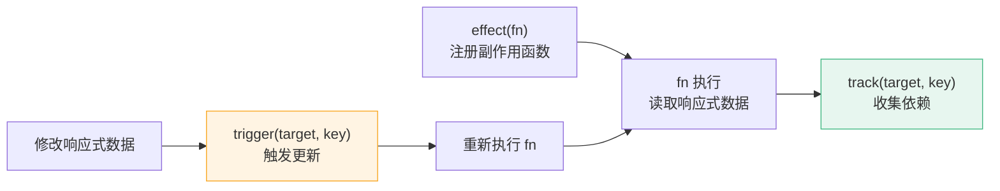
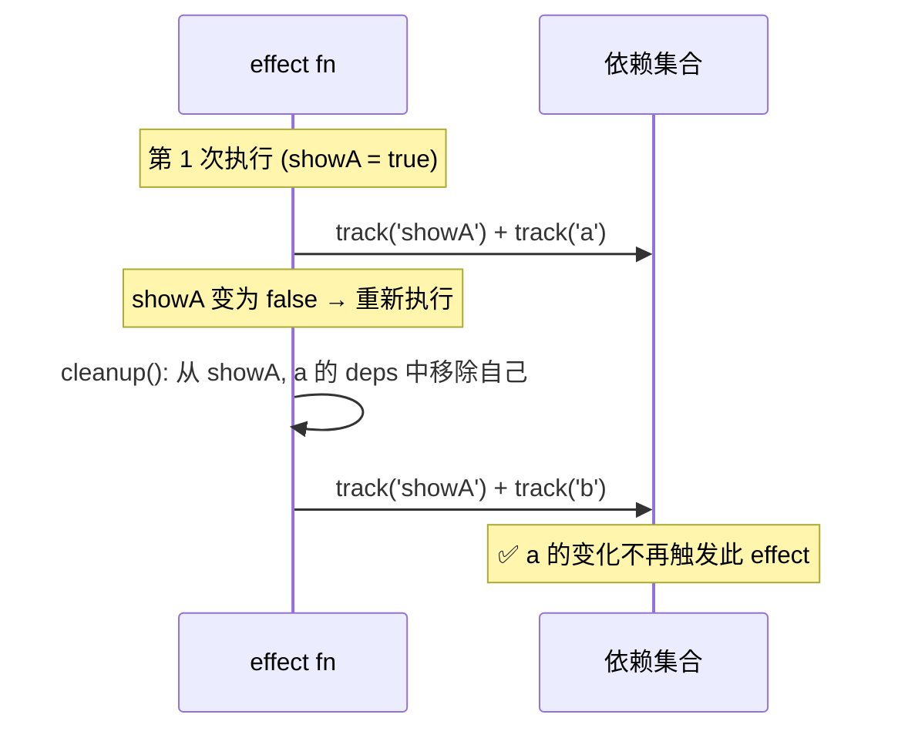

# D06 · effect / track / trigger 三件套

> **对应主课：** L31-L32 响应式原理 + 依赖追踪
> **最后核对：** 2026-04-01

---

## 1. 三者的关系



---

## 2. 数据结构

```
targetMap (WeakMap)
  └─ target 对象 → depsMap (Map)
       ├─ 'count'  → deps (Set) → { effectA, effectB }
       └─ 'name'   → deps (Set) → { effectC }
```

- **WeakMap**：target 被 GC 时，依赖自动清理
- **Map**：每个属性一个依赖集合
- **Set**：同一个 effect 不会重复收集

---

## 3. track 实现

```typescript
function track(target: object, key: string | symbol) {
  if (!activeEffect) return  // 没有正在执行的 effect → 不收集

  let depsMap = targetMap.get(target)
  if (!depsMap) {
    depsMap = new Map()
    targetMap.set(target, depsMap)
  }

  let deps = depsMap.get(key)
  if (!deps) {
    deps = new Set()
    depsMap.set(key, deps)
  }

  // 双向引用
  deps.add(activeEffect)         // deps 记录 effect
  activeEffect.deps.push(deps)   // effect 记录 deps（用于 cleanup）
}
```

**双向引用的作用：** cleanup 时，effect 需要知道自己被哪些 deps 集合引用了，才能从中移除自己。

---

## 4. trigger 实现

```typescript
function trigger(target: object, key: string | symbol) {
  const depsMap = targetMap.get(target)
  if (!depsMap) return

  const deps = depsMap.get(key)
  if (!deps) return

  // 创建副本避免无限循环（cleanup 会修改 deps）
  const effectsToRun = new Set<ReactiveEffect>()

  deps.forEach(effect => {
    // 避免自身递归：正在执行的 effect 不应该再次触发自己
    if (effect !== activeEffect) {
      effectsToRun.add(effect)
    }
  })

  effectsToRun.forEach(effect => {
    if (effect.scheduler) {
      effect.scheduler(effect)  // 有调度器 → 交给调度器
    } else {
      effect.run()              // 无调度器 → 直接执行
    }
  })
}
```

### 为什么需要 `effect !== activeEffect`

```typescript
const count = ref(0)

effect(() => {
  count.value++  // 读取 → track，写入 → trigger → 再次执行 → 无限循环！
})
// 加了 activeEffect 判断后，不会触发自身 → 避免死循环
```

---

## 5. effect 的 cleanup



---

## 6. 在 Vue 组件中的应用

| 场景 | 内部机制 |
|------|---------|
| `{{ msg }}` 模板绑定 | render effect 中读取 → track |
| `computed(() => ...)` | lazy effect + scheduler(dirty=true) |
| `watch(source, cb)` | effect 追踪 source → scheduler(cb) |
| `watchEffect(() => ...)` | 立即执行的 effect |

---

## 7. 动手实验：40 行实现完整响应式

把下面代码粘贴到浏览器控制台，体验 effect/track/trigger 的完整链路：

```javascript
// ===== Mini Reactive System（可直接运行） =====
const targetMap = new WeakMap()
let activeEffect = null

function track(target, key) {
  if (!activeEffect) return
  let depsMap = targetMap.get(target)
  if (!depsMap) targetMap.set(target, depsMap = new Map())
  let deps = depsMap.get(key)
  if (!deps) depsMap.set(key, deps = new Set())
  deps.add(activeEffect)
  console.log(`  📌 track: ${key} → 收集了 effect`)
}

function trigger(target, key) {
  const deps = targetMap.get(target)?.get(key)
  if (!deps) return
  console.log(`  🔔 trigger: ${key} → 通知 ${deps.size} 个 effect`)
  deps.forEach(fn => fn())
}

function reactive(obj) {
  return new Proxy(obj, {
    get(t, k, r) { track(t, k); return Reflect.get(t, k, r) },
    set(t, k, v, r) { Reflect.set(t, k, v, r); trigger(t, k); return true },
  })
}

function effect(fn) {
  activeEffect = fn
  fn()  // 首次执行 → 触发 getter → track 收集依赖
  activeEffect = null
}

// ===== 测试 =====
const state = reactive({ count: 0, name: 'Vue' })

// 注册 effect：首次执行会读取 count → track 收集
effect(() => {
  console.log(`🖥️ 视图更新: count = ${state.count}`)
})

// 修改数据 → trigger → effect 重新执行 → 视图更新
state.count = 1   // 🖥️ 视图更新: count = 1
state.count = 2   // 🖥️ 视图更新: count = 2
state.name = 'Vue 3'  // 没有 effect 依赖 name，不会触发
```

> 这 40 行代码就是 Vue 3 响应式系统的核心骨架。`ref()` 本质上就是 `reactive({ value: T })` 的简写。

---

## 8. 总结

- `effect` 注册副作用函数，首次立即执行
- `track` 在 getter 中收集"谁在用这个数据"
- `trigger` 在 setter 中通知"数据变了，重新执行"
- cleanup 解决条件分支的依赖残留
- scheduler 让 trigger 不直接执行，而是交给调度器

