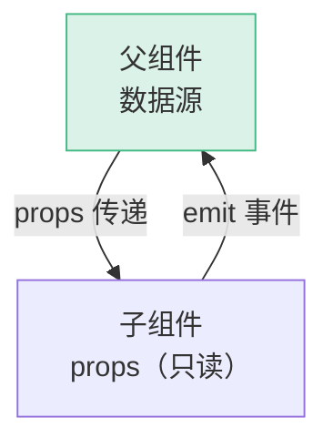
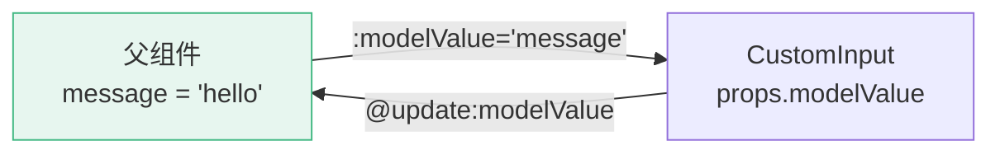
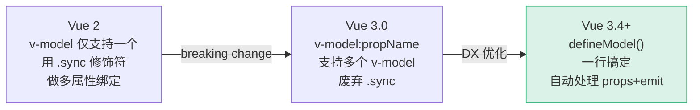
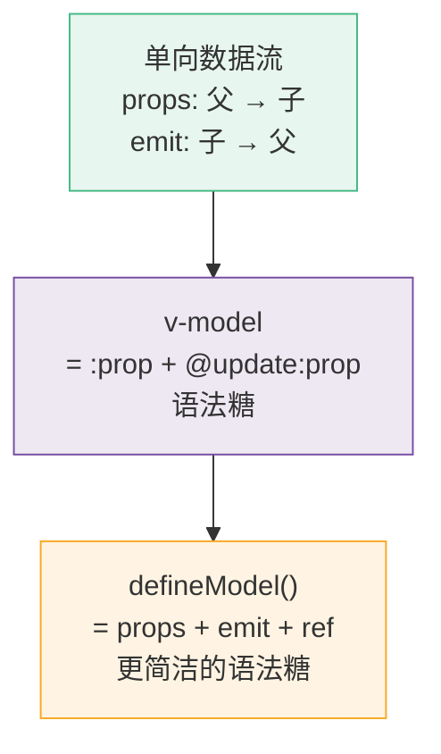

# D07 · 单向数据流 vs v-model

> **对应主课：** L06 表单 + v-model、L14 组件通信
> **最后核对：** 2026-04-01

---

## 1. 单向数据流

Vue 的 Props 遵循**单向数据流**：父 → 子。子组件不能修改 props。



```typescript
// ❌ 子组件直接修改 props
const props = defineProps<{ count: number }>()
props.count++  // Vue 会警告：Attempting to mutate prop "count"

// ✅ 通知父组件修改
const emit = defineEmits<{ 'update:count': [value: number] }>()
emit('update:count', props.count + 1)
```

---

## 2. v-model 的本质

`v-model` 是 props + emit 的**语法糖**：

```vue
<!-- v-model 写法 -->
<CustomInput v-model="message" />

<!-- 等价展开 -->
<CustomInput :modelValue="message" @update:modelValue="message = $event" />
```



### 子组件实现

```vue
<!-- CustomInput.vue -->
<script setup>
const props = defineProps<{ modelValue: string }>()
const emit = defineEmits<{ 'update:modelValue': [value: string] }>()
</script>

<template>
  <input
    :value="modelValue"
    @input="emit('update:modelValue', ($event.target as HTMLInputElement).value)"
  />
</template>
```

### Vue 3.4+ defineModel 简写

```vue
<!-- CustomInput.vue — Vue 3.4+ -->
<script setup>
const model = defineModel<string>()
</script>

<template>
  <input v-model="model" />
</template>
```

`defineModel()` 编译为 props + emit，让子组件像操作本地 ref 一样操作 v-model。

---

## 3. 多个 v-model

```vue
<!-- 父组件 -->
<UserForm
  v-model:firstName="user.firstName"
  v-model:lastName="user.lastName"
  v-model:email="user.email"
/>

<!-- UserForm.vue -->
<script setup>
const firstName = defineModel<string>('firstName')
const lastName = defineModel<string>('lastName')
const email = defineModel<string>('email')
</script>

<template>
  <input v-model="firstName" placeholder="名" />
  <input v-model="lastName" placeholder="姓" />
  <input v-model="email" placeholder="邮箱" />
</template>
```

---

## 4. v-model 修饰符

```vue
<!-- 内置修饰符 -->
<input v-model.trim="name" />      <!-- 自动 trim -->
<input v-model.number="age" />     <!-- 转为数字 -->
<input v-model.lazy="text" />      <!-- change 而非 input 事件 -->

<!-- 自定义修饰符 -->
<CustomInput v-model.capitalize="text" />

<!-- CustomInput.vue -->
<script setup>
const [model, modifiers] = defineModel<string>({
  set(value) {
    if (modifiers.capitalize) {
      return value.charAt(0).toUpperCase() + value.slice(1)
    }
    return value
  },
})
</script>
```

---

## 5. 何时用 v-model vs props+emit

| 场景 | 推荐 |
|------|------|
| 表单输入组件 | ✅ v-model |
| 开关/选择器 | ✅ v-model |
| 弹窗 visible | ✅ `v-model:visible` |
| 按钮点击事件 | ❌ props + emit |
| 复杂对象传递 | ❌ props + emit |
| 只读数据展示 | ❌ 只需 props |

**原则：v-model 适合"双向绑定"的场景（输入型组件）。单纯的父 → 子数据传递用 props。**

## 6. 常见反模式

### 反模式 1：v-model 修改 props 对象内部

```typescript
// 父组件
const user = ref({ name: 'Vue', age: 3 })

// ❌ 子组件直接修改 props 对象的属性
const props = defineProps<{ user: { name: string; age: number } }>()
props.user.name = 'React'  // 不会警告，但违反单向数据流！
// 因为对象是引用传递，子组件改了，父组件的数据也变了

// ✅ 正确做法：emit 一个新对象
const emit = defineEmits<{ 'update:user': [value: typeof props.user] }>()
emit('update:user', { ...props.user, name: 'React' })
```

### 反模式 2：对非输入型组件用 v-model

```vue
<!-- ⚠️ 不推荐：列表组件不应该用 v-model -->
<UserList v-model="selectedUsers" />
<!-- 这暗示 UserList 是一个"输入控件"，但它其实是展示+选择 -->

<!-- ✅ 更清晰的语义 -->
<UserList :users="users" :selected="selectedIds" @select="handleSelect" />
```

---

## 7. v-model 的演进



---

## 8. 总结



- 单向数据流是 Vue 的**核心原则**，v-model 不违反它
- v-model 只是 props + emit 的简写，数据流仍然是清晰的
- Vue 3.4 的 `defineModel` 让双向绑定的实现更简洁
- 避免对非输入型组件使用 v-model，保持语义清晰
- 避免直接修改 props 对象的内部属性
