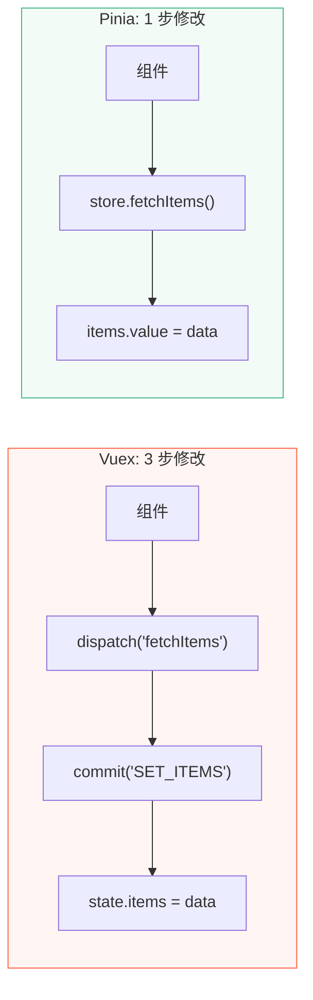

# D08 · Pinia vs Vuex

> **对应主课：** L11 Pinia 状态管理
> **最后核对：** 2026-04-01

---

## 1. 核心区别

| 维度 | Vuex (Vue 2/3) | Pinia (Vue 3) |
|------|----------------|---------------|
| API 风格 | mutations + actions + getters | 只有 state + getters + actions |
| Mutations | ✅ 必须通过 mutation 修改 | ❌ 不存在，直接修改 state |
| TypeScript | 需要额外类型声明 | 完美类型推断 |
| 模块化 | modules（嵌套 + 命名空间） | 多个独立 store（扁平） |
| DevTools | ✅ 支持 | ✅ 支持 |
| 代码体积 | ~6KB | ~1.5KB |
| Composition API | 需要 `useStore()` | 天然支持 |
| 热更新 | 需要配置 | 开箱即用 |

---

## 2. 同一功能对比

### Vuex

```typescript
// store/index.ts
import { createStore } from 'vuex'

export default createStore({
  state: {
    count: 0,
    items: [] as string[],
  },
  getters: {
    doubleCount(state) {
      return state.count * 2
    },
    itemCount(state) {
      return state.items.length
    },
  },
  mutations: {
    // 必须是同步的！
    INCREMENT(state) {
      state.count++
    },
    SET_ITEMS(state, items: string[]) {
      state.items = items
    },
  },
  actions: {
    // 异步操作放在 actions
    async fetchItems({ commit }) {
      const items = await api.getItems()
      commit('SET_ITEMS', items)  // 必须通过 mutation 修改
    },
    increment({ commit }) {
      commit('INCREMENT')
    },
  },
})

// 组件中使用
import { useStore } from 'vuex'

const store = useStore()
store.state.count            // 读取
store.getters.doubleCount    // getter
store.commit('INCREMENT')    // 触发 mutation
store.dispatch('fetchItems') // 触发 action
```

### Pinia

```typescript
// stores/counter.ts
import { ref, computed } from 'vue'
import { defineStore } from 'pinia'

export const useCounterStore = defineStore('counter', () => {
  const count = ref(0)
  const items = ref<string[]>([])

  const doubleCount = computed(() => count.value * 2)
  const itemCount = computed(() => items.value.length)

  function increment() {
    count.value++  // 直接修改！
  }

  async function fetchItems() {
    items.value = await api.getItems()  // 直接赋值！
  }

  return { count, items, doubleCount, itemCount, increment, fetchItems }
})

// 组件中使用
import { useCounterStore } from '@/stores/counter'

const counter = useCounterStore()
counter.count                // 读取
counter.doubleCount          // getter (computed)
counter.increment()          // action（直接调函数）
counter.fetchItems()         // 异步 action（也是直接调函数）
```

---

## 3. 为什么去掉 Mutations



Vuex 的 mutations 最初是为了 DevTools 时间旅行调试。但 Pinia 证明：**不需要 mutations 也能实现完整的 DevTools 支持**。去掉 mutations 后：
- 减少了样板代码
- 不需要记字符串常量
- 异步和同步操作不再需要分开

---

## 4. 模块化对比

```typescript
// Vuex: 嵌套模块（容易变得复杂）
const store = createStore({
  modules: {
    user: {
      namespaced: true,
      state: { name: '' },
      mutations: { SET_NAME(state, name) { state.name = name } },
    },
    cart: {
      namespaced: true,
      state: { items: [] },
      // 访问其他模块需要 rootState
      actions: {
        checkout({ state, rootState }) {
          // rootState.user.name
        },
      },
    },
  },
})
// 使用：store.commit('user/SET_NAME', 'Vue')  ← 字符串路径

// Pinia: 独立 store（扁平、清晰）
const useUserStore = defineStore('user', () => {
  const name = ref('')
  return { name }
})

const useCartStore = defineStore('cart', () => {
  const items = ref([])

  function checkout() {
    const userStore = useUserStore()  // 直接引用其他 store
    console.log(userStore.name)
  }

  return { items, checkout }
})
```

---

## 5. TypeScript 支持

```typescript
// Vuex：需要大量类型声明
interface RootState {
  user: UserState
  cart: CartState
}

// 使用时仍然是 any 或需要类型断言
const name = (store.state as RootState).user.name

// Pinia：自动推断
const userStore = useUserStore()
userStore.name  // 自动推断为 string ✅
```

---

## 6. 迁移建议

| | 建议 |
|-|------|
| 新项目 | ✅ 直接用 Pinia |
| Vue 3 老项目用 Vuex 4 | 逐步迁移到 Pinia |
| Vue 2 项目 | 继续用 Vuex 3（Pinia 也支持 Vue 2） |

**Pinia 是 Vue 官方推荐的状态管理方案**，Vuex 进入维护模式。

---

## 7. 总结

- Pinia 去掉了 mutations，简化了开发流程
- Pinia 用独立 store 替代嵌套 modules，更清晰
- Pinia 的 Composition API 风格让 TypeScript 推断完美
- Pinia 体积更小（1.5KB vs 6KB）
- Vuex 不会被删除，但新项目应该选 Pinia
