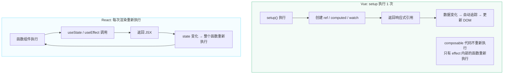

# D09 · Composables vs React Hooks

> **对应主课：** L37 Composition API 设计哲学
> **最后核对：** 2026-04-01

---

## 1. 表面相似，底层不同

```typescript
// Vue Composable
function useCounter() {
  const count = ref(0)
  const increment = () => count.value++
  return { count, increment }
}

// React Hook
function useCounter() {
  const [count, setCount] = useState(0)
  const increment = () => setCount(c => c + 1)
  return { count, increment }
}
```

看起来几乎一样，但执行模型完全不同。

---

## 2. 核心差异

| 维度 | Vue Composable | React Hook |
|------|---------------|------------|
| **执行频率** | 只执行 **1 次**（setup） | **每次渲染**都重新执行 |
| **依赖追踪** | 自动（Proxy） | 手动（deps 数组） |
| **条件调用** | ✅ 可以在 if/for 中 | ❌ 必须在顶层 |
| **闭包陷阱** | 不存在 | 常见问题 |
| **返回值** | 响应式 Ref | 快照值 |

---

## 3. 执行模型



---

## 4. 闭包陷阱

### React 的闭包陷阱

```javascript
function Timer() {
  const [count, setCount] = useState(0)

  useEffect(() => {
    const id = setInterval(() => {
      console.log(count)  // ❌ 永远是 0！
      // 因为 useEffect 的回调闭包捕获了初始的 count 值
    }, 1000)
    return () => clearInterval(id)
  }, [])  // 空依赖 → 回调不会更新

  return <button onClick={() => setCount(c => c + 1)}>{count}</button>
}
```

修复方式（繁琐）：
```javascript
// 方式 1: 添加依赖（但每次 count 变化都重建定时器）
useEffect(() => { /* ... */ }, [count])

// 方式 2: useRef（额外的心智负担）
const countRef = useRef(count)
countRef.current = count  // 每次渲染手动同步
```

### Vue 没有这个问题

```typescript
setup() {
  const count = ref(0)

  onMounted(() => {
    setInterval(() => {
      console.log(count.value)  // ✅ 永远是最新值
      // 因为 count 是 Ref 对象，.value 是 getter
      // 每次读取都是最新的
    }, 1000)
  })

  return { count }
}
```

---

## 5. 依赖声明

```typescript
// React: 手动声明依赖数组
useEffect(() => {
  fetchData(userId, pageNum)
}, [userId, pageNum])  // ← 漏了一个就是 bug

useMemo(() => {
  return expensiveCalc(a, b)
}, [a, b])  // ← 忘了加依赖 → 缓存值过期

// Vue: 自动追踪依赖
watchEffect(() => {
  fetchData(userId.value, pageNum.value)
  // 自动追踪 userId 和 pageNum，不需要声明
})

const result = computed(() => {
  return expensiveCalc(a.value, b.value)
  // 自动追踪 a 和 b，不需要 deps 数组
})
```

---

## 6. 条件调用

```typescript
// React: ❌ hooks 不能在条件语句中
function App({ isAdmin }) {
  if (isAdmin) {
    useAdminPanel()  // ❌ React 报错！
  }
}

// Vue: ✅ composable 可以在任意位置调用
setup() {
  if (props.isAdmin) {
    useAdminPanel()  // ✅ 完全合法
  }
}
```

因为 Vue 的 setup 只执行一次，不依赖调用顺序来匹配状态。React Hooks 必须保证每次渲染的调用顺序一致。

## 7. 实战对比：useMousePosition

同一个功能在两个框架中的实现差异：

```typescript
// ===== Vue Composable =====
function useMousePosition() {
  const x = ref(0)
  const y = ref(0)

  function update(e: MouseEvent) {
    x.value = e.clientX
    y.value = e.clientY
  }

  onMounted(() => window.addEventListener('mousemove', update))
  onUnmounted(() => window.removeEventListener('mousemove', update))

  return { x, y }
}
// setup 中调用一次 → 创建一次 → 永远工作
// update 函数不会被重新创建
```

```javascript
// ===== React Hook =====
function useMousePosition() {
  const [pos, setPos] = useState({ x: 0, y: 0 })

  useEffect(() => {
    const update = (e) => setPos({ x: e.clientX, y: e.clientY })
    window.addEventListener('mousemove', update)
    return () => window.removeEventListener('mousemove', update)
  }, [])  // 空依赖 → 只绑定一次，但这里碰巧没问题

  return pos
}
// 每次渲染：函数组件重新执行 → useState 调用 → useEffect 检查依赖
// 返回的 pos 是一个新对象（但内容可能一样）
```

**关键区别：**
- Vue 的 `update` 函数只创建一次，直接修改 ref
- React 的每次渲染都重新执行 hook 函数（虽然 useEffect 内部有优化）
- Vue 的返回值 `{ x, y }` 是固定的 ref 引用，消费者不会因为鼠标移动而重渲染（除非模板用到了 `x.value`）
- React 的返回值 `pos` 每次 setPos 都是新对象，消费组件会重渲染

---

## 8. 性能影响

| 方面 | Vue Composable | React Hook |
|------|---------------|------------|
| 函数执行 | 1 次（setup） | N 次（每次渲染） |
| 闭包创建 | 1 个（setup 闭包） | N 个（每次渲染新回调） |
| GC 压力 | 低（稳定引用） | 较高（每次创建新闭包） |
| 优化手段 | 无需优化 | useCallback / useMemo |
| Devtools 体验 | 稳定的 ref 引用 | 快照值，需要 Profiler |

> React 需要 `useCallback` 和 `useMemo` 来优化性能，Vue 天然不需要这些。这不是 React 的缺陷，而是两种响应式模型的本质差异。

---

## 9. 总结

| | Vue Composable | React Hook |
|-|---------------|------------|
| 心智模型 | 响应式变量 | 渲染快照 |
| 执行 | 一次性设置 | 每次渲染 |
| 陷阱 | 几乎没有 | 闭包/依赖声明 |
| 性能优化 | 不需要 | useCallback/useMemo |
| 学习曲线 | 理解 Ref | 理解 Hooks 规则 |

两者都是优秀的逻辑复用方案，但 Vue 的自动依赖追踪让开发体验更顺畅，性能优化的心智负担更低。

