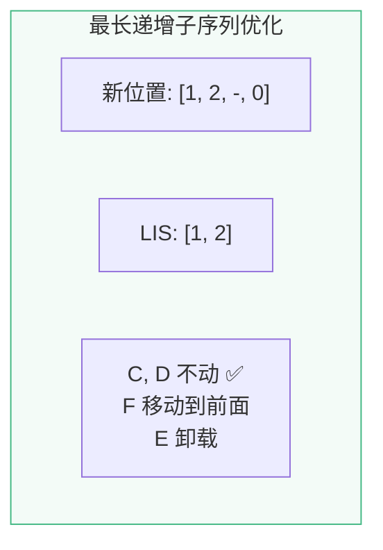

# D11 · Diff 算法深入

> **对应主课：** L33 Virtual DOM
> **最后核对：** 2026-04-01

---

## 1. 为什么不全量替换

```javascript
// 最简单的方案：每次更新重建整个 DOM
container.innerHTML = render()  // ← 简单但会丢失所有状态（focus、scroll、动画）

// Diff 方案：找到最小变化，精准修改
patch(oldVNode, newVNode)  // ← 保留未变化的 DOM 节点
```

---

## 2. Vue 3 的五步 Diff

处理有 key 的子节点列表：

```
旧: [A, B, C, D, E, F, G]
新: [A, B, F, C, D, G]
```

### Step 1: 从头比较

```
旧: [A, B, C, D, E, F, G]
新: [A, B, F, C, D, G]
     ^  ^
     相同 → patch, i++
```

### Step 2: 从尾比较

```
旧: [A, B, C, D, E, F, G]
新: [A, B, F, C, D, G]
                        ^
                        G 相同 → patch, e1--, e2--
```

### Step 3: 新节点多余 → mount

```
旧: []           (所有旧节点已匹配)
新: [X, Y]       (还有新节点未匹配)
→ mount X, Y
```

### Step 4: 旧节点多余 → unmount

```
旧: [E, F]      (还有旧节点未匹配)
新: []           (所有新节点已匹配)
→ unmount E, F
```

### Step 5: 乱序 — key 映射 + LIS

```
中间部分:
旧: [C, D, E, F]
新: [F, C, D]

1. 建立新序列 key → index 映射
   { F:0, C:1, D:2 }

2. 遍历旧序列，找到每个节点在新序列中的位置
   C → 1, D → 2, E → 不存在(unmount), F → 0
   新位置数组: [1, 2, -, 0]

3. 最长递增子序列: [1, 2] = [C, D]
   → C, D 不移动

4. F 需要移动到 C 前面
   E 需要卸载
```



---

## 3. 为什么需要 key

```vue
<!-- ❌ 没有 key：按索引匹配 -->
<!-- 删除第一项时，所有项都会被 patch -->
<div v-for="item in list">{{ item.name }}</div>

<!-- ✅ 有 key：按 key 匹配 -->
<!-- 删除第一项时，只有该项被 unmount -->
<div v-for="item in list" :key="item.id">{{ item.name }}</div>
```

**无 key 示例（删除 A）：**
```
旧: [A, B, C]   索引: [0, 1, 2]
新: [B, C]       索引: [0, 1]

无 key → 按索引对比:
0: A → B (patch: 修改内容)
1: B → C (patch: 修改内容)
2: C → 无 (unmount)
→ 3 次操作，且组件状态可能错乱

有 key → 按 key 对比:
A → 不在新列表 (unmount)
B → 存在 (复用)
C → 存在 (复用)
→ 1 次操作，状态正确
```

---

## 4. 与 React diff 的区别

| | Vue 3 | React |
|-|-------|-------|
| 列表 diff | 双端 + LIS | 单向遍历 |
| 静态节点 | PatchFlag 跳过 | 全量比较 |
| key 处理 | 映射 + LIS 最小移动 | 链表 + Fiber |
| 更新粒度 | 组件级（编译优化）| 组件级 |

---

## 5. 时间复杂度

| 算法 | 复杂度 |
|------|--------|
| 理论最优 tree diff | O(n³) |
| 同级比较（Vue/React） | O(n) |
| LIS 算法 | O(n log n) |
| 总体 Vue 3 更新 | O(动态节点数) |

---

## 6. 动手实验：LIS 算法实现

Vue 3 使用最长递增子序列（LIS）来决定哪些节点不需要移动。以下是可运行的实现：

```javascript
// ===== LIS 算法（Vue 3 源码简化版） =====
function getSequence(arr) {
  const n = arr.length
  const result = [0]           // 存储 LIS 的索引
  const predecessor = new Array(n) // 前驱索引（回溯用）
  
  for (let i = 1; i < n; i++) {
    const val = arr[i]
    if (val === -1) continue   // -1 表示新增节点，跳过
    
    const last = arr[result[result.length - 1]]
    if (val > last) {
      predecessor[i] = result[result.length - 1]
      result.push(i)
      continue
    }
    
    // 二分查找：找到第一个 >= val 的位置
    let lo = 0, hi = result.length - 1
    while (lo < hi) {
      const mid = (lo + hi) >> 1
      if (arr[result[mid]] < val) lo = mid + 1
      else hi = mid
    }
    if (val < arr[result[lo]]) {
      if (lo > 0) predecessor[i] = result[lo - 1]
      result[lo] = i
    }
  }
  
  // 回溯构建最终序列
  let len = result.length
  let idx = result[len - 1]
  while (len-- > 0) {
    result[len] = idx
    idx = predecessor[idx]
  }
  return result
}

// ===== 测试 =====
// 模拟 diff Step 5 的场景：
// 旧: [C, D, E, F]
// 新: [F, C, D]
// 旧节点在新序列中的位置: [1, 2, -1, 0]  (-1 = 不存在)
const newIndexes = [1, 2, -1, 0]
const lis = getSequence(newIndexes)
console.log('新位置数组:', newIndexes)
console.log('LIS 索引:', lis)          // [0, 1] → 对应旧数组的 C, D
console.log('→ C, D 不需要移动，F 需要移动，E 需要卸载')
```

---

## 7. 总结

- Vue 3 的 diff 分 5 步：头比、尾比、仅新增、仅删除、乱序 + LIS
- LIS 找到最多「不需要移动」的节点，最小化 DOM 操作
- key 让 diff 能精确识别节点身份，避免不必要的 patch
- 加上 PatchFlag 和 Block Tree，实际 diff 范围远小于全部节点

