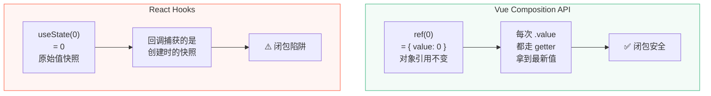

# D12 · 闭包陷阱与解决方案

> **对应主课：** L37 Composition API 设计哲学
> **最后核对：** 2026-04-01

---

## 1. 什么是闭包陷阱

闭包陷阱是指：回调函数捕获了创建时的变量值，后续变量更新后，回调中仍然使用旧值。

```javascript
// 经典示例
for (var i = 0; i < 3; i++) {
  setTimeout(() => {
    console.log(i)  // 输出 3, 3, 3（不是 0, 1, 2）
  }, 100)
}
// var 是函数作用域，循环结束时 i = 3，三个回调共享同一个 i
```

---

## 2. Vue 中几乎没有闭包陷阱

```typescript
// Vue 的 ref 是响应式对象，.value 是 getter
const count = ref(0)

onMounted(() => {
  setInterval(() => {
    console.log(count.value)  // ✅ 永远是最新值
    // 因为每次读取 count.value 都触发 getter
    // getter 返回的是当前最新的 _value
  }, 1000)
})

// 即使在 setup 中创建的回调，也能拿到最新值
const handler = () => {
  console.log(count.value)  // ✅ 不需要担心"过期"
}
```

**原因：** Vue 的 `ref` 是对象引用，`.value` 是运行时计算的，不是创建时的快照。

---

## 3. React 中的闭包陷阱

```javascript
function Counter() {
  const [count, setCount] = useState(0)

  // ❌ 闭包陷阱
  useEffect(() => {
    const id = setInterval(() => {
      console.log(count)  // 永远是 0！
    }, 1000)
    return () => clearInterval(id)
  }, [])

  // ❌ 事件处理器也有同样问题
  const handleClickLater = () => {
    setTimeout(() => {
      alert(count)  // 显示的是点击时的 count 值，不是 3 秒后的最新值
    }, 3000)
  }
}
```

---

## 4. Vue 中仍需注意的场景

### 4.1 解构后丢失响应式

```typescript
const state = reactive({ count: 0 })

// ❌ 解构出的 count 是普通数字
const { count } = state

setTimeout(() => {
  console.log(count)  // 永远是 0！（普通变量，不是响应式）
}, 1000)

// ✅ 解构用 toRefs
const { count } = toRefs(state)
setTimeout(() => {
  console.log(count.value)  // ✅ 最新值
}, 1000)
```

### 4.2 watch 的 getter 写法

```typescript
const state = reactive({ count: 0 })

// ❌ 直接传 state.count → 传的是当前值（0），不会更新
watch(state.count, (val) => { /* ... */ })

// ✅ 传 getter 函数
watch(() => state.count, (val) => { /* ... */ })
```

### 4.3 第三方库的回调

```typescript
// 某些第三方库传入回调时，可能在内部存储了旧引用
thirdPartyLib.onEvent((data) => {
  // 如果库缓存了这个回调，可能拿到旧闭包
  console.log(someReactiveValue.value)  // 没问题，ref 本身就是最新的
  console.log(someDestructuredPrimitive)  // ⚠️ 可能是旧值
})
```

---

## 5. 最佳实践

```typescript
// 1. 使用 ref 而不是解构后的原始值
const count = ref(0)           // ✅ 传递 count 对象
const { count: c } = state     // ⚠️ c 是快照

// 2. 在回调中通过 .value 访问
setTimeout(() => count.value)   // ✅

// 3. watch 用 getter 函数
watch(() => state.count, cb)    // ✅

// 4. 传给第三方库时用 ref 对象
useThirdParty({ value: count }) // ✅ 传 ref 对象

// 5. 需要原始值时用 computed 包装
const displayCount = computed(() => state.count)
```

## 6. 动手实验：Vue ref vs 普通变量

在浏览器控制台运行对比实验：

```javascript
// ===== 模拟 Vue ref 的闭包安全性 =====

// 模拟 ref：对象引用 + getter
function ref(initialValue) {
  const r = { _value: initialValue }
  Object.defineProperty(r, 'value', {
    get() { return r._value },
    set(v) { r._value = v }
  })
  return r
}

// ===== 场景 1：普通变量（React 模式）=====
let plainCount = 0
const plainCallback = () => console.log('普通变量:', plainCount)
// 捕获的是创建时的值吗？

// ===== 场景 2：ref 对象（Vue 模式）=====
const refCount = ref(0)
const refCallback = () => console.log('ref.value:', refCount.value)
// 每次读取都走 getter

// 模拟数据更新
plainCount = 42
refCount.value = 42

// 模拟异步回调执行
setTimeout(() => {
  plainCallback()  // 普通变量: 42  ← 这里碰巧也是对的！
  refCallback()    // ref.value: 42
  
  // 但如果是函数参数传递的值就不同了...
  function createHandler(val) {
    return () => console.log('函数参数:', val)
  }
  const handler = createHandler(plainCount)  // 传入 42
  plainCount = 100
  handler()  // 函数参数: 42  ← ❌ 旧值！闭包陷阱！
  
  // ref 对象永远安全
  function createRefHandler(r) {
    return () => console.log('ref 参数:', r.value)
  }
  const refHandler = createRefHandler(refCount)
  refCount.value = 100
  refHandler()  // ref 参数: 100  ← ✅ 最新值！
}, 100)
```

---

## 7. 真实 Debug 场景

### 场景：定时刷新数据显示旧值

```typescript
// ❌ Bug：dashboard 数据不更新
const { count } = storeToRefs(useTaskStore())  // ✅ 这里没问题
const displayText = `任务数量: ${count.value}`  // ❌ 快照！

setInterval(() => {
  document.title = displayText  // 永远显示初始值
}, 5000)

// ✅ Fix 1：回调内读取
setInterval(() => {
  document.title = `任务数量: ${count.value}`  // 每次重新读取
}, 5000)

// ✅ Fix 2：用 watchEffect 自动追踪
watchEffect(() => {
  document.title = `任务数量: ${count.value}`
})
```

### 心智模型



---

## 8. 总结

| | Vue | React |
|-|------|-------|
| 闭包陷阱风险 | 极低（ref 是对象引用） | 高（state 是快照） |
| 解决方案 | 天然解决（.value getter） | useRef / 函数式 setState / deps |
| 需要注意 | reactive 解构、watch 参数 | 几乎所有异步回调 |

**核心原则：**
- 回调中读 `ref.value` → 永远安全
- 回调中读解构出来的原始值 → 闭包陷阱
- 传递给第三方库时传 ref 对象 → 安全

Vue 通过 Ref 对象 + getter 机制，**从设计层面避免了闭包陷阱**。这是 Composition API 相对于 React Hooks 的重要优势之一。

