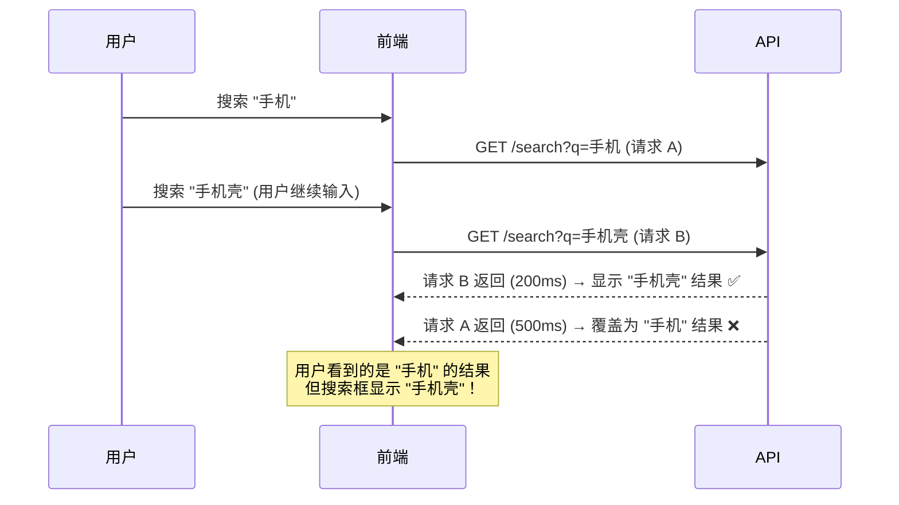

# D13 · 竞态条件与解决方案

> **对应主课：** L23 商品列表（竞态处理）
> **最后核对：** 2026-04-01

---

## 1. 什么是竞态条件

当多个异步操作的完成顺序不确定时，后发先至的请求可能用旧数据覆盖新数据。



---

## 2. 解决方案 1：请求 ID

```typescript
let requestId = 0

async function search(query: string) {
  const currentId = ++requestId  // 每次搜索递增

  loading.value = true
  const result = await api.search(query)

  // 只有最新的请求才更新数据
  if (currentId === requestId) {
    data.value = result    // ✅ 最新请求
    loading.value = false
  }
  // else: 旧请求，静默丢弃
}
```

**优点：** 简单直接。**缺点：** 旧请求仍在进行（浪费带宽）。

---

## 3. 解决方案 2：AbortController

```typescript
let abortController: AbortController | null = null

async function search(query: string) {
  // 取消上一次请求
  abortController?.abort()
  abortController = new AbortController()

  try {
    const result = await fetch(`/api/search?q=${query}`, {
      signal: abortController.signal,
    })
    data.value = await result.json()
  } catch (err) {
    if (err.name === 'AbortError') {
      // 被取消的请求，忽略
      return
    }
    throw err
  }
}
```

**优点：** 真正取消了旧请求，节省了带宽和服务端资源。

### Axios 版本

```typescript
let cancelToken: AbortController | null = null

async function search(query: string) {
  cancelToken?.abort()
  cancelToken = new AbortController()

  const { data } = await axios.get('/api/search', {
    params: { q: query },
    signal: cancelToken.signal,
  })
  results.value = data
}
```

---

## 4. 解决方案 3：防抖

从源头减少请求次数，常与上述方案配合使用：

```typescript
import { ref, watch } from 'vue'
import { useDebouncedRef } from '@/composables/useDebouncedRef'

const searchQuery = ref('')
const debouncedQuery = useDebouncedRef(searchQuery, 300)

// 用户输入 "手机壳" 过程：
// "手" → 等 300ms
// "手机" → 重置计时器，等 300ms
// "手机壳" → 重置计时器，等 300ms → 只发 1 次请求
watch(debouncedQuery, (q) => {
  search(q)
})
```

---

## 5. 解决方案 4：useRequest composable

把竞态处理封装成可复用的 composable：

```typescript
function useRequest<T>(fetcher: (...args: any[]) => Promise<T>) {
  const data = ref<T | null>(null)
  const loading = ref(false)
  const error = ref<string | null>(null)
  let currentId = 0

  async function execute(...args: any[]) {
    const id = ++currentId
    loading.value = true
    error.value = null

    try {
      const result = await fetcher(...args)
      if (id === currentId) {
        data.value = result
      }
    } catch (err) {
      if (id === currentId) {
        error.value = (err as Error).message
      }
    } finally {
      if (id === currentId) {
        loading.value = false
      }
    }
  }

  return { data, loading, error, execute }
}
```

---

## 6. 常见竞态场景

| 场景 | 表现 | 推荐方案 |
|------|------|---------|
| 搜索自动补全 | 旧结果覆盖新结果 | 防抖 + AbortController |
| 分页快速翻页 | 显示错误页码的数据 | 请求 ID |
| Tab 切换加载 | 切换后显示上一个 Tab 的数据 | AbortController + onUnmounted |
| 表单连续提交 | 重复创建记录 | 禁用按钮 + 请求锁 |

---

## 7. 组件卸载时的竞态

```typescript
import { onUnmounted } from 'vue'

function useAutoCancel<T>(fetcher: () => Promise<T>) {
  const controller = new AbortController()

  // 组件卸载时自动取消
  onUnmounted(() => {
    controller.abort()
  })

  return fetcher()
}
```

---

## 8. 总结

- 竞态条件在异步 UI 中很常见，**必须主动处理**
- 请求 ID 是最简单的方案，适合大多数场景
- AbortController 可以真正取消请求，节省资源
- 防抖从源头减少请求，常与其他方案配合
- 组件卸载时应取消未完成的请求，避免更新已销毁组件
