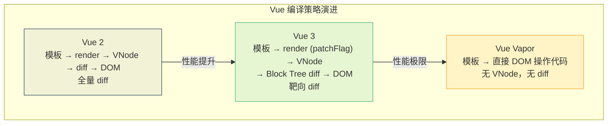
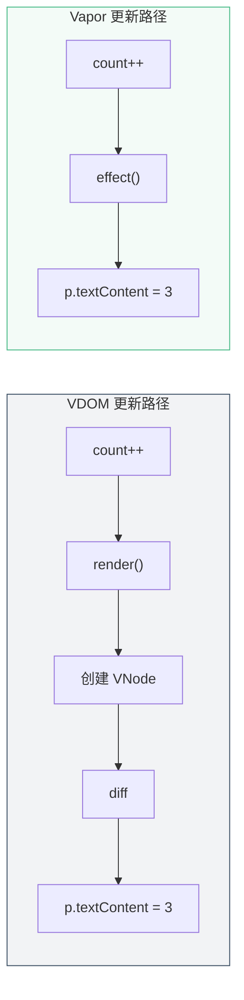
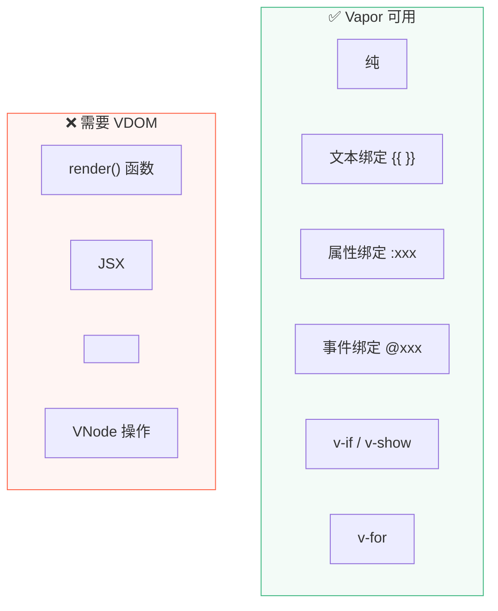

> **对应主课：** L38 Vapor Mode
> **适用版本：** Vue 3.6+
> **当前状态：** Feature-complete in 3.6 beta, unstable
> **最后核对：** 2026-04-01

```
📌 Vue 的下一代编译策略：绕过 Virtual DOM 的直接 DOM 编译
```

---

## 1. Vapor Mode 的定位



---

## 2. 编译输出对比

### 模板

```vue
<template>
  <div>
    <h1>{{ title }}</h1>
    <p>{{ count }}</p>
    <button @click="count++">+1</button>
  </div>
</template>
```

### VDOM 模式输出

```javascript
import { createVNode, openBlock, createBlock, toDisplayString } from 'vue'

function render(_ctx) {
  return (openBlock(), createBlock('div', null, [
    createVNode('h1', null, toDisplayString(_ctx.title), 1 /* TEXT */),
    createVNode('p', null, toDisplayString(_ctx.count), 1 /* TEXT */),
    createVNode('button', { onClick: _cache[0] || (_cache[0] = () => _ctx.count++) }, '+1'),
  ]))
}
// 每次更新：执行 render → 创建 VNode → diff dynamicChildren → patch DOM
```

### Vapor 模式输出

```javascript
import { template, setText, on, effect } from 'vue/vapor'

// 从 HTML 模板字符串创建 DOM（一次性）
const t0 = template('<div><h1></h1><p></p><button>+1</button></div>')

function setup(_ctx) {
  // 克隆模板获得 DOM 引用
  const root = t0()
  const h1 = root.firstChild
  const p = h1.nextSibling
  const button = p.nextSibling

  // 绑定事件（一次性）
  on(button, 'click', () => _ctx.count++)

  // 响应式绑定（effect 直接操作 DOM）
  effect(() => setText(h1, _ctx.title))
  effect(() => setText(p, _ctx.count))

  return root
}
// 更新时：effect 直接执行 setText → 修改 DOM textContent
// 没有 VNode，没有 diff，没有 render 函数重新执行
```



---

## 3. template() 的巧妙之处

```javascript
const t0 = template('<div><h1></h1><p></p><button>+1</button></div>')
```

`template()` 的实现：

```javascript
function template(html) {
  let node
  return () => {
    if (!node) {
      const t = document.createElement('template')
      t.innerHTML = html
      node = t.content.firstChild
    }
    return node.cloneNode(true)  // 克隆比逐个 createElement 快
  }
}
```

- 第一次调用：用 `innerHTML` 解析 HTML 字符串
- 后续调用：`cloneNode(true)` 深克隆，**比逐个 `createElement` 快 3-5 倍**

---

## 4. 性能收益

| 指标 | VDOM 模式 | Vapor 模式 | 提升 |
|------|----------|-----------|------|
| Bundle 大小 | ~15KB (runtime) | ~6KB | -60% |
| 内存 | VNode 对象 | 无额外对象 | -50%+ |
| 更新速度 | render + diff | 直接 DOM 操作 | 2-5x |
| 初始化 | createElement 逐个 | cloneNode 批量 | 3-5x |

---

## 5. 限制与取舍



---

## 6. 与 Svelte/SolidJS 的关系

| 框架 | 策略 | 响应式 | 运行时 |
|------|------|--------|--------|
| **Svelte** | 编译到原生 JS | 编译时（`$:` 标记） | ~2KB |
| **SolidJS** | 编译到 DOM 操作 | 信号系统 | ~7KB |
| **Vue Vapor** | 编译到 DOM 操作 | Proxy 响应式 | ~6KB |

Vue Vapor 的独特之处：**复用 Vue 3 整套响应式系统**（ref/reactive/computed/watch），只是不再经过 VDOM。学了 Vue 3 的响应式，Vapor 零学习成本。

---

## 7. 现状（截至 2026-04-01）

- ✅ Vapor Mode 已在 Vue 3.6 beta 中达到 feature-complete
- ✅ 基本组件渲染、指令、事件绑定均可用
- ⚠️ 仍标记为 **unstable**，API 可能变化
- 📦 原 `vuejs/vue-vapor` 仓库已于 2025-07-19 归档，开发转移到 `vuejs/core` 的 vapor branch
- 🔑 **渐进采用**：同一项目中 VDOM 和 Vapor 组件可以混合使用

---

## 8. 面试回答模板

> "Vue Vapor Mode 是 Vue 团队正在开发的新编译策略。传统模式中数据变化后要执行 render 函数创建 VNode，然后 diff 新旧 VNode 再 patch DOM；Vapor 跳过了中间的 VNode 层，编译器直接生成 effect 绑定到具体的 DOM 操作上——比如数据变了就直接设置 textContent，不需要创建对象、不需要遍历比较。它复用了 Vue 3 的 Proxy 响应式系统，只是输出目标从 VNode 变成了原生 DOM API。这个模式只适用于模板组件，使用 render 函数或 JSX 的组件仍然走 VDOM 路径，两者可以在同一个应用中混用。"
