# L01 · 项目脚手架 + 开发环境

```
🎯 本节目标：用 Vite 创建 Vue 3 + TypeScript 项目，理解每个文件的作用
📦 本节产出：可运行的 Hello World 项目 + 配置好的开发环境 + 第一次 Git 提交
🔗 前置钩子：无（起点）
🔗 后续钩子：L02 将在此项目基础上创建第一个 TodoItem 组件
```

> [!TIP]
> **本节较长（12 个章节），推荐学习路径：**
> - **必学：** §2 创建项目、§3 项目结构解析、§4 SFC 三段式、§5 script setup、§7 动手改造
> - **建议了解：** §1 Vite 原理、§8 HMR
> - **可跳过（后续需要时回查）：** §6 vite.config、§9 TypeScript 配置、§10 public vs assets、§11 npm scripts

---

## 1. 为什么选 Vite 而不是 Webpack

在写第一行代码之前，先理解我们为什么选 Vite 作为构建工具。

### 1.1 Webpack 的痛点

Webpack 在启动开发服务器时，需要**先打包整个应用**，再提供给浏览器：

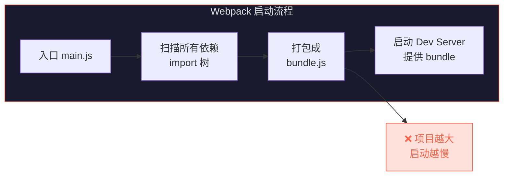

一个中型项目（200+ 模块）冷启动可能需要 **30 秒甚至更久**，热更新也经常需要 2-5 秒。

### 1.2 Vite 的解法：原生 ESM

Vite 利用浏览器原生支持的 ES Modules，**不打包、按需编译**：

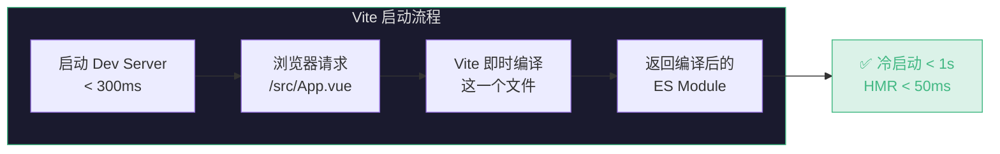

**核心区别：**

| 对比项 | Webpack | Vite |
|--------|---------|------|
| 启动方式 | 先打包，再提供服务 | 先启动服务，按需编译 |
| 冷启动 | 随项目增大线性变慢 | 几乎恒定 < 1s |
| 热更新 (HMR) | 2-5s（需重新打包受影响模块链） | < 50ms（只更新当前模块） |
| 底层 | Node.js（纯 JS） | esbuild（Go 语言，快 10-100x） |
| 生产构建 | webpack | Rollup（可选 esbuild） |

### 1.3 Vite 为什么能这么快

两个关键技术：

1. **预构建依赖（Pre-bundling）**：用 esbuild 把 `node_modules` 里的库（如 `vue`、`lodash`）预编译为 ESM 格式，只做一次
2. **按需编译源码**：你的 `.vue`、`.ts` 文件在**浏览器请求时才编译**，没请求的文件根本不处理

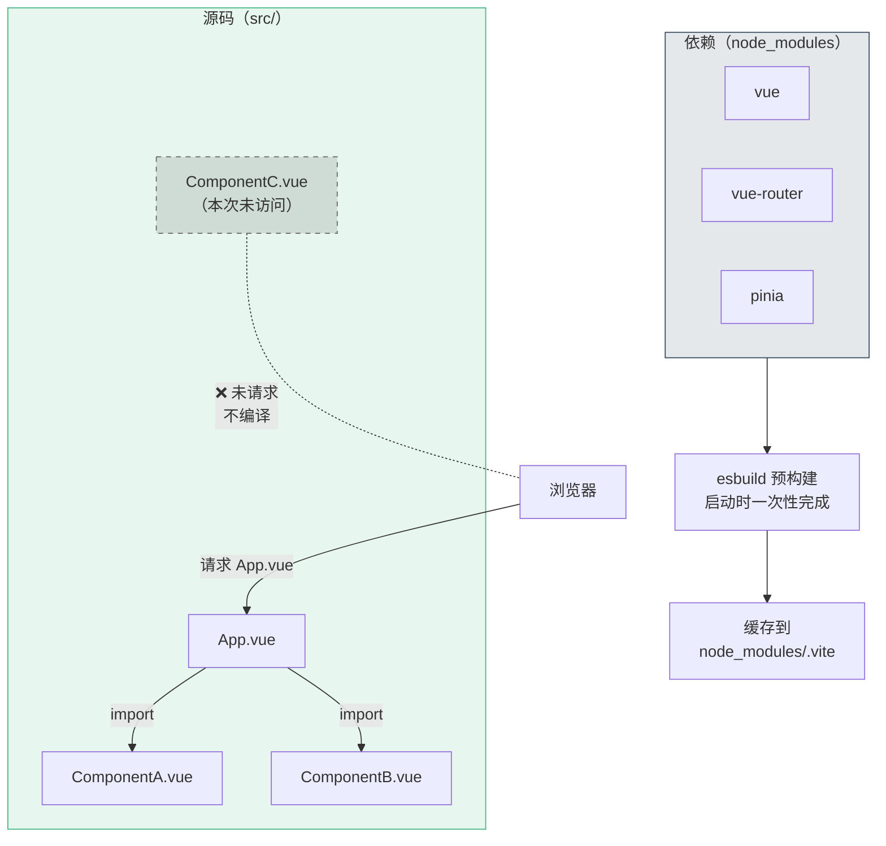

---

## 2. 创建项目

### 2.1 初始化 Vue 3 项目

打开终端，执行：

```bash
npm create vue@latest
```

> `create-vue` 是 Vue 官方的脚手架工具，底层基于 Vite。

交互式选项推荐：

```
✔ Project name: … vue-todo
✔ Add TypeScript? … Yes
✔ Add JSX Support? … No
✔ Add Vue Router? … No          ← Phase 1 不需要路由
✔ Add Pinia? … No               ← Phase 1 不需要状态管理
✔ Add Vitest? … No              ← Phase 2 再加
✔ Add an End-to-End Testing Solution? … No
✔ Add ESLint for code quality? … Yes
✔ Add Prettier for code formatting? … Yes
✔ Add Vue DevTools browser extension? … Yes
```

> **为什么现在不加 Router 和 Pinia？**
> Phase 1 是纯基础阶段。让你先理解组件、响应式和模板语法，不被额外概念干扰。Phase 2 用到时再手动安装，这样你会知道**每个依赖解决什么问题**。

安装依赖并启动：

```bash
cd vue-todo
npm install
npm run dev
```

浏览器打开 `http://localhost:5173`，看到 Vue 欢迎页就成功了。

### 2.2 初始化 Git

```bash
git init
git add .
git commit -m "L01: 项目初始化 - Vite + Vue 3 + TypeScript"
```

> **每节课结束都提交一次**，这样你可以随时回溯到任何阶段。

---

## 3. 项目结构解析

执行 `tree -I node_modules` 查看目录结构：

```
vue-todo/
├── public/                  # 静态资源（不经过 Vite 处理）
│   └── favicon.ico
├── src/                     # 源码目录（核心）
│   ├── assets/              # 需要 Vite 处理的资源（CSS、图片）
│   │   ├── base.css
│   │   └── main.css
│   ├── components/          # 组件目录
│   │   └── HelloWorld.vue
│   ├── App.vue              # 根组件
│   └── main.ts              # 应用入口
├── index.html               # HTML 入口（注意：在根目录，不在 public/）
├── env.d.ts                 # TypeScript 环境声明
├── tsconfig.json            # TypeScript 配置
├── vite.config.ts           # Vite 配置
├── package.json             # 依赖和脚本
└── .eslintrc.cjs            # ESLint 配置
```

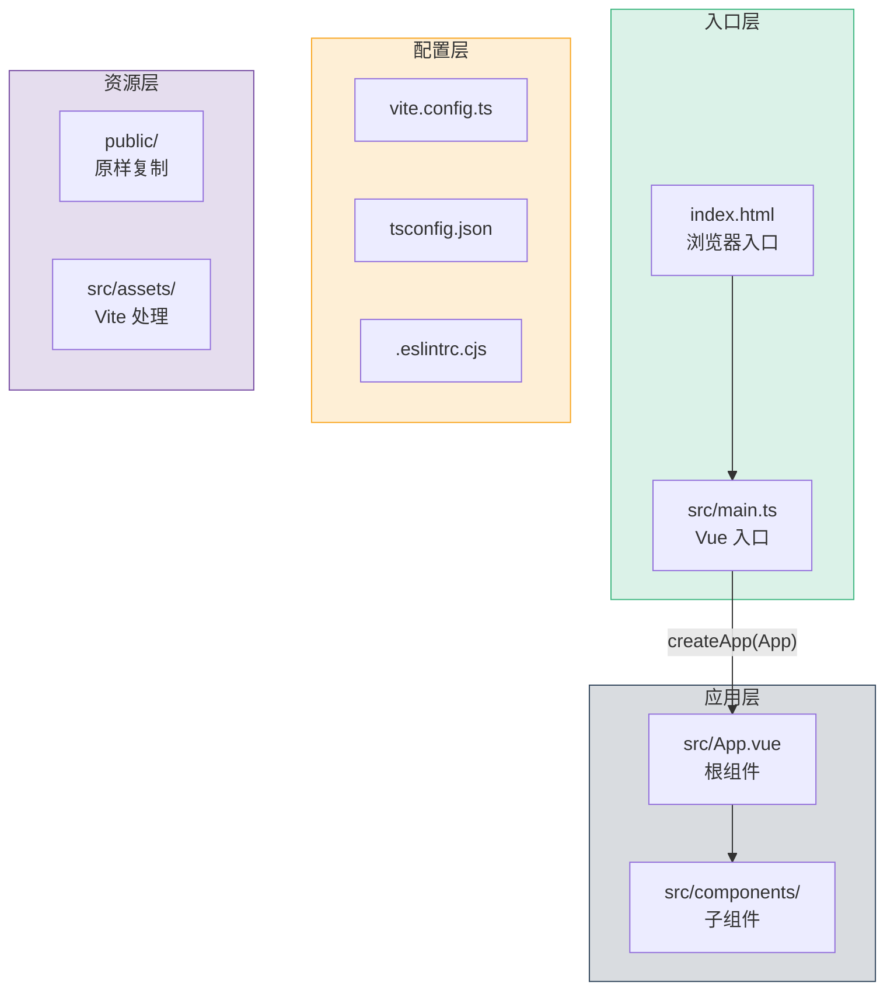

### 3.1 关键文件逐行解读

#### `index.html` — 浏览器入口

```html
<!DOCTYPE html>
<html lang="en">
  <head>
    <meta charset="UTF-8" />
    <link rel="icon" href="/favicon.ico" />
    <meta name="viewport" content="width=device-width, initial-scale=1.0" />
    <title>Vite App</title>
  </head>
  <body>
    <div id="app"></div>
    <!-- ⬆ Vue 将在这个 div 内渲染整个应用 -->

    <script type="module" src="/src/main.ts"></script>
    <!-- ⬆ type="module" 告诉浏览器用 ES Module 方式加载 -->
    <!-- ⬆ Vite 拦截这个请求，即时编译 main.ts -->
  </body>
</html>
```

> **注意：** `index.html` 在项目根目录，不在 `public/` 里。这是 Vite 和 Webpack 的一个不同点。Vite 把 `index.html` 当作"入口"（等同于 Webpack 的 `entry`），通过 HTML 里的 `<script>` 标签找到 JS 入口。

#### `src/main.ts` — Vue 应用入口

```typescript
import { createApp } from 'vue'    // 从 Vue 导入创建应用的工厂函数
import App from './App.vue'         // 导入根组件

import './assets/main.css'          // 导入全局样式

createApp(App)     // 创建 Vue 应用实例，App 是根组件
  .mount('#app')   // 挂载到 index.html 的 <div id="app">
```

**`createApp` 做了什么？**

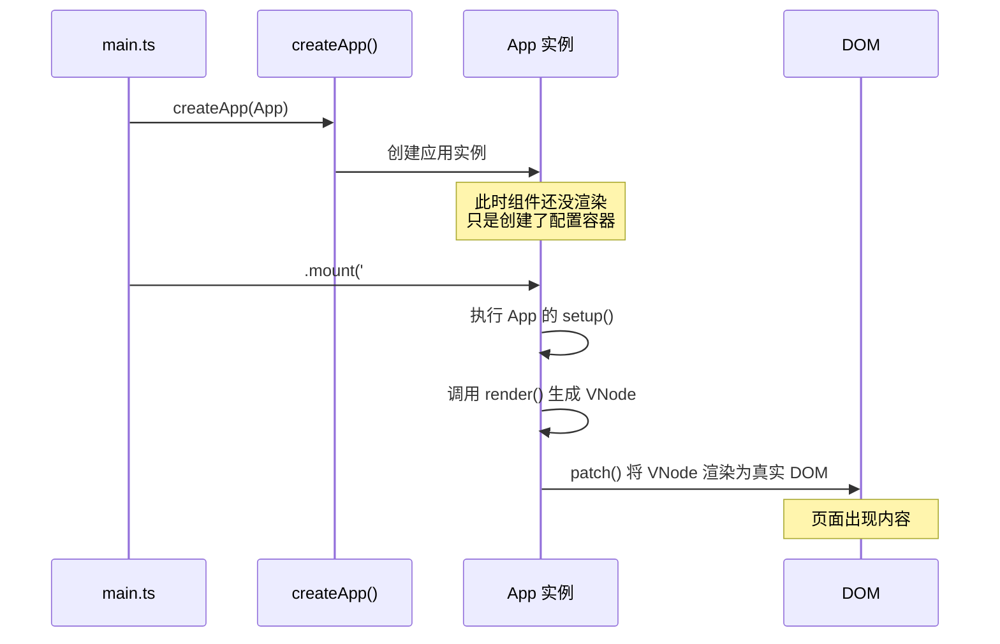

#### `src/App.vue` — 根组件（SFC 单文件组件）

```vue
<script setup lang="ts">
import HelloWorld from './components/HelloWorld.vue'
</script>

<template>
  <header>
    <div class="wrapper">
      <HelloWorld msg="You did it!" />
    </div>
  </header>
</template>

<style scoped>
/* scoped: 样式只作用于当前组件 */
header {
  line-height: 1.5;
}
</style>
```

---

## 4. SFC 三段式结构

Vue 的单文件组件（Single File Component）由三部分组成：

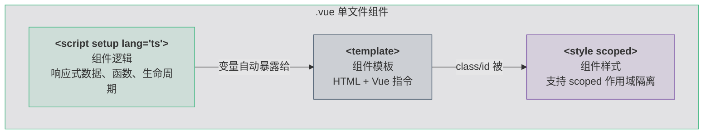

### 4.1 为什么把 HTML/JS/CSS 放在同一个文件？

这是 Vue 最有争议也最精妙的设计。关键理解：

**"关注点分离" ≠ "文件类型分离"**

传统方式按文件类型分离（`.html` / `.js` / `.css`），但一个按钮的逻辑、模板和样式分散在三个文件里，改一个按钮要打开三个文件。

SFC 按**功能单元分离**——一个组件的所有相关代码放在一起：

```
❌ 按文件类型分离（改一个按钮 → 打开 3 个文件）
src/
├── templates/
│   └── button.html
├── scripts/
│   └── button.js
└── styles/
    └── button.css

✅ 按功能单元分离（改一个按钮 → 打开 1 个文件）
src/
└── components/
    └── Button.vue      ← template + script + style
```

---

## 5. `<script setup>` 语法糖

### 5.1 普通写法 vs `<script setup>`

**普通写法（Vue 3 也支持但不推荐）：**

```vue
<script lang="ts">
import { defineComponent, ref } from 'vue'
import HelloWorld from './components/HelloWorld.vue'

export default defineComponent({
  components: {        // 手动注册组件
    HelloWorld
  },
  setup() {            // setup 函数
    const count = ref(0)
    function increment() {
      count.value++
    }
    return {           // 必须手动 return 暴露给模板
      count,
      increment
    }
  }
})
</script>
```

**`<script setup>` 语法糖（推荐）：**

```vue
<script setup lang="ts">
import { ref } from 'vue'
import HelloWorld from './components/HelloWorld.vue'

// 顶层变量自动暴露给模板，不需要 return
const count = ref(0)
function increment() {
  count.value++
}
// 导入的组件自动注册，不需要 components 选项
</script>
```

### 5.2 `<script setup>` 帮你省了什么

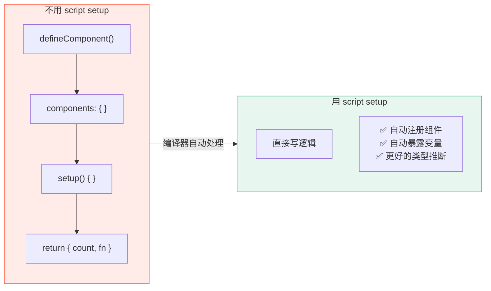

| 特性 | 普通 `<script>` | `<script setup>` |
|------|----------------|-------------------|
| 组件注册 | 手动在 `components` 中注册 | import 就自动注册 |
| 暴露给模板 | 必须在 `setup()` 中 `return` | 顶层变量自动暴露 |
| TypeScript 推断 | 需要 `defineComponent()` 包裹 | 天生完美推断 |
| 代码量 | 多 ~40% 样板代码 | 精简 |
| Props 声明 | `props` 选项 | `defineProps()` 宏 |
| Emits 声明 | `emits` 选项 | `defineEmits()` 宏 |

> **本教程全程使用 `<script setup>`**，这是 Vue 3 官方推荐的写法。

---

## 6. 了解 `vite.config.ts`

```typescript
import { fileURLToPath, URL } from 'node:url'
import { defineConfig } from 'vite'
import vue from '@vitejs/plugin-vue'

export default defineConfig({
  plugins: [
    vue(),  // Vue SFC 支持：编译 .vue 文件
  ],
  resolve: {
    alias: {
      '@': fileURLToPath(new URL('./src', import.meta.url))
      // ⬆ 路径别名：@/components/xxx 等价于 src/components/xxx
    }
  }
})
```

**`@vitejs/plugin-vue` 做了什么：**

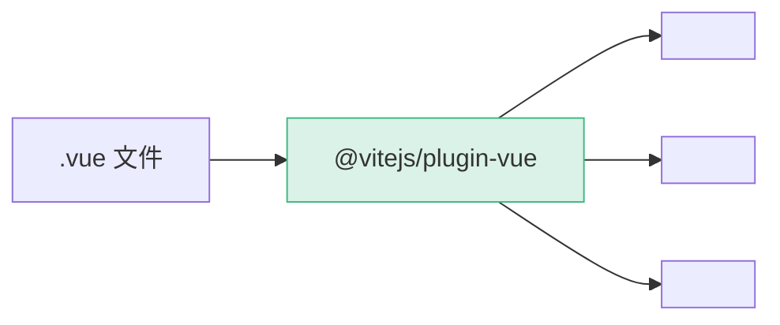

它在 Vite 构建管线中注册了一个"转换器"，遇到 `.vue` 文件时，把三段式 SFC 拆分编译为浏览器可执行的 JS + CSS。

---

## 7. 动手：改造为 Todo 应用骨架

现在让我们把默认的 Hello World 改造为 Todo 应用的骨架。

### 7.1 清理默认文件

删除不需要的默认内容：

```bash
# 删除默认组件和资源
rm src/components/HelloWorld.vue
rm src/components/TheWelcome.vue
rm src/components/WelcomeItem.vue
rm -rf src/components/icons/
rm src/assets/logo.svg
```

### 7.2 替换 `src/App.vue`

```vue
<script setup lang="ts">
// 目前为空，L02 会在这里导入第一个组件
</script>

<template>
  <div class="app">
    <header class="app-header">
      <h1>📝 Vue Todo</h1>
      <p class="subtitle">Phase 1 — 用 Vue 3 从零做一个 Todo App</p>
    </header>

    <main class="app-main">
      <p class="placeholder">🚧 Todo 列表将在 L02-L08 中逐步实现</p>
    </main>

    <footer class="app-footer">
      <p>Built with Vue 3 + Vite + TypeScript</p>
    </footer>
  </div>
</template>

<style scoped>
.app {
  max-width: 640px;
  margin: 0 auto;
  padding: 2rem;
  min-height: 100vh;
  display: flex;
  flex-direction: column;
}

.app-header {
  text-align: center;
  margin-bottom: 2rem;
}

.app-header h1 {
  font-size: 2rem;
  color: #42b883;
  margin-bottom: 0.25rem;
}

.subtitle {
  color: #888;
  font-size: 0.9rem;
}

.app-main {
  flex: 1;
}

.placeholder {
  text-align: center;
  padding: 3rem;
  background: #f6f8fa;
  border-radius: 12px;
  color: #666;
  border: 2px dashed #e0e0e0;
}

.app-footer {
  text-align: center;
  margin-top: 2rem;
  padding-top: 1rem;
  border-top: 1px solid #eee;
  color: #aaa;
  font-size: 0.8rem;
}
</style>
```

### 7.3 替换 `src/assets/main.css`

```css
/* 全局基础样式 */
*,
*::before,
*::after {
  box-sizing: border-box;
  margin: 0;
  padding: 0;
}

body {
  font-family: -apple-system, BlinkMacSystemFont, 'Segoe UI', Roboto,
    'Helvetica Neue', Arial, sans-serif;
  line-height: 1.6;
  color: #2c3e50;
  background-color: #ffffff;
  -webkit-font-smoothing: antialiased;
  -moz-osx-font-smoothing: grayscale;
}
```

> 你可以删除 `src/assets/base.css`，因为我们用自己的全局样式。

### 7.4 确认效果

```bash
npm run dev
```

浏览器应该显示一个简洁的页面：标题 "📝 Vue Todo" + 一个占位框。

---

## 8. 理解热更新（HMR）

现在试一下：**不关闭浏览器**，修改 `App.vue` 里的标题文字。

```vue
<h1>📝 Vue Todo</h1>
<!-- 改为 -->
<h1>✅ My Todo App</h1>
```

保存文件，浏览器**瞬间更新**，没有整页刷新，表单状态也不会丢失。

这就是 HMR（Hot Module Replacement）：

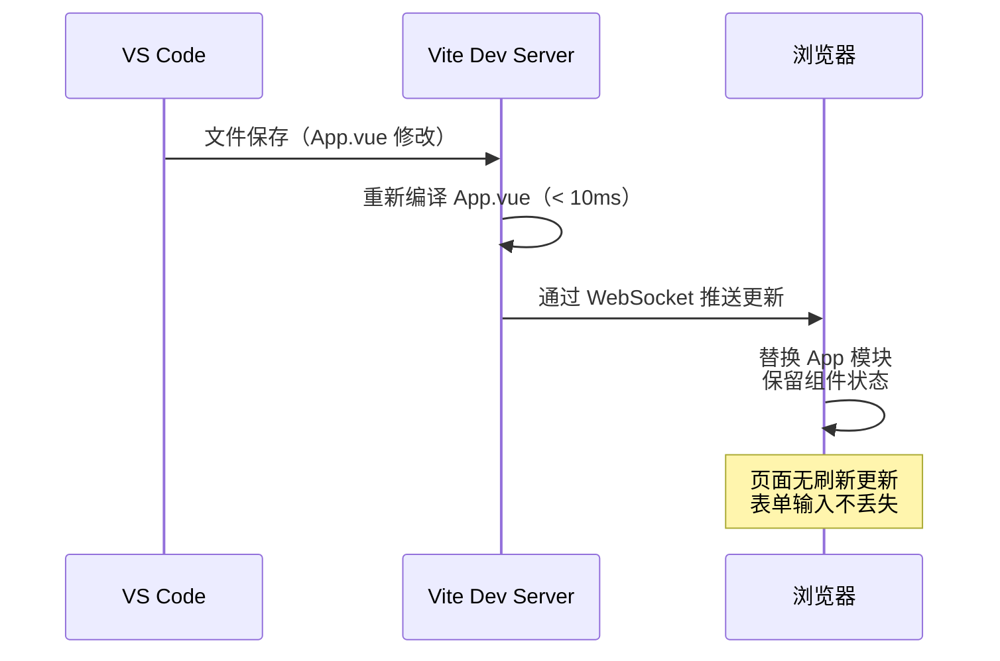

**与整页刷新的区别：**
- **整页刷新**：重新加载 HTML → 重新执行所有 JS → 所有状态归零
- **HMR**：只替换变化的模块 → 其他模块状态保留 → 开发体验极佳

---

## 9. TypeScript 配置简析

打开 `tsconfig.json`，几个关键配置：

```jsonc
{
  "compilerOptions": {
    "target": "ES2020",           // 编译目标：现代浏览器
    "module": "ESNext",           // 模块系统：ES Modules
    "moduleResolution": "bundler", // 模块解析：让 Vite 处理
    "strict": true,               // 严格模式：推荐开启
    "jsx": "preserve",            // JSX：保留，交给 Vue 编译器
    "paths": {                    // 路径别名：与 vite.config.ts 保持一致
      "@/*": ["./src/*"]
    }
  }
}
```

> **`strict: true` 很重要。** 它开启了 TypeScript 的所有严格检查，虽然写代码时可能会多一些类型标注，但能在编译时就捕获大量 bug。

---

## 10. `public/` vs `src/assets/` 的区别

| | `public/` | `src/assets/` |
|--|-----------|---------------|
| 处理方式 | 原样复制到构建输出 | 被 Vite 处理（哈希、压缩等） |
| 引用方式 | 绝对路径 `/logo.png` | `import logo from '@/assets/logo.png'` |
| 文件名 | 构建后名字不变 | 构建后加哈希 `logo.a1b2c3.png` |
| 适合存放 | `favicon.ico`、`robots.txt` | 图片、字体、CSS |
| 缓存控制 | 需手动管理 | 自动长期缓存（哈希变则 URL 变） |

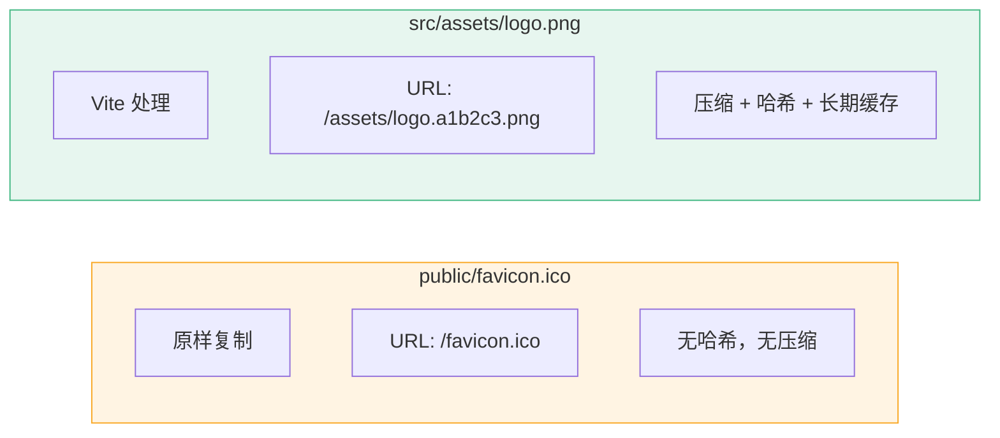

**经验法则：** 除了 `favicon.ico` 和 `robots.txt`，所有资源都放 `src/assets/`。

---

## 11. npm scripts 解读

打开 `package.json` 的 `scripts` 部分：

```json
{
  "scripts": {
    "dev": "vite",                    // 启动开发服务器
    "build": "run-p type-check \"build-only {@}\" --",  // 类型检查 + 构建
    "preview": "vite preview",        // 预览构建产物
    "build-only": "vite build",       // 只构建，不类型检查
    "type-check": "vue-tsc --build",  // TypeScript 类型检查
    "lint": "eslint . --fix"          // ESLint 检查 + 自动修复
  }
}
```

| 命令 | 用途 | 什么时候用 |
|------|------|-----------|
| `npm run dev` | 启动开发服务器 | 日常开发 |
| `npm run build` | 生产构建 | 部署前 |
| `npm run preview` | 预览生产构建 | 部署前验证 |
| `npm run lint` | 代码风格检查 | 提交前 |

---

## 12. 本节总结

### 知识清单

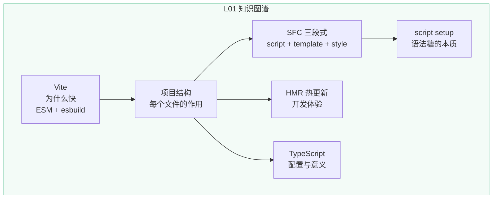


### 🔬 深度专题

> 📖 [D01 · Options API vs Composition API](/lessons/deep-dives/D01-options-vs-composition) — 为什么本教程全程使用 Composition API？

### 检查清单

- [ ] 能用 `npm create vue@latest` 创建项目
- [ ] 能解释 Vite 比 Webpack 快的原因
- [ ] 能说出 `index.html → main.ts → App.vue` 的加载链
- [ ] 能解释 SFC 三段式结构的每个部分
- [ ] 能解释 `<script setup>` 相比普通 `<script>` 省了什么
- [ ] 能区分 `public/` 和 `src/assets/` 的用途
- [ ] 项目已完成第一次 `git commit`

### 课后练习

**练习 1：跟做（10 min）**
完整跟做本节内容：创建项目 → 清理默认文件 → 替换 App.vue → 启动确认。

**练习 2：举一反三（15 min）**
给 `main.css` 增加一套 CSS 变量（`--color-primary`、`--color-bg`、`--color-text`），在 `App.vue` 中使用这些变量。思考：为什么用 CSS 变量比硬编码颜色值更好？

**挑战题（20 min）**
在 `vite.config.ts` 中配置第二个路径别名 `@components` → `src/components`，确认在 `.vue` 文件中 `import from '@components/xxx'` 可以正常工作。同时需要同步修改 `tsconfig.json` 的 `paths`。

### Git 提交

```bash
git add .
git commit -m "L01: 清理默认文件，搭建 Todo App 骨架"
```

---

## 🔗 钩子连接

### → 下一节：L02 · 第一个组件：TodoItem

L02 将在当前项目基础上：
1. 在 `src/components/` 创建 `TodoItem.vue` 组件
2. 学习 `defineProps()` 定义组件接口
3. 理解 **Props 单向数据流** 原则
4. 在 `App.vue` 中引入并渲染 TodoItem

**L02 会用到这节课的：**
- 项目结构（知道在哪创建组件）
- `<script setup>`（知道 import 即自动注册）
- SFC 三段式（知道如何组织组件代码）
