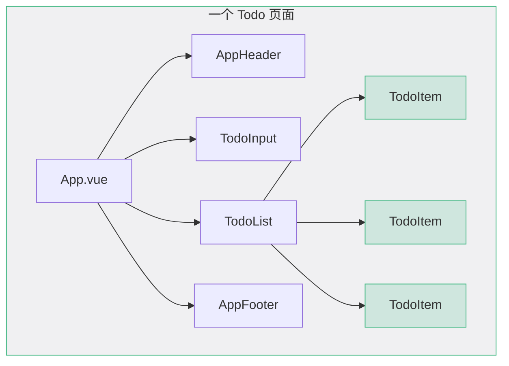
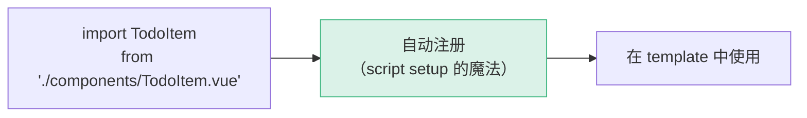
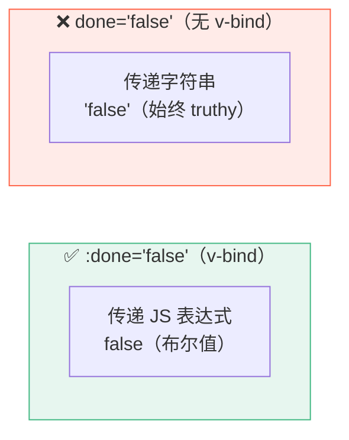
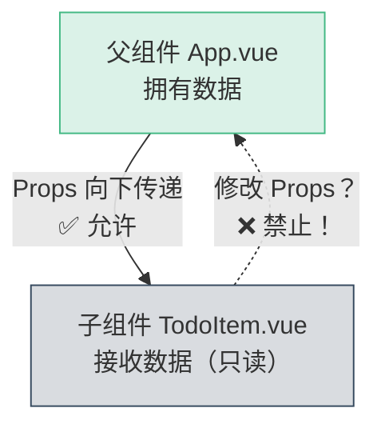
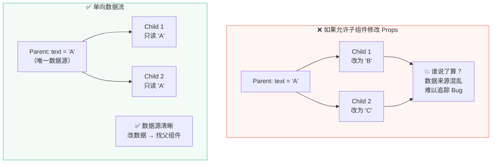
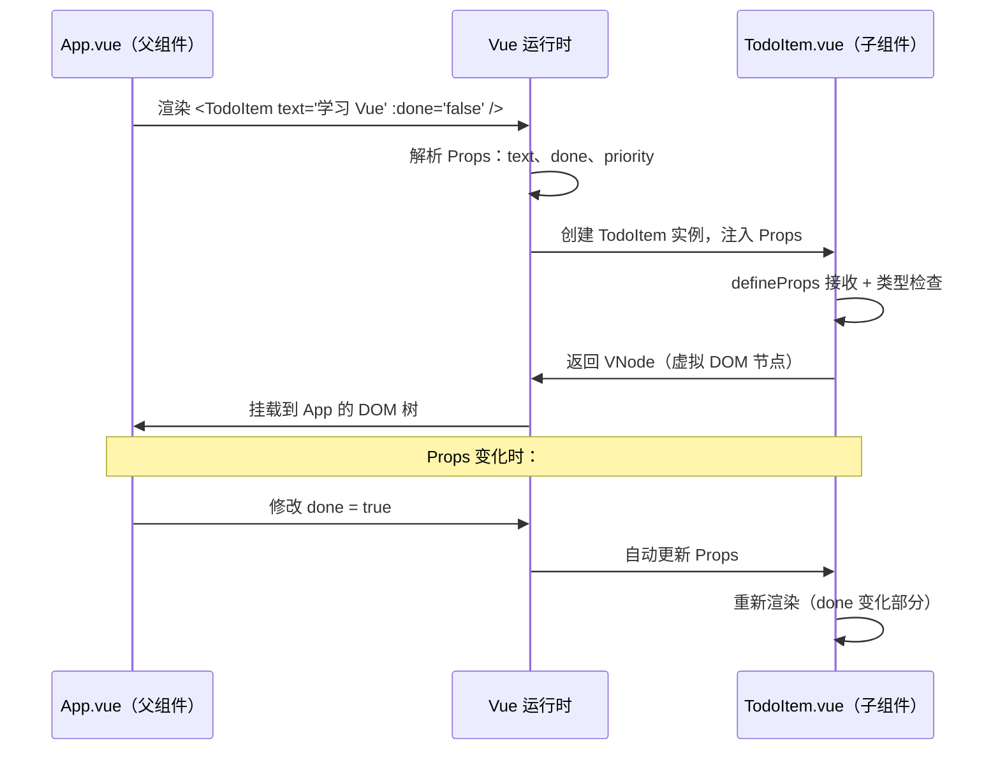
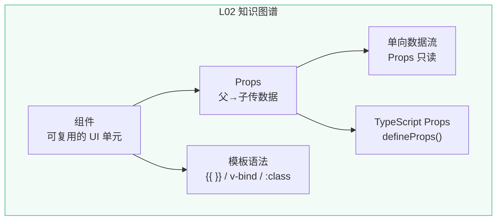

# L02 · 第一个组件：TodoItem

```
🎯 本节目标：创建 TodoItem 组件，理解 Props 单向数据流
📦 本节产出：可渲染静态 Todo 项的组件 + 父组件传值演示
🔗 前置钩子：L01 的项目结构（知道在哪建组件、import 即注册）
🔗 后续钩子：L03 将用 ref() 让数据变成响应式的
```

---

## 1. 什么是组件

组件是 Vue 最核心的概念：**一段可复用的、自包含的 UI 单元**。



**组件的好处：**
- **复用**：同一个 `TodoItem` 组件渲染多条数据
- **封装**：每个组件管好自己的逻辑和样式（`scoped`）
- **组合**：小组件拼装成大组件，大组件拼装成页面

---

## 2. 创建第一个组件：TodoItem

### 2.1 创建文件

在 `src/components/` 下新建 `TodoItem.vue`：

```vue
<!-- src/components/TodoItem.vue -->
<script setup lang="ts">
// 暂时为空——还没有 Props
</script>

<template>
  <div class="todo-item">
    <span class="todo-text">学习 Vue 3</span>
  </div>
</template>

<style scoped>
.todo-item {
  display: flex;
  align-items: center;
  padding: 12px 16px;
  background: #fff;
  border-radius: 8px;
  border: 1px solid #e8e8e8;
  transition: box-shadow 0.2s ease;
}

.todo-item:hover {
  box-shadow: 0 2px 8px rgba(0, 0, 0, 0.06);
}

.todo-text {
  font-size: 1rem;
  color: #2c3e50;
}
</style>
```

### 2.2 在 App.vue 中使用

```vue
<!-- src/App.vue -->
<script setup lang="ts">
import TodoItem from './components/TodoItem.vue'
// ⬆ import 就自动注册了，不需要 components: { TodoItem }
</script>

<template>
  <div class="app">
    <header class="app-header">
      <h1>📝 Vue Todo</h1>
    </header>

    <main class="app-main">
      <TodoItem />
      <TodoItem />
      <TodoItem />
      <!-- ⬆ 同一个组件可以多次使用，但现在每个都显示一样的文字 -->
    </main>
  </div>
</template>
```



> **注意组件命名规则：** 组件名使用 **PascalCase**（`TodoItem`），文件名也用 PascalCase（`TodoItem.vue`）。在模板中可以用 `<TodoItem />` 或 `<todo-item />`，但推荐 PascalCase 以区分原生 HTML 标签。

---

## 3. 用 Props 让组件接收数据

现在三个 `TodoItem` 显示一样的文字，没有意义。我们需要让父组件 **传数据** 给子组件。

### 3.1 定义 Props

```vue
<!-- src/components/TodoItem.vue -->
<script setup lang="ts">
// defineProps 是编译器宏，不需要 import
const props = defineProps<{
  text: string       // Todo 的文本内容
  done: boolean      // 是否已完成
}>()
</script>

<template>
  <div class="todo-item" :class="{ 'is-done': done }">
    <span class="todo-text">{{ text }}</span>
    <!-- ⬆ {{ text }} 模板插值：把 JS 表达式渲染为文本 -->
    <!-- ⬆ 在 template 中访问 props 不需要 props.text，直接用 text -->
  </div>
</template>

<style scoped>
.todo-item {
  display: flex;
  align-items: center;
  padding: 12px 16px;
  background: #fff;
  border-radius: 8px;
  border: 1px solid #e8e8e8;
  margin-bottom: 8px;
  transition: all 0.2s ease;
}

.todo-item:hover {
  box-shadow: 0 2px 8px rgba(0, 0, 0, 0.06);
}

.todo-item.is-done {
  opacity: 0.6;
  background: #f9f9f9;
}

.todo-item.is-done .todo-text {
  text-decoration: line-through;
  color: #999;
}

.todo-text {
  font-size: 1rem;
  color: #2c3e50;
}
</style>
```

### 3.2 父组件传值

```vue
<!-- src/App.vue -->
<script setup lang="ts">
import TodoItem from './components/TodoItem.vue'
</script>

<template>
  <div class="app">
    <header class="app-header">
      <h1>📝 Vue Todo</h1>
    </header>

    <main class="app-main">
      <!-- 通过属性传递 Props -->
      <TodoItem text="学习 Vue 3 基础" :done="false" />
      <TodoItem text="理解组件和 Props" :done="false" />
      <TodoItem text="搭建项目脚手架" :done="true" />
      <!--                            ⬆ :done 冒号绑定，传 JS 值 -->
      <!--                     done（无冒号）传的是字符串 "true" -->
    </main>
  </div>
</template>
```

**`:done="false"` vs `done="false"` 的区别：**



> **记住规则：** 传非字符串值（布尔、数字、对象、数组）**必须加冒号 `:`**。

---

## 4. Props 的 TypeScript 类型声明

Vue 3 + `<script setup>` 中有两种 Props 声明方式：

### 4.1 纯类型声明（推荐）

```typescript
// 利用 TypeScript 泛型，编译时类型检查
const props = defineProps<{
  text: string
  done: boolean
  priority?: 'low' | 'medium' | 'high'  // 可选 prop
}>()
```

### 4.2 带默认值的声明

```typescript
// 使用 withDefaults 设置默认值
const props = withDefaults(
  defineProps<{
    text: string
    done: boolean
    priority?: 'low' | 'medium' | 'high'
  }>(),
  {
    done: false,
    priority: 'medium'
  }
)
```

### 4.3 两种方式对比

| 特性 | 纯类型 `defineProps<T>()` | 带默认值 `withDefaults()` |
|------|-------------------------|--------------------------|
| 类型安全 | ✅ 完整 | ✅ 完整 |
| 默认值 | ❌ 不支持 | ✅ 支持 |
| 可读性 | 简洁 | 稍冗长 |
| 适用场景 | 所有 prop 都必传 | 需要默认值 |

---

## 5. 单向数据流：最重要的规则



**核心规则：Props 是只读的，子组件不能修改 Props。**

如果你在子组件里尝试修改：

```typescript
// ❌ 这会导致控制台报错
props.text = '修改后的文本'
// Warning: Attempting to mutate prop "text". Props are readonly.
```

**为什么要这样设计？**



**那子组件想改数据怎么办？** → L05 会讲 `emit`（子组件通知父组件去改）。

---

## 6. 模板语法基础

### 6.1 插值 `{{ }}`

```vue
<template>
  <!-- 文本插值：渲染 JS 表达式的结果 -->
  <span>{{ text }}</span>
  <span>{{ text.toUpperCase() }}</span>
  <span>{{ done ? '✅' : '⬜' }}</span>
  <span>{{ `共 ${count} 项` }}</span>

  <!-- ⚠️ 只能用表达式，不能用语句 -->
  <!-- ❌ {{ if (done) { return '完成' } }} -->
  <!-- ❌ {{ let x = 1 }} -->
</template>
```

### 6.2 属性绑定 `v-bind` / `:`

```vue
<template>
  <!-- 完整语法 -->
  <div v-bind:id="itemId">...</div>

  <!-- 简写语法（推荐） -->
  <div :id="itemId">...</div>

  <!-- 绑定多个属性 -->
  <div :class="{ 'is-done': done, 'is-urgent': priority === 'high' }">

  <!-- 动态绑定 style -->
  <div :style="{ color: done ? '#999' : '#333' }">
</template>
```

### 6.3 class 绑定的三种方式

```vue
<template>
  <!-- 对象语法：key 是类名，value 是布尔值 -->
  <div :class="{ 'is-done': done, 'is-urgent': isUrgent }">

  <!-- 数组语法：可以混合静态和动态 -->
  <div :class="['todo-item', done ? 'is-done' : '']">

  <!-- 与静态 class 共存 -->
  <div class="todo-item" :class="{ 'is-done': done }">
  <!-- 渲染为 class="todo-item is-done"（自动合并） -->
</template>
```

```mermaid
flowchart LR
    static["class='todo-item'"]
    dynamic[":class=\"{ 'is-done': true }\""]
    result["渲染结果：\nclass='todo-item is-done'"]

    static --> result
    dynamic --> result

    style result fill:#42b88330,stroke:#42b883
```

---

## 7. 完善 TodoItem 组件

把学到的知识综合运用，完善组件。我们在此增加一个新功能——**优先级（priority）**属性，体验如何扩展已有组件：

```vue
<!-- src/components/TodoItem.vue 完整版 -->
<script setup lang="ts">
const props = withDefaults(
  defineProps<{
    text: string
    done?: boolean
    priority?: 'low' | 'medium' | 'high'
    createdAt?: string
  }>(),
  {
    done: false,
    priority: 'medium',
  }
)

// 在 <script setup> 中访问 props 需要 props.xxx
// 在 <template> 中直接用 xxx（自动解包）
</script>

<template>
  <div
    class="todo-item"
    :class="{
      'is-done': done,
      [`priority-${priority}`]: true,
    }"
  >
    <span class="status-icon">{{ done ? '✅' : '⬜' }}</span>
    <div class="todo-content">
      <span class="todo-text">{{ text }}</span>
      <span v-if="createdAt" class="todo-date">{{ createdAt }}</span>
    </div>
    <span class="priority-badge">{{ priority }}</span>
  </div>
</template>

<style scoped>
.todo-item {
  display: flex;
  align-items: center;
  gap: 12px;
  padding: 12px 16px;
  background: #fff;
  border-radius: 8px;
  border: 1px solid #e8e8e8;
  margin-bottom: 8px;
  transition: all 0.2s ease;
}

.todo-item:hover {
  box-shadow: 0 2px 8px rgba(0, 0, 0, 0.06);
  transform: translateY(-1px);
}

.todo-item.is-done {
  opacity: 0.55;
  background: #fafafa;
}

.todo-item.is-done .todo-text {
  text-decoration: line-through;
  color: #999;
}

.status-icon {
  font-size: 1.2rem;
  cursor: pointer;
  user-select: none;
}

.todo-content {
  flex: 1;
  display: flex;
  flex-direction: column;
}

.todo-text {
  font-size: 1rem;
  color: #2c3e50;
}

.todo-date {
  font-size: 0.75rem;
  color: #aaa;
  margin-top: 2px;
}

.priority-badge {
  font-size: 0.7rem;
  padding: 2px 8px;
  border-radius: 10px;
  text-transform: uppercase;
  font-weight: 600;
  letter-spacing: 0.5px;
}

.priority-low .priority-badge {
  background: #e8f5e9;
  color: #4caf50;
}

.priority-medium .priority-badge {
  background: #fff3e0;
  color: #ff9800;
}

.priority-high .priority-badge {
  background: #ffebee;
  color: #f44336;
}
</style>
```

### 更新 App.vue

```vue
<!-- src/App.vue -->
<script setup lang="ts">
import TodoItem from './components/TodoItem.vue'
</script>

<template>
  <div class="app">
    <header class="app-header">
      <h1>📝 Vue Todo</h1>
      <p class="subtitle">Phase 1 — 用 Vue 3 从零做一个 Todo App</p>
    </header>

    <main class="app-main">
      <TodoItem
        text="搭建项目脚手架"
        :done="true"
        priority="low"
        created-at="2024-01-01"
      />
      <TodoItem
        text="理解组件和 Props"
        :done="false"
        priority="medium"
        created-at="2024-01-02"
      />
      <TodoItem
        text="学习响应式系统"
        :done="false"
        priority="high"
      />
    </main>
  </div>
</template>

<style scoped>
.app {
  max-width: 640px;
  margin: 0 auto;
  padding: 2rem;
}

.app-header {
  text-align: center;
  margin-bottom: 2rem;
}

.app-header h1 {
  font-size: 2rem;
  color: #42b883;
  margin-bottom: 0.25rem;
}

.subtitle {
  color: #888;
  font-size: 0.9rem;
}
</style>
```

> **注意 `created-at` vs `createdAt`：** 在模板中使用 kebab-case（`created-at`），Vue 自动转为 camelCase（`createdAt`）。两种写法都支持，但 HTML 属性习惯用 kebab-case。

---

## 8. 组件数据流全景



---

## 9. 本节总结

### 知识清单



### 检查清单

- [ ] 能在 `src/components/` 下创建 `.vue` 组件
- [ ] 知道 `<script setup>` 中 import 即自动注册
- [ ] 能用 `defineProps<T>()` 声明 Props 类型
- [ ] 能用 `withDefaults()` 设置默认值
- [ ] 能解释为什么 Props 是只读的（单向数据流）
- [ ] 能区分 `:done="false"` 和 `done="false"`
- [ ] 能使用 `{{ }}`、`:class`、`:style` 绑定数据

### 🐞 防坑指南

| 坑 | 说明 | 正确做法 |
|----|------|---------|
| Props 不加冒号 | `done="false"` 传的是字符串 `"false"`（truthy！） | `:done="false"` 传布尔值 |
| 模板中写 `props.text` | `<template>` 中 props 自动解包 | 直接写 `{{ text }}` |
| 组件名用 kebab-case 创建文件 | `todo-item.vue` 不是推荐命名 | 文件名用 PascalCase：`TodoItem.vue` |
| 在子组件里修改 props | Vue 会报 readonly 警告 | 用 emit 通知父组件修改 |
| 忘记写 `scoped` | 样式会泄漏到全局 | `<style scoped>` |

### 📐 最佳实践

1. **组件粒度**：一个组件只做一件事。如果你发现 `<template>` 超过 100 行，考虑拆分子组件
2. **Props 命名**：用 camelCase 定义（`createdAt`），模板中用 kebab-case 传值（`created-at`）
3. **类型优先**：始终用 `defineProps<T>()` 的泛型声明，而不是运行时验证
4. **默认值**：可选 Props 一定要用 `withDefaults()` 给默认值，避免模板中频繁 `?.` 判断

### Git 提交

```bash
git add .
git commit -m "L02: TodoItem 组件 + Props + 模板语法"
```

---

## 🔗 钩子连接

### → 下一节：L03 · 响应式数据：ref / reactive

L03 将解决一个关键问题：**现在的 Todo 数据是写死在模板里的，无法动态添加。**

L03 会用到 L02 的：
- `TodoItem` 组件（接收动态数据渲染）
- `defineProps`（保持接口不变）
- 模板语法（用 `v-for` 循环渲染——但那是 L04 的事）

L03 将引入：
- `ref()` 让原始值变成响应式
- `reactive()` 让对象变成响应式
- 理解"数据变 → 视图自动更新"的心智模型
