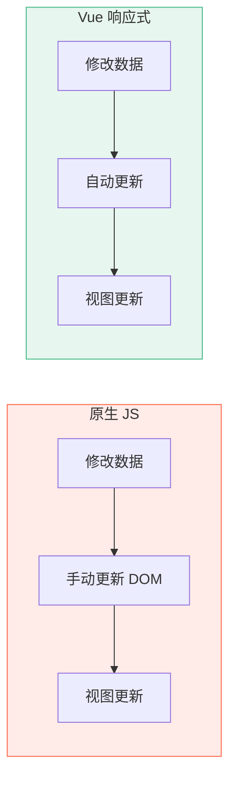
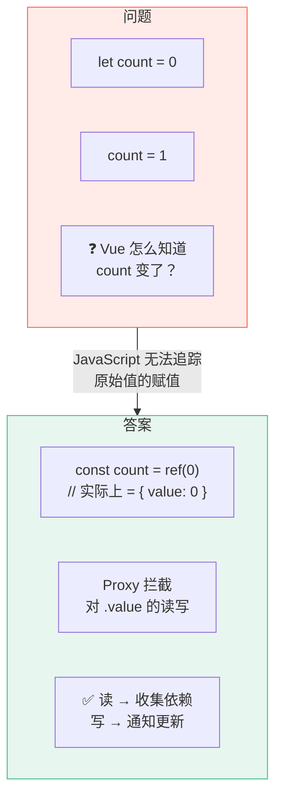
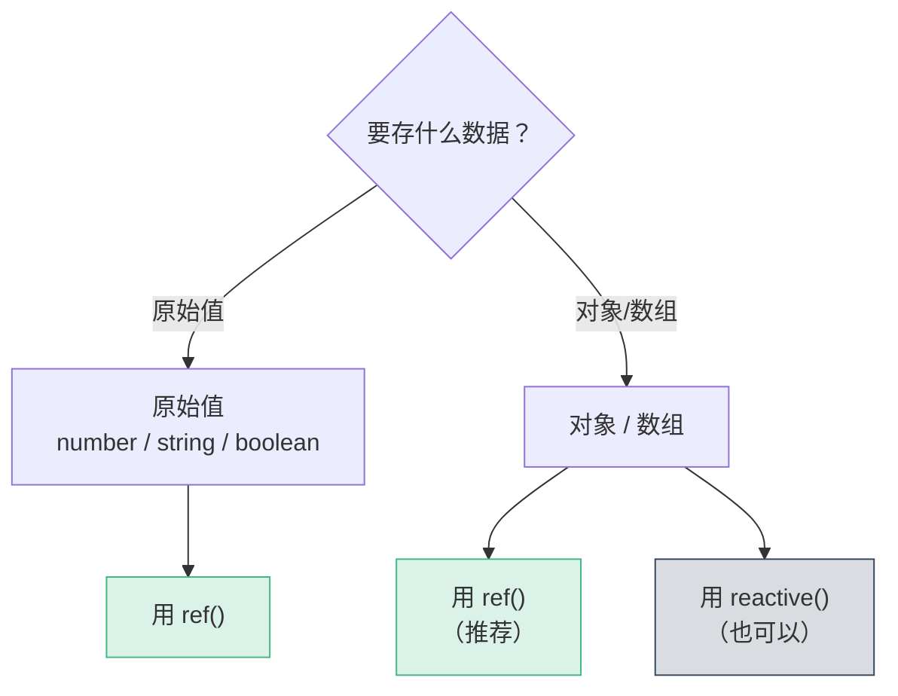
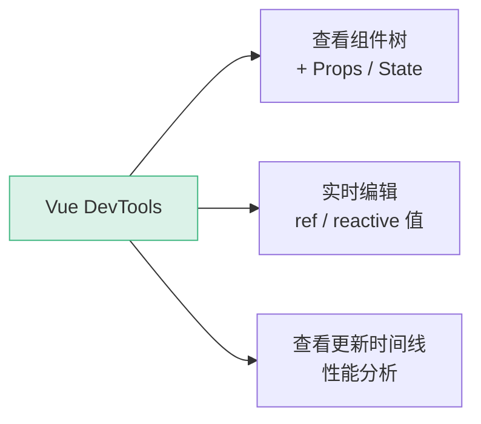
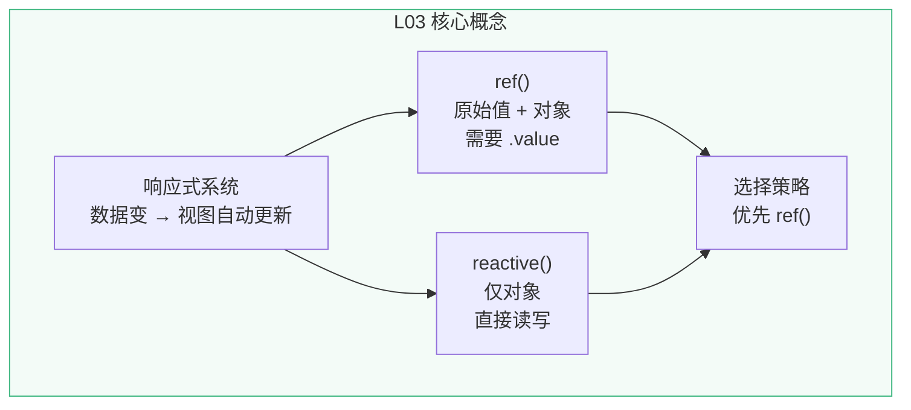

# L03 · 响应式数据：让 Todo 动起来

```
🎯 本节目标：掌握 ref() 和 reactive()，在组件中管理动态数据
📦 本节产出：可动态添加 Todo 的应用 + 理解响应式心智模型
🔗 前置钩子：L02 的 TodoItem 组件（接收 Props 渲染）
🔗 后续钩子：L04 将用 v-for 渲染 Todo 数组
```

---

## 1. 什么是"响应式"

**问题：** 用原生 JS 操作 DOM，数据和视图是断开的。

```javascript
// 原生 JS：手动同步数据和视图
let count = 0
document.getElementById('counter').textContent = count // 初始渲染

function increment() {
  count++
  document.getElementById('counter').textContent = count // 💀 必须手动更新 DOM
}
```

**Vue 的响应式：** 数据变了 → 视图**自动**更新，你不需要碰 DOM。



---

## 2. ref()：让原始值变成响应式

### 2.1 基本用法

```vue
<script setup lang="ts">
import { ref } from 'vue'

// ref 把原始值包装成响应式引用
const count = ref(0)        // 类型自动推断为 Ref<number>
const message = ref('Hello') // Ref<string>
const isDone = ref(false)    // Ref<boolean>

// 在 JS 中读写需要 .value
console.log(count.value)     // 0
count.value++                // 触发视图更新
console.log(count.value)     // 1
</script>

<template>
  <!-- 在模板中自动解包，不需要 .value -->
  <p>{{ count }}</p>
  <p>{{ message }}</p>
</template>
```

### 2.2 `.value` 的存在理由

为什么不能像普通变量那样 `count = 1` 就触发更新？



**关键点：** JavaScript 的原始值（number、string、boolean）是**按值传递**的，Proxy 只能拦截**对象属性**的读写。所以 Vue 把原始值包进 `{ value: T }` 对象，用 Proxy 拦截 `.value` 的 getter/setter。

> 深入原理请参考深度专题 D05。

---

## 3. reactive()：让对象变成响应式

```vue
<script setup lang="ts">
import { reactive } from 'vue'

// reactive 直接让对象变成响应式
const todo = reactive({
  text: '学习 Vue 3',
  done: false,
  priority: 'medium' as 'low' | 'medium' | 'high'
})

// 不需要 .value，直接读写属性
console.log(todo.text)       // '学习 Vue 3'
todo.done = true             // 触发视图更新
todo.text = '已学完 Vue 3'   // 触发视图更新
</script>

<template>
  <p>{{ todo.text }}</p>
  <p>{{ todo.done ? '✅ 完成' : '⬜ 进行中' }}</p>
</template>
```

### 3.1 reactive 的限制

```typescript
import { reactive } from 'vue'

// ✅ 对象
const state = reactive({ count: 0 })

// ❌ 原始值 —— reactive 不接受
// const count = reactive(0)  // TS Error + 运行时警告

// ❌ 解构会丢失响应式
const { count } = reactive({ count: 0 })
// count 现在是普通数字 0，与 reactive 对象断开连接

// ❌ 整体替换会丢失响应式
let state2 = reactive({ count: 0 })
state2 = reactive({ count: 1 })  // 旧引用丢失，视图不更新
```

---

## 4. ref vs reactive：如何选择



| 特性 | `ref()` | `reactive()` |
|------|---------|--------------|
| 接受类型 | **任意类型**（原始值 + 对象） | **仅对象** |
| 读写方式 | JS 中 `.value`，模板中自动解包 | 直接读写属性 |
| 可以整体替换 | ✅ `count.value = newObj` | ❌ 丢失响应式 |
| 可以解构 | ❌（需要 `toRefs()`） | ❌（同样丢失） |
| TypeScript | 自动推断 `Ref<T>` | 自动推断 |

**本教程的选择：优先用 `ref()`**

理由：
1. `ref` 能处理所有类型，心智模型统一
2. `ref` 可以整体替换（`todos.value = newArray`），`reactive` 不行
3. Vue 官方文档也推荐 `ref` 作为默认选择

---

## 5. 实战：给 Todo App 加上动态数据

### 5.1 定义 Todo 类型

先创建类型定义文件 `src/types/todo.ts`：

```typescript
// src/types/todo.ts
export interface Todo {
  id: number
  text: string
  done: boolean
  priority: 'low' | 'medium' | 'high'
  createdAt: string
}
```

### 5.2 在 App.vue 中使用 ref

```vue
<!-- src/App.vue -->
<script setup lang="ts">
import { ref } from 'vue'
import TodoItem from './components/TodoItem.vue'
import type { Todo } from './types/todo'

// 用 ref 管理 Todo 列表
const todos = ref<Todo[]>([
  {
    id: 1,
    text: '搭建项目脚手架',
    done: true,
    priority: 'low',
    createdAt: '2024-01-01',
  },
  {
    id: 2,
    text: '理解组件和 Props',
    done: true,
    priority: 'medium',
    createdAt: '2024-01-02',
  },
  {
    id: 3,
    text: '学习响应式系统',
    done: false,
    priority: 'high',
    createdAt: '2024-01-03',
  },
])

// 新 Todo 的输入文本
const newTodoText = ref('')

// 添加 Todo
function addTodo() {
  const text = newTodoText.value.trim()
  if (!text) return

  todos.value.push({
    id: Date.now(),    // 用时间戳做临时 ID
    text,
    done: false,
    priority: 'medium',
    createdAt: new Date().toISOString().split('T')[0],
  })

  newTodoText.value = '' // 清空输入框
}
</script>

<template>
  <div class="app">
    <header class="app-header">
      <h1>📝 Vue Todo</h1>
      <p class="subtitle">{{ todos.length }} 个任务</p>
    </header>

    <div class="add-todo">
      <input
        :value="newTodoText"
        @input="newTodoText = ($event.target as HTMLInputElement).value"
        @keyup.enter="addTodo"
        placeholder="添加新任务..."
        class="todo-input"
      />
      <button @click="addTodo" class="add-btn">添加</button>
    </div>

    <main class="app-main">
      <!-- 暂时硬编码索引，L04 会用 v-for -->
      <TodoItem
        v-if="todos[0]"
        :text="todos[0].text"
        :done="todos[0].done"
        :priority="todos[0].priority"
        :created-at="todos[0].createdAt"
      />
      <TodoItem
        v-if="todos[1]"
        :text="todos[1].text"
        :done="todos[1].done"
        :priority="todos[1].priority"
        :created-at="todos[1].createdAt"
      />
      <TodoItem
        v-if="todos[2]"
        :text="todos[2].text"
        :done="todos[2].done"
        :priority="todos[2].priority"
        :created-at="todos[2].createdAt"
      />
      <p class="hint">⚠️ 目前只能显示前 3 条，L04 用 v-for 解决</p>
    </main>
  </div>
</template>

<style scoped>
.app {
  max-width: 640px;
  margin: 0 auto;
  padding: 2rem;
}

.app-header {
  text-align: center;
  margin-bottom: 2rem;
}

.app-header h1 {
  font-size: 2rem;
  color: #42b883;
  margin-bottom: 0.25rem;
}

.subtitle {
  color: #888;
  font-size: 0.9rem;
}

.add-todo {
  display: flex;
  gap: 8px;
  margin-bottom: 1.5rem;
}

.todo-input {
  flex: 1;
  padding: 10px 16px;
  border: 2px solid #e8e8e8;
  border-radius: 8px;
  font-size: 1rem;
  outline: none;
  transition: border-color 0.2s;
}

.todo-input:focus {
  border-color: #42b883;
}

.add-btn {
  padding: 10px 20px;
  background: #42b883;
  color: #fff;
  border: none;
  border-radius: 8px;
  font-size: 1rem;
  cursor: pointer;
  transition: background 0.2s;
}

.add-btn:hover {
  background: #38a575;
}

.hint {
  text-align: center;
  color: #999;
  font-size: 0.85rem;
  margin-top: 1rem;
}
</style>
```

---

## 6. 响应式更新的流程

当你在输入框输入文字并点击"添加"时，发生了什么：

```mermaid
sequenceDiagram
    participant User as 用户
    participant Input as <input>
    participant Ref as newTodoText (ref)
    participant Fn as addTodo()
    participant Array as todos (ref)
    participant Vue as Vue 响应式系统
    participant DOM as DOM

    User->>Input: 输入 "学习 Pinia"
    Input->>Ref: @input → newTodoText.value = "学习 Pinia"
    User->>Fn: 按 Enter / 点击添加
    Fn->>Array: todos.value.push(newTodo)
    Fn->>Ref: newTodoText.value = ""
    Array->>Vue: Proxy 拦截 push 操作
    Ref->>Vue: Proxy 拦截 .value 赋值
    Vue->>DOM: 批量更新 DOM
    Note over DOM: 新 Todo 出现<br/>输入框清空
```



**要点：**
1. 你只修改了数据（`todos.value.push(...)` 和 `newTodoText.value = ""`）
2. **没有写任何 DOM 操作代码**
3. Vue 自动检测到数据变化，自动更新视图

---

## 7. DevTools 中观察响应式

安装 [Vue DevTools 浏览器插件](https://devtools.vuejs.org/)，打开 F12 → Vue 标签页。

你可以：
- 查看每个组件的 Props 和 State
- **实时编辑** ref 的值，观察视图变化
- 追踪组件的渲染触发原因



---

## 8. 常见陷阱

### 8.1 忘记 `.value`

```typescript
const count = ref(0)

// ❌ 错误：直接操作 ref 对象，而不是 .value
count++         // ref 对象不是数字，不能 ++
if (count) {}   // ref 对象始终 truthy，即使 value 是 0

// ✅ 正确
count.value++
if (count.value) {}
```

### 8.2 reactive 解构丢失响应式

```typescript
const state = reactive({ count: 0, name: 'Vue' })

// ❌ 解构后变成普通变量，失去响应式
const { count, name } = state
count++ // 不会触发更新

// ✅ 用 toRefs 解构
import { toRefs } from 'vue'
const { count, name } = toRefs(state)
count.value++ // 保持响应式
```

### 8.3 整体替换 reactive 对象

```typescript
let state = reactive({ items: [] })

// ❌ 整体替换，旧引用丢失
state = reactive({ items: [1, 2, 3] })

// ✅ 修改属性
state.items = [1, 2, 3]

// ✅ 或者用 ref 就没有这个问题
const state2 = ref({ items: [] })
state2.value = { items: [1, 2, 3] } // OK
```

---

## 9. 本节总结

### 知识图谱



### 检查清单

- [ ] 能解释"响应式"是什么意思
- [ ] 能用 `ref()` 创建响应式原始值
- [ ] 能用 `reactive()` 创建响应式对象
- [ ] 知道 `.value` 存在的原因
- [ ] 知道模板中 ref 自动解包（不需要 `.value`）
- [ ] 能说出 `ref` 和 `reactive` 的区别与选择策略
- [ ] 知道三个常见陷阱（忘记 .value、解构丢失、整体替换）
- [ ] 能在 Vue DevTools 中查看组件状态

### 课后练习

**练习 1：跟做（15 min）**
完整实现本节的 Todo 添加功能，确认输入框输入 → 点击添加 → 列表更新 → 输入框清空。

**练习 2：举一反三（15 min）**
为每个 Todo 添加"删除"按钮：在 `App.vue` 中实现 `deleteTodo(id: number)` 函数，用 `todos.value = todos.value.filter(...)` 删除指定项。思考：为什么 `filter` 返回新数组也会触发视图更新？

**挑战题（20 min）**
不使用 `ref`，尝试用普通的 `let count = 0` 实现一个计数器，点击按钮 `count++` 后观察页面是否更新。然后改为 `ref(0)`，对比行为差异。用自己的话总结"响应式"的含义。

### Git 提交

```bash
git add .
git commit -m "L03: ref/reactive 响应式数据 + 动态添加 Todo"
```

---

## 🔗 钩子连接

### → 下一节：L04 · 列表渲染：v-for + key

L03 遗留的问题：**硬编码 `todos[0]`、`todos[1]`、`todos[2]`，新添加的 Todo 显示不出来。**

L04 将用 `v-for` 指令循环渲染整个数组，彻底解决这个问题。同时讲透 `key` 在 Virtual DOM diff 算法中的作用。
