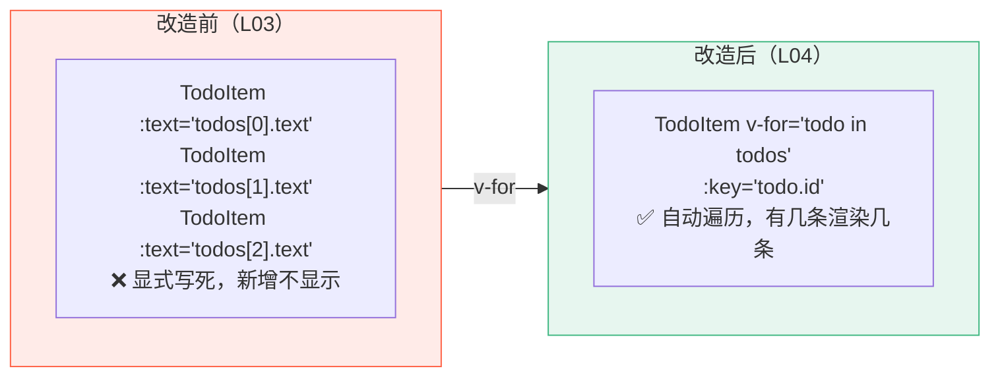
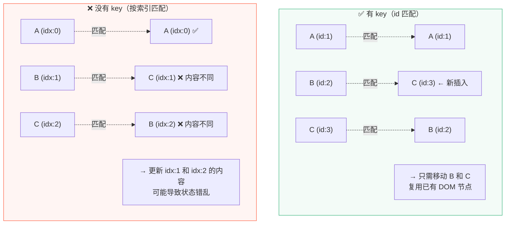
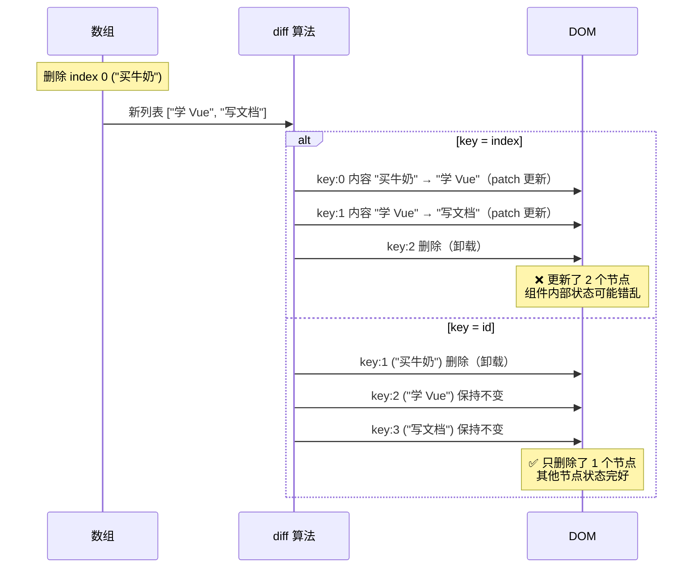
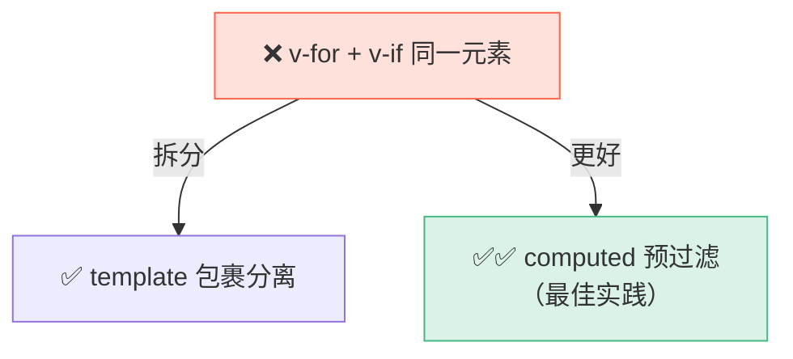
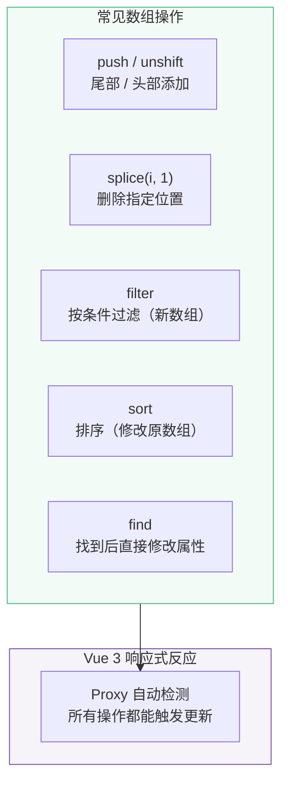
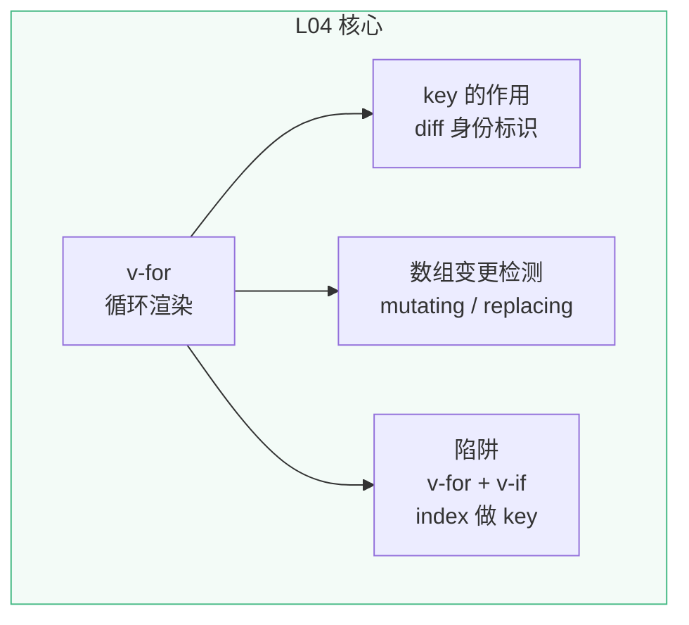

# L04 · 列表渲染：v-for 与 key 的秘密

```
🎯 本节目标：用 v-for 渲染 Todo 列表，理解 key 在 diff 算法中的角色
📦 本节产出：可动态展示任意数量 Todo 的列表视图
🔗 前置钩子：L03 的 ref/reactive 响应式数据 + todos 数组
🔗 后续钩子：L05 将为列表中的每项添加完成/删除操作
```

---

## 1. 问题回顾

L03 中我们硬编码了 `todos[0]`、`todos[1]`、`todos[2]`，新添加的 Todo 无法显示。我们需要一种方式**自动遍历数组，为每个元素渲染一个组件**。

---

## 2. v-for 基础语法

### 2.1 遍历数组

```vue
<template>
  <!-- item 是数组中的每一项，index 是索引 -->
  <div v-for="(item, index) in items" :key="item.id">
    {{ index }}. {{ item.name }}
  </div>
</template>
```

### 2.2 应用到 Todo App

```vue
<!-- src/App.vue -->
<script setup lang="ts">
import { ref } from 'vue'
import TodoItem from './components/TodoItem.vue'
import type { Todo } from './types/todo'

const todos = ref<Todo[]>([
  { id: 1, text: '搭建项目脚手架', done: true, priority: 'low', createdAt: '2024-01-01' },
  { id: 2, text: '理解组件和 Props', done: true, priority: 'medium', createdAt: '2024-01-02' },
  { id: 3, text: '学习响应式系统', done: false, priority: 'high', createdAt: '2024-01-03' },
])

const newTodoText = ref('')

function addTodo() {
  const text = newTodoText.value.trim()
  if (!text) return
  todos.value.push({
    id: Date.now(),
    text,
    done: false,
    priority: 'medium',
    createdAt: new Date().toISOString().split('T')[0],
  })
  newTodoText.value = ''
}
</script>

<template>
  <div class="app">
    <header class="app-header">
      <h1>📝 Vue Todo</h1>
      <p class="subtitle">{{ todos.length }} 个任务</p>
    </header>

    <div class="add-todo">
      <input
        :value="newTodoText"
        @input="newTodoText = ($event.target as HTMLInputElement).value"
        @keyup.enter="addTodo"
        placeholder="添加新任务..."
        class="todo-input"
      />
      <button @click="addTodo" class="add-btn">添加</button>
    </div>

    <main class="app-main">
      <!-- ✅ v-for 遍历数组，渲染任意数量的 TodoItem -->
      <TodoItem
        v-for="todo in todos"
        :key="todo.id"
        :text="todo.text"
        :done="todo.done"
        :priority="todo.priority"
        :created-at="todo.createdAt"
      />
    </main>
  </div>
</template>
```

**对比改造前后：**



---

## 3. key 的作用：不只是消除警告

### 3.1 没有 key 会怎样

```vue
<!-- ❌ 没有 key -->
<TodoItem v-for="todo in todos" :text="todo.text" />
```

Vue 会在控制台警告：

> `[Vue warn]: v-for without key. Use :key to track element identity.`

但 key 不只是消除警告——它直接影响**渲染性能**和**组件状态**。

### 3.2 key 在 diff 算法中的角色

当数组变化时（添加、删除、排序），Vue 需要知道**新旧列表中哪些节点是同一个**：



### 3.3 用 index 做 key 的问题

```vue
<!-- ⚠️ 看起来可以，实际有坑 -->
<TodoItem v-for="(todo, index) in todos" :key="index" />
```

**场景：删除第一条 Todo**

```
删除前：                     删除后：
index 0 → "买牛奶"          index 0 → "学 Vue"    ← index 没变！
index 1 → "学 Vue"           index 1 → "写文档"    ← index 没变！
index 2 → "写文档"           
```

Vue 认为 index 0 的节点还在，只是内容变了——于是**更新内容但保留了旧的组件状态**（比如输入框里未提交的文字、动画状态）。



**结论：永远用唯一且稳定的标识（如 `id`）做 key，不要用 `index`。**

---

## 4. v-for 的其他用法

### 4.1 遍历对象

```vue
<script setup lang="ts">
const user = { name: '张三', age: 25, city: '北京' }
</script>

<template>
  <!-- value 是属性值，key 是属性名，index 是序号 -->
  <div v-for="(value, key, index) in user" :key="key">
    {{ index }}. {{ key }}: {{ value }}
  </div>
  <!-- 输出：
    0. name: 张三
    1. age: 25
    2. city: 北京
  -->
</template>
```

### 4.2 遍历数字范围

```vue
<template>
  <!-- n 从 1 开始，不是 0 -->
  <span v-for="n in 5" :key="n">{{ n }} </span>
  <!-- 输出：1 2 3 4 5 -->
</template>
```

### 4.3 v-for 与 v-if 不要同时用在一个元素上

```vue
<!-- ❌ 错误：v-if 优先级高于 v-for，此时 todo 还不存在 -->
<TodoItem
  v-for="todo in todos"
  v-if="!todo.done"
  :key="todo.id"
/>

<!-- ✅ 方案 1：用 <template> 包裹 v-for -->
<template v-for="todo in todos" :key="todo.id">
  <TodoItem v-if="!todo.done" :text="todo.text" />
</template>

<!-- ✅ 方案 2（更推荐）：用 computed 过滤 -->
<!-- 在 script 中：const activeTodos = computed(() => todos.value.filter(t => !t.done)) -->
<TodoItem v-for="todo in activeTodos" :key="todo.id" :text="todo.text" />
```



---

## 5. 数组变更检测

Vue 能检测到以下**变更方法**（直接修改原数组）：

```typescript
// ✅ 这些操作会触发视图更新
todos.value.push(newTodo)
todos.value.pop()
todos.value.shift()
todos.value.unshift(newTodo)
todos.value.splice(index, 1)
todos.value.sort((a, b) => a.id - b.id)
todos.value.reverse()
```

**替换数组**也可以（创建新数组赋值）：

```typescript
// ✅ 替换整个数组也能触发更新
todos.value = todos.value.filter(t => !t.done)
todos.value = [...todos.value, newTodo]
```

> **在 Vue 3 中没有 Vue 2 的限制。** Vue 2 中 `arr[index] = newValue` 不响应式，Vue 3 用 Proxy 解决了这个问题。

```typescript
// ✅ Vue 3 中直接按索引修改也可以
todos.value[0] = { ...todos.value[0], done: true }
todos.value[0].done = true  // 也可以
```

---

## 6. 实战：常见列表操作

### 6.1 删除指定项

```typescript
function deleteTodo(id: number) {
  todos.value = todos.value.filter(t => t.id !== id)
  // 或者用 splice（修改原数组）
  // const index = todos.value.findIndex(t => t.id === id)
  // if (index !== -1) todos.value.splice(index, 1)
}
```

### 6.2 修改指定项

```typescript
function toggleTodo(id: number) {
  const todo = todos.value.find(t => t.id === id)
  if (todo) {
    todo.done = !todo.done  // ✅ Vue 3 可以直接修改
  }
}
```

### 6.3 插入到指定位置

```typescript
function insertAfter(afterId: number, newTodo: Todo) {
  const index = todos.value.findIndex(t => t.id === afterId)
  todos.value.splice(index + 1, 0, newTodo)
}
```

### 6.4 排序

```typescript
function sortByPriority() {
  const order = { high: 0, medium: 1, low: 2 }
  todos.value.sort((a, b) => order[a.priority] - order[b.priority])
}
```

### 6.5 操作对照图



---

## 7. key 与组件状态：用真实案例理解

这是一个很容易踩坑的场景：列表中每项包含**有内部状态的组件**（如输入框）。

```vue
<!-- EditableTodoItem.vue — 每项有自己的编辑状态 -->
<script setup lang="ts">
import { ref } from 'vue'
defineProps<{ text: string }>()

const isEditing = ref(false)  // 组件内部状态
const editText = ref('')
</script>

<template>
  <div class="editable-item">
    <template v-if="isEditing">
      <input v-model="editText" />
      <button @click="isEditing = false">保存</button>
    </template>
    <template v-else>
      <span>{{ text }}</span>
      <button @click="isEditing = true; editText = text">编辑</button>
    </template>
  </div>
</template>
```

**测试场景：**

1. 点击第一项的"编辑"按钮 → 输入框出现，输入 "新内容"
2. 此时删除第一项

```
如果 key=index：
  组件实例不会被销毁！Vue 认为 index:0 还在
  → 第二项的内容被渲染到 index:0 的组件中
  → 但 isEditing=true 和 editText="新内容" 是旧组件的状态
  → 用户看到第二项突然出现了编辑框和错误的内容 😱

如果 key=id：
  id:1 的组件实例被正确销毁
  → id:2 和 id:3 的组件完整保留，状态正确
  → 用户看到第一项消失，其他不变 ✅
```

**记住：key 决定了 Vue 是否复用组件实例。唯一且稳定的 key 保证了正确的组件生命周期。**

---

## 8. 大列表性能提示

当列表超过几百条时，需要关注性能：

```typescript
// ✅ 用 computed 过滤而不是在模板里写复杂表达式
const filteredTodos = computed(() =>
  todos.value.filter(t => t.text.includes(searchQuery.value))
)

// ✅ 使用 shallowRef（将在 L30 深入）
// 当列表数据只被整体替换而不修改内部属性时
const bigList = shallowRef<Item[]>([])
bigList.value = fetchedData  // 只在 .value 赋值时触发更新

// ✅ 大列表使用虚拟滚动（Phase 3 · L30 将详细讲解）
// 只渲染可见区域的 DOM 节点，万条数据也流畅
```

| 数据量 | 推荐方案 |
|--------|---------|
| < 100 条 | 直接 v-for，无需优化 |
| 100 - 500 条 | computed 预过滤 + 合理 key |
| 500 - 5000 条 | shallowRef + 分页加载 |
| > 5000 条 | 虚拟列表（@tanstack/vue-virtual） |

---

## 9. `<template>` 上的 v-for

有时你想循环渲染多个元素但不想添加额外的 DOM 包裹节点：

```vue
<!-- ❌ 额外的 div 包裹 -->
<div v-for="todo in todos" :key="todo.id">
  <h3>{{ todo.text }}</h3>
  <p>{{ todo.createdAt }}</p>
</div>

<!-- ✅ template 不渲染为 DOM 节点 -->
<template v-for="todo in todos" :key="todo.id">
  <h3>{{ todo.text }}</h3>
  <p>{{ todo.createdAt }}</p>
</template>
```

`<template>` 是 Vue 的"隐形容器"，只存在于模板层面，不会渲染为真实 DOM 元素。

---

## 10. 本节总结

### 知识图谱



### 检查清单

- [ ] 能用 `v-for` 遍历数组渲染组件列表
- [ ] 知道 `:key` 必须用唯一标识而非 `index`
- [ ] 能解释 key 在 diff 算法中的作用（用自己的话）
- [ ] 知道 `v-for` 和 `v-if` 不能同时用在一个元素上
- [ ] 知道 Vue 3 中数组变更检测没有 Vue 2 的限制
- [ ] 能用 `<template v-for>` 渲染无包裹的多元素

### 🐞 防坑指南

| 坑 | 说明 | 正确做法 |
|----|------|---------|
| 不写 `:key` | Vue 用索引做 diff → 状态错乱 | 用唯一且稳定的 id 作 key |
| 用 index 做 key | 删除/排序后索引变化 → 组件复用错误 | 用 `todo.id` 等业务标识 |
| `v-for` + `v-if` 同一元素 | Vue 3 中 `v-if` 优先 → 无法读循环变量 | 用 `<template v-for>` 包裹 |
| 直接赋值数组索引 | `arr[0] = newVal` 语义不清 | 用 `splice` 或找到对象修改属性 |

### 📐 最佳实践

1. **过滤/排序用 computed**：不要在 `v-for` 中写复杂过滤，用 `computed` 预处理
2. **大列表考虑虚拟滚动**：100+ 条用 `vue-virtual-scroller`
3. **key 选择优先级**：`id` > `slug/code` > 永远不要用 `index`
4. **避免嵌套 v-for**：超过两层嵌套应拆为子组件

### Git 提交

```bash
git add .
git commit -m "L04: v-for 列表渲染 + key"
```

---

## 🔗 钩子连接

### → 下一节：L05 · 条件渲染与事件

目前列表能展示、能添加，但不能**完成**和**删除**。L05 将引入：
- `v-if` / `v-show` 条件渲染
- `@click` 事件绑定
- `defineEmits` 子组件向父组件通信
- `<Transition>` 组件实现删除动画
