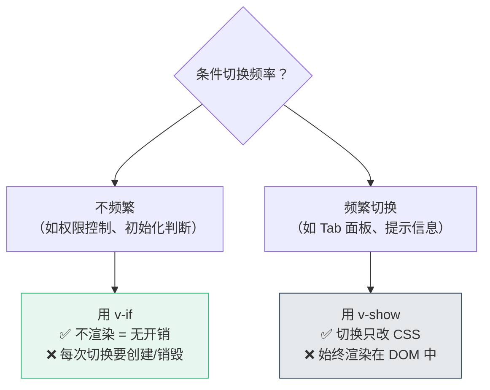
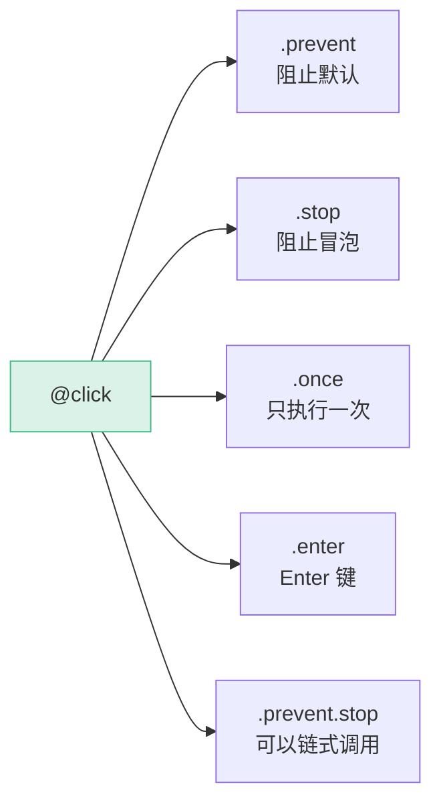
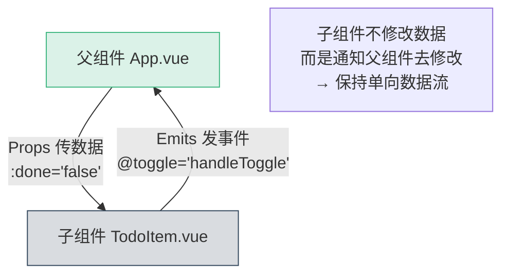
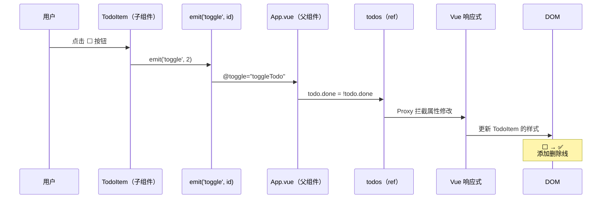
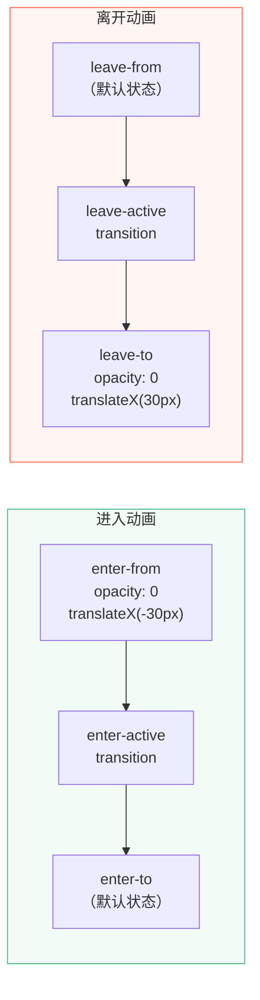
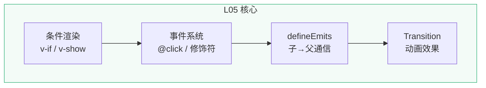

# L05 · 条件渲染与事件：完成 / 删除 Todo

```
🎯 本节目标：实现 Todo 的完成切换和删除功能，掌握条件渲染和事件系统
📦 本节产出：可完成、可删除的 Todo 应用 + 删除动画
🔗 前置钩子：L04 的 v-for 列表渲染
🔗 后续钩子：L06 将用 v-model 实现内联编辑
```

---

## 1. 条件渲染：v-if vs v-show

### 1.1 v-if

```vue
<template>
  <!-- v-if：条件为 false 时，元素完全不存在于 DOM -->
  <p v-if="todos.length === 0" class="empty">🎉 所有任务已完成！</p>

  <!-- v-else-if / v-else 必须紧跟 v-if -->
  <div v-if="status === 'loading'">加载中...</div>
  <div v-else-if="status === 'error'">出错了</div>
  <div v-else>数据加载完成</div>
</template>
```

### 1.2 v-show

```vue
<template>
  <!-- v-show：条件为 false 时，元素仍然存在于 DOM，只是 display: none -->
  <p v-show="showHint" class="hint">提示：按 Enter 快速添加</p>
</template>
```

### 1.3 如何选择



| | `v-if` | `v-show` |
|--|--------|----------|
| 条件为 false 时 | DOM 中不存在 | DOM 中存在，`display: none` |
| 切换开销 | 高（创建/销毁组件） | 低（只改 CSS） |
| 初始渲染 | 条件为 false 时不渲染 | 始终渲染 |
| 支持 `<template>` | ✅ | ❌ |
| 支持 `v-else` | ✅ | ❌ |

---

## 2. 事件绑定：@click

### 2.1 基本语法

```vue
<template>
  <!-- 完整写法 -->
  <button v-on:click="handleClick">点击</button>

  <!-- 简写（推荐） -->
  <button @click="handleClick">点击</button>

  <!-- 内联表达式 -->
  <button @click="count++">+1</button>

  <!-- 传参 -->
  <button @click="remove(todo.id)">删除</button>

  <!-- 访问原生事件对象 -->
  <button @click="handleClick($event)">点击</button>
</template>
```

### 2.2 事件修饰符

```vue
<template>
  <!-- .prevent：阻止默认行为（等同 event.preventDefault()） -->
  <form @submit.prevent="onSubmit">

  <!-- .stop：阻止冒泡（等同 event.stopPropagation()） -->
  <div @click.stop="handleClick">

  <!-- .once：只触发一次 -->
  <button @click.once="initApp">初始化</button>

  <!-- 按键修饰符 -->
  <input @keyup.enter="submit" />
  <input @keyup.esc="cancel" />
</template>
```



---

## 3. 子组件通信：defineEmits

Props 是父→子传数据，那子组件想通知父组件怎么办？用 **emit**。

### 3.1 原理



### 3.2 在 TodoItem 中定义事件

```vue
<!-- src/components/TodoItem.vue -->
<script setup lang="ts">
const props = withDefaults(
  defineProps<{
    id: number
    text: string
    done?: boolean
    priority?: 'low' | 'medium' | 'high'
    createdAt?: string
  }>(),
  { done: false, priority: 'medium' }
)

// 定义组件可以发出的事件
const emit = defineEmits<{
  toggle: [id: number]       // 切换完成状态，传递 id
  delete: [id: number]       // 删除 Todo，传递 id
}>()

function handleToggle() {
  emit('toggle', props.id)   // 发出 toggle 事件，携带 id
}

function handleDelete() {
  emit('delete', props.id)   // 发出 delete 事件，携带 id
}
</script>

<template>
  <div class="todo-item" :class="{ 'is-done': done, [`priority-${priority}`]: true }">
    <button class="toggle-btn" @click="handleToggle">
      {{ done ? '✅' : '⬜' }}
    </button>

    <div class="todo-content">
      <span class="todo-text">{{ text }}</span>
      <span v-if="createdAt" class="todo-date">{{ createdAt }}</span>
    </div>

    <span class="priority-badge">{{ priority }}</span>

    <button class="delete-btn" @click="handleDelete">🗑️</button>
  </div>
</template>

<style scoped>
.todo-item {
  display: flex;
  align-items: center;
  gap: 12px;
  padding: 12px 16px;
  background: #fff;
  border-radius: 8px;
  border: 1px solid #e8e8e8;
  margin-bottom: 8px;
  transition: all 0.3s ease;
}

.todo-item:hover {
  box-shadow: 0 2px 8px rgba(0, 0, 0, 0.06);
}

.todo-item.is-done {
  opacity: 0.55;
  background: #fafafa;
}

.todo-item.is-done .todo-text {
  text-decoration: line-through;
  color: #999;
}

.toggle-btn,
.delete-btn {
  background: none;
  border: none;
  font-size: 1.2rem;
  cursor: pointer;
  padding: 4px;
  border-radius: 4px;
  transition: background 0.2s;
}

.toggle-btn:hover,
.delete-btn:hover {
  background: #f0f0f0;
}

.delete-btn {
  opacity: 0;
  transition: opacity 0.2s;
}

.todo-item:hover .delete-btn {
  opacity: 1;
}

.todo-content {
  flex: 1;
  display: flex;
  flex-direction: column;
}

.todo-text {
  font-size: 1rem;
  color: #2c3e50;
}

.todo-date {
  font-size: 0.75rem;
  color: #aaa;
  margin-top: 2px;
}

.priority-badge {
  font-size: 0.7rem;
  padding: 2px 8px;
  border-radius: 10px;
  text-transform: uppercase;
  font-weight: 600;
  letter-spacing: 0.5px;
}

.priority-low .priority-badge {
  background: #e8f5e9;
  color: #4caf50;
}

.priority-medium .priority-badge {
  background: #fff3e0;
  color: #ff9800;
}

.priority-high .priority-badge {
  background: #ffebee;
  color: #f44336;
}
</style>
```

### 3.3 在 App.vue 中监听事件

```vue
<!-- src/App.vue -->
<script setup lang="ts">
import { ref } from 'vue'
import TodoItem from './components/TodoItem.vue'
import type { Todo } from './types/todo'

const todos = ref<Todo[]>([
  { id: 1, text: '搭建项目脚手架', done: true, priority: 'low', createdAt: '2024-01-01' },
  { id: 2, text: '理解组件和 Props', done: true, priority: 'medium', createdAt: '2024-01-02' },
  { id: 3, text: '学习响应式系统', done: false, priority: 'high', createdAt: '2024-01-03' },
])

const newTodoText = ref('')

function addTodo() {
  const text = newTodoText.value.trim()
  if (!text) return
  todos.value.push({
    id: Date.now(),
    text,
    done: false,
    priority: 'medium',
    createdAt: new Date().toISOString().split('T')[0],
  })
  newTodoText.value = ''
}

// 切换完成状态
function toggleTodo(id: number) {
  const todo = todos.value.find(t => t.id === id)
  if (todo) {
    todo.done = !todo.done  // ✅ 在父组件修改数据，保持单向数据流
  }
}

// 删除 Todo
function deleteTodo(id: number) {
  todos.value = todos.value.filter(t => t.id !== id)
}
</script>

<template>
  <div class="app">
    <header class="app-header">
      <h1>📝 Vue Todo</h1>
      <p class="subtitle">{{ todos.length }} 个任务</p>
    </header>

    <div class="add-todo">
      <input
        :value="newTodoText"
        @input="newTodoText = ($event.target as HTMLInputElement).value"
        @keyup.enter="addTodo"
        placeholder="添加新任务..."
        class="todo-input"
      />
      <button @click="addTodo" class="add-btn">添加</button>
    </div>

    <main class="app-main">
      <p v-if="todos.length === 0" class="empty">🎉 所有任务已完成！</p>

      <TodoItem
        v-for="todo in todos"
        :key="todo.id"
        :id="todo.id"
        :text="todo.text"
        :done="todo.done"
        :priority="todo.priority"
        :created-at="todo.createdAt"
        @toggle="toggleTodo"
        @delete="deleteTodo"
      />
      <!-- ⬆ @toggle="toggleTodo" 监听子组件的 toggle 事件 -->
      <!-- ⬆ 子组件 emit('toggle', id) → 执行 toggleTodo(id) -->
    </main>
  </div>
</template>
```

### 3.4 完整数据流



---

## 4. Transition 动画

给删除操作加上动画效果：

```vue
<!-- 在 App.vue 的 template 中 -->
<TransitionGroup name="list" tag="div" class="todo-list">
  <TodoItem
    v-for="todo in todos"
    :key="todo.id"
    :id="todo.id"
    :text="todo.text"
    :done="todo.done"
    :priority="todo.priority"
    :created-at="todo.createdAt"
    @toggle="toggleTodo"
    @delete="deleteTodo"
  />
</TransitionGroup>
```

```css
/* 在 App.vue 的 style 中 */

/* 进入动画 */
.list-enter-from {
  opacity: 0;
  transform: translateX(-30px);
}

.list-enter-active {
  transition: all 0.3s ease;
}

/* 离开动画 */
.list-leave-to {
  opacity: 0;
  transform: translateX(30px);
}

.list-leave-active {
  transition: all 0.3s ease;
}

/* 移动动画（列表重排时） */
.list-move {
  transition: transform 0.3s ease;
}
```



**`<Transition>` vs `<TransitionGroup>`：**
- `<Transition>`：单个元素/组件的进出动画
- `<TransitionGroup>`：列表的进出 + 移动动画

---

## 5. 完整的空状态处理

```vue
<template>
  <main class="app-main">
    <!-- 空状态 -->
    <div v-if="todos.length === 0" class="empty-state">
      <span class="empty-icon">🎉</span>
      <p class="empty-text">没有任务了</p>
      <p class="empty-hint">在上方添加你的第一个任务吧</p>
    </div>

    <!-- 有数据时显示列表 -->
    <TransitionGroup v-else name="list" tag="div" class="todo-list">
      <TodoItem
        v-for="todo in todos"
        :key="todo.id"
        v-bind="todo"
        @toggle="toggleTodo"
        @delete="deleteTodo"
      />
      <!-- ⬆ v-bind="todo" 是展开语法 -->
      <!-- 等价于 :id="todo.id" :text="todo.text" :done="todo.done" ... -->
    </TransitionGroup>
  </main>
</template>
```

> **`v-bind="todo"` 展开技巧：** 当 Props 名和数据对象属性名一致时，可以用 `v-bind="obj"` 展开所有属性，省去逐个绑定。

---

## 6. 本节总结

### 知识图谱



### 检查清单

- [ ] 能区分 `v-if` 和 `v-show` 的区别与适用场景
- [ ] 能用 `@click` 绑定事件并传参
- [ ] 知道常用事件修饰符（`.prevent`、`.stop`、`.enter`）
- [ ] 能用 `defineEmits` 声明和触发自定义事件
- [ ] 能解释"子组件 emit 事件 → 父组件监听处理"的数据流
- [ ] 能用 `<TransitionGroup>` 实现列表动画

### 🐞 防坑指南

| 坑 | 说明 | 正确做法 |
|----|------|---------|
| emit 事件名大写 | `emit('Toggle')` 父组件 `@toggle` 收不到 | 事件名用 camelCase 或 kebab-case，保持一致 |
| v-show 用在 `<template>` 上 | `<template>` 不是真实 DOM → v-show 无效 | 改用 `v-if` 或给真实元素加 v-show |
| TransitionGroup 无 key | 列表项必须有 key 才能触发动画 | 每个子元素加 `:key` |
| 内联事件写复杂逻辑 | `@click="a++; b--; doSomething()"` 难维护 | 抽为方法 `@click="handleClick"` |

### 📐 最佳实践

1. **emit 类型声明**：始终用 `defineEmits<{ event: [payload] }>()` 泛型，享受类型检查
2. **v-if vs v-show**：权限判断用 `v-if`（安全），Tab 切换用 `v-show`（性能）
3. **事件命名**：自定义事件用行为动词（`toggle`、`delete`、`update`），不用 `onClick` 等
4. **动画渐进**：先做功能、后加动画，`<Transition>` 可以最后一步加上去

### Git 提交

```bash
git add .
git commit -m "L05: 条件渲染 + 事件绑定 + emit + 动画"
```

---

## 🔗 钩子连接

### → 下一节：L06 · 表单与 v-model：双向绑定

现在 Todo 能添加、完成、删除了，但不能**编辑**。L06 将引入 `v-model` 实现双向绑定，让 Todo 支持内联编辑。同时会深入讲解 `v-model` 的语法糖本质。
