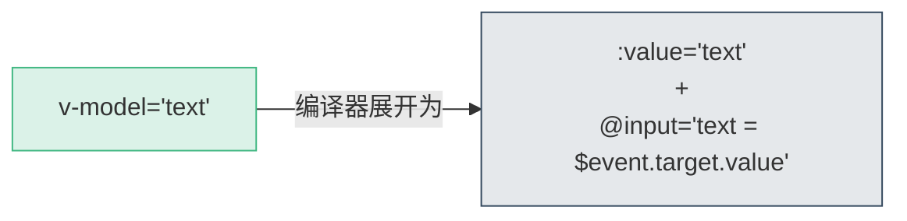
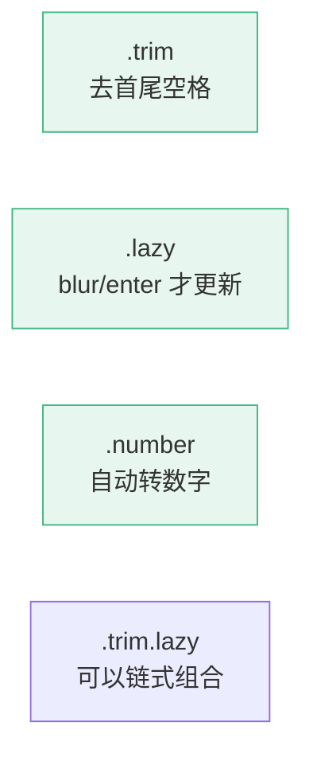
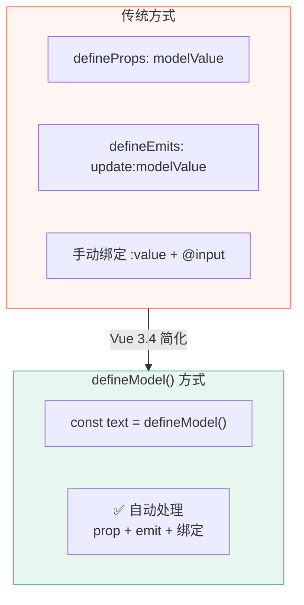
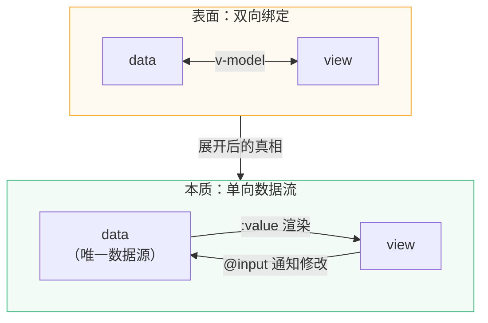

# L06 · 表单与 v-model：双向绑定

```
🎯 本节目标：用 v-model 重构输入框，实现 Todo 内联编辑
📦 本节产出：支持内联编辑的 Todo App + 理解 v-model 语法糖本质
🔗 前置钩子：L05 的事件系统（@input/@click/emit）
🔗 后续钩子：L07 将用 computed 和 watch 实现筛选和统计
```

---

## 1. v-model 是什么

### 1.1 没有 v-model 的写法（L03/L05 中的方式）

```vue
<input
  :value="newTodoText"
  @input="newTodoText = ($event.target as HTMLInputElement).value"
/>
```

每次都要写 `:value` + `@input`，很繁琐。

### 1.2 v-model 语法糖

```vue
<!-- 等价于上面的写法，但更简洁 -->
<input v-model="newTodoText" />
```

**v-model 的本质：**



> `v-model` 不是新概念，只是 `:value` + `@input` 的语法糖。理解这一点很重要——Vue 的双向绑定并没有打破单向数据流。

### 1.3 用 v-model 重构 App.vue 的输入框

```vue
<!-- 改造前 -->
<input
  :value="newTodoText"
  @input="newTodoText = ($event.target as HTMLInputElement).value"
  @keyup.enter="addTodo"
  placeholder="添加新任务..."
/>

<!-- 改造后 -->
<input
  v-model="newTodoText"
  @keyup.enter="addTodo"
  placeholder="添加新任务..."
/>
```

---

## 2. v-model 在不同表单元素上的行为

`v-model` 在不同表单元素上，展开为不同的属性和事件：

| 元素 | 绑定属性 | 监听事件 |
|------|---------|---------|
| `<input type="text">` | `:value` | `@input` |
| `<textarea>` | `:value` | `@input` |
| `<input type="checkbox">` | `:checked` | `@change` |
| `<input type="radio">` | `:checked` | `@change` |
| `<select>` | `:value` | `@change` |

### 2.1 Checkbox

```vue
<script setup lang="ts">
import { ref } from 'vue'

// 单个 checkbox → boolean
const isAgreed = ref(false)

// 多个 checkbox → 数组
const selectedTags = ref<string[]>([])
</script>

<template>
  <!-- 单个 checkbox -->
  <label>
    <input type="checkbox" v-model="isAgreed" />
    同意条款
  </label>
  <p>{{ isAgreed ? '已同意' : '未同意' }}</p>

  <!-- 多个 checkbox 绑定同一个数组 -->
  <label><input type="checkbox" v-model="selectedTags" value="工作" /> 工作</label>
  <label><input type="checkbox" v-model="selectedTags" value="学习" /> 学习</label>
  <label><input type="checkbox" v-model="selectedTags" value="生活" /> 生活</label>
  <p>已选: {{ selectedTags }}</p>
  <!-- 输出：["工作", "学习"] -->
</template>
```

### 2.2 Select

```vue
<script setup lang="ts">
import { ref } from 'vue'

const priority = ref<'low' | 'medium' | 'high'>('medium')
</script>

<template>
  <select v-model="priority">
    <option value="low">🟢 低</option>
    <option value="medium">🟡 中</option>
    <option value="high">🔴 高</option>
  </select>
</template>
```

---

## 3. v-model 修饰符

### 3.1 `.trim`：去除首尾空格

```vue
<!-- 自动去除用户输入的首尾空格 -->
<input v-model.trim="newTodoText" />

<!-- 等价于 -->
<input :value="newTodoText"
  @input="newTodoText = $event.target.value.trim()" />
```

### 3.2 `.lazy`：在 change 事件时更新（而非 input）

```vue
<!-- 默认：每输入一个字符就更新 -->
<input v-model="text" />

<!-- .lazy：失去焦点或按 Enter 才更新 -->
<input v-model.lazy="text" />
```

### 3.3 `.number`：自动转为数字

```vue
<input v-model.number="age" type="number" />
<!-- age 的值是 number 类型，而不是 string -->
```



---

## 4. 组件上的 v-model

### 4.1 在自定义组件上使用 v-model

`v-model` 不只能用在原生 `<input>` 上，还能用在**自定义组件**上。

```vue
<!-- 父组件 -->
<TodoInput v-model="newTodoText" />

<!-- 等价于 -->
<TodoInput :modelValue="newTodoText" @update:modelValue="newTodoText = $event" />
```

### 4.2 defineModel()（Vue 3.4+ 推荐）

```vue
<!-- src/components/TodoInput.vue -->
<script setup lang="ts">
// defineModel 自动处理 prop + emit
const text = defineModel<string>({ default: '' })
</script>

<template>
  <input
    :value="text"
    @input="text = ($event.target as HTMLInputElement).value"
    class="todo-input"
    placeholder="添加新任务..."
  />
</template>
```



### 4.3 多个 v-model

一个组件可以支持多个 `v-model`：

```vue
<!-- 父组件 -->
<TodoEditor
  v-model:text="todo.text"
  v-model:priority="todo.priority"
/>

<!-- 子组件 TodoEditor.vue -->
<script setup lang="ts">
const text = defineModel<string>('text')
const priority = defineModel<'low' | 'medium' | 'high'>('priority')
</script>
```

---

## 5. 实战：Todo 内联编辑

### 5.1 升级 TodoItem 支持编辑模式

```vue
<!-- src/components/TodoItem.vue（新增编辑功能） -->
<script setup lang="ts">
import { ref } from 'vue'

const props = withDefaults(
  defineProps<{
    id: number
    text: string
    done?: boolean
    priority?: 'low' | 'medium' | 'high'
    createdAt?: string
  }>(),
  { done: false, priority: 'medium' }
)

const emit = defineEmits<{
  toggle: [id: number]
  delete: [id: number]
  update: [id: number, text: string]
}>()

// 编辑状态
const isEditing = ref(false)
const editText = ref('')

function startEdit() {
  if (props.done) return  // 已完成的不允许编辑
  isEditing.value = true
  editText.value = props.text
}

function saveEdit() {
  const text = editText.value.trim()
  if (text && text !== props.text) {
    emit('update', props.id, text)
  }
  isEditing.value = false
}

function cancelEdit() {
  isEditing.value = false
}
</script>

<template>
  <div class="todo-item" :class="{ 'is-done': done, 'is-editing': isEditing }">
    <button class="toggle-btn" @click="emit('toggle', id)">
      {{ done ? '✅' : '⬜' }}
    </button>

    <div class="todo-content">
      <!-- 编辑模式 -->
      <input
        v-if="isEditing"
        v-model.trim="editText"
        @keyup.enter="saveEdit"
        @keyup.esc="cancelEdit"
        @blur="saveEdit"
        class="edit-input"
        ref="editInput"
      />

      <!-- 展示模式 -->
      <span
        v-else
        class="todo-text"
        @dblclick="startEdit"
      >
        {{ text }}
      </span>

      <span v-if="createdAt && !isEditing" class="todo-date">{{ createdAt }}</span>
    </div>

    <span v-if="!isEditing" class="priority-badge">{{ priority }}</span>
    <button v-if="!isEditing" class="delete-btn" @click="emit('delete', id)">🗑️</button>
  </div>
</template>

<style scoped>
.todo-item {
  display: flex;
  align-items: center;
  gap: 12px;
  padding: 12px 16px;
  background: #fff;
  border-radius: 8px;
  border: 1px solid #e8e8e8;
  margin-bottom: 8px;
  transition: all 0.3s ease;
}

.todo-item.is-editing {
  border-color: #42b883;
  box-shadow: 0 0 0 2px rgba(66, 184, 131, 0.15);
}

.todo-item:hover {
  box-shadow: 0 2px 8px rgba(0, 0, 0, 0.06);
}

.todo-item.is-done {
  opacity: 0.55;
  background: #fafafa;
}

.todo-item.is-done .todo-text {
  text-decoration: line-through;
  color: #999;
}

.toggle-btn,
.delete-btn {
  background: none;
  border: none;
  font-size: 1.2rem;
  cursor: pointer;
  padding: 4px;
  border-radius: 4px;
  transition: background 0.2s;
}

.toggle-btn:hover,
.delete-btn:hover {
  background: #f0f0f0;
}

.delete-btn {
  opacity: 0;
  transition: opacity 0.2s;
}

.todo-item:hover .delete-btn {
  opacity: 1;
}

.todo-content {
  flex: 1;
  display: flex;
  flex-direction: column;
}

.todo-text {
  font-size: 1rem;
  color: #2c3e50;
  cursor: default;
}

.todo-text:hover {
  cursor: text;
}

.edit-input {
  font-size: 1rem;
  padding: 4px 8px;
  border: 1px solid #ddd;
  border-radius: 4px;
  outline: none;
  width: 100%;
}

.edit-input:focus {
  border-color: #42b883;
}

.todo-date {
  font-size: 0.75rem;
  color: #aaa;
  margin-top: 2px;
}

.priority-badge {
  font-size: 0.7rem;
  padding: 2px 8px;
  border-radius: 10px;
  text-transform: uppercase;
  font-weight: 600;
}

.priority-low .priority-badge { background: #e8f5e9; color: #4caf50; }
.priority-medium .priority-badge { background: #fff3e0; color: #ff9800; }
.priority-high .priority-badge { background: #ffebee; color: #f44336; }
</style>
```

### 5.2 在 App.vue 中处理更新事件

```vue
<script setup lang="ts">
// ...已有代码...

function updateTodo(id: number, text: string) {
  const todo = todos.value.find(t => t.id === id)
  if (todo) {
    todo.text = text
  }
}
</script>

<template>
  <!-- 在 TodoItem 上添加 @update 监听 -->
  <TodoItem
    v-for="todo in todos"
    :key="todo.id"
    v-bind="todo"
    @toggle="toggleTodo"
    @delete="deleteTodo"
    @update="updateTodo"
  />
</template>
```

---

## 6. v-model 的本质：语法糖展开

```mermaid
flowchart TB
    subgraph Native["原生元素上的 v-model"]
        input_vmodel["<input v-model='text'>"]
        input_expand[":value='text'\n@input='text = $event.target.value'"]
        input_vmodel --> input_expand
    end

    subgraph Component["组件上的 v-model"]
        comp_vmodel["<MyComp v-model='text'>"]
        comp_expand[":modelValue='text'\n@update:modelValue='text = $event'"]
        comp_vmodel --> comp_expand
    end

    subgraph Named["命名 v-model"]
        named_vmodel["<MyComp v-model:title='text'>"]
        named_expand[":title='text'\n@update:title='text = $event'"]
        named_vmodel --> named_expand
    end

    style Native fill:#42b88310,stroke:#42b883
    style Component fill:#35495e10,stroke:#35495e
    style Named fill:#764ba210,stroke:#764ba2
```



---

## 7. 深度专题预览：D07 · v-model 违反单向数据流了吗？

很多人认为 v-model 是"双向绑定"，与 Vue 倡导的"单向数据流"矛盾。实际上：



**结论：** v-model 只是语法糖，底层仍然是 `:value` + `@input` 的单向数据流。数据源始终是 data，view 只是**请求**修改，最终决定权在数据层。

---

## 8. 本节总结

### 检查清单

- [ ] 能解释 v-model 是 `:value` + `@input` 的语法糖
- [ ] 知道 v-model 在 checkbox/select 上的不同行为
- [ ] 能使用 `.trim`、`.lazy`、`.number` 修饰符
- [ ] 能用 `defineModel()` 在组件上实现 v-model
- [ ] 能实现 Todo 的双击编辑、Enter 保存、Esc 取消
- [ ] 能解释 v-model 没有违反单向数据流

### 🐞 防坑指南

| 坑 | 说明 | 正确做法 |
|----|------|---------|
| 给非表单组件用 v-model | `<UserCard v-model="user">` 语义不清 | v-model 仅用于输入型组件 |
| `.number` 对空值 | 空输入框 `.number` 返回空字符串 | 配合 `?? 0` 或验证逻辑 |
| 忘记 `.trim` | 用户输入 `"  todo "` 含前后空格 | 表单输入默认加 `.trim` |
| 编辑模式忘记初始化 | 打开编辑时 editText 是空的 | `editText.value = props.text` 后再切编辑态 |

### 📐 最佳实践

1. **优先 defineModel**：Vue 3.4+ 用 `defineModel()` 替代 props + emit 手动绑定
2. **编辑模式三件套**：`@dblclick` 进入、`@keyup.enter` 保存、`@keyup.esc` 取消
3. **表单防抖**：搜索输入用 `.lazy` 或 `watchDebounced`，避免高频请求
4. **多 v-model 命名**：超过 2 个 v-model 时果断用命名写法 `v-model:title`，提升可读性

### Git 提交

```bash
git add .
git commit -m "L06: v-model 双向绑定 + Todo 内联编辑"
```

---

## 🔗 钩子连接

### → 下一节：L07 · computed 与 watch：筛选 + 统计

Todo 功能基本完整了（增删改查）。L07 将添加：
- 用 `computed` 实现"全部/进行中/已完成"筛选
- 用 `computed` 计算统计数据（完成率 / 剩余数量）
- 用 `watch` 实现副作用（如自动保存提示）
