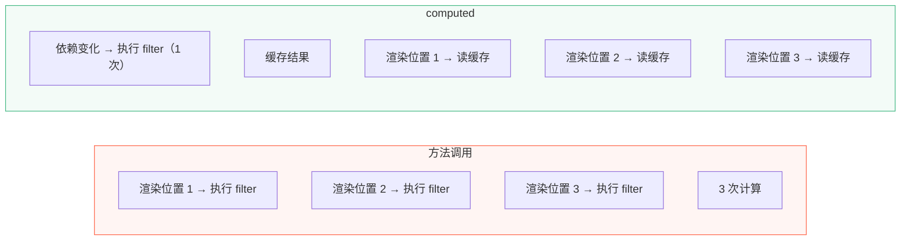
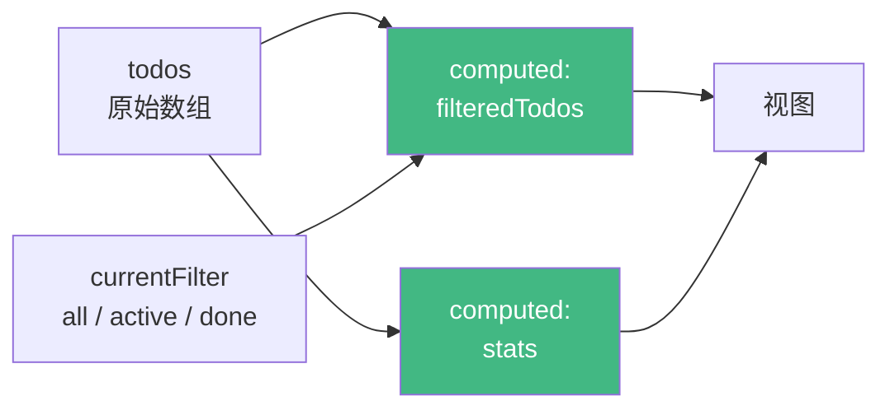
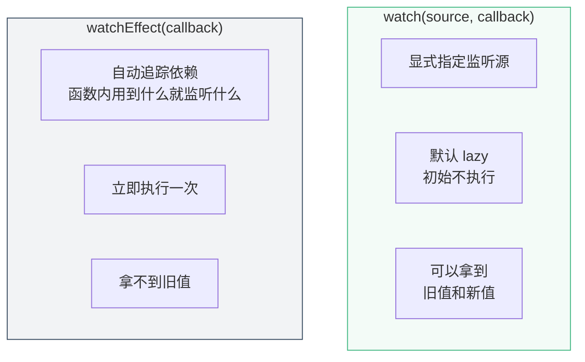
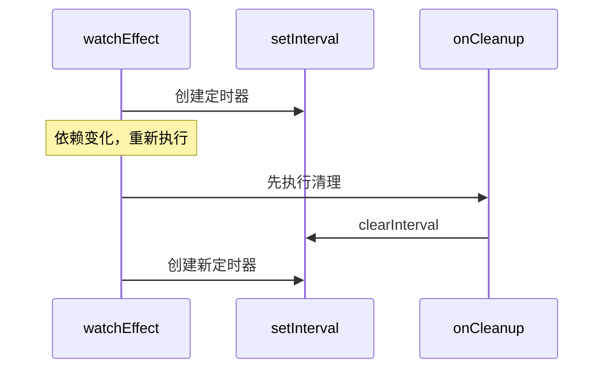

# L07 · computed 与 watch：筛选 + 统计

```
🎯 本节目标：用 computed 实现智能筛选和统计，用 watch 实现副作用
📦 本节产出：支持 全部/进行中/已完成 筛选 + 统计面板的 Todo App
🔗 前置钩子：L06 的完整 CRUD（增删改查全通）
🔗 后续钩子：L08 将把数据持久化到 localStorage
```

---

## 1. computed：缓存的派生数据

### 1.1 为什么不直接用方法

```vue
<script setup lang="ts">
import { ref } from 'vue'

const todos = ref([
  { id: 1, text: '学 Vue', done: false },
  { id: 2, text: '学 TS', done: true },
])

// 方法：每次模板重新渲染都会调用
function getActiveTodos() {
  console.log('方法被调用了')
  return todos.value.filter(t => !t.done)
}
</script>

<template>
  <!-- 假设这里有 10 个地方用到 activeTodos -->
  <p>剩余: {{ getActiveTodos().length }}</p>     <!-- 调用 1 次 -->
  <p>进行中: {{ getActiveTodos().length }}</p>   <!-- 调用 2 次 -->
  <div v-for="t in getActiveTodos()" :key="t.id"> <!-- 调用 3 次 -->
    {{ t.text }}
  </div>
  <!-- 每次渲染执行 3 次 filter，即使 todos 没变 -->
</template>
```

### 1.2 computed 的缓存优势

```vue
<script setup lang="ts">
import { ref, computed } from 'vue'

const todos = ref([
  { id: 1, text: '学 Vue', done: false },
  { id: 2, text: '学 TS', done: true },
])

// computed：只在依赖变化时重新计算，结果被缓存
const activeTodos = computed(() => {
  console.log('computed 被重新计算了')
  return todos.value.filter(t => !t.done)
})
</script>

<template>
  <!-- 引用 10 次也只计算 1 次，其余从缓存读取 -->
  <p>剩余: {{ activeTodos.length }}</p>
  <p>进行中: {{ activeTodos.length }}</p>
  <div v-for="t in activeTodos" :key="t.id">
    {{ t.text }}
  </div>
</template>
```



---

## 2. 实战：Todo 筛选系统

### 2.1 筛选逻辑

```vue
<!-- src/App.vue -->
<script setup lang="ts">
import { ref, computed } from 'vue'
import TodoItem from './components/TodoItem.vue'
import type { Todo } from './types/todo'

const todos = ref<Todo[]>([
  { id: 1, text: '搭建项目脚手架', done: true, priority: 'low', createdAt: '2024-01-01' },
  { id: 2, text: '理解组件和 Props', done: true, priority: 'medium', createdAt: '2024-01-02' },
  { id: 3, text: '学习响应式系统', done: false, priority: 'high', createdAt: '2024-01-03' },
  { id: 4, text: '完成 v-for 列表', done: false, priority: 'medium', createdAt: '2024-01-04' },
])

// 当前筛选条件
type FilterType = 'all' | 'active' | 'done'
const currentFilter = ref<FilterType>('all')

// computed：根据筛选条件过滤
const filteredTodos = computed(() => {
  switch (currentFilter.value) {
    case 'active':
      return todos.value.filter(t => !t.done)
    case 'done':
      return todos.value.filter(t => t.done)
    default:
      return todos.value
  }
})

// computed：统计数据
const stats = computed(() => {
  const total = todos.value.length
  const doneCount = todos.value.filter(t => t.done).length
  const activeCount = total - doneCount
  const donePercent = total > 0 ? Math.round((doneCount / total) * 100) : 0
  return { total, doneCount, activeCount, donePercent }
})

// ...addTodo、toggleTodo、deleteTodo、updateTodo 函数同前...
const newTodoText = ref('')

function addTodo() {
  const text = newTodoText.value.trim()
  if (!text) return
  todos.value.push({
    id: Date.now(), text, done: false,
    priority: 'medium',
    createdAt: new Date().toISOString().split('T')[0],
  })
  newTodoText.value = ''
}

function toggleTodo(id: number) {
  const todo = todos.value.find(t => t.id === id)
  if (todo) todo.done = !todo.done
}

function deleteTodo(id: number) {
  todos.value = todos.value.filter(t => t.id !== id)
}

function updateTodo(id: number, text: string) {
  const todo = todos.value.find(t => t.id === id)
  if (todo) todo.text = text
}

// 清除已完成
function clearDone() {
  todos.value = todos.value.filter(t => !t.done)
}
</script>

<template>
  <div class="app">
    <header class="app-header">
      <h1>📝 Vue Todo</h1>
    </header>

    <!-- 输入区 -->
    <div class="add-todo">
      <input v-model.trim="newTodoText" @keyup.enter="addTodo"
        placeholder="添加新任务..." class="todo-input" />
      <button @click="addTodo" class="add-btn">添加</button>
    </div>

    <!-- 统计面板 -->
    <div class="stats-panel">
      <div class="stat">
        <span class="stat-value">{{ stats.total }}</span>
        <span class="stat-label">总计</span>
      </div>
      <div class="stat">
        <span class="stat-value">{{ stats.activeCount }}</span>
        <span class="stat-label">进行中</span>
      </div>
      <div class="stat">
        <span class="stat-value">{{ stats.doneCount }}</span>
        <span class="stat-label">已完成</span>
      </div>
      <div class="stat">
        <div class="progress-bar">
          <div class="progress-fill" :style="{ width: stats.donePercent + '%' }"></div>
        </div>
        <span class="stat-label">{{ stats.donePercent }}%</span>
      </div>
    </div>

    <!-- 筛选栏 -->
    <div class="filter-bar">
      <button
        v-for="f in (['all', 'active', 'done'] as FilterType[])"
        :key="f"
        :class="['filter-btn', { active: currentFilter === f }]"
        @click="currentFilter = f"
      >
        {{ f === 'all' ? '全部' : f === 'active' ? '进行中' : '已完成' }}
        <span class="filter-count">
          {{ f === 'all' ? stats.total : f === 'active' ? stats.activeCount : stats.doneCount }}
        </span>
      </button>

      <button v-if="stats.doneCount > 0" @click="clearDone" class="clear-btn">
        清除已完成
      </button>
    </div>

    <!-- Todo 列表 -->
    <main class="app-main">
      <p v-if="filteredTodos.length === 0" class="empty">
        {{ currentFilter === 'all' ? '🎉 添加你的第一个任务' : '📭 没有匹配的任务' }}
      </p>

      <TransitionGroup name="list" tag="div">
        <TodoItem
          v-for="todo in filteredTodos"
          :key="todo.id"
          v-bind="todo"
          @toggle="toggleTodo"
          @delete="deleteTodo"
          @update="updateTodo"
        />
      </TransitionGroup>
    </main>
  </div>
</template>
```



---

## 3. watch 与 watchEffect

### 3.1 watch：监听特定数据变化

```typescript
import { watch } from 'vue'

// 监听单个 ref
watch(currentFilter, (newVal, oldVal) => {
  console.log(`筛选从 ${oldVal} 切换到 ${newVal}`)
})

// 监听 ref 数组（需要 deep 选项）
watch(todos, (newTodos) => {
  console.log('todos 变化了，当前数量:', newTodos.length)
}, { deep: true })  // deep: true 监听数组内部对象属性的变化

// 监听多个源
watch([currentFilter, todos], ([newFilter, newTodos]) => {
  console.log('筛选或数据变化了')
})
```

### 3.2 watchEffect：自动追踪依赖

```typescript
import { watchEffect } from 'vue'

// 不需要指定依赖——函数内用到的响应式数据自动被追踪
watchEffect(() => {
  console.log(`当前筛选: ${currentFilter.value}`)
  console.log(`结果数量: ${filteredTodos.value.length}`)
  // 任何一个变化都会重新执行
})
```

### 3.3 watch vs watchEffect



| | `watch` | `watchEffect` |
|--|---------|---------------|
| 依赖声明 | 显式指定 | 自动追踪 |
| 初始执行 | ❌（除非 `immediate: true`） | ✅ 立即执行 |
| 新旧值 | ✅ `(newVal, oldVal)` | ❌ |
| 适用场景 | 需要对比新旧值、条件执行 | 同步多个数据源、无需旧值 |

### 3.4 实际应用：自动保存提示

```typescript
// 监听 todos 变化，显示"已保存"提示
const savedMessage = ref('')

watch(todos, () => {
  savedMessage.value = '✅ 已自动保存'
  setTimeout(() => {
    savedMessage.value = ''
  }, 2000)
}, { deep: true })
```

---

## 4. computed 的进阶

### 4.1 可写的 computed

```typescript
const firstName = ref('张')
const lastName = ref('三')

// 可写 computed
const fullName = computed({
  get() {
    return `${firstName.value}${lastName.value}`
  },
  set(newName: string) {
    // 假设姓一个字，名可能多个字
    firstName.value = newName[0]
    lastName.value = newName.slice(1)
  }
})

fullName.value = '李四'
// firstName = '李', lastName = '四'
```

### 4.2 computed 最佳实践

```typescript
// ✅ computed 应该是纯函数——只做计算，不要有副作用
const activeTodos = computed(() => {
  return todos.value.filter(t => !t.done)
})

// ❌ 不要在 computed 里修改其他状态
const activeTodos = computed(() => {
  someOtherRef.value = 'changed'  // 副作用！
  return todos.value.filter(t => !t.done)
})

// ❌ 不要在 computed 里做异步操作
const activeTodos = computed(async () => {  // 返回 Promise 而不是值
  const data = await fetch('/api/todos')
  return data.json()
})
```

---

## 5. 清理副作用

`watch` 和 `watchEffect` 都可以清理副作用（如定时器、事件监听器）：

```typescript
watchEffect((onCleanup) => {
  const timer = setInterval(() => {
    console.log('定时检查...')
  }, 5000)

  // 在下次重新执行或组件卸载时执行清理
  onCleanup(() => {
    clearInterval(timer)
  })
})
```



---

## 6. 本节总结

### 检查清单

- [ ] 能解释 computed 与方法的区别（缓存 vs 每次执行）
- [ ] 能用 computed 实现派生数据（筛选、统计）
- [ ] 能区分 `watch` 和 `watchEffect` 的适用场景
- [ ] 能用 `watch` 的 `deep` 选项监听对象/数组内部变化
- [ ] 知道 computed 应该是纯函数，不做副作用
- [ ] 能在 watch/watchEffect 中清理副作用

### Git 提交

```bash
git add .
git commit -m "L07: computed 筛选 + 统计面板 + watch"
```

---

## 🔗 钩子连接

### → 下一节：L08 · 本地持久化 + Composable

现在刷新页面数据就丢了。L08 将用 `watch` + `localStorage` 实现持久化，并抽取第一个 composable `useLocalStorage()`。
