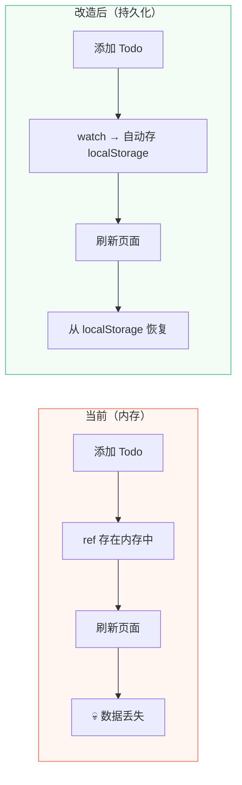
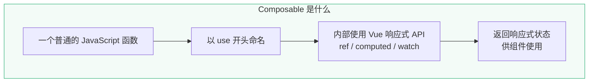
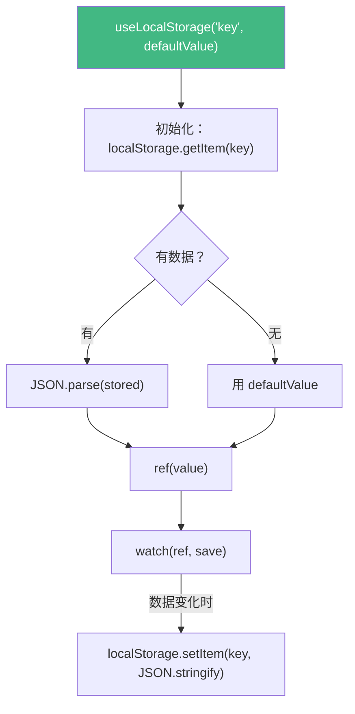
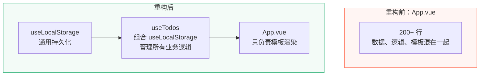
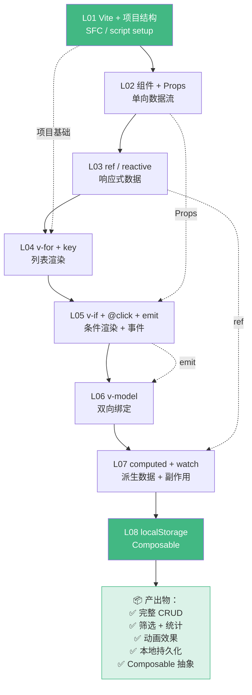

---
prev:
  text: 'L07 · computed 与 watch'
  link: '/lessons/phase-1/L07-computed-watch'
next:
  text: '🚀 Phase 2 → L09 · 架构升级'
  link: '/lessons/phase-2/L09-architecture'
---

# L08 · 本地持久化：localStorage + Composable

```
🎯 本节目标：将 Todo 数据持久化到 localStorage，并抽取第一个 Composable
📦 本节产出：刷新不丢失数据的 Todo App + useLocalStorage composable
🔗 前置钩子：L07 的 watch（用于监听数据变化自动保存）
🔗 后续钩子：Phase 2 (L09) 将在此基础上重构为任务管理系统
```

---

## 1. 为什么需要持久化

目前应用刷新后数据全丢——因为 Vue 的响应式数据存在**内存**中。浏览器关闭或刷新，内存清空。



---

## 2. 直接实现：watch + localStorage

### 2.1 保存

```typescript
import { ref, watch } from 'vue'

const todos = ref<Todo[]>([])

// 监听 todos 变化，自动保存到 localStorage
watch(todos, (newTodos) => {
  localStorage.setItem('vue-todo-list', JSON.stringify(newTodos))
}, { deep: true })  // deep: true 监听数组元素属性的变化
```

### 2.2 恢复

```typescript
// 初始化时从 localStorage 读取
function loadTodos(): Todo[] {
  const stored = localStorage.getItem('vue-todo-list')
  if (stored) {
    try {
      return JSON.parse(stored)
    } catch {
      return []
    }
  }
  return []
}

const todos = ref<Todo[]>(loadTodos())
```

### 2.3 问题：代码散落在组件中

如果多个组件都需要本地持久化，每次都要写一遍 `watch` + `localStorage.getItem/setItem` + `JSON.parse/stringify` + `try/catch`……

解决方案：**抽取为 Composable**。

---

## 3. 什么是 Composable

Composable 是 Vue 3 中**复用有状态逻辑**的核心模式。



**类比理解：**

| | React | Vue 3 |
|--|-------|-------|
| 复用逻辑的方式 | Custom Hook | Composable |
| 命名规范 | `useXxx()` | `useXxx()` |
| 本质 | 函数 | 函数 |
| 关键区别 | 每次渲染重新执行 | setup 中只执行一次 |

### 3.1 创建 `useLocalStorage`

```typescript
// src/composables/useLocalStorage.ts
import { ref, watch, type Ref } from 'vue'

/**
 * 将 ref 的值同步到 localStorage
 * @param key localStorage 的 key
 * @param defaultValue 默认值（localStorage 中没有数据时使用）
 * @returns 响应式 ref，值变化自动同步到 localStorage
 */
export function useLocalStorage<T>(key: string, defaultValue: T): Ref<T> {
  // 1. 从 localStorage 读取，如果没有则用默认值
  const stored = localStorage.getItem(key)
  const data = ref<T>(
    stored ? JSON.parse(stored) : defaultValue
  ) as Ref<T>

  // 2. 监听变化，自动保存
  watch(data, (newValue) => {
    localStorage.setItem(key, JSON.stringify(newValue))
  }, { deep: true })

  return data
}
```

### 3.2 使用 Composable

```vue
<!-- src/App.vue -->
<script setup lang="ts">
import { useLocalStorage } from './composables/useLocalStorage'
import type { Todo } from './types/todo'

// 一行代码完成持久化 🎉
const todos = useLocalStorage<Todo[]>('vue-todo-list', [
  { id: 1, text: '搭建项目脚手架', done: true, priority: 'low', createdAt: '2024-01-01' },
  { id: 2, text: '学习 Vue 3 基础', done: false, priority: 'high', createdAt: '2024-01-02' },
])

// 筛选条件也可以持久化
const currentFilter = useLocalStorage<'all' | 'active' | 'done'>('vue-todo-filter', 'all')
</script>
```



---

## 4. Composable 设计原则

### 4.1 命名规范

```
✅ useLocalStorage    — 以 use 开头
✅ useTodoStats       — 描述功能
✅ useMousePosition   — 描述数据来源

❌ localStorage       — 没有 use 前缀
❌ useDoStuff         — 名字不描述功能
```

### 4.2 组合 Composable

Composable 可以调用其他 Composable：

```typescript
// src/composables/useTodos.ts
import { computed } from 'vue'
import { useLocalStorage } from './useLocalStorage'
import type { Todo } from '@/types/todo'

export function useTodos() {
  const todos = useLocalStorage<Todo[]>('vue-todo-list', [])
  const filter = useLocalStorage<'all' | 'active' | 'done'>('vue-todo-filter', 'all')

  const filteredTodos = computed(() => {
    switch (filter.value) {
      case 'active': return todos.value.filter(t => !t.done)
      case 'done': return todos.value.filter(t => t.done)
      default: return todos.value
    }
  })

  const stats = computed(() => {
    const total = todos.value.length
    const doneCount = todos.value.filter(t => t.done).length
    return {
      total,
      doneCount,
      activeCount: total - doneCount,
      donePercent: total > 0 ? Math.round((doneCount / total) * 100) : 0,
    }
  })

  function addTodo(text: string) {
    todos.value.push({
      id: Date.now(),
      text,
      done: false,
      priority: 'medium',
      createdAt: new Date().toISOString().split('T')[0],
    })
  }

  function toggleTodo(id: number) {
    const todo = todos.value.find(t => t.id === id)
    if (todo) todo.done = !todo.done
  }

  function deleteTodo(id: number) {
    todos.value = todos.value.filter(t => t.id !== id)
  }

  function updateTodo(id: number, text: string) {
    const todo = todos.value.find(t => t.id === id)
    if (todo) todo.text = text
  }

  function clearDone() {
    todos.value = todos.value.filter(t => !t.done)
  }

  return {
    todos,
    filter,
    filteredTodos,
    stats,
    addTodo,
    toggleTodo,
    deleteTodo,
    updateTodo,
    clearDone,
  }
}
```

### 4.3 App.vue 变得极简

```vue
<!-- src/App.vue -->
<script setup lang="ts">
import { ref } from 'vue'
import TodoItem from './components/TodoItem.vue'
import { useTodos } from './composables/useTodos'

const {
  filteredTodos, filter, stats,
  addTodo, toggleTodo, deleteTodo, updateTodo, clearDone,
} = useTodos()

const newTodoText = ref('')

function handleAdd() {
  if (newTodoText.value.trim()) {
    addTodo(newTodoText.value.trim())
    newTodoText.value = ''
  }
}
</script>

<!-- template 不需要改变 -->
```



---

## 5. 更多 Composable 示例

### 5.1 useMousePosition

```typescript
// src/composables/useMousePosition.ts
import { ref, onMounted, onUnmounted } from 'vue'

export function useMousePosition() {
  const x = ref(0)
  const y = ref(0)

  function update(event: MouseEvent) {
    x.value = event.pageX
    y.value = event.pageY
  }

  onMounted(() => window.addEventListener('mousemove', update))
  onUnmounted(() => window.removeEventListener('mousemove', update))

  return { x, y }
}
```

### 5.2 useWindowSize

```typescript
// src/composables/useWindowSize.ts
import { ref, onMounted, onUnmounted } from 'vue'

export function useWindowSize() {
  const width = ref(window.innerWidth)
  const height = ref(window.innerHeight)

  function update() {
    width.value = window.innerWidth
    height.value = window.innerHeight
  }

  onMounted(() => window.addEventListener('resize', update))
  onUnmounted(() => window.removeEventListener('resize', update))

  return { width, height }
}
```

> 这些都是典型的"有状态逻辑复用"场景——注册事件、管理状态、清理资源。

---

## 6. Phase 1 总结

恭喜你完成了 Phase 1！让我们回顾所有概念的关联：



### Phase 1 知识清单

| 概念 | 课时 | 掌握标志 |
|------|------|---------|
| Vite + SFC | L01 | 能创建项目并解释结构 |
| 组件 + Props | L02 | 能定义 Props 并解释单向数据流 |
| ref / reactive | L03 | 能选择合适的 API 并解释 .value |
| v-for + key | L04 | 能渲染列表并解释 key 的作用 |
| v-if + 事件 + emit | L05 | 能实现父子通信 |
| v-model | L06 | 能解释语法糖本质 |
| computed + watch | L07 | 能区分使用场景 |
| Composable | L08 | 能抽取可复用逻辑 |


### 🔬 深度专题

> 📖 [D09 · Composables vs React Hooks](/lessons/deep-dives/D09-composables-vs-hooks) — 同样是"钩子"，为什么心智模型完全不同？

### Git 提交

```bash
git add .
git commit -m "L08: localStorage 持久化 + Composable 抽取 [Phase 1 完成]"
git tag phase-1-complete
```

---

## 🔗 钩子连接

### → Phase 2：L09 · 架构升级：从单文件到工程化

Phase 2 将在 Phase 1 的代码基础上**演进**（不是推倒重来），升级为任务管理系统：

- L09：将 App.vue 拆分为多组件架构 + Slots 插槽
- L10：添加 Vue Router 实现多页面
- L11：引入 Pinia 替代 localStorage 做状态管理
- L12-L18：标签分类、拖拽、测试、部署……

**Phase 1 的所有代码和 Composable 会被保留和复用。**
