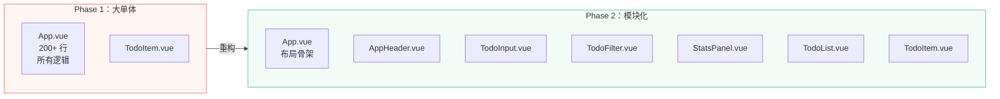
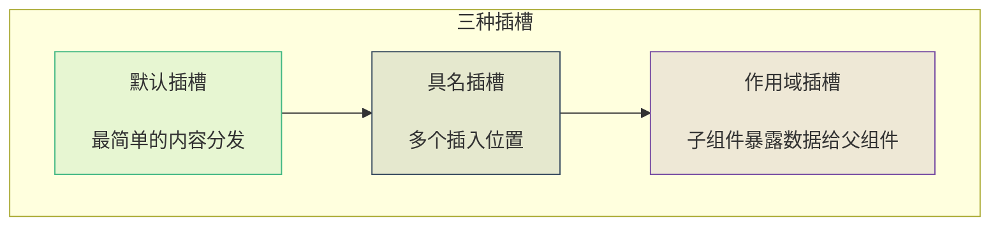
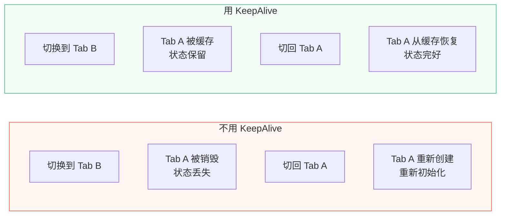

# L09 · 架构升级：从单文件到工程化

```
🎯 本节目标：将 Phase 1 的 Todo App 重构为多组件架构
📦 本节产出：按功能拆分的组件树 + 清晰目录结构 + Slots 插槽使用
🔗 前置钩子：Phase 1 完整 Todo App（L08 产出）
🔗 后续钩子：L10 将为拆分后的组件添加 Vue Router
```

---

## 1. 为什么要重构

Phase 1 的 App.vue 已经 200+ 行了——模板、逻辑、样式全混在一起。想象一下真实项目有几十个页面、上百个功能，单文件不可维护。



---

## 2. 目录结构设计

```
src/
├── assets/                   # 全局样式、图片
│   └── main.css
├── components/               # 通用可复用组件
│   ├── AppHeader.vue         # 应用头部
│   ├── BaseButton.vue        # 基础按钮（可复用）
│   └── BaseCard.vue          # 基础卡片容器
├── components/todo/          # Todo 功能模块的组件
│   ├── TodoInput.vue         # 输入框
│   ├── TodoItem.vue          # 单条 Todo
│   ├── TodoList.vue          # Todo 列表容器
│   ├── TodoFilter.vue        # 筛选栏
│   └── TodoStats.vue         # 统计面板
├── composables/              # Composable 函数
│   ├── useLocalStorage.ts
│   └── useTodos.ts
├── types/                    # TypeScript 类型定义
│   └── todo.ts
├── App.vue                   # 根组件（只负责布局）
└── main.ts                   # 入口
```

**组件拆分原则：**

| 原则 | 说明 | 示例 |
|------|------|------|
| 单一职责 | 一个组件只做一件事 | TodoInput 只管输入 |
| 容器 vs 展示 | 容器组件管数据，展示组件管渲染 | TodoList(容器) vs TodoItem(展示) |
| 可复用性 | 通用组件抽取到 `components/` | BaseButton、BaseCard |
| 模块内聚 | 功能相关的组件放同一目录 | `components/todo/` |

---

## 3. Slots 插槽：组件的"占位符"

### 3.1 默认插槽

```vue
<!-- BaseCard.vue -->
<template>
  <div class="card">
    <slot />  <!-- 占位符：父组件可以往这里插入内容 -->
  </div>
</template>

<style scoped>
.card {
  background: #fff;
  border-radius: 12px;
  border: 1px solid #e8e8e8;
  padding: 16px;
  margin-bottom: 16px;
}
</style>
```

```vue
<!-- 使用 -->
<BaseCard>
  <h2>统计数据</h2>
  <p>总共 10 个任务</p>
</BaseCard>
```

### 3.2 具名插槽

```vue
<!-- BaseCard.vue（带具名插槽） -->
<template>
  <div class="card">
    <div class="card-header" v-if="$slots.header">
      <slot name="header" />
    </div>
    <div class="card-body">
      <slot />  <!-- 默认插槽 -->
    </div>
    <div class="card-footer" v-if="$slots.footer">
      <slot name="footer" />
    </div>
  </div>
</template>
```

```vue
<!-- 使用 -->
<BaseCard>
  <template #header>
    <h2>📊 统计面板</h2>
  </template>

  <p>总共 10 个任务，完成 3 个</p>

  <template #footer>
    <button>清除已完成</button>
  </template>
</BaseCard>
```

### 3.3 作用域插槽

```vue
<!-- TodoList.vue -->
<script setup lang="ts">
import type { Todo } from '@/types/todo'

defineProps<{
  todos: Todo[]
}>()
</script>

<template>
  <div class="todo-list">
    <div v-for="todo in todos" :key="todo.id">
      <!-- 作用域插槽：把 todo 数据暴露给父组件 -->
      <slot name="item" :todo="todo" :index="index" />
    </div>
  </div>
</template>
```

```vue
<!-- 使用：父组件决定每一项怎么渲染 -->
<TodoList :todos="filteredTodos">
  <template #item="{ todo }">
    <TodoItem v-bind="todo" @toggle="toggleTodo" @delete="deleteTodo" />
  </template>
</TodoList>
```



---

## 4. 拆分实战

### 4.1 TodoInput.vue

```vue
<!-- src/components/todo/TodoInput.vue -->
<script setup lang="ts">
import { ref } from 'vue'

const emit = defineEmits<{
  add: [text: string]
}>()

const newText = ref('')

function handleAdd() {
  const text = newText.value.trim()
  if (!text) return
  emit('add', text)
  newText.value = ''
}
</script>

<template>
  <div class="todo-input-wrapper">
    <input
      v-model.trim="newText"
      @keyup.enter="handleAdd"
      placeholder="添加新任务..."
      class="todo-input"
    />
    <button @click="handleAdd" class="add-btn" :disabled="!newText.trim()">
      添加
    </button>
  </div>
</template>

<style scoped>
.todo-input-wrapper {
  display: flex;
  gap: 8px;
  margin-bottom: 1.5rem;
}

.todo-input {
  flex: 1;
  padding: 10px 16px;
  border: 2px solid #e8e8e8;
  border-radius: 8px;
  font-size: 1rem;
  outline: none;
  transition: border-color 0.2s;
}

.todo-input:focus {
  border-color: #42b883;
}

.add-btn {
  padding: 10px 20px;
  background: #42b883;
  color: #fff;
  border: none;
  border-radius: 8px;
  font-size: 1rem;
  cursor: pointer;
  transition: all 0.2s;
}

.add-btn:hover:not(:disabled) {
  background: #38a575;
}

.add-btn:disabled {
  opacity: 0.5;
  cursor: not-allowed;
}
</style>
```

### 4.2 TodoFilter.vue

```vue
<!-- src/components/todo/TodoFilter.vue -->
<script setup lang="ts">
export type FilterType = 'all' | 'active' | 'done'

const filter = defineModel<FilterType>({ default: 'all' })

defineProps<{
  totalCount: number
  activeCount: number
  doneCount: number
}>()

const emit = defineEmits<{
  clearDone: []
}>()

const filterOptions: { value: FilterType; label: string }[] = [
  { value: 'all', label: '全部' },
  { value: 'active', label: '进行中' },
  { value: 'done', label: '已完成' },
]
</script>

<template>
  <div class="filter-bar">
    <div class="filter-buttons">
      <button
        v-for="opt in filterOptions"
        :key="opt.value"
        :class="['filter-btn', { active: filter === opt.value }]"
        @click="filter = opt.value"
      >
        {{ opt.label }}
        <span class="count">
          {{ opt.value === 'all' ? totalCount : opt.value === 'active' ? activeCount : doneCount }}
        </span>
      </button>
    </div>

    <button v-if="doneCount > 0" @click="emit('clearDone')" class="clear-btn">
      清除已完成
    </button>
  </div>
</template>

<style scoped>
.filter-bar {
  display: flex;
  justify-content: space-between;
  align-items: center;
  margin-bottom: 1rem;
}

.filter-buttons {
  display: flex;
  gap: 4px;
  background: #f0f0f0;
  border-radius: 8px;
  padding: 3px;
}

.filter-btn {
  padding: 6px 14px;
  border: none;
  border-radius: 6px;
  background: transparent;
  cursor: pointer;
  font-size: 0.85rem;
  color: #666;
  transition: all 0.2s;
}

.filter-btn.active {
  background: #fff;
  color: #42b883;
  font-weight: 600;
  box-shadow: 0 1px 3px rgba(0, 0, 0, 0.1);
}

.count {
  margin-left: 4px;
  font-size: 0.75rem;
  opacity: 0.7;
}

.clear-btn {
  padding: 6px 12px;
  border: 1px solid #ff6b6b;
  border-radius: 6px;
  background: transparent;
  color: #ff6b6b;
  cursor: pointer;
  font-size: 0.8rem;
  transition: all 0.2s;
}

.clear-btn:hover {
  background: #ff6b6b;
  color: #fff;
}
</style>
```

### 4.3 TodoStats.vue

```vue
<!-- src/components/todo/TodoStats.vue -->
<script setup lang="ts">
defineProps<{
  total: number
  doneCount: number
  activeCount: number
  donePercent: number
}>()
</script>

<template>
  <div class="stats-panel">
    <div class="stat">
      <span class="stat-value">{{ total }}</span>
      <span class="stat-label">总计</span>
    </div>
    <div class="stat">
      <span class="stat-value">{{ activeCount }}</span>
      <span class="stat-label">进行中</span>
    </div>
    <div class="stat">
      <span class="stat-value">{{ doneCount }}</span>
      <span class="stat-label">已完成</span>
    </div>
    <div class="stat">
      <div class="progress-bar">
        <div class="progress-fill" :style="{ width: donePercent + '%' }"></div>
      </div>
      <span class="stat-label">{{ donePercent }}%</span>
    </div>
  </div>
</template>

<style scoped>
.stats-panel {
  display: flex;
  gap: 16px;
  padding: 16px;
  background: #f8f9fa;
  border-radius: 10px;
  margin-bottom: 1rem;
}

.stat {
  flex: 1;
  display: flex;
  flex-direction: column;
  align-items: center;
  gap: 4px;
}

.stat-value {
  font-size: 1.5rem;
  font-weight: 700;
  color: #2c3e50;
}

.stat-label {
  font-size: 0.75rem;
  color: #999;
}

.progress-bar {
  width: 100%;
  height: 6px;
  background: #e0e0e0;
  border-radius: 3px;
  overflow: hidden;
  margin-top: 8px;
}

.progress-fill {
  height: 100%;
  background: #42b883;
  border-radius: 3px;
  transition: width 0.3s ease;
}
</style>
```

### 4.4 重构后的 App.vue

```vue
<!-- src/App.vue -->
<script setup lang="ts">
import AppHeader from './components/AppHeader.vue'
import TodoInput from './components/todo/TodoInput.vue'
import TodoFilter from './components/todo/TodoFilter.vue'
import TodoStats from './components/todo/TodoStats.vue'
import TodoItem from './components/todo/TodoItem.vue'
import { useTodos } from './composables/useTodos'

const {
  filteredTodos, filter, stats,
  addTodo, toggleTodo, deleteTodo, updateTodo, clearDone,
} = useTodos()
</script>

<template>
  <div class="app">
    <AppHeader title="📝 Vue Todo" />

    <TodoInput @add="addTodo" />
    <TodoStats v-bind="stats" />
    <TodoFilter
      v-model="filter"
      :total-count="stats.total"
      :active-count="stats.activeCount"
      :done-count="stats.doneCount"
      @clear-done="clearDone"
    />

    <main>
      <p v-if="filteredTodos.length === 0" class="empty">📭 没有匹配的任务</p>

      <TransitionGroup name="list" tag="div">
        <TodoItem
          v-for="todo in filteredTodos"
          :key="todo.id"
          v-bind="todo"
          @toggle="toggleTodo"
          @delete="deleteTodo"
          @update="updateTodo"
        />
      </TransitionGroup>
    </main>
  </div>
</template>

<style scoped>
.app {
  max-width: 640px;
  margin: 0 auto;
  padding: 2rem;
}

.empty {
  text-align: center;
  padding: 3rem;
  color: #999;
  background: #f8f9fa;
  border-radius: 12px;
}
</style>
```

**App.vue 从 200+ 行 → ~50 行，只负责组装子组件。**

---

## 5. KeepAlive：缓存组件状态

```vue
<template>
  <!-- KeepAlive 让被切换的组件保留在内存中，不被销毁 -->
  <KeepAlive>
    <component :is="currentView" />
  </KeepAlive>
</template>
```

**使用场景：** Tab 切换时保留表单填写内容、保留滚动位置等。L10 配合 Router 使用时会很有用。



---

## 6. 本节总结

### 检查清单

- [ ] 能将大组件拆分为多个小组件
- [ ] 能设计合理的项目目录结构
- [ ] 能使用默认插槽、具名插槽和作用域插槽
- [ ] 能区分容器组件和展示组件
- [ ] 知道 `$slots` 可以检测插槽是否被使用
- [ ] 理解 `<KeepAlive>` 的缓存作用

### 🐞 防坑指南

| 坑 | 说明 | 正确做法 |
|----|------|-------|
| 组件拆太细 | 一个按钮一个组件 → 文件爆炸 | 只在有复用需要或逻辑复杂时才拆 |
| 通用组件放业务目录 | `BaseButton` 放在 `todo/` 下 | 通用组件放 `components/`，业务组件放 `components/[feature]/` |
| KeepAlive 缓存太多 | 所有页面都缓存 → 内存占用大 | 用 `include`/`exclude`/`max` 控制缓存范围 |
| slot 拼写错误 | `<template #headr>` 静默失败 | 开 ESLint 插件检查 slot 名 |

### 📐 最佳实践

1. **拆分原则**：能用 3 句话解释一个组件的职责，否则太大了
2. **Base 组件前缀**：通用 UI 组件用 `Base` 前缀（`BaseButton`/`BaseCard`），业务组件不加
3. **composable 抽取**：数据逻辑抽到 `composables/`，组件只管渲染
4. **目录即模块**：`components/todo/` 内的组件只服务 Todo 功能，不跨模块引用

### Git 提交

```bash
git add .
git commit -m "L09: 组件拆分重构 + Slots 插槽"
```

---

## 🔗 钩子连接

### → 下一节：L10 · Vue Router

组件拆分完了，但目前所有内容还在**同一个页面**。L10 将引入 Vue Router 实现：
- 任务列表页 `/`
- 任务详情页 `/tasks/:id`
- 统计页 `/stats`
- 设置页 `/settings`
