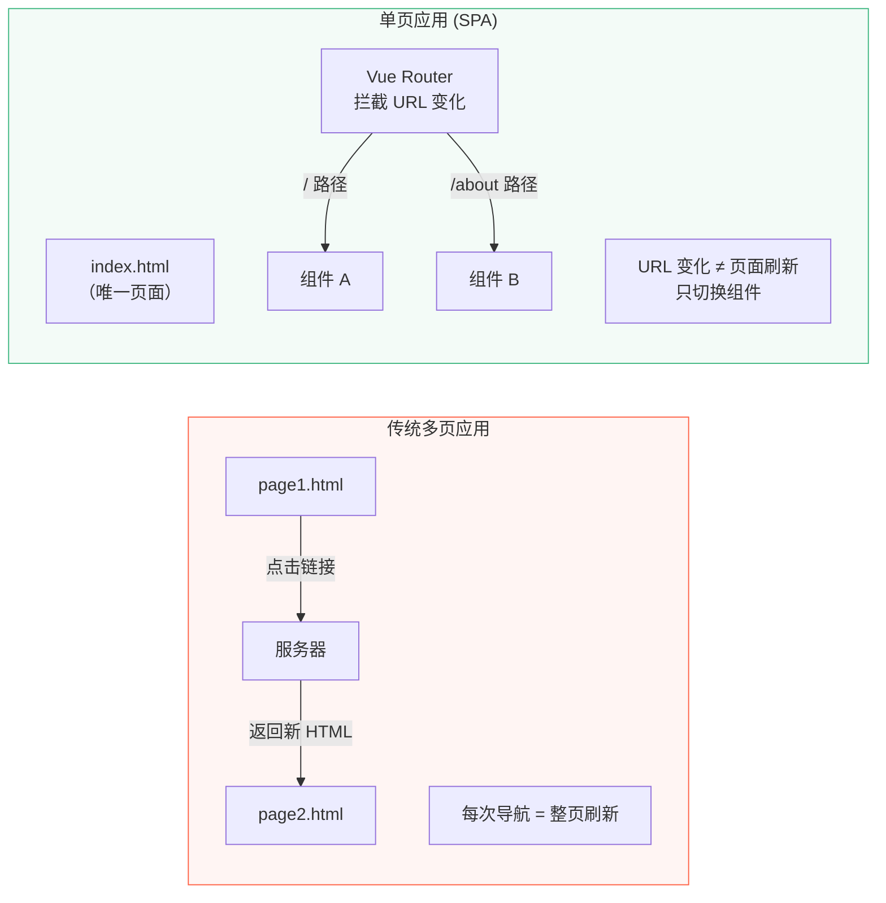
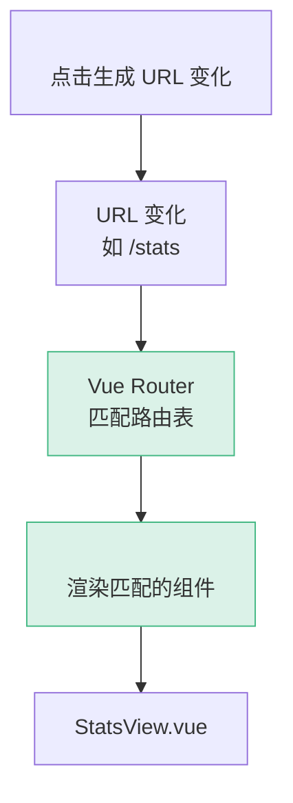
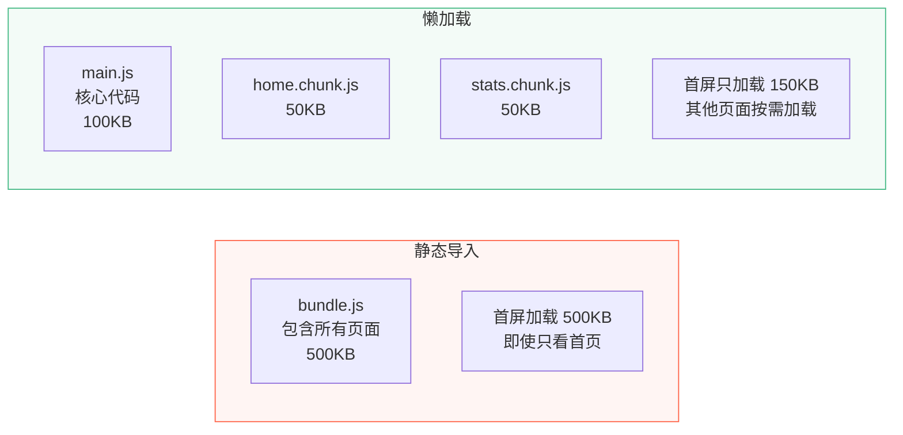
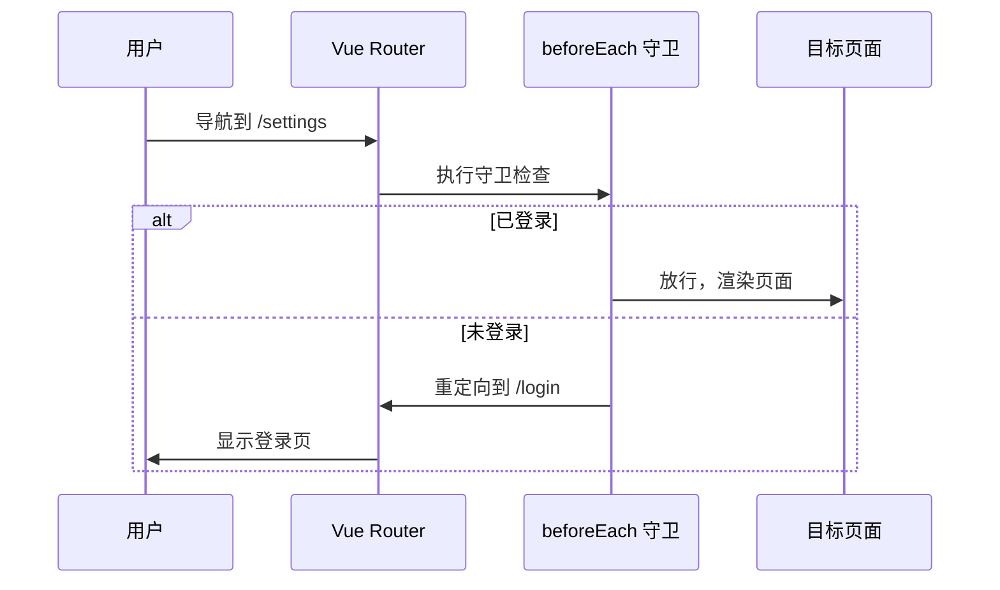
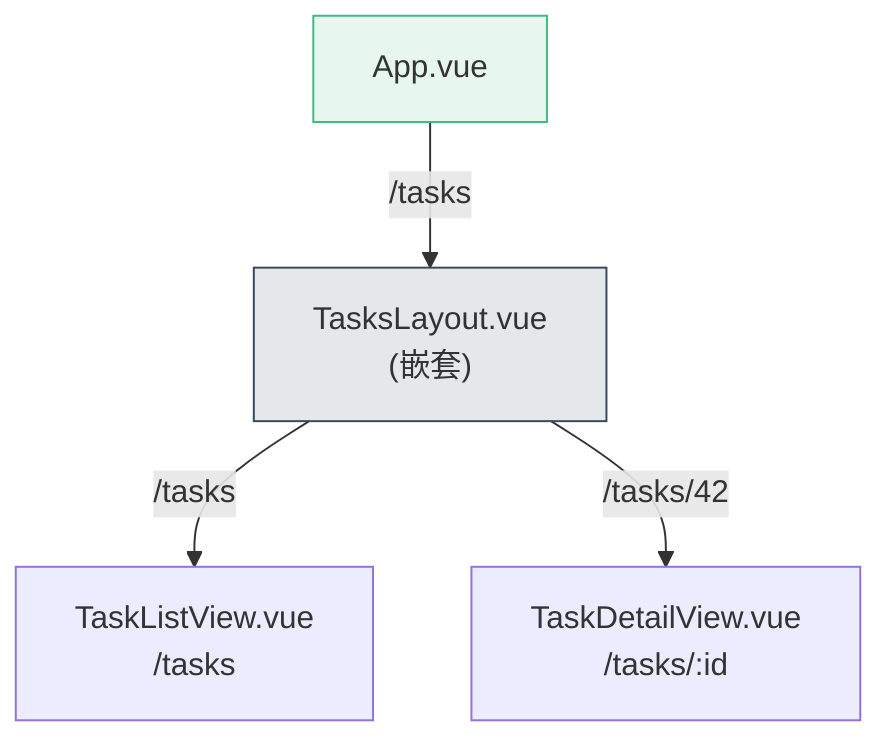

# L10 · Vue Router：从单页到多页

```
🎯 本节目标：集成 Vue Router 4，实现多视图 SPA + 路由守卫
📦 本节产出：支持 任务看板 / 任务详情 / 统计 / 设置 四个页面的 SPA
🔗 前置钩子：L09 拆分后的组件架构
🔗 后续钩子：L11 将引入 Pinia 管理跨路由的共享状态
```

---

## 1. SPA 与路由的概念



---

## 2. 安装和基础配置

```bash
npm install vue-router@4
```

### 2.1 创建路由配置

```typescript
// src/router/index.ts
import { createRouter, createWebHistory } from 'vue-router'

const router = createRouter({
  history: createWebHistory(import.meta.env.BASE_URL),
  routes: [
    {
      path: '/',
      name: 'home',
      component: () => import('@/views/HomeView.vue'),  // 路由懒加载
    },
    {
      path: '/tasks/:id',
      name: 'task-detail',
      component: () => import('@/views/TaskDetailView.vue'),
      props: true,  // 将路由参数作为 Props 传入组件
    },
    {
      path: '/stats',
      name: 'stats',
      component: () => import('@/views/StatsView.vue'),
    },
    {
      path: '/settings',
      name: 'settings',
      component: () => import('@/views/SettingsView.vue'),
    },
    {
      // 404 页面
      path: '/:pathMatch(.*)*',
      name: 'not-found',
      component: () => import('@/views/NotFoundView.vue'),
    },
  ],
})

export default router
```

### 2.2 注册路由

```typescript
// src/main.ts
import { createApp } from 'vue'
import App from './App.vue'
import router from './router'

import './assets/main.css'

createApp(App)
  .use(router)  // 安装路由插件
  .mount('#app')
```

### 2.3 使用 RouterView 和 RouterLink

```vue
<!-- src/App.vue -->
<script setup lang="ts">
import { RouterView, RouterLink } from 'vue-router'
</script>

<template>
  <div class="app">
    <nav class="app-nav">
      <RouterLink to="/" class="nav-link">📋 任务</RouterLink>
      <RouterLink to="/stats" class="nav-link">📊 统计</RouterLink>
      <RouterLink to="/settings" class="nav-link">⚙️ 设置</RouterLink>
    </nav>

    <!-- 路由出口：匹配的组件渲染在这里 -->
    <main class="app-main">
      <RouterView />
    </main>
  </div>
</template>
```



---

## 3. 路由懒加载

```typescript
// ❌ 静态导入：所有页面打包到一个 bundle，首屏加载慢
import HomeView from '@/views/HomeView.vue'
import StatsView from '@/views/StatsView.vue'

// ✅ 动态导入：每个页面单独打包，按需加载
component: () => import('@/views/HomeView.vue')
```



---

## 4. 动态路由与参数

### 4.1 路由参数

```typescript
// 路由配置
{ path: '/tasks/:id', component: TaskDetailView, props: true }
```

```vue
<!-- TaskDetailView.vue -->
<script setup lang="ts">
// 方式 1：通过 Props 接收（推荐，需要路由配置 props: true）
const props = defineProps<{ id: string }>()

// 方式 2：通过 useRoute 获取
import { useRoute } from 'vue-router'
const route = useRoute()
console.log(route.params.id)  // 等同于 props.id
</script>
```

### 4.2 编程式导航

```typescript
import { useRouter } from 'vue-router'

const router = useRouter()

// 跳转到指定路由
router.push('/stats')
router.push({ name: 'task-detail', params: { id: '42' } })

// 替换当前记录（不产生历史记录）
router.replace('/settings')

// 后退
router.back()
```

---

## 5. 路由守卫

### 5.1 全局前置守卫

```typescript
// src/router/index.ts
router.beforeEach((to, from) => {
  // 模拟鉴权
  const isLoggedIn = !!localStorage.getItem('user-token')

  if (to.name !== 'login' && !isLoggedIn) {
    // 未登录，重定向到登录页
    return { name: 'login' }
  }
})
```



### 5.2 路由元信息

```typescript
// 在路由配置中添加 meta
{
  path: '/settings',
  name: 'settings',
  component: () => import('@/views/SettingsView.vue'),
  meta: {
    requiresAuth: true,   // 需要登录
    title: '设置',         // 页面标题
  },
}

// 在守卫中使用 meta
router.beforeEach((to) => {
  // 更新页面标题
  document.title = (to.meta.title as string) || 'Vue Todo'

  // 检查是否需要登录
  if (to.meta.requiresAuth && !isLoggedIn()) {
    return { name: 'login' }
  }
})
```

---

## 6. 嵌套路由

```typescript
{
  path: '/tasks',
  component: () => import('@/views/TasksLayout.vue'),
  children: [
    {
      path: '',           // /tasks
      name: 'task-list',
      component: () => import('@/views/TaskListView.vue'),
    },
    {
      path: ':id',        // /tasks/42
      name: 'task-detail',
      component: () => import('@/views/TaskDetailView.vue'),
      props: true,
    },
  ],
}
```

```vue
<!-- TasksLayout.vue -->
<template>
  <div class="tasks-layout">
    <aside class="sidebar">
      <!-- 侧边栏导航 -->
    </aside>
    <div class="content">
      <RouterView />  <!-- 子路由渲染在这里 -->
    </div>
  </div>
</template>
```



---

## 7. RouterLink 的激活状态

```vue
<template>
  <!-- RouterLink 自动给匹配的链接添加 class -->
  <RouterLink to="/" class="nav-link">
    <!-- 精确匹配：router-link-exact-active -->
    <!-- 包含匹配：router-link-active -->
    首页
  </RouterLink>
</template>

<style>
/* 自定义激活样式 */
.nav-link.router-link-exact-active {
  color: #42b883;
  font-weight: bold;
}
</style>
```

---

## 8. 本节总结

### 检查清单

- [ ] 能安装和配置 Vue Router 4
- [ ] 能使用 `<RouterView>` 和 `<RouterLink>`
- [ ] 能实现路由懒加载
- [ ] 能使用动态路由参数 `:id`
- [ ] 能用 `useRouter()` 实现编程式导航
- [ ] 能配置路由守卫 `beforeEach`
- [ ] 能使用嵌套路由和路由元信息

### 🐞 防坑指南

| 坑 | 说明 | 正确做法 |
|----|------|---------|
| 忘记 `createWebHistory` 的 base | 部署到子路径时 404 | `createWebHistory(import.meta.env.BASE_URL)` |
| 守卫里死循环 | `beforeEach` 中 `next('/login')` 无限跳转 | 加条件判断 `if (to.path !== '/login')` |
| 路由懒加载用错语法 | `import(Component)` 不返回 Promise | `() => import('./views/Foo.vue')` |
| 动态路由参数变了组件不刷新 | `/user/1` → `/user/2` 复用同一组件 | 用 `watch(() => route.params.id)` 或 `:key="route.params.id"` |

### 📐 最佳实践

1. **页面放 `views/`，组件放 `components/`**：路由挂载的顶层组件放 views 目录
2. **路由懒加载**：除首页外的路由全部用 `() => import()` 按需加载
3. **路由命名**：用 `name` 属性而非硬编码路径（`{ name: 'TaskDetail', params: { id } }`）
4. **滚动行为**：配置 `scrollBehavior` 返回 `{ top: 0 }`，切页自动回顶

### Git 提交

```bash
git add .
git commit -m "L10: Vue Router 多页面 + 路由守卫"
```

---

## 🔗 钩子连接

### → 下一节：L11 · Pinia 全局状态管理

多页面后出现新问题：**不同路由页面需要共享同一份 todos 数据。** 目前的 composable 在每个组件实例中创建独立副本，L11 将引入 Pinia 实现真正的全局状态共享。
