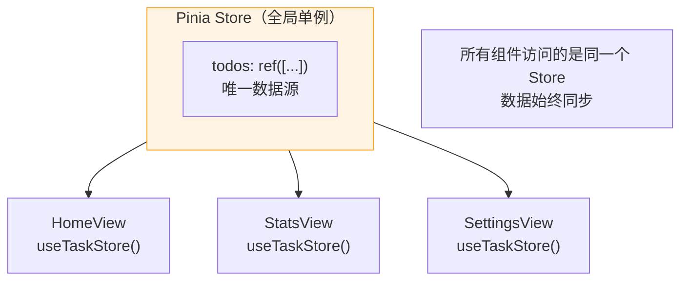
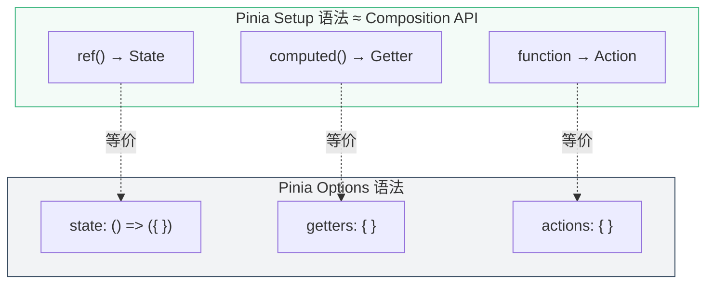
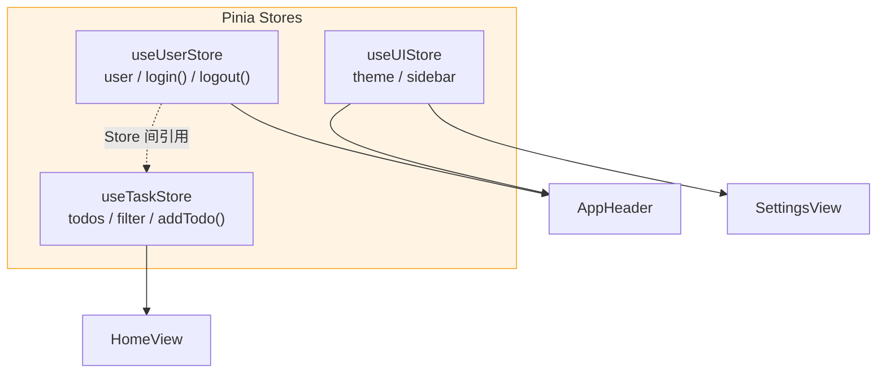

# L11 · Pinia：全局状态管理

```
🎯 本节目标：用 Pinia 替代 composable 实现真正的全局状态共享
📦 本节产出：完整的 Pinia store 架构 + 持久化插件 + 多 store 组合
🔗 前置钩子：L10 的多路由架构（跨路由共享数据的需求）
🔗 后续钩子：L12 将在 store 基础上实现标签分类系统
```

---

## 1. 为什么需要 Pinia

### 1.1 Composable 的局限

```typescript
// useTodos() 在不同组件中调用 → 创建不同的 ref 实例
// HomeView.vue
const { todos } = useTodos()  // ref 实例 A

// StatsView.vue
const { todos } = useTodos()  // ref 实例 B ← 不是同一个！
```

除非 composable 内部使用模块级变量（单例模式），否则每次调用都创建**独立的状态**。

### 1.2 Pinia 解决什么



---

## 2. 安装和创建 Store

```bash
npm install pinia
```

### 2.1 注册 Pinia

```typescript
// src/main.ts
import { createApp } from 'vue'
import { createPinia } from 'pinia'
import App from './App.vue'
import router from './router'

const app = createApp(App)
app.use(createPinia())  // 安装 Pinia
app.use(router)
app.mount('#app')
```

### 2.2 创建 Task Store（Setup 语法）

```typescript
// src/stores/taskStore.ts
import { ref, computed } from 'vue'
import { defineStore } from 'pinia'
import type { Todo } from '@/types/todo'

// Setup 语法：像写 Composition API 一样写 Store
export const useTaskStore = defineStore('tasks', () => {
  // State → ref()
  const todos = ref<Todo[]>([
    { id: 1, text: '搭建项目脚手架', done: true, priority: 'low', createdAt: '2024-01-01' },
    { id: 2, text: '学习 Vue 3', done: false, priority: 'high', createdAt: '2024-01-02' },
  ])

  const filter = ref<'all' | 'active' | 'done'>('all')

  // Getters → computed()
  const filteredTodos = computed(() => {
    switch (filter.value) {
      case 'active': return todos.value.filter(t => !t.done)
      case 'done': return todos.value.filter(t => t.done)
      default: return todos.value
    }
  })

  const stats = computed(() => {
    const total = todos.value.length
    const doneCount = todos.value.filter(t => t.done).length
    return {
      total,
      doneCount,
      activeCount: total - doneCount,
      donePercent: total > 0 ? Math.round((doneCount / total) * 100) : 0,
    }
  })

  // Actions → 普通函数
  function addTodo(text: string) {
    todos.value.push({
      id: Date.now(), text, done: false,
      priority: 'medium',
      createdAt: new Date().toISOString().split('T')[0],
    })
  }

  function toggleTodo(id: number) {
    const todo = todos.value.find(t => t.id === id)
    if (todo) todo.done = !todo.done
  }

  function deleteTodo(id: number) {
    todos.value = todos.value.filter(t => t.id !== id)
  }

  function updateTodo(id: number, text: string) {
    const todo = todos.value.find(t => t.id === id)
    if (todo) todo.text = text
  }

  function clearDone() {
    todos.value = todos.value.filter(t => !t.done)
  }

  return {
    todos, filter, filteredTodos, stats,
    addTodo, toggleTodo, deleteTodo, updateTodo, clearDone,
  }
})
```

> **为什么选 Setup 语法而不是 Options 语法？** 因为它和 Composition API 完全一致——`ref` 是 State，`computed` 是 Getter，函数是 Action。无需学习新概念。



---

## 3. 在组件中使用 Store

```vue
<!-- src/views/HomeView.vue -->
<script setup lang="ts">
import { ref } from 'vue'
import { useTaskStore } from '@/stores/taskStore'
import TodoItem from '@/components/todo/TodoItem.vue'
import TodoInput from '@/components/todo/TodoInput.vue'
import TodoFilter from '@/components/todo/TodoFilter.vue'
import TodoStats from '@/components/todo/TodoStats.vue'

// 获取 Store 实例
const taskStore = useTaskStore()
// 直接解构会丢失响应式 → 用 storeToRefs
import { storeToRefs } from 'pinia'
const { filteredTodos, filter, stats } = storeToRefs(taskStore)
// Action 可以直接解构（函数不需要响应式）
const { addTodo, toggleTodo, deleteTodo, updateTodo, clearDone } = taskStore
</script>

<template>
  <div>
    <TodoInput @add="addTodo" />
    <TodoStats v-bind="stats" />
    <TodoFilter v-model="filter" v-bind="stats" @clear-done="clearDone" />

    <TransitionGroup name="list" tag="div">
      <TodoItem
        v-for="todo in filteredTodos"
        :key="todo.id"
        v-bind="todo"
        @toggle="toggleTodo"
        @delete="deleteTodo"
        @update="updateTodo"
      />
    </TransitionGroup>
  </div>
</template>
```

### 3.1 storeToRefs：为什么需要

```typescript
// ❌ 直接解构 → 丢失响应式（和 reactive 一样的问题）
const { todos, filter } = taskStore  // todos 变成普通值

// ✅ storeToRefs → 保持响应式
const { todos, filter } = storeToRefs(taskStore)  // todos 仍然是 ref

// ✅ Actions 可以直接解构（函数不需要响应式）
const { addTodo, deleteTodo } = taskStore
```

---

## 4. 多 Store 组合

```typescript
// src/stores/userStore.ts
export const useUserStore = defineStore('user', () => {
  const user = ref<{ name: string; email: string } | null>(null)
  const isLoggedIn = computed(() => !!user.value)

  function login(name: string, email: string) {
    user.value = { name, email }
  }

  function logout() {
    user.value = null
  }

  return { user, isLoggedIn, login, logout }
})
```

```typescript
// src/stores/uiStore.ts
export const useUIStore = defineStore('ui', () => {
  const theme = ref<'light' | 'dark'>('light')
  const sidebarOpen = ref(true)

  function toggleTheme() {
    theme.value = theme.value === 'light' ? 'dark' : 'light'
  }

  function toggleSidebar() {
    sidebarOpen.value = !sidebarOpen.value
  }

  return { theme, sidebarOpen, toggleTheme, toggleSidebar }
})
```



**Store 间引用：**
```typescript
// taskStore 中引用 userStore
export const useTaskStore = defineStore('tasks', () => {
  const userStore = useUserStore()

  function addTodo(text: string) {
    if (!userStore.isLoggedIn) {
      throw new Error('请先登录')
    }
    // ...
  }
})
```

---

## 5. 持久化插件

```bash
npm install pinia-plugin-persistedstate
```

```typescript
// src/main.ts
import piniaPluginPersistedstate from 'pinia-plugin-persistedstate'

const pinia = createPinia()
pinia.use(piniaPluginPersistedstate)

app.use(pinia)
```

```typescript
// 在 Store 中启用持久化
export const useTaskStore = defineStore('tasks', () => {
  // ...状态和逻辑...
  return { todos, filter, /* ... */ }
}, {
  persist: true,  // 一行开启，自动同步到 localStorage
})
```

---

## 6. Pinia DevTools

在 Vue DevTools 的 Pinia 标签页中可以：
- 查看所有 Store 的当前状态
- **时间旅行**：回退到之前的状态
- 直接编辑 Store 数据
- 追踪 Action 调用记录

---

## 7. 本节总结


### 🔬 深度专题

> 📖 [D08 · Pinia vs Vuex 4 设计决策](/lessons/deep-dives/D08-pinia-vs-vuex) — 为什么 Pinia 成为官方推荐？

### 检查清单

- [ ] 能安装和配置 Pinia
- [ ] 能用 Setup 语法创建 Store
- [ ] 知道 `storeToRefs` 的必要性
- [ ] 能在组件中使用 Store 的 State / Getter / Action
- [ ] 能实现多 Store 组合
- [ ] 能配置 `pinia-plugin-persistedstate` 持久化

### 课后练习

**练习 1：跟做（15 min）**
完整实现 taskStore + 在 HomeView 中使用 storeToRefs 解构 + 渲染 filteredTodos。

**练习 2：举一反三（20 min）**
在 taskStore 中增加 `sortBy` state（`'date'` | `'priority'` | `'name'`），增加对应的 `sortedTodos` computed，让 `filteredTodos` 在筛选之后再排序。

**挑战题（30 min）**
实现一个简单的 undo 功能：在 taskStore 中维护一个 `history: Todo[][]` 数组，每次修改前把当前 `todos` 快照 push 进 history。实现 `undo()` action，从 history 中恢复上一个状态。

### 🐞 防坑指南

| 坑 | 说明 | 正确做法 |
|----|------|---------|
| 直接解构 store | `const { count } = store` 丢失响应式 | `const { count } = storeToRefs(store)` |
| 组件外使用 store | 在 `.ts` 文件中顶层调用 `useStore()` | 必须在 `setup()` 内或 Pinia 已安装后调用 |
| store 当全局变量用 | 什么数据都塞进 store | 只有**跨组件共享**的数据才放 store |
| 忘记 action 直接改 state | `store.count++` 跳过了 action | 通过 action 修改，方便调试追踪 |

### 📐 最佳实践

1. **store 命名**：`useXxxStore` 配合 `id: 'xxx'`，保持一致
2. **getter 代替组件 computed**：能在 store 的 getter 做的计算不要在组件里重复
3. **action 职责**：action 负责业务逻辑（校验 + 修改），组件只调用 action
4. **持久化选择性**：只持久化需要的 key（`persist: { pick: ['todos'] }`），不要全量序列化

### Git 提交

```bash
git add .
git commit -m "L11: Pinia 全局状态管理 + 持久化"
```

---

## 🔗 钩子连接

### → 下一节：L12 · 任务分类与标签系统

L12 将在 Pinia Store 基础上为任务添加分类、优先级筛选和标签管理。
