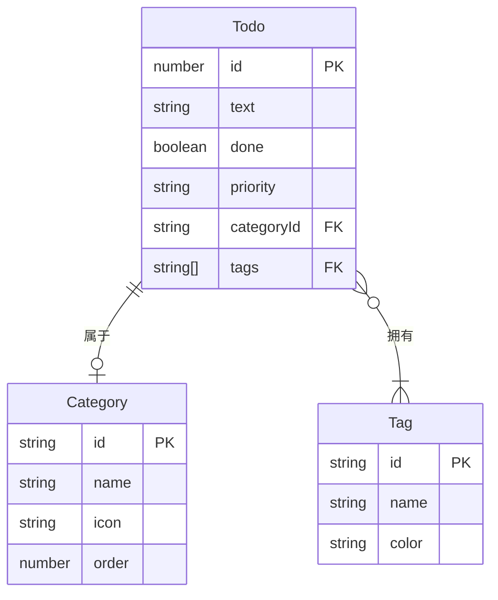
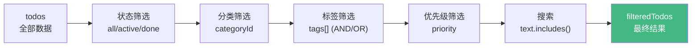
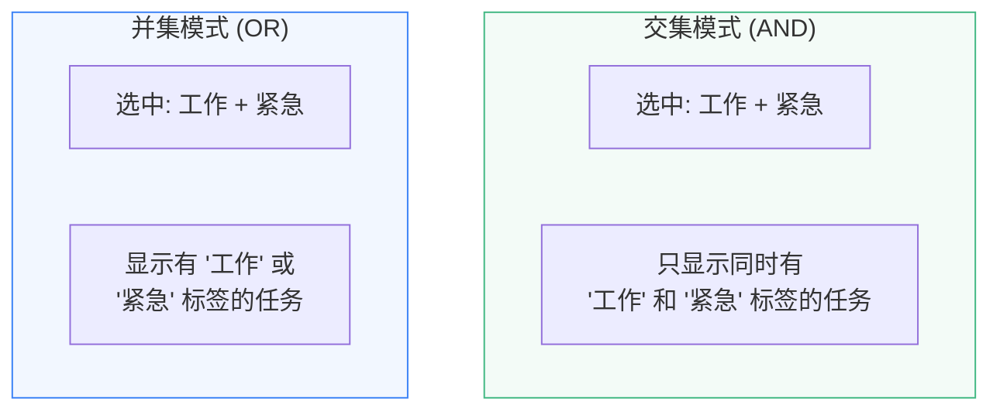
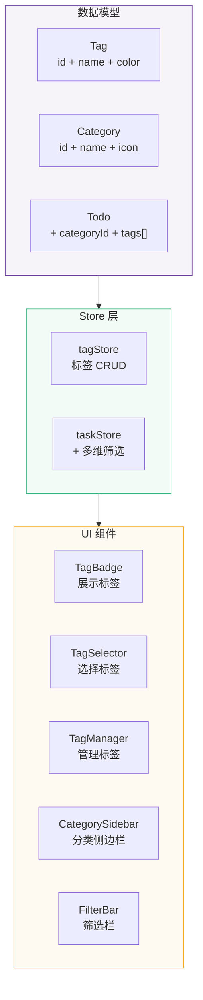

# L12 · 任务分类与标签系统

```
🎯 本节目标：为任务添加分类、优先级和标签管理，实现多维度组合筛选
📦 本节产出：支持多维度筛选和标签 CRUD 的任务系统
🔗 前置钩子：L11 的 Pinia Store（tagStore 遵循相同模式）
🔗 后续钩子：L13 将在分类基础上添加拖拽排序（看板列 = 分类）
```

> [!TIP]
> **本节较长（9 个章节），推荐学习路径：**
> - **必学：** §1 数据模型扩展、§2 Tag Store、§3 多维度筛选
> - **建议了解：** §4 TagBadge 组件、§5 TagSelector 组件
> - **可跳过（当 UI 参考用）：** §6 标签管理面板、§7 分类侧边栏、§8 筛选栏 UI（完整样式代码，按需查阅）

---

## 1. 扩展数据模型

### 1.1 升级类型定义

```typescript
// src/types/todo.ts
export interface Tag {
  id: string
  name: string
  color: string  // 如 '#42b883'
}

export interface Category {
  id: string
  name: string
  icon: string   // emoji
  order: number  // 排序
}

export interface Todo {
  id: number
  text: string
  done: boolean
  priority: 'low' | 'medium' | 'high'
  createdAt: string
  categoryId?: string    // 所属分类（一个任务只属于一个分类）
  tags: string[]         // 标签 ID 数组（一个任务可以有多个标签）
  dueDate?: string       // 截止日期
}
```



**设计决策：**
- Category 是**一对多**：一个任务只能属于一个分类（收件箱/项目/将来也许）
- Tag 是**多对多**：一个任务可以有多个标签，一个标签可以被多个任务使用

---

## 2. Tag Store

```typescript
// src/stores/tagStore.ts
import { ref, computed } from 'vue'
import { defineStore } from 'pinia'
import type { Tag, Category } from '@/types/todo'

export const useTagStore = defineStore('tags', () => {
  // ─── 标签 ───
  const tags = ref<Tag[]>([
    { id: 'work', name: '工作', color: '#3b82f6' },
    { id: 'study', name: '学习', color: '#42b883' },
    { id: 'life', name: '生活', color: '#f59e0b' },
    { id: 'urgent', name: '紧急', color: '#ef4444' },
  ])

  function addTag(name: string, color: string) {
    const id = `tag-${Date.now()}`
    tags.value.push({ id, name, color })
    return id
  }

  function updateTag(id: string, updates: Partial<Omit<Tag, 'id'>>) {
    const tag = tags.value.find(t => t.id === id)
    if (tag) {
      if (updates.name) tag.name = updates.name
      if (updates.color) tag.color = updates.color
    }
  }

  function removeTag(id: string) {
    tags.value = tags.value.filter(t => t.id !== id)
    // 注意：还需要从所有 todo 中移除该 tag
    // 这会在 taskStore 中通过 watch 或 action 完成
  }

  function getTagById(id: string) {
    return tags.value.find(t => t.id === id)
  }

  // ─── 分类 ───
  const categories = ref<Category[]>([
    { id: 'inbox', name: '收件箱', icon: '📥', order: 0 },
    { id: 'project', name: '项目', icon: '📁', order: 1 },
    { id: 'someday', name: '将来/也许', icon: '💭', order: 2 },
  ])

  function addCategory(name: string, icon: string) {
    const id = `cat-${Date.now()}`
    categories.value.push({
      id, name, icon,
      order: categories.value.length,
    })
    return id
  }

  function removeCategory(id: string) {
    categories.value = categories.value.filter(c => c.id !== id)
  }

  const sortedCategories = computed(() =>
    [...categories.value].sort((a, b) => a.order - b.order)
  )

  return {
    tags, addTag, updateTag, removeTag, getTagById,
    categories: sortedCategories, addCategory, removeCategory,
  }
}, { persist: true })
```

---

## 3. 多维度筛选

### 3.1 筛选状态

```typescript
// 在 taskStore 中扩展筛选逻辑
const selectedCategory = ref<string | null>(null)
const selectedTags = ref<string[]>([])
const selectedPriority = ref<'all' | 'low' | 'medium' | 'high'>('all')
const searchQuery = ref('')
const tagFilterMode = ref<'and' | 'or'>('and')  // 标签交集/并集
```

### 3.2 组合筛选 computed

```typescript
const filteredTodos = computed(() => {
  let result = todos.value

  // 1. 按完成状态
  if (filter.value === 'active') result = result.filter(t => !t.done)
  if (filter.value === 'done') result = result.filter(t => t.done)

  // 2. 按分类
  if (selectedCategory.value) {
    result = result.filter(t => t.categoryId === selectedCategory.value)
  }

  // 3. 按标签（支持交集和并集）
  if (selectedTags.value.length > 0) {
    if (tagFilterMode.value === 'and') {
      // 交集：选中的标签都要包含
      result = result.filter(t =>
        selectedTags.value.every(tag => t.tags.includes(tag))
      )
    } else {
      // 并集：包含任意一个选中标签即可
      result = result.filter(t =>
        selectedTags.value.some(tag => t.tags.includes(tag))
      )
    }
  }

  // 4. 按优先级
  if (selectedPriority.value !== 'all') {
    result = result.filter(t => t.priority === selectedPriority.value)
  }

  // 5. 按搜索关键词
  if (searchQuery.value) {
    const q = searchQuery.value.toLowerCase()
    result = result.filter(t => t.text.toLowerCase().includes(q))
  }

  return result
})
```



### 3.3 交集 vs 并集



---

## 4. TagBadge 组件

```vue
<!-- src/components/ui/TagBadge.vue -->
<script setup lang="ts">
defineProps<{
  name: string
  color: string
  removable?: boolean
  selected?: boolean
  size?: 'sm' | 'md'
}>()

defineEmits<{
  remove: []
  click: []
}>()
</script>

<template>
  <span
    class="tag-badge"
    :class="[size ?? 'md', { selected }]"
    :style="{
      '--tag-color': color,
      backgroundColor: selected ? color + '30' : color + '15',
      color: color,
      borderColor: selected ? color : color + '40',
    }"
    @click="$emit('click')"
  >
    {{ name }}
    <button
      v-if="removable"
      @click.stop="$emit('remove')"
      class="remove-btn"
      aria-label="移除标签"
    >
      ×
    </button>
  </span>
</template>

<style scoped>
.tag-badge {
  display: inline-flex;
  align-items: center;
  gap: 4px;
  border-radius: 12px;
  font-weight: 500;
  border: 1px solid;
  cursor: default;
  transition: all 0.15s;
  user-select: none;
}

.tag-badge.md {
  padding: 3px 12px;
  font-size: 0.8rem;
}

.tag-badge.sm {
  padding: 1px 8px;
  font-size: 0.7rem;
}

.tag-badge.selected {
  font-weight: 600;
  box-shadow: 0 0 0 1px var(--tag-color);
}

.remove-btn {
  background: none;
  border: none;
  font-size: 0.9rem;
  cursor: pointer;
  padding: 0 2px;
  opacity: 0.5;
  color: inherit;
  line-height: 1;
}

.remove-btn:hover {
  opacity: 1;
}
</style>
```

---

## 5. TagSelector 组件

```vue
<!-- src/components/todo/TagSelector.vue -->
<script setup lang="ts">
import { useTagStore } from '@/stores/tagStore'
import TagBadge from '@/components/ui/TagBadge.vue'

const tagStore = useTagStore()
const selectedTags = defineModel<string[]>({ default: () => [] })

function toggleTag(tagId: string) {
  const index = selectedTags.value.indexOf(tagId)
  if (index > -1) {
    selectedTags.value.splice(index, 1)
  } else {
    selectedTags.value.push(tagId)
  }
}

function isSelected(tagId: string) {
  return selectedTags.value.includes(tagId)
}
</script>

<template>
  <div class="tag-selector">
    <label class="selector-label">标签</label>
    <div class="tag-list">
      <TagBadge
        v-for="tag in tagStore.tags"
        :key="tag.id"
        :name="tag.name"
        :color="tag.color"
        :selected="isSelected(tag.id)"
        style="cursor: pointer"
        @click="toggleTag(tag.id)"
      />
    </div>
  </div>
</template>

<style scoped>
.tag-selector {
  display: flex;
  flex-direction: column;
  gap: 8px;
}

.selector-label {
  font-size: 0.8rem;
  color: var(--text-secondary, #888);
  font-weight: 500;
}

.tag-list {
  display: flex;
  flex-wrap: wrap;
  gap: 6px;
}
</style>
```

---

## 6. 标签管理面板

用户需要能创建、编辑和删除标签：

```vue
<!-- src/components/todo/TagManager.vue -->
<script setup lang="ts">
import { ref } from 'vue'
import { useTagStore } from '@/stores/tagStore'
import TagBadge from '@/components/ui/TagBadge.vue'

const tagStore = useTagStore()

// 新增标签
const newTagName = ref('')
const newTagColor = ref('#42b883')

const presetColors = [
  '#3b82f6', '#42b883', '#f59e0b', '#ef4444',
  '#8b5cf6', '#ec4899', '#06b6d4', '#84cc16',
]

function handleAddTag() {
  const name = newTagName.value.trim()
  if (!name) return
  tagStore.addTag(name, newTagColor.value)
  newTagName.value = ''
}

function handleRemoveTag(id: string) {
  if (confirm('删除标签后，所有任务上的该标签也会被移除。确认删除？')) {
    tagStore.removeTag(id)
  }
}

// 编辑模式
const editingId = ref<string | null>(null)
const editName = ref('')
const editColor = ref('')

function startEdit(tag: { id: string; name: string; color: string }) {
  editingId.value = tag.id
  editName.value = tag.name
  editColor.value = tag.color
}

function saveEdit() {
  if (editingId.value) {
    tagStore.updateTag(editingId.value, {
      name: editName.value,
      color: editColor.value,
    })
    editingId.value = null
  }
}
</script>

<template>
  <div class="tag-manager">
    <h3>标签管理</h3>

    <!-- 现有标签列表 -->
    <div class="tag-list">
      <div v-for="tag in tagStore.tags" :key="tag.id" class="tag-item">
        <template v-if="editingId === tag.id">
          <input v-model="editName" class="edit-input" @keyup.enter="saveEdit" />
          <div class="color-picker">
            <button
              v-for="c in presetColors"
              :key="c"
              class="color-dot"
              :class="{ active: editColor === c }"
              :style="{ background: c }"
              @click="editColor = c"
            />
          </div>
          <button @click="saveEdit" class="btn-sm">保存</button>
        </template>
        <template v-else>
          <TagBadge :name="tag.name" :color="tag.color" />
          <div class="tag-actions">
            <button @click="startEdit(tag)" class="action-btn">✏️</button>
            <button @click="handleRemoveTag(tag.id)" class="action-btn danger">🗑️</button>
          </div>
        </template>
      </div>
    </div>

    <!-- 添加新标签 -->
    <div class="add-tag-form">
      <input
        v-model="newTagName"
        placeholder="新标签名称..."
        class="tag-input"
        @keyup.enter="handleAddTag"
      />
      <div class="color-picker">
        <button
          v-for="c in presetColors"
          :key="c"
          class="color-dot"
          :class="{ active: newTagColor === c }"
          :style="{ background: c }"
          @click="newTagColor = c"
        />
      </div>
      <button @click="handleAddTag" class="btn-primary" :disabled="!newTagName.trim()">
        添加
      </button>
    </div>
  </div>
</template>

<style scoped>
.tag-manager {
  padding: 16px;
  background: var(--bg-primary, #fff);
  border-radius: 12px;
  border: 1px solid var(--border-color, #e0e0e0);
}

.tag-manager h3 {
  margin: 0 0 16px;
  font-size: 1rem;
}

.tag-list {
  display: flex;
  flex-direction: column;
  gap: 8px;
  margin-bottom: 16px;
}

.tag-item {
  display: flex;
  align-items: center;
  gap: 8px;
  padding: 6px 0;
  border-bottom: 1px solid var(--border-color, #f0f0f0);
}

.tag-actions {
  margin-left: auto;
  display: flex;
  gap: 4px;
}

.action-btn {
  background: none;
  border: none;
  cursor: pointer;
  font-size: 0.8rem;
  padding: 4px;
  border-radius: 4px;
  opacity: 0.5;
  transition: opacity 0.15s;
}

.action-btn:hover { opacity: 1; }
.action-btn.danger:hover { background: #fee; }

.add-tag-form {
  display: flex;
  align-items: center;
  gap: 8px;
  flex-wrap: wrap;
}

.tag-input, .edit-input {
  flex: 1;
  min-width: 120px;
  padding: 6px 12px;
  border: 1px solid var(--border-color, #ddd);
  border-radius: 6px;
  font-size: 0.85rem;
}

.color-picker {
  display: flex;
  gap: 4px;
}

.color-dot {
  width: 20px;
  height: 20px;
  border-radius: 50%;
  border: 2px solid transparent;
  cursor: pointer;
  transition: border-color 0.15s, transform 0.15s;
}

.color-dot:hover { transform: scale(1.15); }
.color-dot.active { border-color: #333; transform: scale(1.2); }

.btn-primary {
  padding: 6px 16px;
  background: var(--accent, #42b883);
  color: white;
  border: none;
  border-radius: 6px;
  cursor: pointer;
  font-size: 0.85rem;
}

.btn-primary:disabled { opacity: 0.5; cursor: not-allowed; }

.btn-sm {
  padding: 4px 12px;
  background: var(--accent, #42b883);
  color: white;
  border: none;
  border-radius: 4px;
  cursor: pointer;
  font-size: 0.8rem;
}
</style>
```

---

## 7. 分类侧边栏

```vue
<!-- src/components/todo/CategorySidebar.vue -->
<script setup lang="ts">
import { computed } from 'vue'
import { useTagStore } from '@/stores/tagStore'
import { useTaskStore } from '@/stores/taskStore'
import { storeToRefs } from 'pinia'

const tagStore = useTagStore()
const taskStore = useTaskStore()
const { selectedCategory } = storeToRefs(taskStore)

// 计算每个分类的任务数量
const categoryCounts = computed(() => {
  const counts: Record<string, number> = {}
  for (const cat of tagStore.categories) {
    counts[cat.id] = taskStore.todos.filter(t => t.categoryId === cat.id).length
  }
  // 未分类
  counts['uncategorized'] = taskStore.todos.filter(t => !t.categoryId).length
  return counts
})
</script>

<template>
  <aside class="sidebar">
    <h3 class="sidebar-title">分类</h3>
    <ul class="category-list">
      <!-- 全部 -->
      <li
        class="category-item"
        :class="{ active: !selectedCategory }"
        @click="selectedCategory = null"
      >
        <span class="cat-icon">📋</span>
        <span class="cat-name">全部</span>
        <span class="cat-count">{{ taskStore.todos.length }}</span>
      </li>

      <!-- 各分类 -->
      <li
        v-for="cat in tagStore.categories"
        :key="cat.id"
        class="category-item"
        :class="{ active: selectedCategory === cat.id }"
        @click="selectedCategory = cat.id"
      >
        <span class="cat-icon">{{ cat.icon }}</span>
        <span class="cat-name">{{ cat.name }}</span>
        <span class="cat-count">{{ categoryCounts[cat.id] || 0 }}</span>
      </li>
    </ul>
  </aside>
</template>

<style scoped>
.sidebar {
  width: 220px;
  padding: 16px;
  border-right: 1px solid var(--border-color, #e0e0e0);
}

.sidebar-title {
  font-size: 0.75rem;
  text-transform: uppercase;
  letter-spacing: 1px;
  color: var(--text-muted, #999);
  margin: 0 0 12px;
}

.category-list {
  list-style: none;
  padding: 0;
  margin: 0;
}

.category-item {
  display: flex;
  align-items: center;
  gap: 8px;
  padding: 8px 12px;
  border-radius: 8px;
  cursor: pointer;
  transition: background 0.15s;
  margin-bottom: 2px;
}

.category-item:hover {
  background: var(--bg-tertiary, #f0f0f0);
}

.category-item.active {
  background: var(--accent, #42b883);
  color: white;
}

.category-item.active .cat-count {
  background: rgba(255, 255, 255, 0.3);
  color: white;
}

.cat-icon { font-size: 1rem; }
.cat-name { flex: 1; font-size: 0.9rem; }

.cat-count {
  font-size: 0.7rem;
  background: var(--bg-tertiary, #e0e0e0);
  padding: 1px 8px;
  border-radius: 10px;
  font-weight: 600;
}
</style>
```

---

## 8. 筛选栏 UI

```vue
<!-- src/components/todo/FilterBar.vue -->
<script setup lang="ts">
import { useTaskStore } from '@/stores/taskStore'
import { useTagStore } from '@/stores/tagStore'
import { storeToRefs } from 'pinia'
import TagBadge from '@/components/ui/TagBadge.vue'

const taskStore = useTaskStore()
const tagStore = useTagStore()
const { selectedTags, selectedPriority, searchQuery, tagFilterMode } = storeToRefs(taskStore)

function toggleTag(tagId: string) {
  const idx = selectedTags.value.indexOf(tagId)
  if (idx > -1) selectedTags.value.splice(idx, 1)
  else selectedTags.value.push(tagId)
}

function clearFilters() {
  selectedTags.value = []
  selectedPriority.value = 'all'
  searchQuery.value = ''
}

const hasActiveFilter = computed(() =>
  selectedTags.value.length > 0 ||
  selectedPriority.value !== 'all' ||
  searchQuery.value !== ''
)
</script>

<template>
  <div class="filter-bar">
    <!-- 搜索 -->
    <input
      v-model="searchQuery"
      placeholder="🔍 搜索任务..."
      class="search-input"
    />

    <!-- 优先级 -->
    <div class="filter-group">
      <label>优先级</label>
      <select v-model="selectedPriority" class="priority-select">
        <option value="all">全部</option>
        <option value="high">🔴 高</option>
        <option value="medium">🟡 中</option>
        <option value="low">🟢 低</option>
      </select>
    </div>

    <!-- 标签筛选 -->
    <div class="filter-group">
      <div class="tag-filter-header">
        <label>标签</label>
        <button
          class="mode-toggle"
          @click="tagFilterMode = tagFilterMode === 'and' ? 'or' : 'and'"
        >
          {{ tagFilterMode === 'and' ? 'AND' : 'OR' }}
        </button>
      </div>
      <div class="tag-filter-list">
        <TagBadge
          v-for="tag in tagStore.tags"
          :key="tag.id"
          :name="tag.name"
          :color="tag.color"
          :selected="selectedTags.includes(tag.id)"
          size="sm"
          style="cursor: pointer"
          @click="toggleTag(tag.id)"
        />
      </div>
    </div>

    <!-- 清除筛选 -->
    <button
      v-if="hasActiveFilter"
      @click="clearFilters"
      class="clear-btn"
    >
      ✕ 清除筛选
    </button>
  </div>
</template>
```

---

## 9. 本节总结

### 知识图谱



### 检查清单

- [ ] 能设计 Tag/Category/Todo 的关联数据模型
- [ ] 能实现 tagStore 的 CRUD 操作
- [ ] 能实现多维度组合筛选（状态 + 分类 + 标签 + 优先级 + 搜索）
- [ ] 理解标签筛选的交集（AND）和并集（OR）区别
- [ ] 能创建可复用的 TagBadge 组件（支持 selected/removable 状态）
- [ ] 能实现标签管理面板（颜色选择器 + 编辑 + 删除）
- [ ] 能实现分类侧边栏（带数量统计）

### Git 提交

```bash
git add .
git commit -m "L12: 任务分类 + 标签系统 + 多维度筛选"
```

### 🔗 → 下一节

L13 将在分类基础上实现 Kanban 看板拖拽——看板的每一列对应一个分类，用 vuedraggable 实现跨列的任务移动。
