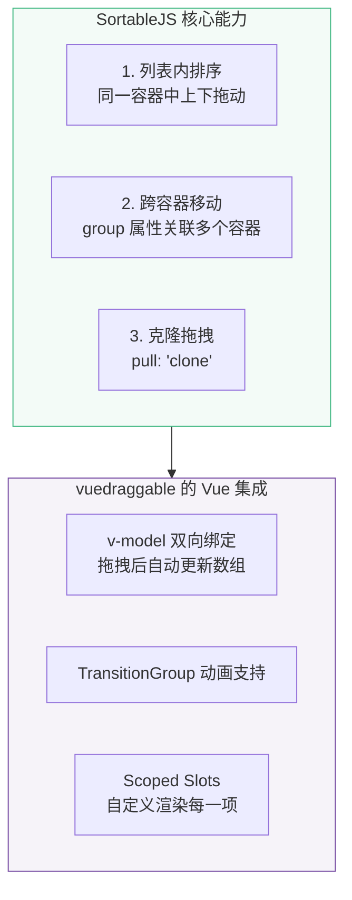
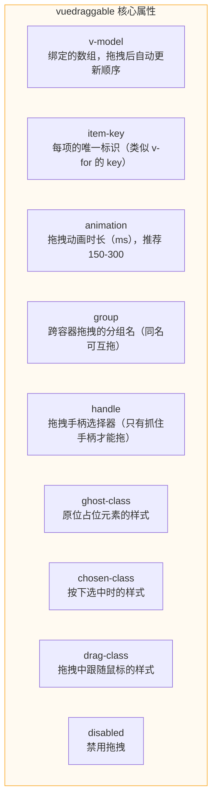
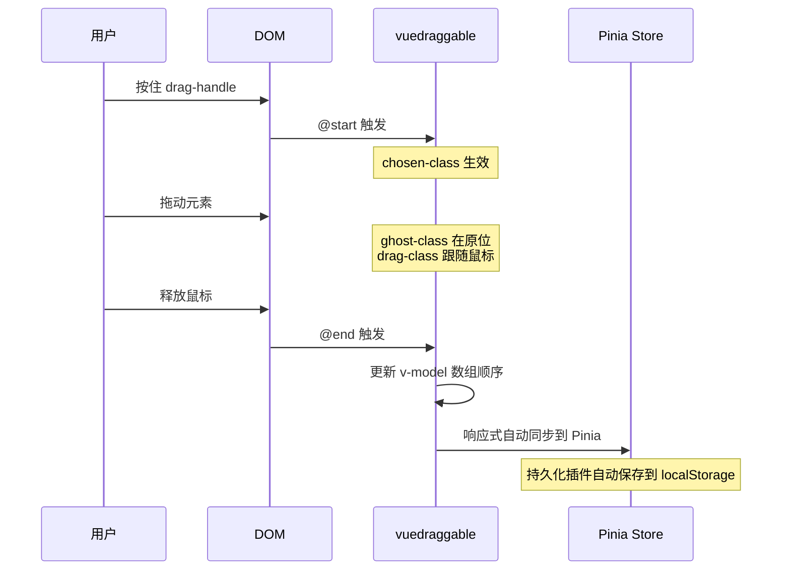
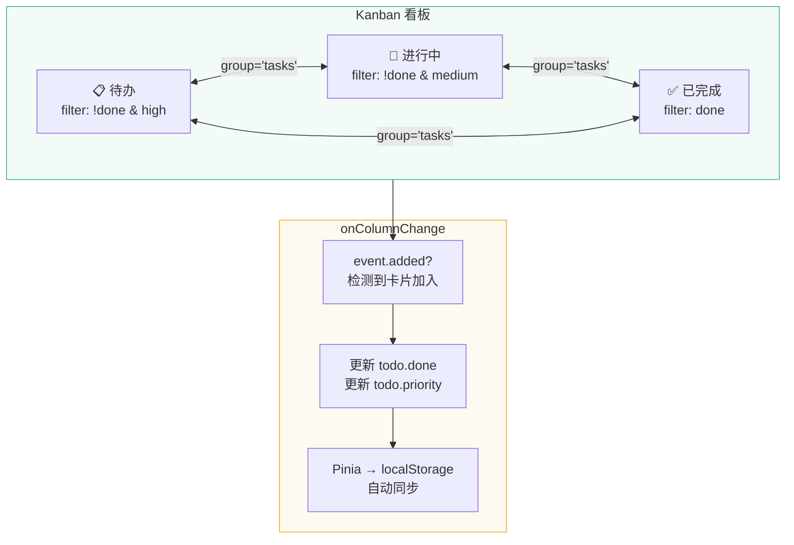

# L13 · 拖拽排序：交互升级

```
🎯 本节目标：实现任务的拖拽排序和状态看板（Kanban）
📦 本节产出：支持 Drag & Drop 的看板视图 + 列表拖拽排序
🔗 前置钩子：L12 的任务分类系统（看板卡片展示分类信息）
🔗 后续钩子：L14 跨层通信、L15 异步组件
```

> [!TIP]
> **本节较长（10 个章节），推荐学习路径：**
> - **必学：** §1 技术选型、§3 列表拖拽排序、§4 核心事件、§5 Kanban 看板
> - **建议了解：** §2 SortableJS 能力、§6 排序持久化
> - **可跳过（按需查阅）：** §7 移动端适配、§8 视图切换、§9 常见问题排查

---

## 1. 拖拽交互的技术选型

在实现拖拽之前，我们需要选择合适的方案。不同场景的复杂度差异极大：

| 方案 | 底层 | 优点 | 缺点 | 适用场景 |
|------|------|------|------|---------|
| 原生 HTML5 Drag & Drop | `draggable` 属性 + 6 个事件 | 无依赖 | API 反人类、移动端不支持 | 文件拖入 |
| `@vueuse/core` useDraggable | Pointer Events | 轻量 | 只支持单元素位移 | 拖拽面板、浮窗 |
| **vuedraggable** | SortableJS | Vue 3 深度集成、列表排序 | 体积较大（~15KB） | **列表排序、看板** ✅ |
| dnd-kit (React) | Pointer Events | 灵活 | React 生态 | — |

```bash
npm install vuedraggable@next
```

> `vuedraggable@next` 是兼容 Vue 3 的版本，底层基于 SortableJS。

---

## 2. 理解 SortableJS 的核心能力

`vuedraggable` 是 SortableJS 的 Vue 3 封装。SortableJS 提供三大核心能力：



---

## 3. 列表拖拽排序

### 3.1 基础实现

```vue
<!-- src/components/todo/DraggableTodoList.vue -->
<script setup lang="ts">
import draggable from 'vuedraggable'
import { useTaskStore } from '@/stores/taskStore'
import { storeToRefs } from 'pinia'
import TodoItem from './TodoItem.vue'
import { ref } from 'vue'

const taskStore = useTaskStore()

// ⚠️ 注意：filteredTodos 是 computed（只读），不能直接用于 v-model！
// 拖拽需要写入数组顺序，所以绑定 store 中的源数组 todos
const { todos } = storeToRefs(taskStore)

// 拖拽状态
const isDragging = ref(false)

// 拖拽结束后通知 store 持久化新顺序
function onDragEnd() {
  isDragging.value = false
  taskStore.reorderTodos(todos.value.map(t => t.id))
}
</script>

<template>
  <draggable
    v-model="todos"
    item-key="id"
    :animation="200"
    ghost-class="ghost"
    chosen-class="chosen"
    drag-class="dragging"
    handle=".drag-handle"
    @start="isDragging = true"
    @end="onDragEnd"
  >
    <template #item="{ element, index }">
      <TodoItem
        v-bind="element"
        @toggle="taskStore.toggleTodo"
        @delete="taskStore.deleteTodo"
      >
        <template #prefix>
          <span class="drag-handle" :title="'长按拖拽排序'">
            <svg width="16" height="16" viewBox="0 0 16 16" fill="currentColor">
              <circle cx="5" cy="3" r="1.5" />
              <circle cx="11" cy="3" r="1.5" />
              <circle cx="5" cy="8" r="1.5" />
              <circle cx="11" cy="8" r="1.5" />
              <circle cx="5" cy="13" r="1.5" />
              <circle cx="11" cy="13" r="1.5" />
            </svg>
          </span>
        </template>
      </TodoItem>
    </template>

    <!-- 空状态 -->
    <template #footer>
      <div v-if="todos.length === 0" class="empty-state">
        <p>暂无任务</p>
      </div>
    </template>
  </draggable>
</template>

<style scoped>
/* 拖拽手柄 */
.drag-handle {
  cursor: grab;
  color: #ccc;
  user-select: none;
  padding: 4px 8px;
  border-radius: 4px;
  transition: color 0.2s, background 0.2s;
}

.drag-handle:hover {
  color: #42b883;
  background: #42b88310;
}

.drag-handle:active {
  cursor: grabbing;
}

/* 拖拽时留在原位的占位 —— ghost */
.ghost {
  opacity: 0.3;
  background: #42b88320;
  border: 2px dashed #42b883;
  border-radius: 8px;
}

/* 被选中（按下但未开始拖拽）—— chosen */
.chosen {
  box-shadow: 0 4px 20px rgba(66, 184, 131, 0.3);
}

/* 正在拖拽的元素 —— dragging */
.dragging {
  opacity: 0.9;
  transform: rotate(2deg);
  box-shadow: 0 8px 30px rgba(0, 0, 0, 0.15);
}

/* 空状态 */
.empty-state {
  text-align: center;
  padding: 40px;
  color: #999;
}
</style>
```

### 3.2 核心属性详解



| 属性 | 类型 | 说明 |
|------|------|------|
| `v-model` | `T[]` | 绑定的数组，拖拽后自动更新 |
| `item-key` | `string` | 每项的唯一字段名（如 `"id"`） |
| `animation` | `number` | 过渡动画毫秒数，`0` = 无动画 |
| `group` | `string \| object` | 跨容器分组。`"tasks"` 或 `{ name: "tasks", pull: true, put: true }` |
| `handle` | `string` | CSS 选择器，只有匹配的子元素才触发拖拽 |
| `ghost-class` | `string` | 占位元素的 CSS 类名 |
| `chosen-class` | `string` | 选中元素的 CSS 类名 |
| `drag-class` | `string` | 拖拽中元素的 CSS 类名 |
| `disabled` | `boolean` | 禁用拖拽（如移动端视图） |
| `sort` | `boolean` | 是否允许排序（`false` 则只能跨容器移动） |

---

## 4. 核心事件

```typescript
interface DragEvent {
  // @start 和 @end 的事件对象
  oldIndex: number     // 原位置索引
  newIndex: number     // 新位置索引
  from: HTMLElement     // 来源容器
  to: HTMLElement       // 目标容器
  item: HTMLElement     // 被拖拽的 DOM
}

interface ChangeEvent {
  // @change 事件对象（更细粒度）
  added?: { element: T; newIndex: number }
  removed?: { element: T; oldIndex: number }
  moved?: { element: T; oldIndex: number; newIndex: number }
}
```



---

## 5. Kanban 看板视图

看板是将任务按状态分成多列，支持跨列拖拽的经典交互模式。

> [!IMPORTANT]
> **看板分列策略：** 本节看板按 **完成状态 + 优先级** 分列（待办/进行中/已完成），而不是按 L12 的分类（categoryId）分列。
> 这是因为状态看板更符合 Kanban 的经典用法。若需按分类分列，只需把 `filter` 条件改为 `t.categoryId === column.categoryId`。

### 5.1 完整实现

```vue
<!-- src/views/KanbanView.vue -->
<script setup lang="ts">
import draggable from 'vuedraggable'
import { computed, ref } from 'vue'
import { useTaskStore } from '@/stores/taskStore'
import type { Todo } from '@/types/todo'

const taskStore = useTaskStore()

// 看板列定义
interface KanbanColumn {
  id: string
  title: string
  emoji: string
  color: string
  items: Todo[]
}

const columns = computed<KanbanColumn[]>(() => [
  {
    id: 'todo',
    title: '待办',
    emoji: '📋',
    color: '#f59e0b',
    items: taskStore.todos.filter(t => !t.done && t.priority === 'high'),
  },
  {
    id: 'in-progress',
    title: '进行中',
    emoji: '🔨',
    color: '#3b82f6',
    items: taskStore.todos.filter(t => !t.done && t.priority === 'medium'),
  },
  {
    id: 'done',
    title: '已完成',
    emoji: '✅',
    color: '#42b883',
    items: taskStore.todos.filter(t => t.done),
  },
])

// 跨列拖拽状态变更
function onColumnChange(columnId: string, event: any) {
  if (event.added) {
    const todo = event.added.element as Todo

    switch (columnId) {
      case 'todo':
        todo.done = false
        todo.priority = 'high'
        break
      case 'in-progress':
        todo.done = false
        todo.priority = 'medium'
        break
      case 'done':
        todo.done = true
        break
    }
  }
}

// 当前拖拽所在列（高亮目标列）
const activeColumn = ref<string | null>(null)
</script>

<template>
  <div class="kanban-page">
    <header class="kanban-header">
      <h1>📌 看板视图</h1>
      <p class="kanban-subtitle">拖拽任务卡片到不同列来更改状态</p>
    </header>

    <div class="kanban-board">
      <div
        v-for="column in columns"
        :key="column.id"
        class="kanban-column"
        :class="{ 'is-active': activeColumn === column.id }"
        :style="{ '--column-color': column.color }"
      >
        <!-- 列头 -->
        <div class="column-header">
          <span class="column-title">
            {{ column.emoji }} {{ column.title }}
          </span>
          <span class="column-count">{{ column.items.length }}</span>
        </div>

        <!-- 可拖拽列表 -->
        <draggable
          :list="column.items"
          group="tasks"
          item-key="id"
          :animation="200"
          ghost-class="kanban-ghost"
          class="kanban-list"
          @change="(e: any) => onColumnChange(column.id, e)"
          @start="activeColumn = column.id"
          @end="activeColumn = null"
        >
          <template #item="{ element }">
            <div class="kanban-card" :class="{ 'is-done': element.done }">
              <div class="card-header">
                <span class="card-title">{{ element.text }}</span>
                <span class="priority-badge" :class="element.priority">
                  {{ element.priority }}
                </span>
              </div>
              <div class="card-meta">
                <span v-if="element.categoryId" class="card-category">
                  📁 {{ element.categoryId }}
                </span>
                <span v-if="element.tags?.length" class="card-tags">
                  <span v-for="tag in element.tags" :key="tag" class="tag">
                    {{ tag }}
                  </span>
                </span>
              </div>
              <div class="card-footer">
                <span class="card-date">
                  {{ new Date(element.createdAt).toLocaleDateString() }}
                </span>
              </div>
            </div>
          </template>

          <!-- 列为空时的提示 -->
          <template #footer>
            <div v-if="column.items.length === 0" class="column-empty">
              <p>拖拽任务到这里</p>
            </div>
          </template>
        </draggable>
      </div>
    </div>
  </div>
</template>

<style scoped>
.kanban-page {
  padding: 24px;
}

.kanban-header {
  margin-bottom: 24px;
}

.kanban-header h1 {
  font-size: 1.5rem;
  margin: 0 0 4px 0;
}

.kanban-subtitle {
  color: #888;
  font-size: 0.875rem;
  margin: 0;
}

/* ─── 看板容器 ─── */
.kanban-board {
  display: grid;
  grid-template-columns: repeat(auto-fit, minmax(300px, 1fr));
  gap: 20px;
  align-items: start;
}

/* ─── 列 ─── */
.kanban-column {
  background: #f8f9fa;
  border-radius: 12px;
  padding: 16px;
  min-height: 300px;
  border: 2px solid transparent;
  transition: border-color 0.2s, background 0.2s;
}

.kanban-column.is-active {
  border-color: var(--column-color);
  background: color-mix(in srgb, var(--column-color) 5%, #f8f9fa);
}

.column-header {
  display: flex;
  align-items: center;
  justify-content: space-between;
  margin-bottom: 16px;
  padding-bottom: 12px;
  border-bottom: 2px solid var(--column-color, #e0e0e0);
}

.column-title {
  font-weight: 600;
  font-size: 1rem;
}

.column-count {
  background: var(--column-color, #e0e0e0);
  color: white;
  font-size: 0.75rem;
  font-weight: 700;
  padding: 2px 10px;
  border-radius: 12px;
  min-width: 24px;
  text-align: center;
}

/* ─── 拖拽列表 ─── */
.kanban-list {
  min-height: 100px;
}

/* ─── 卡片 ─── */
.kanban-card {
  background: #fff;
  padding: 14px;
  border-radius: 10px;
  margin-bottom: 10px;
  box-shadow: 0 1px 4px rgba(0, 0, 0, 0.06);
  cursor: grab;
  transition: box-shadow 0.2s, transform 0.15s;
  border-left: 3px solid transparent;
}

.kanban-card:hover {
  box-shadow: 0 4px 16px rgba(0, 0, 0, 0.1);
  transform: translateY(-1px);
}

.kanban-card:active {
  cursor: grabbing;
}

.kanban-card.is-done {
  opacity: 0.65;
}

.kanban-card.is-done .card-title {
  text-decoration: line-through;
}

/* ─── 卡片内部 ─── */
.card-header {
  display: flex;
  justify-content: space-between;
  align-items: flex-start;
  gap: 8px;
  margin-bottom: 8px;
}

.card-title {
  font-weight: 500;
  font-size: 0.9rem;
  line-height: 1.4;
  flex: 1;
}

.priority-badge {
  font-size: 0.65rem;
  padding: 2px 8px;
  border-radius: 8px;
  text-transform: uppercase;
  font-weight: 700;
  letter-spacing: 0.5px;
  white-space: nowrap;
}

.priority-badge.high { background: #fee2e2; color: #dc2626; }
.priority-badge.medium { background: #fef3c7; color: #d97706; }
.priority-badge.low { background: #d1fae5; color: #059669; }

.card-meta {
  display: flex;
  flex-wrap: wrap;
  gap: 6px;
  margin-bottom: 8px;
}

.card-category {
  font-size: 0.75rem;
  color: #666;
}

.card-tags {
  display: flex;
  gap: 4px;
}

.tag {
  font-size: 0.65rem;
  background: #e8f5e9;
  color: #2e7d32;
  padding: 1px 6px;
  border-radius: 4px;
}

.card-footer {
  display: flex;
  justify-content: flex-end;
}

.card-date {
  font-size: 0.7rem;
  color: #aaa;
}

/* ─── Ghost（占位） ─── */
.kanban-ghost {
  opacity: 0.3;
  background: #42b88320;
  border: 2px dashed #42b883;
  border-radius: 10px;
}

.kanban-ghost > * {
  visibility: hidden;
}

/* ─── 空列提示 ─── */
.column-empty {
  text-align: center;
  padding: 32px 16px;
  color: #bbb;
  font-size: 0.85rem;
  border: 2px dashed #e0e0e0;
  border-radius: 8px;
}
</style>
```

### 5.2 跨列拖拽的数据流



**关键点：** `group="tasks"` 让三个列共享同一个拖拽池。当卡片跨列移动时，`@change` 事件的 `event.added` 告诉我们哪张卡进入了当前列——我们据此更新卡片的 `done` 和 `priority` 属性。

---

## 6. 拖拽排序持久化

拖拽改变了数组顺序，但刷新页面后顺序会丢失。需要把排序结果持久化：

```typescript
// 方案 1：Pinia persist 插件自动处理（推荐）
// 因为 vuedraggable 的 v-model 直接修改了 Pinia store 中的数组
// persist: true 会自动存入 localStorage

// 方案 2：手动存储排序索引
function onDragEnd() {
  const order = todos.value.map(t => t.id)
  localStorage.setItem('todo-order', JSON.stringify(order))
}

function restoreOrder() {
  const saved = localStorage.getItem('todo-order')
  if (saved) {
    const order = JSON.parse(saved) as number[]
    todos.value.sort((a, b) => order.indexOf(a.id) - order.indexOf(b.id))
  }
}
```

---

## 7. 移动端触摸适配

SortableJS 默认支持触摸事件，但需要额外配置：

```vue
<draggable
  v-model="items"
  item-key="id"
  :delay="150"
  :delay-on-touch-only="true"
  :touch-start-threshold="5"
>
```

| 属性 | 说明 |
|------|------|
| `delay` | 按住多久后开始拖拽（防止误触） |
| `delay-on-touch-only` | delay 只在触摸设备生效，鼠标设备不延迟 |
| `touch-start-threshold` | 手指移动多少像素后才算开始拖拽 |

---

## 8. 视图切换：列表 ↔ 看板

在路由中添加看板视图，让用户自由切换：

```typescript
// src/router/index.ts
{
  path: '/kanban',
  name: 'kanban',
  component: () => import('@/views/KanbanView.vue'),
  meta: { title: '看板视图' },
},
```

```vue
<!-- Header 中添加切换按钮 -->
<nav class="view-switcher">
  <RouterLink to="/" class="view-btn" active-class="active">
    📋 列表
  </RouterLink>
  <RouterLink to="/kanban" class="view-btn" active-class="active">
    📌 看板
  </RouterLink>
</nav>
```

---

## 9. 常见问题排查

| 问题 | 原因 | 解决 |
|------|------|------|
| 拖拽后列表数据没变 | `v-model` 绑定了 computed（只读） | 绑定 store 中的源数组，不要绑定 filtered 结果 |
| 跨列拖拽后卡片消失 | `group` 名称不一致 | 所有列的 `group` 必须相同 |
| 动画不生效 | 忘记设置 `animation` | 添加 `:animation="200"` |
| ghost 样式不生效 | 类名冲突或 scoped 样式 | `ghost-class` 用全局样式或 `:deep()` |
| 拖拽时页面滚动 | 移动端默认行为 | 在容器上 `touch-action: none` |

---

## 10. 本节总结

### 检查清单

- [ ] 能用 vuedraggable 实现列表拖拽排序
- [ ] 理解 `v-model`、`item-key`、`group`、`handle` 核心属性
- [ ] 能实现 Kanban 看板的跨列拖拽并同步状态
- [ ] 能用 `ghost-class`、`chosen-class`、`drag-class` 自定义拖拽体验
- [ ] 能在 `@change` 事件中处理跨列数据同步
- [ ] 能处理排序结果的持久化
- [ ] 能处理移动端触摸的延迟配置

### Git 提交

```bash
git add .
git commit -m "L13: 拖拽排序 + Kanban 看板视图"
```

### 🔗 → 下一节

L14 将学习 provide/inject 等高级组件通信方式——当看板中的子组件需要访问跨层级数据时，provide/inject 比逐层传 props 优雅得多。
