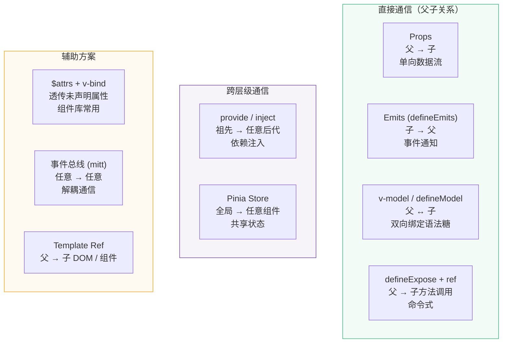
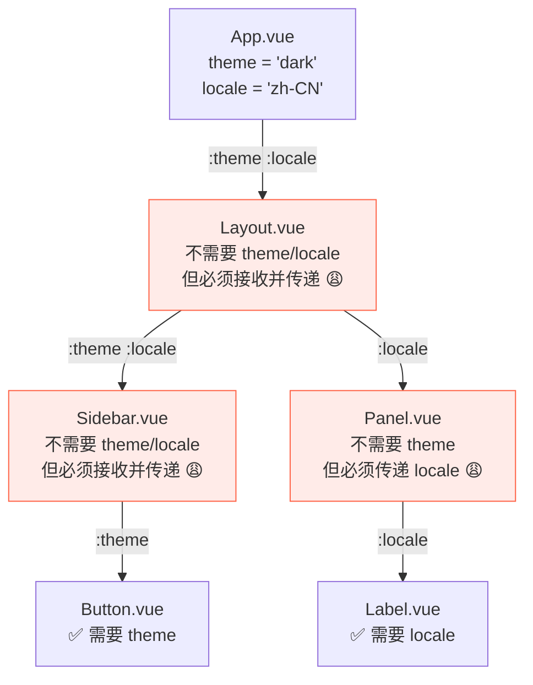
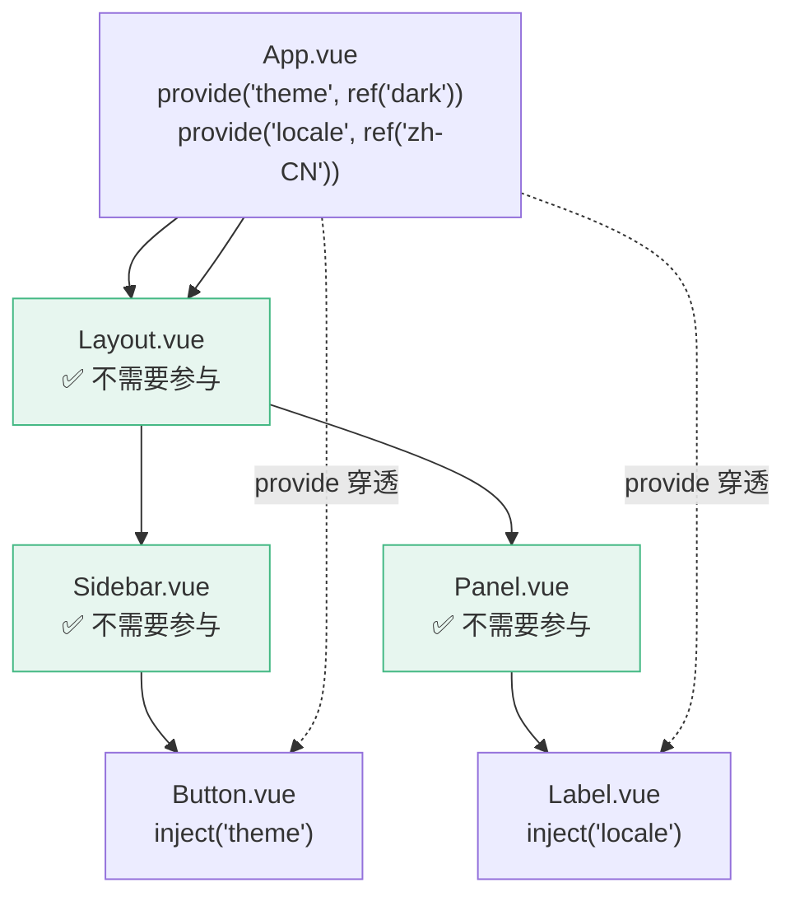
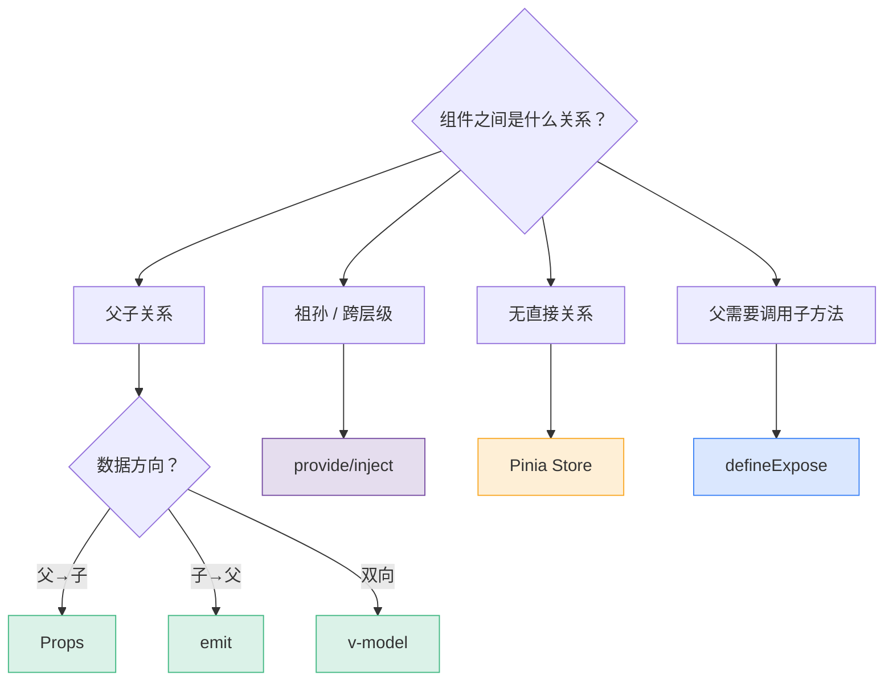

# L14 · 组件通信全景：provide/inject + defineExpose

```
🎯 本节目标：掌握 Vue 3 全部组件通信方式，在正确的场景选择正确的方案
📦 本节产出：组件通信方式速查表 + 重构现有通信逻辑 + 可复用 InjectionKey 类型
🔗 前置钩子：L12-L13 的多层组件嵌套（通信痛点真实出现）
🔗 后续钩子：L15 异步组件需要更灵活的通信、L16 自定义指令
```

---

## 1. 通信方式全景图

经历了 L09-L13，我们的组件层级已经很深了。不同层级、不同方向的通信需要不同的方案：



---

## 2. 回顾：Props + Emits（L02-L05 已讲）

```vue
<!-- 父组件 -->
<TodoItem
  :text="todo.text"
  :done="todo.done"
  @toggle="handleToggle"
  @delete="handleDelete"
/>

<!-- 子组件 -->
<script setup lang="ts">
defineProps<{ text: string; done: boolean }>()
const emit = defineEmits<{
  toggle: [id: number]
  delete: [id: number]
}>()
</script>
```

这是最基本、最常用的通信方式。**90% 的场景应该用 Props + Emits**。

问题在于：当层级加深到 3 层以上时，Props 逐层传递变得很痛苦→

---

## 3. Prop Drilling 问题

### 3.1 问题复现



**中间 3 个组件都不需要 `theme`/`locale`，却必须接收并转发。** 这就是 Prop Drilling（Props 穿透）。

问题：
1. 中间组件被污染——承担了不属于它的职责
2. 修改参数需要同时改 N 个组件
3. 增加新的跨层级参数很痛苦

---

## 4. provide / inject

### 4.1 基本用法

```typescript
// 祖先组件 provide
import { provide, ref } from 'vue'

const theme = ref<'light' | 'dark'>('dark')
const locale = ref('zh-CN')

provide('theme', theme)    // key, value
provide('locale', locale)
```

```typescript
// 任意后代组件 inject
import { inject, type Ref } from 'vue'

const theme = inject<Ref<'light' | 'dark'>>('theme')

// 提供默认值（当没有祖先 provide 时）
const theme = inject('theme', ref('light'))
```



**中间组件完全不需要参与——provide 可以穿越任意层级。**

### 4.2 类型安全的 InjectionKey

用字符串 key 的问题：类型不安全，容易拼写出错。

```typescript
// src/types/injection-keys.ts
import type { InjectionKey, Ref, DeepReadonly } from 'vue'

// 简单场景：只传 Ref
export const LocaleKey: InjectionKey<Ref<string>> = Symbol('locale')
export const UserKey: InjectionKey<Ref<{ name: string; role: string } | null>> = Symbol('user')

// 复杂场景：传数据 + 方法的组合（§4.3 使用）
export interface ThemeContext {
  theme: DeepReadonly<Ref<'light' | 'dark'>>
  toggleTheme: () => void
}
export const ThemeKey: InjectionKey<ThemeContext> = Symbol('theme')
```

```typescript
// provide（类型安全）
import { ThemeKey } from '@/types/injection-keys'
provide(ThemeKey, theme)  // ✅ 如果 theme 类型不匹配会报错

// inject（自动类型推断）
import { ThemeKey } from '@/types/injection-keys'
const theme = inject(ThemeKey)
// 类型自动推断为 Ref<'light' | 'dark'> | undefined
```

### 4.3 provide 响应式数据 + 方法

```typescript
// App.vue — provide 不仅可以传数据，也可以传方法
const theme = ref<'light' | 'dark'>('light')

function toggleTheme() {
  theme.value = theme.value === 'light' ? 'dark' : 'light'
}

// 同时 provide 数据和修改方法
provide(ThemeKey, {
  theme: readonly(theme),      // DeepReadonly<Ref>，防止后代直接篡改
  toggleTheme,                 // 修改必须通过提供的方法
})  // ✅ 类型与 ThemeKey: InjectionKey<ThemeContext> 一致
```

```typescript
// 后代组件 inject
const { theme, toggleTheme } = inject(ThemeKey)!
// theme 是 readonly → 后代只能读不能写
// toggleTheme 是唯一的修改入口
```

**设计原则：** provide 响应式数据时，用 `readonly()` 包装，只暴露方法来修改。这保持了清晰的数据流——谁 provide 谁管数据。

### 4.4 provide/inject vs Pinia

| | provide/inject | Pinia |
|--|---------------|-------|
| 作用范围 | 组件子树（树状） | 全局（平铺） |
| 适用场景 | 组件库内部状态、局部主题 | 跨页面共享的业务数据 |
| DevTools | 不支持 | ✅ 时间旅行 |
| 持久化 | 需要手动 | 插件支持 |
| 测试 | 需要 provide wrapper | createPinia() |

**选型建议：**
- 需要 DevTools 调试、持久化、跨页面 → Pinia
- 组件库内部、局部配置注入 → provide/inject

---

## 5. defineExpose：父组件访问子组件方法

### 5.1 使用场景

有时父组件需要**命令式**地调用子组件的方法——例如让输入框聚焦、让表单重置、让组件刷新。

```vue
<!-- 子组件 TodoInput.vue -->
<script setup lang="ts">
import { ref } from 'vue'

const inputRef = ref<HTMLInputElement>()
const inputValue = ref('')

function focus() {
  inputRef.value?.focus()
}

function clear() {
  inputValue.value = ''
}

function getValue() {
  return inputValue.value
}

// ⚠️ <script setup> 组件默认是封闭的——父组件拿不到任何内部绑定
// 必须用 defineExpose 显式暴露
defineExpose({
  focus,
  clear,
  getValue,
})
</script>

<template>
  <input ref="inputRef" v-model="inputValue" placeholder="添加任务..." />
</template>
```

```vue
<!-- 父组件 -->
<script setup lang="ts">
import { ref, onMounted } from 'vue'
import TodoInput from './TodoInput.vue'

// 用 ref 获取子组件实例
const todoInputRef = ref<InstanceType<typeof TodoInput>>()

onMounted(() => {
  // 页面加载后自动聚焦
  todoInputRef.value?.focus()
})

function handleKeyboardShortcut(e: KeyboardEvent) {
  if (e.ctrlKey && e.key === 'n') {
    e.preventDefault()
    todoInputRef.value?.focus()
  }
}

function handleReset() {
  todoInputRef.value?.clear()
}
</script>

<template>
  <TodoInput ref="todoInputRef" />
  <button @click="handleReset">清空</button>
</template>
```

### 5.2 InstanceType 类型技巧

```typescript
// 获得子组件暴露的方法的类型
const inputRef = ref<InstanceType<typeof TodoInput>>()

// 这样 inputRef.value?.focus() 就有类型提示和检查
```

### 5.3 何时用 defineExpose vs emit

| 场景 | 推荐方案 |
|------|---------|
| 子组件通知父组件"发生了什么" | `emit`（声明式） |
| 父组件命令子组件"做某件事" | `defineExpose`（命令式） |
| 表单提交 | `emit('submit', data)` |
| 表单重置 / 聚焦 / 滚动到位 | `defineExpose({ reset, focus })` |

---

## 6. $attrs 透传

### 6.1 场景：封装原生元素

当你封装一个组件库的按钮时，使用者可能传入 `disabled`、`aria-label`、`@click` 等原生属性。你不可能在 Props 里声明所有可能的原生属性。

```vue
<!-- BaseButton.vue -->
<script setup lang="ts">
defineProps<{
  variant?: 'primary' | 'secondary' | 'danger'
  size?: 'sm' | 'md' | 'lg'
}>()

// 没有在 Props 中声明的属性自动放入 $attrs
// 包括原生 HTML 属性和事件监听器
</script>

<template>
  <button
    :class="['base-btn', `btn-${variant}`, `btn-${size}`]"
    v-bind="$attrs"
  >
    <slot />
  </button>
</template>

<script lang="ts">
export default {
  inheritAttrs: false  // 禁止自动继承到根元素，手动控制绑定位置
}
</script>
```

```vue
<!-- 使用 -->
<BaseButton
  variant="primary"
  size="lg"
  disabled
  aria-label="保存更改"
  @click="save"
  @mouseenter="showTooltip"
>
  保存
</BaseButton>

<!--
  variant, size → Props（组件自己处理）
  disabled, aria-label, @click, @mouseenter → $attrs → 透传到 <button>
-->
```

### 6.2 useAttrs() 在 script setup 中使用

```typescript
import { useAttrs } from 'vue'

const attrs = useAttrs()
console.log(attrs) // { disabled: true, 'aria-label': '保存更改', onClick: fn, ... }
```

---

## 7. 通信方式速查表

| 场景 | 推荐方案 | 为什么 |
|------|---------|--------|
| 父 → 子传数据 | Props | 最直接，类型安全 |
| 子 → 父通知事件 | emit / defineEmits | 保持单向数据流 |
| 表单双向绑定 | v-model / defineModel | 语法糖，简洁 |
| 祖先 → 任意后代 | provide / inject + InjectionKey | 避免 prop drilling |
| 不相关组件共享数据 | Pinia Store | 全局单例，DevTools |
| 父命令式调用子方法 | ref + defineExpose | 聚焦/重置等场景 |
| 封装透传原生属性 | $attrs + v-bind | 组件库标准做法 |
| 极端解耦（不推荐） | mitt 事件总线 | 调试困难，最后手段 |



---

## 8. 本节总结

### 检查清单

- [ ] 能解释 Prop Drilling 问题以及什么时候它会出现
- [ ] 能用 provide/inject 实现跨层级通信
- [ ] 能用 InjectionKey + Symbol 实现类型安全的注入
- [ ] 知道 provide 响应式数据时用 readonly 包装的原因
- [ ] 能用 defineExpose 暴露子组件方法给父组件
- [ ] 能用 `InstanceType<typeof Component>` 获取组件类型
- [ ] 能用 $attrs + v-bind 透传原生属性
- [ ] 能根据场景在速查表中选择正确的通信方式

### 🐞 防坑指南

| 坑 | 说明 | 正确做法 |
|----|------|---------|
| provide 非响应式值 | `provide('count', count.value)` 传了快照 | `provide('count', count)` 传 ref 对象 |
| inject 忘记默认值 | 上层没 provide → `undefined` 静默失败 | `inject('key', defaultValue)` 或用 InjectionKey |
| defineExpose 暴露太多 | 整个组件内部都能被父组件操控 | 只暴露必要的方法（`reset`/`validate`） |
| $attrs 覆盖根元素属性 | 子组件根元素的 class 被覆盖 | 手动用 `v-bind="$attrs"` 绑定到指定元素 |

### 📐 最佳实践

1. **通信方式选择规则**：父子 → props/emit；跨层 → provide/inject；全局 → Pinia
2. **provide 用 readonly**：`provide('todos', readonly(todos))` 防止下层组件意外修改
3. **InjectionKey 类型安全**：用 `Symbol()` + `InjectionKey<T>` 确保 inject 的类型推断
4. **defineExpose 加注释**：暴露的 API 是组件的"公开接口"，要像函数签名一样写文档

### Git 提交

```bash
git add .
git commit -m "L14: 组件通信全景 - provide/inject/expose/$attrs"
```

### 🔗 → 下一节

L15 将学习异步组件和 Suspense——当组件需要异步加载或数据获取时，如何优雅地显示 loading 和 error 状态。
