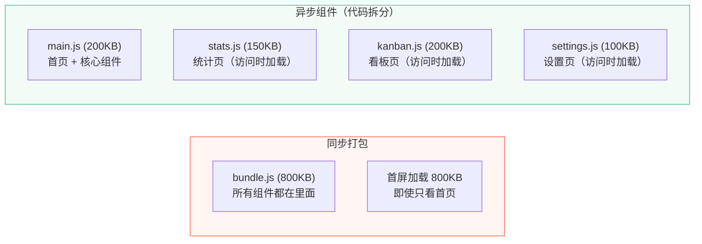
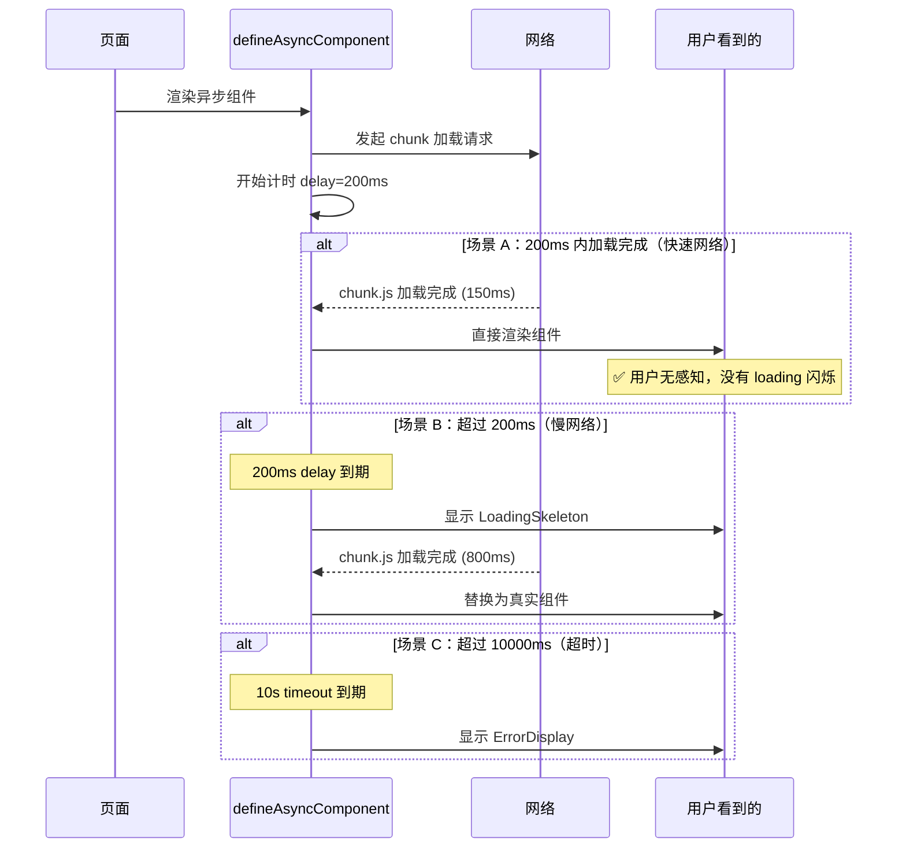
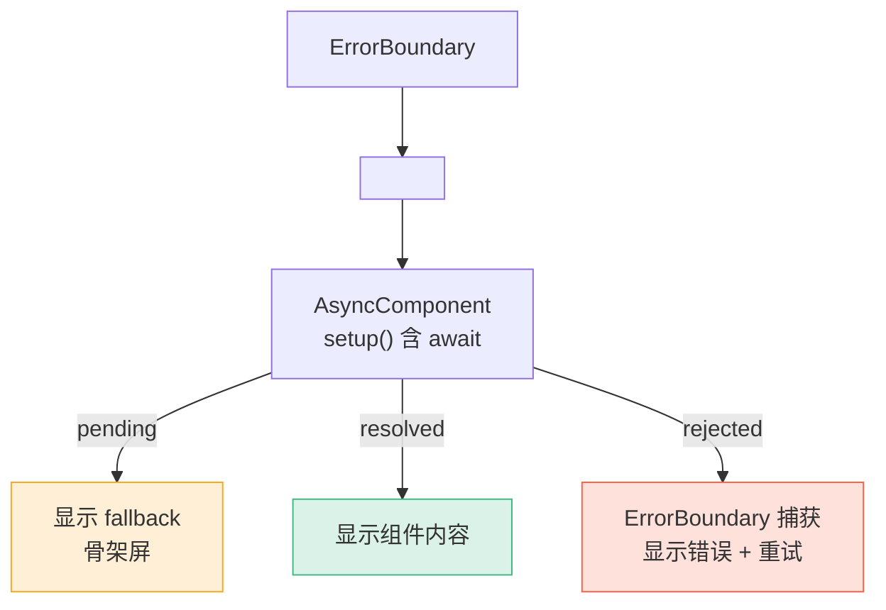

# L15 · 异步组件与 Suspense

> **版本信息**
> - 适用版本：Vue 3.4+
> - Suspense 状态：**Experimental**（API 可能变化）
> - 最后核对：2026-04-01
> - 官方文档：https://vuejs.org/guide/built-ins/suspense.html

```
🎯 本节目标：理解异步组件加载、Suspense 使用、以及优雅的 Loading / Error 状态管理
📦 本节产出：带骨架屏的异步页面加载 + 错误边界组件 + 性能优化（代码拆分）
🔗 前置钩子：L10 路由懒加载（已使用 `() => import()`）、L14 通信方式
🔗 后续钩子：L16 自定义指令 + 主题系统
```

---

## 1. 为什么需要异步组件

### 1.1 打包体积问题

当应用变大时，所有组件打包到一个 JS 文件会导致首屏加载慢：



### 1.2 路由懒加载回顾（L10 已做）

```typescript
// router/index.ts
const StatsView = () => import('@/views/StatsView.vue')   // 访问 /stats 时才加载
const KanbanView = () => import('@/views/KanbanView.vue') // 访问 /kanban 时才加载
```

路由懒加载本质就是异步组件。本节将深入到**组件级别**的异步加载。

---

## 2. defineAsyncComponent

### 2.1 基础用法

```typescript
import { defineAsyncComponent } from 'vue'

// 最简形式
const AsyncChart = defineAsyncComponent(
  () => import('./components/HeavyChart.vue')
)
```

等价于：
```vue
<template>
  <AsyncChart />  <!-- 组件所在 chunk 会在渲染时自动加载 -->
</template>
```

### 2.2 完整配置

```typescript
import { defineAsyncComponent } from 'vue'
import LoadingSkeleton from '@/components/ui/LoadingSkeleton.vue'
import ErrorDisplay from '@/components/ui/ErrorDisplay.vue'

const AsyncDashboard = defineAsyncComponent({
  // 加载器函数
  loader: () => import('./views/DashboardView.vue'),

  // 加载中显示的组件
  loadingComponent: LoadingSkeleton,

  // 加载失败显示的组件
  errorComponent: ErrorDisplay,

  // 延迟显示 loading（ms）
  // 如果在 200ms 内加载完成，就不会显示 loading（避免闪烁）
  delay: 200,

  // 超时时间（ms）
  // 超过此时间视为加载失败，显示 errorComponent
  timeout: 10000,

  // 失败时是否挂起（Suspense 相关）
  suspensible: true,

  // 自定义错误处理
  onError(error, retry, fail, attempts) {
    if (error.message.includes('fetch') && attempts <= 3) {
      // 网络错误自动重试 3 次
      retry()
    } else {
      fail()
    }
  },
})
```

### 2.3 时序图：delay 的作用



**关键设计：** `delay` 避免了快速网络下的 loading 闪烁——如果组件在 200ms 内就加载好了，用户根本看不到 loading 状态。

---

## 3. 骨架屏组件

一个好的 loading 状态不是转圈圈，而是**骨架屏**——模拟真实页面的占位布局：

```vue
<!-- src/components/ui/LoadingSkeleton.vue -->
<script setup lang="ts">
withDefaults(defineProps<{
  lines?: number
  hasAvatar?: boolean
  hasImage?: boolean
}>(), {
  lines: 3,
  hasAvatar: false,
  hasImage: false,
})
</script>

<template>
  <div class="skeleton" aria-busy="true" aria-label="加载中">
    <!-- 头部：头像 + 标题 -->
    <div v-if="hasAvatar" class="skeleton-header">
      <div class="skeleton-avatar pulse"></div>
      <div class="skeleton-title-group">
        <div class="skeleton-line skeleton-title pulse"></div>
        <div class="skeleton-line skeleton-subtitle pulse"></div>
      </div>
    </div>

    <!-- 图片占位 -->
    <div v-if="hasImage" class="skeleton-image pulse"></div>

    <!-- 文本行 -->
    <div class="skeleton-body">
      <div
        v-for="i in lines"
        :key="i"
        class="skeleton-line pulse"
        :style="{ width: i === lines ? '60%' : '100%' }"
      ></div>
    </div>
  </div>
</template>

<style scoped>
.skeleton {
  padding: 20px;
}

.skeleton-header {
  display: flex;
  align-items: center;
  gap: 12px;
  margin-bottom: 20px;
}

.skeleton-avatar {
  width: 48px;
  height: 48px;
  border-radius: 50%;
  background: #e0e0e0;
  flex-shrink: 0;
}

.skeleton-title-group {
  flex: 1;
}

.skeleton-title {
  height: 16px;
  width: 40%;
  margin-bottom: 8px;
}

.skeleton-subtitle {
  height: 12px;
  width: 25%;
}

.skeleton-image {
  width: 100%;
  height: 200px;
  border-radius: 8px;
  background: #e0e0e0;
  margin-bottom: 16px;
}

.skeleton-body {
  display: flex;
  flex-direction: column;
  gap: 10px;
}

.skeleton-line {
  height: 14px;
  background: #e0e0e0;
  border-radius: 6px;
}

/* 脉冲动画 */
.pulse {
  animation: pulse 1.5s infinite ease-in-out;
}

@keyframes pulse {
  0%, 100% { opacity: 1; }
  50% { opacity: 0.4; }
}
</style>
```

---

## 4. Suspense

### 4.1 什么是 Suspense

`<Suspense>` 是 Vue 3 的内置组件，用于处理**异步 setup** 的组件。当子组件的 `setup()` 中有 `await` 时，Suspense 会在 Promise 完成前显示 fallback 内容。

```vue
<template>
  <Suspense>
    <template #default>
      <DashboardView />  <!-- setup() 中有 await -->
    </template>
    <template #fallback>
      <LoadingSkeleton :lines="5" has-avatar />
    </template>
  </Suspense>
</template>
```

### 4.2 async setup

```vue
<!-- DashboardView.vue — 这是一个 async setup 组件 -->
<script setup lang="ts">
// ⚠️ 顶层 await 让整个 setup 变成异步
// Suspense 会等待所有 await 完成后再渲染
const userRes = await fetch('/api/user/profile')
const user = await userRes.json()

const statsRes = await fetch('/api/user/stats')
const stats = await statsRes.json()
// 此时 Suspense 的 fallback 关闭，显示 default 内容
</script>

<template>
  <div class="dashboard">
    <h1>欢迎回来，{{ user.name }}</h1>
    <div class="stats-grid">
      <div class="stat-card">
        <span>{{ stats.totalTasks }}</span>
        <label>总任务</label>
      </div>
      <div class="stat-card">
        <span>{{ stats.completedTasks }}</span>
        <label>已完成</label>
      </div>
    </div>
  </div>
</template>
```

### 4.3 Suspense + 错误处理

Suspense **没有内置的错误处理**。我们需要用 `onErrorCaptured` 手动实现：

```vue
<!-- ErrorBoundary.vue — 可复用的错误边界组件 -->
<script setup lang="ts">
import { ref, onErrorCaptured } from 'vue'

const error = ref<Error | null>(null)

onErrorCaptured((err) => {
  error.value = err as Error
  return false  // 阻止冒泡
})

function retry() {
  error.value = null  // 重置错误 → 重新渲染子组件
}
</script>

<template>
  <div v-if="error" class="error-boundary">
    <div class="error-icon">❌</div>
    <h3>加载出错了</h3>
    <p class="error-message">{{ error.message }}</p>
    <button @click="retry" class="retry-btn">🔄 重试</button>
  </div>
  <slot v-else />
</template>

<style scoped>
.error-boundary {
  text-align: center;
  padding: 40px;
  border: 1px solid #fee;
  border-radius: 12px;
  background: #fff5f5;
}

.error-icon {
  font-size: 2rem;
  margin-bottom: 12px;
}

.error-message {
  color: #666;
  font-size: 0.9rem;
  margin: 8px 0 16px;
}

.retry-btn {
  padding: 8px 24px;
  border: none;
  border-radius: 8px;
  background: #42b883;
  color: white;
  cursor: pointer;
}
</style>
```

### 4.4 组合使用

```vue
<template>
  <ErrorBoundary>
    <Suspense>
      <template #default>
        <DashboardView />
      </template>
      <template #fallback>
        <LoadingSkeleton :lines="5" has-avatar />
      </template>
    </Suspense>
  </ErrorBoundary>
</template>
```



---

## 5. defineAsyncComponent vs Suspense 选型

| 场景 | 推荐方案 | 原因 |
|------|---------|------|
| 路由级代码拆分 | 路由懒加载 `() => import()` | 最简洁 |
| 重型组件（图表、编辑器） | `defineAsyncComponent` + loading/error | 完整生命周期控制 |
| 需要协调多个异步依赖 | `<Suspense>` | 等待所有子组件就绪 |
| 需要 `async setup` 获取数据 | `<Suspense>` + ErrorBoundary | 声明式数据获取 |
| 简单的条件加载 | `v-if` + 动态 `import()` | 按需导入 |

---

## 6. Suspense 的限制和注意事项

> ⚠️ Suspense 在 Vue 3 中仍标记为 **Experimental（实验性）**

| 限制 | 详细说明 | 建议 |
|------|---------|------|
| API 可能变化 | 未来 Vue 版本可能调整行为 | 关注 RFC 和 changelog |
| 嵌套 Suspense | 内层 Suspense 可能阻塞外层 | 避免深于 2 层 |
| 无内置 Error Boundary | 需要 `onErrorCaptured` 手写 | 封装通用 ErrorBoundary |
| 错误后重试 | 没有原生 retry 机制 | 手写 retry 逻辑（如上） |
| 与 Transition 配合 | 需要特定 `mode` 和结构 | 参考官方文档示例 |
| 异步 setup 中不能用 this | `<script setup>` 本来就没有 this | — |

**实际建议：**
- 简单场景 → `defineAsyncComponent` 更可控
- 需要协调多异步依赖 → `<Suspense>` 更优雅
- 生产环境关键路径 → 都加上 ErrorBoundary

---

## 7. 实际应用：为任务管理添加异步统计视图

```vue
<!-- src/views/StatsView.vue -->
<script setup lang="ts">
// 模拟异步数据获取
const response = await fetch('/api/stats')
const stats = await response.json()
// Suspense 会等待这些 await 完成
</script>

<template>
  <div class="stats-page">
    <h1>📊 统计概览</h1>
    <div class="stats-grid">
      <div class="stat-card">
        <div class="stat-value">{{ stats.total }}</div>
        <div class="stat-label">总任务</div>
      </div>
      <div class="stat-card">
        <div class="stat-value">{{ stats.done }}</div>
        <div class="stat-label">已完成</div>
      </div>
      <div class="stat-card">
        <div class="stat-value">{{ stats.donePercent }}%</div>
        <div class="stat-label">完成率</div>
      </div>
    </div>
  </div>
</template>
```

在路由中配套 Suspense：

```vue
<!-- App.vue -->
<template>
  <ErrorBoundary>
    <RouterView v-slot="{ Component }">
      <Suspense>
        <template #default>
          <component :is="Component" />
        </template>
        <template #fallback>
          <LoadingSkeleton :lines="4" />
        </template>
      </Suspense>
    </RouterView>
  </ErrorBoundary>
</template>
```

---

## 8. 本节总结


### 🔬 深度专题

> 📖 [D10 · Suspense 现状与限制](/lessons/deep-dives/D10-suspense-limitations) — 为什么 Suspense 仍是实验性功能？

### 检查清单

- [ ] 理解异步组件解决的打包体积问题
- [ ] 能用 `defineAsyncComponent` 创建异步组件
- [ ] 能配置 `loading` / `error` / `delay` / `timeout` / `onError`
- [ ] 理解 `delay` 防止 loading 闪烁的设计
- [ ] 能实现骨架屏组件
- [ ] 能用 `<Suspense>` 处理 async setup 组件
- [ ] 能封装 ErrorBoundary 组件处理错误
- [ ] 知道 Suspense 的实验性状态和限制
- [ ] 能根据场景选择 defineAsyncComponent vs Suspense

### Git 提交

```bash
git add .
git commit -m "L15: 异步组件 + Suspense + 骨架屏 + ErrorBoundary"
```

### 🔗 → 下一节

L16 将学习自定义指令和主题系统——用 `v-focus`、`v-permission` 等自定义指令封装可复用的 DOM 操作，用 CSS 变量实现明暗主题切换。
