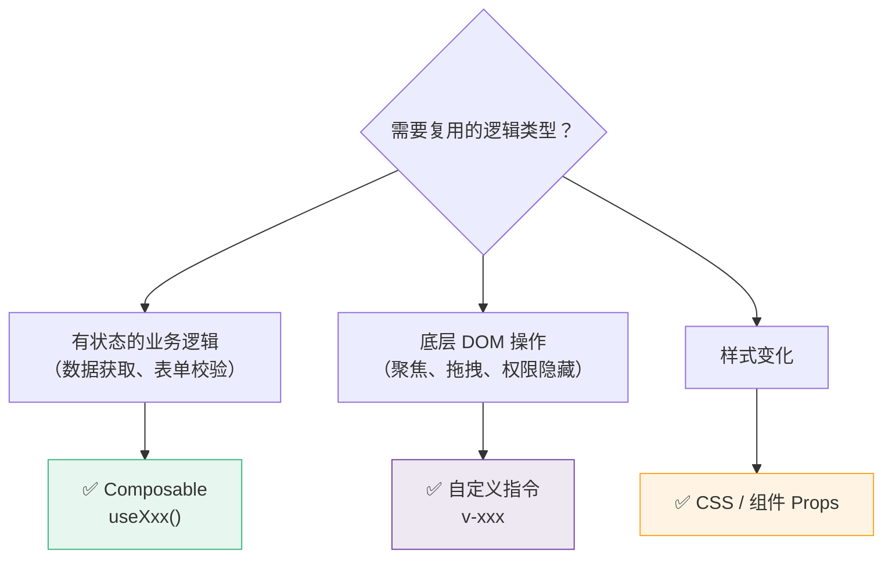
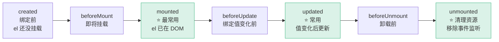
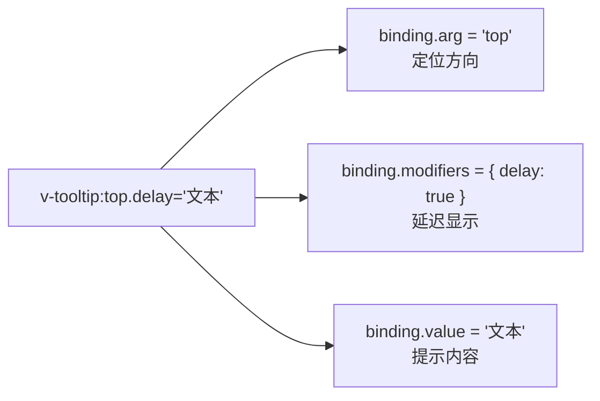
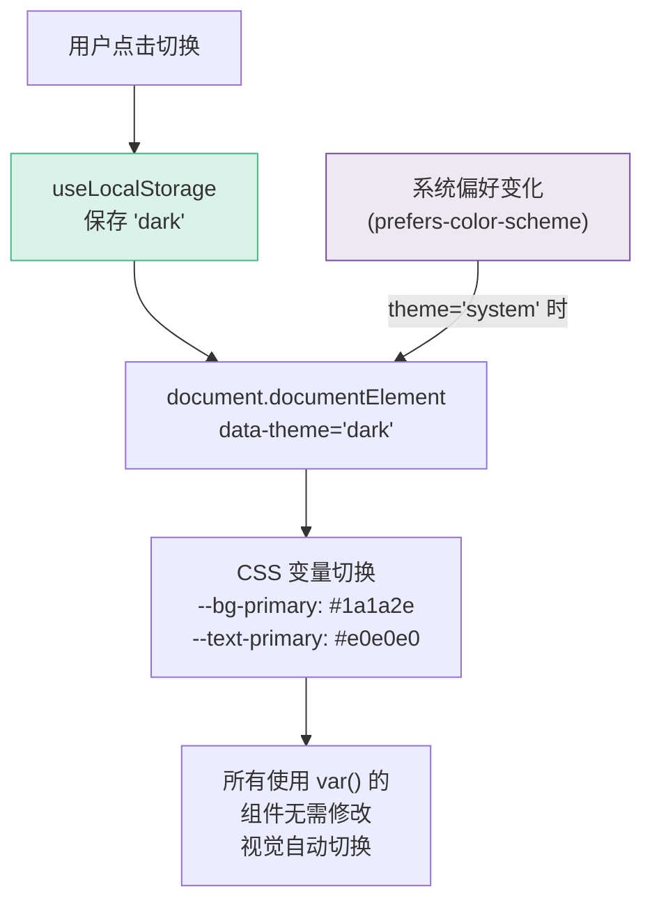

# L16 · 自定义指令 + 主题系统

```
🎯 本节目标：创建自定义指令（v-focus、v-permission、v-tooltip），实现明/暗主题切换
📦 本节产出：支持明暗主题的任务管理系统 + 可复用自定义指令库
🔗 前置钩子：L15 的完整功能集
🔗 后续钩子：L17 将为所有功能编写测试（包括指令和主题）
```

---

## 1. 自定义指令

### 1.1 什么时候用自定义指令



**经验法则：** 如果你发现自己在 `onMounted` 中用 `document.querySelector` 或直接操作 DOM，那大概率应该用指令。

### 1.2 指令生命周期



每个钩子接收相同的参数：

```typescript
// 指令钩子签名
{
  mounted(el, binding, vnode, prevVnode) {
    // el: 指令绑定的 DOM 元素
    // binding.value: v-xxx="value" 中的 value
    // binding.arg: v-xxx:arg 中的 arg
    // binding.modifiers: v-xxx.mod 中的 { mod: true }
    // binding.oldValue: 更新前的值（仅 updated 中可用）
  }
}
```

---

## 2. 实战指令一：v-focus

```typescript
// src/directives/vFocus.ts
import type { Directive } from 'vue'

export const vFocus: Directive<HTMLElement> = {
  mounted(el) {
    // 如果元素本身是 input/textarea，直接聚焦
    if (el.tagName === 'INPUT' || el.tagName === 'TEXTAREA') {
      el.focus()
    } else {
      // 如果是容器元素，找到内部的第一个 input
      const input = el.querySelector<HTMLElement>('input, textarea')
      input?.focus()
    }
  }
}
```

```vue
<template>
  <!-- 自动聚焦 -->
  <input v-focus placeholder="页面加载后自动获得焦点" />

  <!-- 也可以用在容器上 -->
  <div v-focus>
    <label>搜索</label>
    <input placeholder="这个 input 会被自动聚焦" />
  </div>
</template>
```

---

## 3. 实战指令二：v-permission

```typescript
// src/directives/vPermission.ts
import type { Directive } from 'vue'

export const vPermission: Directive<HTMLElement, string | string[]> = {
  mounted(el, binding) {
    checkPermission(el, binding.value)
  },
  updated(el, binding) {
    // 权限可能动态变化（如用户切换角色）
    checkPermission(el, binding.value)
  },
}

function checkPermission(el: HTMLElement, value: string | string[]) {
  // 实际项目中从 Store 获取用户权限
  const userPermissions = getUserPermissions()
  const required = Array.isArray(value) ? value : [value]

  const hasPermission = required.some(p => userPermissions.includes(p))

  if (!hasPermission) {
    // 方案 1：隐藏元素（可 DevTools 中看到）
    el.style.display = 'none'

    // 方案 2：移除元素（更安全，但无法恢复）
    // el.parentNode?.removeChild(el)

    // 方案 3：禁用 + 提示
    // el.setAttribute('disabled', 'true')
    // el.title = '无权限操作'
  } else {
    el.style.display = ''
  }
}

function getUserPermissions(): string[] {
  // 从 Pinia Store 或 localStorage 获取
  const stored = localStorage.getItem('user-permissions')
  return stored ? JSON.parse(stored) : []
}
```

```vue
<template>
  <!-- 只有 admin 角色可见 -->
  <button v-permission="'admin'" class="danger-btn">
    删除所有数据
  </button>

  <!-- admin 或 editor 可见 -->
  <button v-permission="['admin', 'editor']">
    编辑任务
  </button>
</template>
```

> [!WARNING]
> **前端权限控制 ≠ 安全！** `v-permission` 只是 UI 层隐藏元素，用户可以通过 DevTools 恢复元素或直接调 API 绕过。所有敏感操作**必须在后端验证权限**，前端指令只是用户体验优化。

---

## 4. 实战指令三：v-click-outside

下拉菜单、弹窗的典型需求——点击外部区域时关闭。

```typescript
// src/directives/vClickOutside.ts
import type { Directive } from 'vue'

interface ClickOutsideElement extends HTMLElement {
  _clickOutsideHandler?: (e: MouseEvent) => void
}

export const vClickOutside: Directive<ClickOutsideElement, () => void> = {
  mounted(el, binding) {
    el._clickOutsideHandler = (event: MouseEvent) => {
      const target = event.target as Node
      // 点击目标不在元素内部 → 执行回调
      if (!el.contains(target)) {
        binding.value(event)
      }
    }
    // 使用 capture 确保在冒泡前捕获
    document.addEventListener('click', el._clickOutsideHandler, true)
  },
  unmounted(el) {
    if (el._clickOutsideHandler) {
      document.removeEventListener('click', el._clickOutsideHandler, true)
      delete el._clickOutsideHandler
    }
  },
}
```

```vue
<script setup lang="ts">
import { ref } from 'vue'
import { vClickOutside } from '@/directives/vClickOutside'

const isOpen = ref(false)
function closeDropdown() { isOpen.value = false }
</script>

<template>
  <div class="dropdown-wrapper">
    <button @click="isOpen = !isOpen">菜单 ▼</button>

    <div v-if="isOpen" v-click-outside="closeDropdown" class="dropdown-menu">
      <a href="#">选项 1</a>
      <a href="#">选项 2</a>
      <a href="#">选项 3</a>
    </div>
  </div>
</template>
```

---

## 5. 指令参数和修饰符

Vue 指令支持**参数**（`:arg`）和**修饰符**（`.modifier`）：

```vue
<!-- v-directive:arg.modifier="value" -->
<div v-tooltip:top.delay="'这是提示'">悬停查看</div>
```

### v-tooltip 实战

```typescript
// src/directives/vTooltip.ts
import type { Directive } from 'vue'

interface TooltipElement extends HTMLElement {
  _tooltip?: HTMLDivElement
  _showTooltip?: () => void
  _hideTooltip?: () => void
}

export const vTooltip: Directive<TooltipElement, string> = {
  mounted(el, binding) {
    // 解析参数和修饰符
    const position = binding.arg || 'top'  // :top / :bottom / :left / :right
    const hasDelay = binding.modifiers.delay  // .delay 修饰符

    // 创建 tooltip DOM
    const tooltip = document.createElement('div')
    tooltip.className = `tooltip tooltip-${position}`
    tooltip.textContent = binding.value
    tooltip.style.cssText = `
      position: absolute; padding: 6px 12px;
      background: #333; color: #fff; font-size: 12px;
      border-radius: 6px; white-space: nowrap;
      pointer-events: none; opacity: 0;
      transition: opacity 0.2s; z-index: 9999;
    `

    el.style.position = 'relative'
    el.appendChild(tooltip)
    el._tooltip = tooltip

    // 定位
    function positionTooltip() {
      const rect = el.getBoundingClientRect()
      switch (position) {
        case 'top':
          tooltip.style.bottom = '100%'
          tooltip.style.left = '50%'
          tooltip.style.transform = 'translateX(-50%) translateY(-8px)'
          break
        case 'bottom':
          tooltip.style.top = '100%'
          tooltip.style.left = '50%'
          tooltip.style.transform = 'translateX(-50%) translateY(8px)'
          break
      }
    }

    let timer: ReturnType<typeof setTimeout>

    el._showTooltip = () => {
      const delay = hasDelay ? 500 : 0
      timer = setTimeout(() => {
        positionTooltip()
        tooltip.style.opacity = '1'
      }, delay)
    }

    el._hideTooltip = () => {
      clearTimeout(timer)
      tooltip.style.opacity = '0'
    }

    el.addEventListener('mouseenter', el._showTooltip)
    el.addEventListener('mouseleave', el._hideTooltip)
  },

  updated(el, binding) {
    // 当绑定值变化时更新文本
    if (el._tooltip) {
      el._tooltip.textContent = binding.value
    }
  },

  unmounted(el) {
    if (el._showTooltip) el.removeEventListener('mouseenter', el._showTooltip)
    if (el._hideTooltip) el.removeEventListener('mouseleave', el._hideTooltip)
    if (el._tooltip) el._tooltip.remove()
  },
}
```

```vue
<template>
  <!-- 基础用法 -->
  <button v-tooltip="'保存更改'">💾</button>

  <!-- 指定方向 -->
  <button v-tooltip:bottom="'向下弹出'">📌</button>

  <!-- 延迟显示 -->
  <button v-tooltip.delay="'悬停 500ms 后显示'">⏱️</button>

  <!-- 组合 -->
  <button v-tooltip:top.delay="'延迟 + 顶部'">🔮</button>
</template>
```



---

## 6. 全局注册

```typescript
// src/main.ts
import { vFocus } from '@/directives/vFocus'
import { vPermission } from '@/directives/vPermission'
import { vClickOutside } from '@/directives/vClickOutside'
import { vTooltip } from '@/directives/vTooltip'

const app = createApp(App)

// 全局注册后，所有组件中都可以直接使用
app.directive('focus', vFocus)
app.directive('permission', vPermission)
app.directive('click-outside', vClickOutside)
app.directive('tooltip', vTooltip)
```

全局注册 vs 局部导入：

| 方式 | 写法 | 适用场景 |
|------|------|---------|
| 全局注册 | `app.directive('focus', vFocus)` | 高频使用的指令 |
| 局部导入 | `import { vFocus } from '...'` | 低频使用、按需加载 |

> **`<script setup>` 中局部导入命名规则：** 变量名必须以 `v` 开头（如 `vFocus`），Vue 会自动识别为自定义指令。

---

## 7. 主题系统

### 7.1 CSS 变量定义

```css
/* src/assets/themes.css */

/* 浅色主题（默认） */
:root {
  --bg-primary: #ffffff;
  --bg-secondary: #f8f9fa;
  --bg-tertiary: #e9ecef;
  --text-primary: #2c3e50;
  --text-secondary: #6c757d;
  --text-muted: #adb5bd;
  --border-color: #e0e0e0;
  --accent: #42b883;
  --accent-hover: #36a373;
  --danger: #e74c3c;
  --shadow: 0 1px 3px rgba(0, 0, 0, 0.08);
  --shadow-lg: 0 4px 16px rgba(0, 0, 0, 0.1);
}

/* 深色主题 */
[data-theme="dark"] {
  --bg-primary: #1a1a2e;
  --bg-secondary: #16213e;
  --bg-tertiary: #0f3460;
  --text-primary: #e0e0e0;
  --text-secondary: #a0a0a0;
  --text-muted: #666;
  --border-color: #2a2a4a;
  --accent: #42b883;
  --accent-hover: #5dd9a3;
  --danger: #ff6b6b;
  --shadow: 0 1px 3px rgba(0, 0, 0, 0.3);
  --shadow-lg: 0 4px 16px rgba(0, 0, 0, 0.4);
}

/* 过渡动画：切换主题时平滑变化 */
body {
  background: var(--bg-secondary);
  color: var(--text-primary);
  transition: background 0.3s ease, color 0.3s ease;
}
```

### 7.2 Theme Composable

```typescript
// src/composables/useTheme.ts
import { computed, watchEffect } from 'vue'
import { useLocalStorage } from './useLocalStorage'

type Theme = 'light' | 'dark' | 'system'

export function useTheme() {
  const theme = useLocalStorage<Theme>('app-theme', 'system')

  // 实际应用的主题（system 解析为 light/dark）
  const resolvedTheme = computed<'light' | 'dark'>(() => {
    if (theme.value === 'system') {
      return window.matchMedia('(prefers-color-scheme: dark)').matches
        ? 'dark'
        : 'light'
    }
    return theme.value
  })

  const isDark = computed(() => resolvedTheme.value === 'dark')

  // 监听系统主题变化（仅 system 模式生效）
  const mediaQuery = window.matchMedia('(prefers-color-scheme: dark)')
  mediaQuery.addEventListener('change', () => {
    if (theme.value === 'system') {
      applyTheme()
    }
  })

  function applyTheme() {
    document.documentElement.setAttribute('data-theme', resolvedTheme.value)
  }

  // 响应式同步到 DOM
  watchEffect(applyTheme)

  function toggleTheme() {
    theme.value = isDark.value ? 'light' : 'dark'
  }

  function setTheme(t: Theme) {
    theme.value = t
  }

  return { theme, resolvedTheme, isDark, toggleTheme, setTheme }
}
```

### 7.3 主题切换组件

```vue
<!-- src/components/ui/ThemeToggle.vue -->
<script setup lang="ts">
import { useTheme } from '@/composables/useTheme'

const { isDark, theme, setTheme } = useTheme()
</script>

<template>
  <div class="theme-toggle">
    <!-- 简洁模式：点击切换 -->
    <button
      class="toggle-btn"
      @click="setTheme(isDark ? 'light' : 'dark')"
      :title="isDark ? '切换到浅色' : '切换到深色'"
    >
      <span class="icon">{{ isDark ? '🌙' : '☀️' }}</span>
    </button>

    <!-- 完整模式：三选一 -->
    <div class="theme-options">
      <button
        v-for="opt in [
          { key: 'light', icon: '☀️', label: '浅色' },
          { key: 'dark', icon: '🌙', label: '深色' },
          { key: 'system', icon: '💻', label: '跟随系统' },
        ]"
        :key="opt.key"
        :class="['theme-opt', { active: theme === opt.key }]"
        @click="setTheme(opt.key as any)"
      >
        {{ opt.icon }} {{ opt.label }}
      </button>
    </div>
  </div>
</template>

<style scoped>
.toggle-btn {
  background: var(--bg-tertiary);
  border: 1px solid var(--border-color);
  border-radius: 8px;
  padding: 8px 12px;
  cursor: pointer;
  font-size: 1.2rem;
  transition: background 0.2s;
}

.toggle-btn:hover {
  background: var(--accent);
  color: white;
}

.theme-options {
  display: flex;
  gap: 4px;
  background: var(--bg-tertiary);
  padding: 4px;
  border-radius: 10px;
}

.theme-opt {
  padding: 6px 14px;
  border: none;
  background: none;
  border-radius: 8px;
  cursor: pointer;
  font-size: 0.8rem;
  color: var(--text-secondary);
  transition: all 0.2s;
}

.theme-opt.active {
  background: var(--bg-primary);
  color: var(--text-primary);
  box-shadow: var(--shadow);
  font-weight: 600;
}
</style>
```



### 7.4 组件中使用 CSS 变量

所有组件的样式只用 CSS 变量，不硬编码颜色：

```css
/* ✅ 使用 CSS 变量 → 自动跟随主题 */
.todo-item {
  background: var(--bg-primary);
  color: var(--text-primary);
  border: 1px solid var(--border-color);
  box-shadow: var(--shadow);
}

.todo-item:hover {
  box-shadow: var(--shadow-lg);
}

.btn-primary {
  background: var(--accent);
  color: white;
}

.btn-primary:hover {
  background: var(--accent-hover);
}

/* ❌ 硬编码颜色 → 主题切换时不变 */
.todo-item {
  background: #ffffff;
  color: #333;
}
```

---

## 8. 指令 vs Composable 选型对照

| 需求 | 用指令 | 用 Composable |
|------|--------|--------------|
| 自动聚焦 input | ✅ `v-focus` | ❌ |
| 权限按钮显隐 | ✅ `v-permission` | ⚠️ 可以但不优雅 |
| 点击外部关闭 | ✅ `v-click-outside` | ⚠️ 需要 ref + 事件 |
| 鼠标位置 | ❌ | ✅ `useMousePosition` |
| 本地存储 | ❌ | ✅ `useLocalStorage` |
| 防抖输入 | ✅ `v-debounce` | ✅ `useDebouncedRef` |
| 图片懒加载 | ✅ `v-lazy` | ❌ |
| 主题切换 | ❌ | ✅ `useTheme` |

**总结：需要直接操作 DOM 元素用指令，需要管理响应式状态用 Composable。**

---

## 9. 本节总结

### 检查清单

- [ ] 理解自定义指令的 7 个生命周期钩子
- [ ] 能实现 `v-focus`、`v-permission`、`v-click-outside`、`v-tooltip`
- [ ] 能使用指令参数（`:arg`）和修饰符（`.modifier`）
- [ ] 能用 CSS 变量实现明/暗主题切换 + 系统跟随
- [ ] 知道何时用指令 vs 何时用 Composable
- [ ] 能全局注册和局部导入自定义指令

### Git 提交

```bash
git add .
git commit -m "L16: 自定义指令库 + 明暗主题系统"
```

### 🔗 → 下一节

L17 将为核心组件、Composable 和 Pinia Store 编写 Vitest 单元测试，确保所有功能（包括指令和主题）都有测试覆盖。
