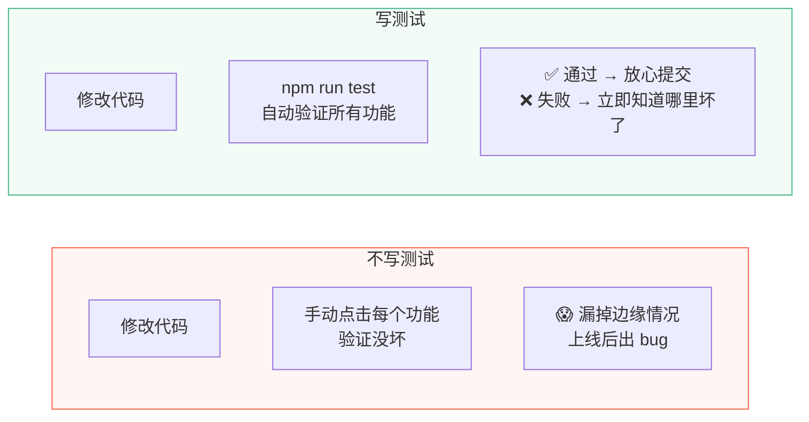
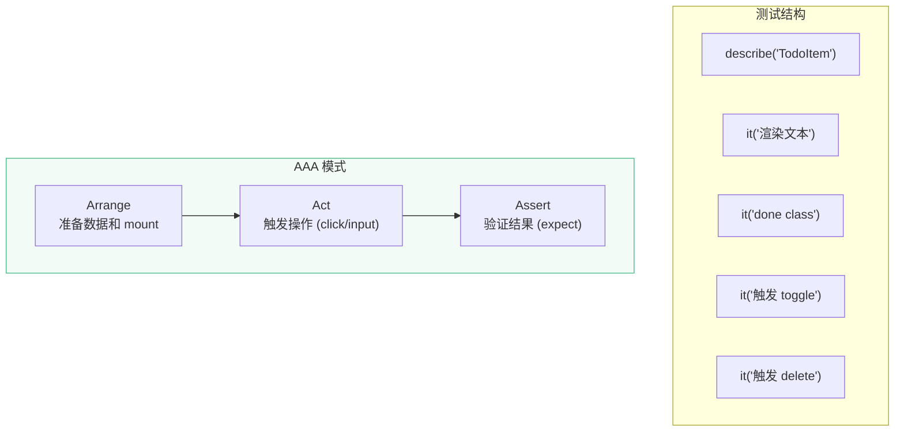

# L17 · 单元测试：Vitest + Vue Test Utils

```
🎯 本节目标：为核心组件、Composable 和 Pinia Store 编写单元测试
📦 本节产出：覆盖率 > 80% 的测试套件 + CI 可执行的测试脚本
🔗 前置钩子：L16 的完整功能集
🔗 后续钩子：L18 的 CI/CD 需要跑测试
```

---

## 1. 为什么要写测试



**测试不是"额外负担"，而是"修改代码的安全网"。** 项目越大越需要测试。

---

## 2. 安装配置

```bash
npm install -D vitest @vue/test-utils happy-dom @pinia/testing
```

```typescript
// vite.config.ts
import { defineConfig } from 'vite'
import vue from '@vitejs/plugin-vue'

export default defineConfig({
  plugins: [vue()],
  test: {
    environment: 'happy-dom',  // 模拟 DOM 环境
    globals: true,              // 全局注入 describe/it/expect
    setupFiles: ['./src/test/setup.ts'],
  },
})
```

```typescript
// src/test/setup.ts — 全局测试配置
import { config } from '@vue/test-utils'
import { createTestingPinia } from '@pinia/testing'

// 全局 stubs（可选）
config.global.stubs = {
  Transition: false,
  TransitionGroup: false,
}
```

```json
// package.json scripts
{
  "scripts": {
    "test": "vitest",
    "test:run": "vitest run",
    "test:coverage": "vitest run --coverage"
  }
}
```

---

## 3. 测试 Composable

Composable 是纯函数+响应式，最容易测试：

### 3.1 测试 useLocalStorage

```typescript
// src/composables/__tests__/useLocalStorage.spec.ts
import { describe, it, expect, beforeEach } from 'vitest'
import { useLocalStorage } from '../useLocalStorage'

describe('useLocalStorage', () => {
  beforeEach(() => {
    localStorage.clear()
  })

  it('应该返回默认值（localStorage 为空时）', () => {
    const data = useLocalStorage('test-key', 'default')
    expect(data.value).toBe('default')
  })

  it('应该从 localStorage 恢复数据', () => {
    localStorage.setItem('test-key', JSON.stringify('saved'))
    const data = useLocalStorage('test-key', 'default')
    expect(data.value).toBe('saved')
  })

  it('修改值时应该自动同步到 localStorage', async () => {
    const data = useLocalStorage('test-key', 'initial')
    data.value = 'updated'

    // watch 是异步的（nextTick 后执行），等待
    await new Promise(r => setTimeout(r, 0))

    const stored = JSON.parse(localStorage.getItem('test-key')!)
    expect(stored).toBe('updated')
  })

  it('应该处理复杂对象', () => {
    const data = useLocalStorage('test-obj', { count: 0, name: 'test' })
    expect(data.value.count).toBe(0)

    data.value.count = 5
    // 验证对象属性修改也被 deep watch 捕获
  })

  it('localStorage 中有非法 JSON 时应该使用默认值', () => {
    localStorage.setItem('test-key', 'invalid json{{{')
    // 应该不崩溃，返回默认值
    const data = useLocalStorage('test-key', 'fallback')
    expect(data.value).toBe('fallback')
  })
})
```

### 3.2 测试 useTodos

```typescript
// src/composables/__tests__/useTodos.spec.ts
import { describe, it, expect, beforeEach } from 'vitest'
import { useTodos } from '../useTodos'

describe('useTodos', () => {
  let todos: ReturnType<typeof useTodos>

  beforeEach(() => {
    localStorage.clear()
    todos = useTodos()
  })

  it('初始状态应该有默认待办', () => {
    expect(todos.todos.value.length).toBeGreaterThanOrEqual(0)
  })

  it('addTodo 应该添加新任务', () => {
    const before = todos.todos.value.length
    todos.addTodo('新任务')
    expect(todos.todos.value.length).toBe(before + 1)
    expect(todos.todos.value.at(-1)?.text).toBe('新任务')
  })

  it('addTodo 应该设置正确的默认值', () => {
    todos.addTodo('测试任务')
    const added = todos.todos.value.at(-1)!
    expect(added.done).toBe(false)
    expect(added.priority).toBe('medium')
    expect(added.id).toBeTypeOf('number')
  })

  it('toggleTodo 应该切换完成状态', () => {
    todos.addTodo('待切换')
    const id = todos.todos.value.at(-1)!.id
    expect(todos.todos.value.find(t => t.id === id)!.done).toBe(false)

    todos.toggleTodo(id)
    expect(todos.todos.value.find(t => t.id === id)!.done).toBe(true)

    todos.toggleTodo(id)
    expect(todos.todos.value.find(t => t.id === id)!.done).toBe(false)
  })

  it('deleteTodo 应该删除指定任务', () => {
    todos.addTodo('将被删除')
    const id = todos.todos.value.at(-1)!.id
    const before = todos.todos.value.length

    todos.deleteTodo(id)
    expect(todos.todos.value.length).toBe(before - 1)
    expect(todos.todos.value.find(t => t.id === id)).toBeUndefined()
  })

  it('clearDone 应该清除所有已完成任务', () => {
    todos.addTodo('任务 A')
    todos.addTodo('任务 B')
    const idA = todos.todos.value.at(-2)!.id
    todos.toggleTodo(idA) // 标记 A 为完成

    todos.clearDone()
    expect(todos.todos.value.find(t => t.id === idA)).toBeUndefined()
  })

  describe('filteredTodos', () => {
    it('filter = all 应该返回全部', () => {
      todos.filter.value = 'all'
      expect(todos.filteredTodos.value.length).toBe(todos.todos.value.length)
    })

    it('filter = active 应该只返回未完成', () => {
      todos.addTodo('活跃任务')
      todos.filter.value = 'active'
      todos.filteredTodos.value.forEach(t => {
        expect(t.done).toBe(false)
      })
    })

    it('filter = done 应该只返回已完成', () => {
      todos.addTodo('完成任务')
      const id = todos.todos.value.at(-1)!.id
      todos.toggleTodo(id)
      todos.filter.value = 'done'
      todos.filteredTodos.value.forEach(t => {
        expect(t.done).toBe(true)
      })
    })
  })

  describe('stats', () => {
    it('应该正确计算统计数据', () => {
      // 清空后添加 3 条
      todos.todos.value = []
      todos.addTodo('A')
      todos.addTodo('B')
      todos.addTodo('C')
      todos.toggleTodo(todos.todos.value[0].id) // A 完成

      expect(todos.stats.value.total).toBe(3)
      expect(todos.stats.value.doneCount).toBe(1)
      expect(todos.stats.value.activeCount).toBe(2)
      expect(todos.stats.value.donePercent).toBe(33) // Math.round(1/3*100)
    })
  })
})
```

---

## 4. 测试 Vue 组件

### 4.1 Vue Test Utils 基础

```typescript
import { mount } from '@vue/test-utils'
import TodoItem from '../TodoItem.vue'

// mount：完整渲染（包括子组件）
const wrapper = mount(TodoItem, {
  props: {
    id: 1,
    text: '学习 Vue',
    done: false,
    priority: 'high',
    createdAt: '2024-01-01',
  },
})

// 常用查询方法
wrapper.text()                      // 获取所有文本内容
wrapper.find('.todo-text')          // 按 CSS 选择器查找
wrapper.findAll('.tag')             // 查找所有匹配
wrapper.find('[data-testid="toggle"]')  // 按 data-testid 查找
wrapper.exists()                    // 元素是否存在
wrapper.classes()                   // 获取 CSS class 列表
wrapper.attributes('disabled')      // 获取属性值
```

### 4.2 测试 TodoItem

```typescript
// src/components/__tests__/TodoItem.spec.ts
import { describe, it, expect } from 'vitest'
import { mount } from '@vue/test-utils'
import TodoItem from '../TodoItem.vue'

const defaultProps = {
  id: 1,
  text: '学习 Vitest',
  done: false,
  priority: 'high' as const,
  createdAt: '2024-01-15',
}

describe('TodoItem', () => {
  it('应该渲染任务文本', () => {
    const wrapper = mount(TodoItem, { props: defaultProps })
    expect(wrapper.text()).toContain('学习 Vitest')
  })

  it('完成状态应该有 done class', () => {
    const wrapper = mount(TodoItem, {
      props: { ...defaultProps, done: true },
    })
    expect(wrapper.classes()).toContain('done')
  })

  it('未完成状态不应该有 done class', () => {
    const wrapper = mount(TodoItem, {
      props: { ...defaultProps, done: false },
    })
    expect(wrapper.classes()).not.toContain('done')
  })

  it('应该显示优先级标识', () => {
    const wrapper = mount(TodoItem, { props: defaultProps })
    const badge = wrapper.find('.priority-badge')
    expect(badge.exists()).toBe(true)
    expect(badge.text()).toContain('high')
  })

  it('点击切换按钮应该触发 toggle 事件', async () => {
    const wrapper = mount(TodoItem, { props: defaultProps })
    await wrapper.find('.toggle-btn').trigger('click')

    expect(wrapper.emitted('toggle')).toBeTruthy()
    expect(wrapper.emitted('toggle')![0]).toEqual([1])
  })

  it('点击删除按钮应该触发 delete 事件', async () => {
    const wrapper = mount(TodoItem, { props: defaultProps })
    await wrapper.find('.delete-btn').trigger('click')

    expect(wrapper.emitted('delete')).toBeTruthy()
    expect(wrapper.emitted('delete')![0]).toEqual([1])
  })

  it('完成状态文本应该有删除线样式', () => {
    const wrapper = mount(TodoItem, {
      props: { ...defaultProps, done: true },
    })
    const text = wrapper.find('.todo-text')
    expect(text.classes()).toContain('is-done')  // 完成状态的 CSS class
  })
})
```



---

## 5. 测试 Pinia Store

```typescript
// src/stores/__tests__/taskStore.spec.ts
import { describe, it, expect, beforeEach } from 'vitest'
import { setActivePinia, createPinia } from 'pinia'
import { useTaskStore } from '../taskStore'

describe('taskStore', () => {
  beforeEach(() => {
    // 每个测试创建全新的 Pinia 实例（隔离状态）
    setActivePinia(createPinia())
  })

  it('初始应该有默认任务', () => {
    const store = useTaskStore()
    expect(store.todos).toBeInstanceOf(Array)
  })

  it('addTodo 应该添加任务', () => {
    const store = useTaskStore()
    const before = store.todos.length
    store.addTodo('测试任务')
    expect(store.todos.length).toBe(before + 1)
  })

  it('toggleTodo 应该切换状态', () => {
    const store = useTaskStore()
    store.addTodo('待切换')
    const id = store.todos.at(-1)!.id

    store.toggleTodo(id)
    expect(store.todos.find(t => t.id === id)!.done).toBe(true)
  })

  it('stats getter 应该返回正确统计', () => {
    const store = useTaskStore()
    store.todos = [
      { id: 1, text: 'A', done: true, priority: 'low', createdAt: '' },
      { id: 2, text: 'B', done: false, priority: 'high', createdAt: '' },
      { id: 3, text: 'C', done: false, priority: 'medium', createdAt: '' },
    ]

    expect(store.stats.total).toBe(3)
    expect(store.stats.doneCount).toBe(1)
    expect(store.stats.activeCount).toBe(2)
    expect(store.stats.donePercent).toBe(33)
  })
})
```

### 5.1 使用 @pinia/testing

```typescript
// 在组件测试中使用 createTestingPinia
import { mount } from '@vue/test-utils'
import { createTestingPinia } from '@pinia/testing'
import HomeView from '../HomeView.vue'

const wrapper = mount(HomeView, {
  global: {
    plugins: [
      createTestingPinia({
        initialState: {
          task: {
            todos: [
              { id: 1, text: '测试任务', done: false, priority: 'high', createdAt: '' },
            ],
          },
        },
        // stubActions: false,  // 设为 false 让 actions 真正执行
      }),
    ],
  },
})
```

---

## 6. 测试最佳实践

### 6.1 测什么，不测什么

| ✅ 应该测 | ❌ 不应该测 |
|----------|-----------|
| 组件的输出（渲染内容） | 组件的内部实现细节 |
| Props 是否正确渲染 | 具体的 CSS 样式 |
| 事件是否正确触发 | 第三方库的行为 |
| Composable 的返回值 | Vue 框架本身的功能 |
| Store 的状态变化 | private 方法 |
| 边缘情况和错误处理 | 快照测试（除非有意义） |

### 6.2 data-testid 的使用

```vue
<!-- 在组件中添加 test id -->
<button data-testid="add-todo-btn" @click="addTodo">添加</button>
<input data-testid="todo-input" v-model="text" />
```

```typescript
// 在测试中使用
wrapper.find('[data-testid="add-todo-btn"]').trigger('click')
wrapper.find('[data-testid="todo-input"]').setValue('新任务')
```

**好处：** 不依赖 CSS class 或 DOM 结构，重构样式不会破坏测试。

### 6.3 测试覆盖率

```bash
# 安装覆盖率工具
npm install -D @vitest/coverage-v8

# 运行覆盖率报告
npm run test:coverage
```

```
 ✓ src/composables/__tests__/useLocalStorage.spec.ts (5 tests)
 ✓ src/composables/__tests__/useTodos.spec.ts (10 tests)
 ✓ src/components/__tests__/TodoItem.spec.ts (7 tests)
 ✓ src/stores/__tests__/taskStore.spec.ts (4 tests)

 Test Files  4 passed (4)
      Tests  26 passed (26)

 ----------|---------|----------|---------|---------|
 File       | % Stmts | % Branch | % Funcs | % Lines |
 -----------|---------|----------|---------|---------|
 All files  |   84.2  |   78.5   |   91.3  |   84.2  |
 -----------|---------|----------|---------|---------|
```

---

## 7. 本节总结

### 文件结构

```
src/
├── composables/
│   ├── useLocalStorage.ts
│   ├── useTodos.ts
│   └── __tests__/
│       ├── useLocalStorage.spec.ts
│       └── useTodos.spec.ts
├── components/
│   ├── TodoItem.vue
│   └── __tests__/
│       └── TodoItem.spec.ts
├── stores/
│   ├── taskStore.ts
│   └── __tests__/
│       └── taskStore.spec.ts
└── test/
    └── setup.ts
```

### 检查清单

- [ ] 能安装和配置 Vitest + Vue Test Utils
- [ ] 能测试 Composable 的返回值和响应式行为
- [ ] 能用 `mount()` 渲染组件并查询 DOM
- [ ] 能用 `trigger()` 模拟用户交互
- [ ] 能用 `emitted()` 验证事件触发
- [ ] 能用 `setActivePinia(createPinia())` 隔离 Store 测试
- [ ] 能用 `createTestingPinia` 在组件测试中注入 Store
- [ ] 知道 data-testid 的优势
- [ ] 能生成覆盖率报告

### Git 提交

```bash
git add .
git commit -m "L17: Vitest 单元测试 - 组件/Composable/Store"
```

### 🔗 → 下一节

L18 将在 GitHub Actions 中自动运行这些测试，并把应用部署到 Vercel——完成从开发到上线的完整链路。
