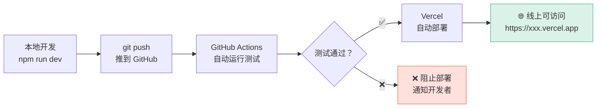
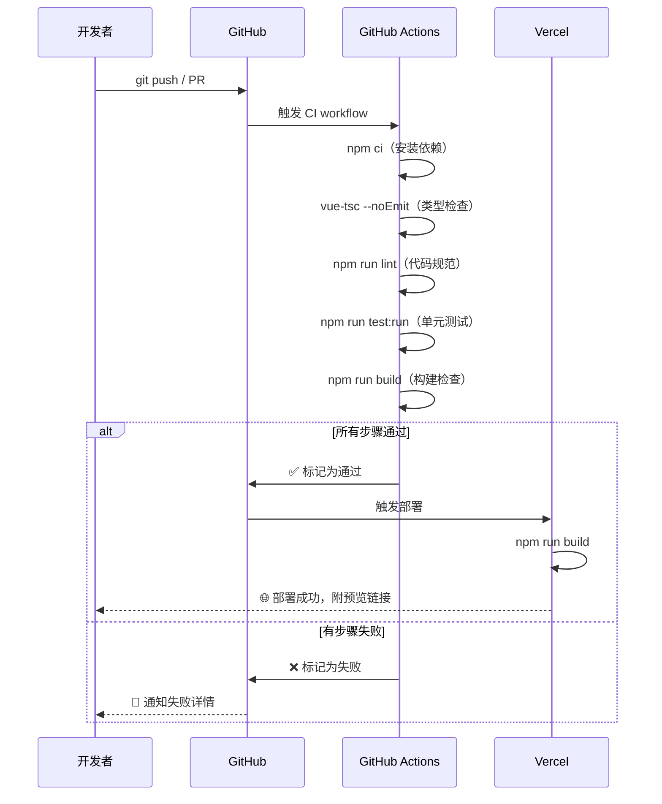
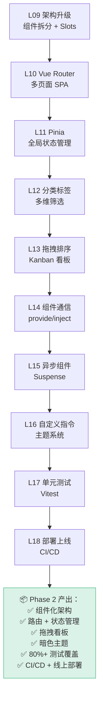

---
prev:
  text: 'L17 · 单元测试'
  link: '/lessons/phase-2/L17-testing'
next:
  text: '🚀 Phase 3 → L19 · 后端搭建'
  link: '/lessons/phase-3/L19-backend-setup'
---

# L18 · 部署上线：CI/CD

```
🎯 本节目标：将应用部署到 Vercel，配置 GitHub Actions CI 自动测试和部署
📦 本节产出：线上可访问的任务管理系统 + CI/CD 流水线 + Phase 2 总结
🔗 前置钩子：L17 的测试套件（CI 需要跑测试）
🔗 后续钩子：Phase 3 将在此基础上添加后端 API
```

---

## 1. 部署概览



---

## 2. 构建生产版本

### 2.1 构建命令

```bash
npm run build
```

Vite 会输出优化后的静态文件到 `dist/` 目录：

```
dist/
├── index.html                    # 入口 HTML
├── assets/
│   ├── index-a1b2c3d4.js        # 主 JS bundle（含 hash）
│   ├── index-e5f6g7h8.css       # 主 CSS bundle
│   ├── HomeView-i9j0k1l2.js     # 路由懒加载 chunk
│   └── StatsView-m3n4o5p6.js    # 路由懒加载 chunk
└── favicon.ico
```

**文件名中的 hash** 用于缓存策略——内容变化时 hash 变化，浏览器自动拉新版本。

### 2.2 本地预览

```bash
npm run preview
# 在 http://localhost:4173 预览生产版本
```

### 2.3 常见构建问题

| 问题 | 原因 | 解决 |
|------|------|------|
| 路由刷新 404 | SPA 只有一个 index.html | 配置服务器 fallback（见下文） |
| 环境变量缺失 | `.env` 没有 `VITE_` 前缀 | `VITE_API_URL` 才会暴露给客户端 |
| 体积过大 | 未 tree-shake | 检查 `import` 是否按需导入 |
| 图片/字体 404 | 路径问题 | 使用 `import` 导入或放 `public/` |

---

## 3. 部署到 Vercel

### 3.1 为什么选 Vercel

| 平台 | 优点 | 缺点 |
|------|------|------|
| **Vercel** | 零配置 Vue/Vite 支持、全球 CDN、自动 HTTPS | 免费版有限制 |
| Netlify | 类似 Vercel、表单处理 | 构建速度稍慢 |
| GitHub Pages | 免费无限制 | 只支持静态、无服务端 |
| Cloudflare Pages | 超快 CDN | 配置稍复杂 |

### 3.2 Vercel 部署步骤

1. **连接 GitHub 仓库**

```bash
# 确保代码已推到 GitHub
git remote add origin https://github.com/你的用户名/vue-todo.git
git push -u origin main
```

2. **在 Vercel 中导入项目**

访问 [vercel.com](https://vercel.com) → New Project → Import Git Repository → 选择仓库。

3. **Vercel 自动识别 Vite 项目**

Vercel 会检测到 `vite.config.ts`，自动设置：
- Build Command: `npm run build`
- Output Directory: `dist`
- Install Command: `npm install`

4. **配置 SPA 路由 fallback**

```json
// vercel.json
{
  "rewrites": [
    { "source": "/(.*)", "destination": "/index.html" }
  ]
}
```

这告诉 Vercel：所有路由都返回 `index.html`，由 Vue Router 在客户端处理路由。

### 3.3 环境变量

在 Vercel 项目设置 → Environment Variables 中添加：

```
VITE_API_URL=https://api.example.com
```

> **注意：** Vite 环境变量必须以 `VITE_` 开头才会暴露给前端代码。

```typescript
// 在代码中使用
const apiUrl = import.meta.env.VITE_API_URL
```

---

## 4. GitHub Actions CI

### 4.1 创建 CI 工作流

```yaml
# .github/workflows/ci.yml
name: CI

on:
  push:
    branches: [main]
  pull_request:
    branches: [main]

jobs:
  test:
    runs-on: ubuntu-latest

    strategy:
      matrix:
        node-version: [18, 20]

    steps:
      - name: 检出代码
        uses: actions/checkout@v4

      - name: 安装 Node.js ${{ matrix.node-version }}
        uses: actions/setup-node@v4
        with:
          node-version: ${{ matrix.node-version }}
          cache: 'npm'

      - name: 安装依赖
        run: npm ci

      - name: 类型检查
        run: npx vue-tsc --noEmit

      - name: Lint 检查
        run: npm run lint
        if: ${{ hashFiles('.eslintrc*') != '' }}

      - name: 运行测试
        run: npm run test:run

      - name: 构建
        run: npm run build
```



### 4.2 PR 状态检查

在 GitHub 仓库 Settings → Branches → Branch protection rules 中：

```
✅ Require status checks to pass before merging
  ✅ test (18)
  ✅ test (20)
```

这确保了**只有通过测试的代码才能合并到 main 分支**。

---

## 5. 自动部署流程

Vercel + GitHub 的集成是**自动**的：

| 触发事件 | 行为 |
|---------|------|
| Push to `main` | 生产环境部署（Production） |
| Push to 其他分支 | 预览环境部署（Preview） |
| Pull Request | 自动生成预览 URL |
| PR 关闭 | 自动清理预览环境 |

```
main 分支
├── commit abc → https://vue-todo.vercel.app（生产）
└── commit def → https://vue-todo.vercel.app（更新生产）

feature/kanban 分支
├── PR #5 → https://vue-todo-pr-5.vercel.app（预览）
└── 合并后自动销毁预览
```

---

## 5.5 生产部署进阶

### 构建产物分析

上线前建议检查打包体积，避免引入过大的依赖：

```bash
# 安装分析插件
npm install -D rollup-plugin-visualizer
```

```typescript
// vite.config.ts
import { visualizer } from 'rollup-plugin-visualizer'

export default defineConfig({
  plugins: [
    vue(),
    visualizer({
      open: true,           // 构建后自动打开分析页面
      gzipSize: true,       // 显示 gzip 后大小
      brotliSize: true,     // 显示 brotli 后大小
    }),
  ],
})
```

```bash
npm run build  # 构建后自动打开 stats.html 可视化分析
```

### 回滚方案

Vercel 保留每次部署的快照，回滚非常简单：

```
# 方式 1：Vercel 仪表板
Deployments → 选择之前的稳定部署 → Promote to Production

# 方式 2：Git 回滚
git revert HEAD
git push origin main  # 触发新部署，代码恢复到上一版本
```

> [!TIP]
> 养成好习惯：每次上线前用 `npm run build && npx serve dist` 在本地验证生产构建，避免"开发环境正常、生产环境白屏"的问题。

---

## 6. 自定义域名（可选）

```
1. 在域名注册商设置 CNAME 记录：
   todo.yourdomain.com → cname.vercel-dns.com

2. 在 Vercel 项目设置 → Domains → 添加 todo.yourdomain.com

3. Vercel 自动配置 HTTPS（Let's Encrypt 证书）
```

---

## 7. Phase 2 总结

恭喜完成 Phase 2！回顾学到的所有内容：



| 技能 | 掌握标志 |
|------|---------|
| 组件架构 | 能按功能拆分组件树 |
| Vue Router | 能配置嵌套路由和守卫 |
| Pinia | 能设计多 Store + 持久化 |
| 拖拽交互 | 能实现 Kanban 看板 |
| 组件通信 | 能根据场景选择正确方案 |
| 异步加载 | 能用 Suspense 和骨架屏 |
| 自定义指令 | 能封装 DOM 操作指令 |
| 单元测试 | 能测试组件/Composable/Store |
| CI/CD | 能配置 GitHub Actions + 自动部署 |

### Git 提交

```bash
git add .
git commit -m "L18: CI/CD + Vercel 部署 [Phase 2 完成]"
git tag phase-2-complete
```

---

## 🔗 → Phase 3：全栈电商

Phase 3 将在 Phase 2 的前端基础上添加**后端 API**，演进为全栈电商应用：

- L19：Express + MongoDB 后端搭建
- L20：RESTful API 设计
- L21-L30：认证、购物车、订单、支付、WebSocket、SSR...

**Phase 2 的所有代码、路由、Store、测试都会被保留和复用。**
