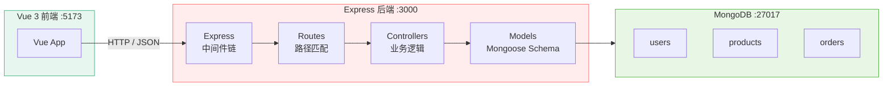
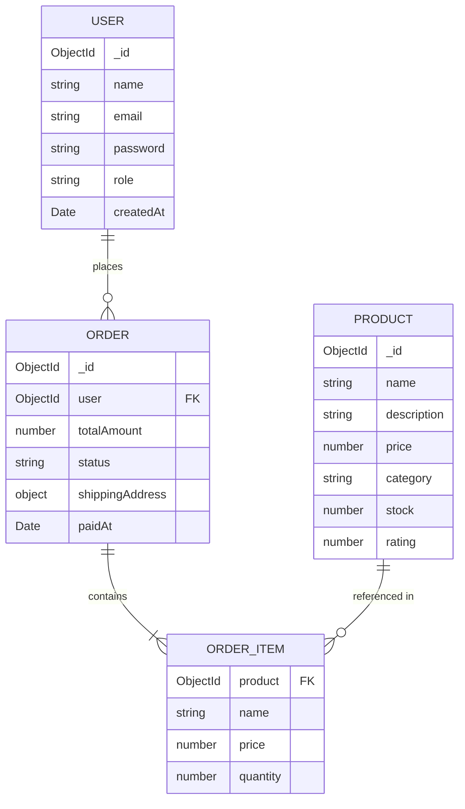
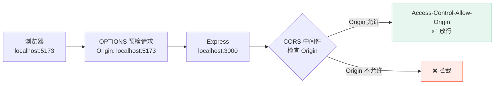

# L19 · 后端搭建：Express + MongoDB

```
🎯 本节目标：搭建 Node.js 后端服务，连接 MongoDB 数据库
📦 本节产出：可运行的 Express 服务 + 数据库连接 + 商品/用户数据模型
🔗 前置钩子：Phase 2 的完整前端架构（L18 产出）
🔗 后续钩子：L20 将基于数据模型实现 RESTful API
```

> [!NOTE]
> **Phase 2 → Phase 3 过渡说明**
>
> Phase 2 围绕任务管理系统构建了完整的前端工程基础——路由、状态管理、组件通信、测试、部署。
> Phase 3 将**沿用这些工程基础**，迁移到一个全新的全栈电商项目。业务场景变了，但架构思路延续：
> - Vue Router → 电商页面路由（商品/购物车/订单）
> - Pinia → 购物车/认证等复杂状态管理
> - Axios + 拦截器 → 与后端 API 通信
> - Vitest → 后端 API 测试 + 前端组件测试
>
> 之所以切换业务场景，是因为全栈电商涵盖**认证、支付、实时通信、SSR** 等前端无法独立实练的维度。

---

## 1. 项目结构

Phase 3 采用 monorepo 结构，前后端放在同一仓库：

```
vue-todo/
├── client/                   # Vue 3 前端（Phase 1-2 的代码移入）
│   ├── src/
│   ├── package.json
│   └── vite.config.ts
├── server/                   # Express 后端（新增）
│   ├── src/
│   │   ├── config/
│   │   │   └── db.ts         # 数据库连接
│   │   ├── models/           # Mongoose 数据模型
│   │   │   ├── User.ts
│   │   │   ├── Product.ts
│   │   │   └── Order.ts
│   │   ├── routes/           # 路由定义
│   │   ├── controllers/      # 请求处理逻辑
│   │   ├── middleware/        # 中间件（认证、错误处理）
│   │   ├── utils/            # 工具函数
│   │   └── app.ts            # Express 入口
│   ├── package.json
│   └── tsconfig.json
└── package.json              # 根 package.json（workspace 脚本）
```

---

## 2. 初始化后端项目

```bash
mkdir server && cd server
npm init -y
npm install express cors dotenv mongoose
npm install -D typescript ts-node-dev @types/express @types/cors @types/node
npx tsc --init
```

### 2.1 TypeScript 配置

```json
// server/tsconfig.json
{
  "compilerOptions": {
    "target": "ES2020",
    "module": "commonjs",
    "rootDir": "./src",
    "outDir": "./dist",
    "strict": true,
    "esModuleInterop": true,
    "resolveJsonModule": true
  },
  "include": ["src/**/*"]
}
```

### 2.2 Express 入口

```typescript
// server/src/app.ts
import express from 'express'
import cors from 'cors'
import dotenv from 'dotenv'
import { connectDB } from './config/db'

dotenv.config()

const app = express()
const PORT = process.env.PORT || 3000

// 中间件
app.use(cors({
  origin: process.env.CLIENT_URL || 'http://localhost:5173',
  credentials: true,
}))
app.use(express.json())            // 解析 JSON 请求体
app.use(express.urlencoded({ extended: true }))

// 健康检查
app.get('/api/health', (req, res) => {
  res.json({ status: 'ok', timestamp: new Date().toISOString() })
})

// 启动
async function start() {
  await connectDB()
  app.listen(PORT, () => {
    console.log(`✅ Server running on http://localhost:${PORT}`)
  })
}

start().catch(console.error)

export default app
```

---

## 3. 连接 MongoDB

```typescript
// server/src/config/db.ts
import mongoose from 'mongoose'

export async function connectDB() {
  const uri = process.env.MONGODB_URI || 'mongodb://localhost:27017/vue-shop'

  try {
    await mongoose.connect(uri)
    console.log('✅ MongoDB connected:', mongoose.connection.name)
  } catch (error) {
    console.error('❌ MongoDB connection error:', error)
    process.exit(1)
  }

  mongoose.connection.on('error', (err) => {
    console.error('MongoDB error:', err)
  })
}
```



---

## 4. 数据模型（Mongoose Schema）

### 4.1 用户模型

```typescript
// server/src/models/User.ts
import mongoose, { Schema, Document } from 'mongoose'

export interface IUser extends Document {
  name: string
  email: string
  password: string  // 加密后的密码
  role: 'user' | 'admin'
  avatar?: string
  createdAt: Date
}

const userSchema = new Schema<IUser>({
  name: { type: String, required: true, trim: true },
  email: {
    type: String, required: true, unique: true,
    lowercase: true, trim: true,
    match: [/^\S+@\S+\.\S+$/, '邮箱格式不正确'],
  },
  password: { type: String, required: true, minlength: 6, select: false },
  role: { type: String, enum: ['user', 'admin'], default: 'user' },
  avatar: String,
}, { timestamps: true })

export default mongoose.model<IUser>('User', userSchema)
```

### 4.2 商品模型

```typescript
// server/src/models/Product.ts
import mongoose, { Schema, Document } from 'mongoose'

export interface IProduct extends Document {
  name: string
  description: string
  price: number
  category: string
  images: string[]
  stock: number
  rating: number
  reviewCount: number
  isActive: boolean
}

const productSchema = new Schema<IProduct>({
  name: { type: String, required: true, trim: true },
  description: { type: String, required: true },
  price: { type: Number, required: true, min: 0 },
  category: { type: String, required: true, index: true },
  images: [{ type: String }],
  stock: { type: Number, required: true, min: 0, default: 0 },
  rating: { type: Number, default: 0, min: 0, max: 5 },
  reviewCount: { type: Number, default: 0 },
  isActive: { type: Boolean, default: true },
}, { timestamps: true })

// 索引：按分类和价格查询
productSchema.index({ category: 1, price: 1 })
// 文本索引：支持搜索
productSchema.index({ name: 'text', description: 'text' })

export default mongoose.model<IProduct>('Product', productSchema)
```

### 4.3 订单模型

```typescript
// server/src/models/Order.ts
import mongoose, { Schema, Document, Types } from 'mongoose'

export interface IOrderItem {
  product: Types.ObjectId
  name: string
  price: number
  quantity: number
  image: string
}

export interface IOrder extends Document {
  user: Types.ObjectId
  items: IOrderItem[]
  totalAmount: number
  status: 'pending' | 'paid' | 'shipped' | 'delivered' | 'cancelled'
  shippingAddress: {
    name: string
    phone: string
    address: string
    city: string
  }
  paymentMethod: string
  paidAt?: Date
  deliveredAt?: Date
}

const orderSchema = new Schema<IOrder>({
  user: { type: Schema.Types.ObjectId, ref: 'User', required: true },
  items: [{
    product: { type: Schema.Types.ObjectId, ref: 'Product', required: true },
    name: String,
    price: Number,
    quantity: { type: Number, required: true, min: 1 },
    image: String,
  }],
  totalAmount: { type: Number, required: true },
  status: {
    type: String,
    enum: ['pending', 'paid', 'shipped', 'delivered', 'cancelled'],
    default: 'pending',
  },
  shippingAddress: {
    name: String, phone: String, address: String, city: String,
  },
  paymentMethod: { type: String, default: 'wechat' },
  paidAt: Date,
  deliveredAt: Date,
}, { timestamps: true })

export default mongoose.model<IOrder>('Order', orderSchema)
```

---

## 5. ER 图



---

## 6. 环境变量

```bash
# server/.env
PORT=3000
MONGODB_URI=mongodb://localhost:27017/vue-shop
CLIENT_URL=http://localhost:5173
JWT_SECRET=your-super-secret-key-change-in-production
JWT_EXPIRES_IN=7d
```

---

## 7. 开发脚本

```json
// server/package.json
{
  "scripts": {
    "dev": "ts-node-dev --respawn --transpile-only src/app.ts",
    "build": "tsc",
    "start": "node dist/app.js"
  }
}
```

```bash
npm run dev
# ✅ Server running on http://localhost:3000
# ✅ MongoDB connected: vue-shop
```

---

## 8. CORS：前后端分离的跨域



---

## 9. 本节总结

### 检查清单

- [ ] 能搭建 Express + TypeScript 项目
- [ ] 能连接 MongoDB 并处理连接错误
- [ ] 能用 Mongoose 定义 Schema 和 Model
- [ ] 理解 monorepo 前后端项目结构
- [ ] 理解 CORS 跨域配置
- [ ] 能用 `ts-node-dev` 实现热重载开发

```bash
git add .
git commit -m "L19: Express + MongoDB 后端搭建"
```

## 🔗 → 下一节：L20 将基于这些 Model 实现完整的 RESTful CRUD API。
