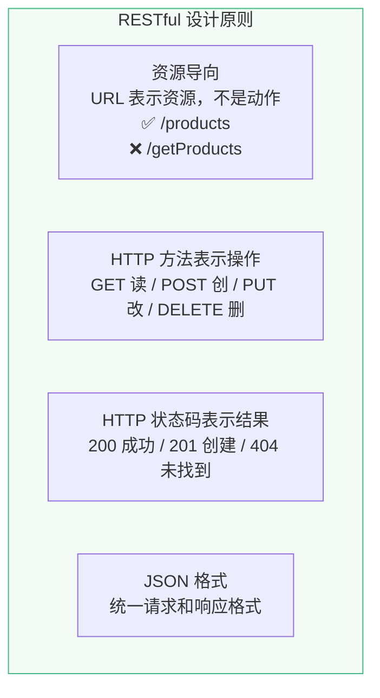
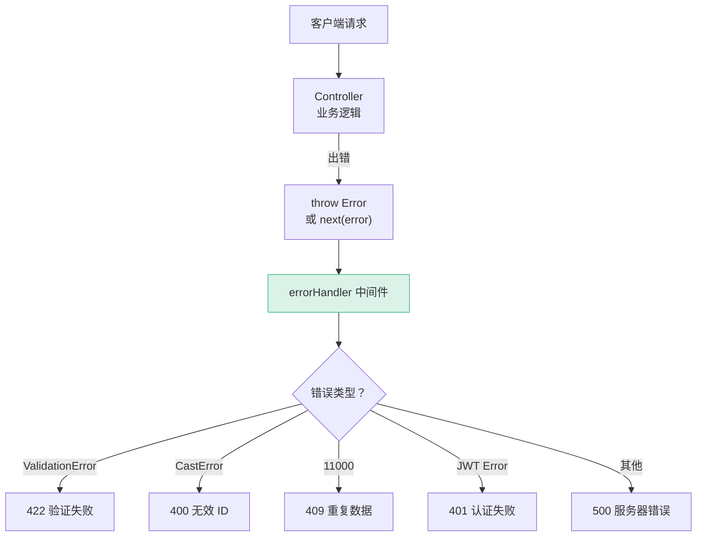

# L20 · RESTful API 设计与实现

```
🎯 本节目标：设计规范的 RESTful API，实现 CRUD 控制器 + 错误处理中间件
📦 本节产出：完整的商品 CRUD API + 统一错误处理 + 请求验证
🔗 前置钩子：L19 的 Express + MongoDB 基础
🔗 后续钩子：L21 将在前端用 Axios 调用这些 API
```

---

## 1. RESTful 设计规范

### 1.1 核心原则



### 1.2 API 路由设计

| 方法 | 路径 | 描述 | 状态码 |
|------|------|------|--------|
| `GET` | `/api/products` | 获取商品列表（支持分页/搜索） | 200 |
| `GET` | `/api/products/:id` | 获取单个商品详情 | 200 / 404 |
| `POST` | `/api/products` | 创建新商品 | 201 |
| `PUT` | `/api/products/:id` | 更新商品（全量） | 200 / 404 |
| `PATCH` | `/api/products/:id` | 部分更新商品 | 200 / 404 |
| `DELETE` | `/api/products/:id` | 删除商品 | 204 / 404 |

```
❌ 错误的 URL 设计：
GET  /api/getProducts
POST /api/createProduct
POST /api/deleteProduct/123

✅ 正确的 RESTful 设计：
GET    /api/products         → 列表
GET    /api/products/123     → 详情
POST   /api/products         → 创建
PUT    /api/products/123     → 更新
DELETE /api/products/123     → 删除
```

---

## 2. 统一响应格式

```typescript
// server/src/utils/response.ts

// 成功响应
export function success(res: Response, data: any, statusCode = 200) {
  return res.status(statusCode).json({
    success: true,
    data,
  })
}

// 分页成功响应
export function successWithPagination(
  res: Response,
  data: any[],
  pagination: { page: number; limit: number; total: number }
) {
  return res.status(200).json({
    success: true,
    data,
    pagination: {
      ...pagination,
      totalPages: Math.ceil(pagination.total / pagination.limit),
    },
  })
}

// 错误响应
export function error(res: Response, message: string, statusCode = 400) {
  return res.status(statusCode).json({
    success: false,
    message,
  })
}
```

---

## 3. 商品控制器

```typescript
// server/src/controllers/productController.ts
import { Request, Response, NextFunction } from 'express'
import Product from '../models/Product'

// GET /api/products — 获取商品列表
export async function getProducts(req: Request, res: Response, next: NextFunction) {
  try {
    const {
      page = '1',
      limit = '12',
      search = '',
      category = '',
      sort = '-createdAt',
      minPrice,
      maxPrice,
    } = req.query

    const pageNum = Math.max(1, parseInt(page as string))
    const limitNum = Math.min(50, parseInt(limit as string))  // 最多 50 条
    const skip = (pageNum - 1) * limitNum

    // 构建查询条件
    const query: any = { isActive: true }

    if (search) {
      query.$or = [
        { name: { $regex: search, $options: 'i' } },
        { description: { $regex: search, $options: 'i' } },
      ]
    }

    if (category) {
      query.category = category
    }

    if (minPrice || maxPrice) {
      query.price = {}
      if (minPrice) query.price.$gte = parseFloat(minPrice as string)
      if (maxPrice) query.price.$lte = parseFloat(maxPrice as string)
    }

    // 并行查询数据和总数
    const [products, total] = await Promise.all([
      Product.find(query)
        .sort(sort as string)
        .skip(skip)
        .limit(limitNum)
        .lean(),             // .lean() 返回普通对象，性能更好
      Product.countDocuments(query),
    ])

    res.json({
      success: true,
      data: products,
      pagination: {
        page: pageNum,
        limit: limitNum,
        total,
        totalPages: Math.ceil(total / limitNum),
      },
    })
  } catch (error) {
    next(error)
  }
}

// GET /api/products/:id — 获取单个商品
export async function getProductById(req: Request, res: Response, next: NextFunction) {
  try {
    const product = await Product.findById(req.params.id).lean()

    if (!product) {
      return res.status(404).json({
        success: false,
        message: '商品不存在',
      })
    }

    res.json({ success: true, data: product })
  } catch (error) {
    next(error)
  }
}

// POST /api/products — 创建商品
export async function createProduct(req: Request, res: Response, next: NextFunction) {
  try {
    const { name, description, price, category, images, stock } = req.body

    // 验证必填字段
    if (!name || !price) {
      return res.status(400).json({
        success: false,
        message: '商品名称和价格为必填项',
      })
    }

    const product = await Product.create({
      name,
      description: description || '',
      price,
      category: category || '默认分类',
      images: images || [],
      stock: stock || 0,
      rating: 0,
      reviewCount: 0,
      isActive: true,
    })

    res.status(201).json({
      success: true,
      data: product,
    })
  } catch (error) {
    next(error)
  }
}

// PUT /api/products/:id — 更新商品
export async function updateProduct(req: Request, res: Response, next: NextFunction) {
  try {
    const product = await Product.findByIdAndUpdate(
      req.params.id,
      { $set: req.body },
      { new: true, runValidators: true }  // new: true 返回更新后的文档
    )

    if (!product) {
      return res.status(404).json({
        success: false,
        message: '商品不存在',
      })
    }

    res.json({ success: true, data: product })
  } catch (error) {
    next(error)
  }
}

// DELETE /api/products/:id — 删除商品（软删除）
export async function deleteProduct(req: Request, res: Response, next: NextFunction) {
  try {
    const product = await Product.findByIdAndUpdate(
      req.params.id,
      { isActive: false },  // 软删除：标记为不活跃
      { new: true }
    )

    if (!product) {
      return res.status(404).json({
        success: false,
        message: '商品不存在',
      })
    }

    res.status(204).end()  // 204 No Content
  } catch (error) {
    next(error)
  }
}
```

---

## 4. 路由配置

```typescript
// server/src/routes/productRoutes.ts
import { Router } from 'express'
import {
  getProducts,
  getProductById,
  createProduct,
  updateProduct,
  deleteProduct,
} from '../controllers/productController'
import { authMiddleware } from '../middlewares/auth'
import { adminOnly } from '../middlewares/role'

const router = Router()

// 公开路由
router.get('/', getProducts)
router.get('/:id', getProductById)

// 需要认证 + 管理员权限
router.post('/', authMiddleware, adminOnly, createProduct)
router.put('/:id', authMiddleware, adminOnly, updateProduct)
router.delete('/:id', authMiddleware, adminOnly, deleteProduct)

export default router
```

```typescript
// server/src/app.ts
import express from 'express'
import cors from 'cors'
import productRoutes from './routes/productRoutes'
import authRoutes from './routes/authRoutes'
import { errorHandler } from './middlewares/errorHandler'

const app = express()

app.use(cors({ origin: process.env.CLIENT_URL || 'http://localhost:5173' }))
app.use(express.json({ limit: '10mb' }))

// 路由
app.use('/api/products', productRoutes)
app.use('/api/auth', authRoutes)

// 全局错误处理（必须在路由之后）
app.use(errorHandler)

export default app
```

---

## 5. 统一错误处理中间件

```typescript
// server/src/middlewares/errorHandler.ts
import { Request, Response, NextFunction } from 'express'

export function errorHandler(
  err: any,
  req: Request,
  res: Response,
  next: NextFunction
) {
  console.error('🔥 Error:', err.message)

  // Mongoose 验证错误
  if (err.name === 'ValidationError') {
    const messages = Object.values(err.errors).map((e: any) => e.message)
    return res.status(422).json({
      success: false,
      message: '数据验证失败',
      errors: messages,
    })
  }

  // Mongoose CastError（无效的 ObjectId）
  if (err.name === 'CastError' && err.kind === 'ObjectId') {
    return res.status(400).json({
      success: false,
      message: '无效的 ID 格式',
    })
  }

  // MongoDB 重复键错误
  if (err.code === 11000) {
    const field = Object.keys(err.keyValue)[0]
    return res.status(409).json({
      success: false,
      message: `${field} 已存在`,
    })
  }

  // JWT 错误
  if (err.name === 'JsonWebTokenError') {
    return res.status(401).json({
      success: false,
      message: 'Token 无效',
    })
  }

  if (err.name === 'TokenExpiredError') {
    return res.status(401).json({
      success: false,
      message: 'Token 已过期',
    })
  }

  // 默认 500 错误
  res.status(err.statusCode || 500).json({
    success: false,
    message: err.message || '服务器内部错误',
  })
}
```



---

## 6. 请求验证中间件

```typescript
// server/src/middlewares/validate.ts
import { Request, Response, NextFunction } from 'express'

type ValidationRule = {
  field: string
  required?: boolean
  type?: 'string' | 'number' | 'boolean'
  min?: number
  max?: number
  minLength?: number
  maxLength?: number
}

export function validate(rules: ValidationRule[]) {
  return (req: Request, res: Response, next: NextFunction) => {
    const errors: string[] = []

    for (const rule of rules) {
      const value = req.body[rule.field]

      if (rule.required && (value === undefined || value === null || value === '')) {
        errors.push(`${rule.field} 为必填项`)
        continue
      }

      if (value !== undefined) {
        if (rule.type === 'number' && typeof value !== 'number') {
          errors.push(`${rule.field} 必须是数字`)
        }
        if (rule.min !== undefined && value < rule.min) {
          errors.push(`${rule.field} 不能小于 ${rule.min}`)
        }
        if (rule.maxLength !== undefined && typeof value === 'string' && value.length > rule.maxLength) {
          errors.push(`${rule.field} 长度不能超过 ${rule.maxLength}`)
        }
      }
    }

    if (errors.length > 0) {
      return res.status(400).json({ success: false, message: '参数错误', errors })
    }

    next()
  }
}

// 使用
router.post('/',
  authMiddleware,
  validate([
    { field: 'name', required: true, maxLength: 100 },
    { field: 'price', required: true, type: 'number', min: 0 },
    { field: 'stock', type: 'number', min: 0 },
  ]),
  createProduct
)
```

---

## 7. 本节总结

### 检查清单

- [ ] 能设计规范的 RESTful URL（资源导向、HTTP 方法语义化）
- [ ] 能实现 CRUD 控制器（getList / getById / create / update / delete）
- [ ] 能实现分页 + 搜索 + 排序 + 价格过滤
- [ ] 理解 `.lean()` 对查询性能的优化
- [ ] 能实现统一错误处理中间件（区分不同错误类型）
- [ ] 能实现请求验证中间件
- [ ] 理解软删除 vs 硬删除的区别
- [ ] 能用 `Promise.all` 并行查询数据和总数

### 🐞 防坑指南

| 坑 | 说明 | 正确做法 |
|----|------|---------|
| URL 中用动词 | `/api/getProducts` 不符合 REST | 用名词 `/api/products` + HTTP 方法 |
| 全量 PUT 缺字段 | PUT 未传的字段被清空 | 部分更新用 PATCH，全量替换用 PUT |
| 分页不限制上限 | `?limit=999999` 拖垮数据库 | `Math.min(50, limit)` 强制上限 |
| 硬删除数据 | `DELETE` 真删 → 无法恢复 | 用 `isActive: false` 软删除 |
| 错误中间件顺序错 | 放在路由前面 → 永远不触发 | 错误处理中间件必须在所有路由之后 |

### 📐 最佳实践

1. **统一响应格式**：`{ success, data, message, pagination }` 前后端约定一致
2. **查询用 `.lean()`**：只读查询加 `.lean()` 返回纯对象，性能提升 5-10 倍
3. **并行查询**：`Promise.all([find(), countDocuments()])` 而非串行
4. **状态码语义化**：201 创建、204 无内容删除、422 验证失败、409 冲突

### Git 提交

```bash
git add .
git commit -m "L20: RESTful API + CRUD + 错误处理 + 验证"
```

### 🔗 → 下一节

L21 将在前端用 Axios 封装调用这些 API——创建实例、拦截器、API 模块化、useRequest composable。
