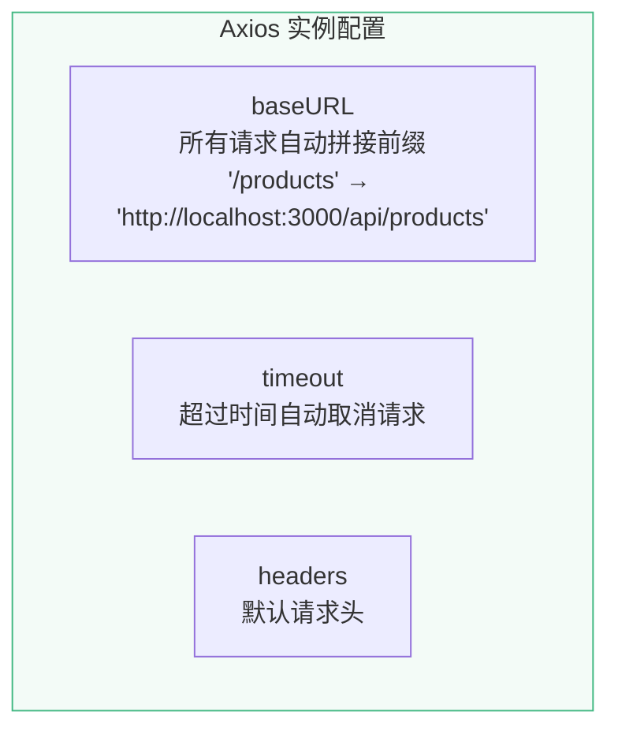
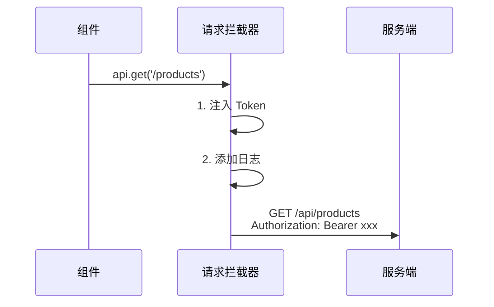
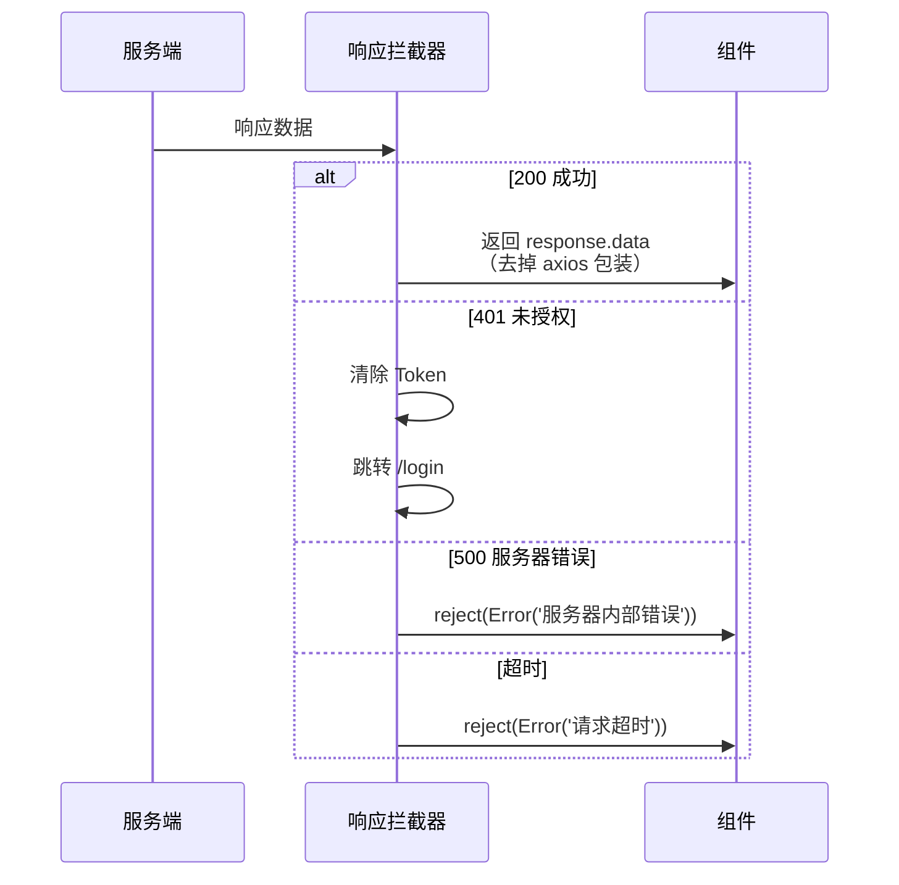
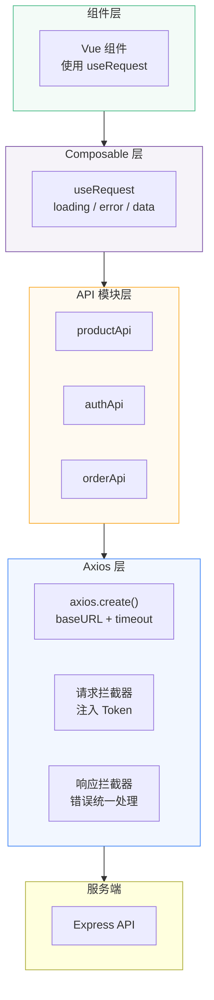

# L21 · Axios 封装：前后端联通

```
🎯 本节目标：封装 Axios 实例，实现请求/响应拦截器，构建 API 模块化架构
📦 本节产出：Axios 封装层 + useRequest composable + 错误统一处理
🔗 前置钩子：L20 的 RESTful API（有了后端接口可以调用）
🔗 后续钩子：L22 将在拦截器中添加 JWT Token
```

---

## 1. 为什么需要封装 Axios

直接在组件中用 `fetch` 或裸 `axios`：

```typescript
// ❌ 每个组件都要写一遍
const res = await fetch('http://localhost:3000/api/products', {
  headers: { 'Content-Type': 'application/json', 'Authorization': `Bearer ${token}` },
})
if (!res.ok) throw new Error('请求失败')
const data = await res.json()
```

**问题：**
- 每次都要写 baseURL
- 每次都要手动加 Token
- 错误处理散落各处
- 超时、重试逻辑重复

封装后：
```typescript
// ✅ 一行调用
const { data } = await api.get('/products')
```

---

## 2. 安装 Axios

```bash
npm install axios
```

---

## 3. 创建 Axios 实例

```typescript
// client/src/utils/request.ts
import axios, { type AxiosInstance, type AxiosRequestConfig, type AxiosResponse } from 'axios'

// 创建自定义实例（不污染全局 axios）
const request: AxiosInstance = axios.create({
  baseURL: import.meta.env.VITE_API_URL || 'http://localhost:3000/api',
  timeout: 10000,  // 10 秒超时
  headers: {
    'Content-Type': 'application/json',
  },
})

export default request
```



---

## 4. 请求拦截器

在请求发出**之前**统一处理：

```typescript
// client/src/utils/request.ts（续）

// ─── 请求拦截器 ───
request.interceptors.request.use(
  (config) => {
    // 1. 自动注入 Token（L22 详细讲）
    const token = localStorage.getItem('access-token')
    if (token) {
      config.headers.Authorization = `Bearer ${token}`
    }

    // 2. 请求日志（开发环境）
    if (import.meta.env.DEV) {
      console.log(`🚀 ${config.method?.toUpperCase()} ${config.url}`, config.params || config.data || '')
    }

    return config
  },
  (error) => {
    return Promise.reject(error)
  }
)
```



---

## 5. 响应拦截器

在响应返回**之后**统一处理：

```typescript
// ─── 响应拦截器 ───
request.interceptors.response.use(
  (response: AxiosResponse) => {
    // 成功响应：直接返回 data（去掉 axios 包装层）
    if (import.meta.env.DEV) {
      console.log(`✅ ${response.config.method?.toUpperCase()} ${response.config.url}`, response.data)
    }
    return response.data
  },
  (error) => {
    // 统一错误处理
    if (error.response) {
      const { status, data } = error.response

      switch (status) {
        case 401:
          // Token 过期或无效 → 清除登录状态，跳转登录
          localStorage.removeItem('access-token')
          window.location.href = '/login'
          break

        case 403:
          console.error('🚫 无权限访问')
          break

        case 404:
          console.error('🔍 资源不存在')
          break

        case 422:
          // 验证错误 → 返回具体字段错误
          console.error('📝 参数验证失败:', data.errors)
          break

        case 429:
          console.error('⏱️ 请求太频繁，请稍后再试')
          break

        case 500:
          console.error('🔥 服务器内部错误')
          break
      }

      // 抛出带有消息的错误
      return Promise.reject(new Error(data?.message || `请求失败 (${status})`))
    }

    if (error.code === 'ECONNABORTED') {
      return Promise.reject(new Error('请求超时，请检查网络'))
    }

    if (!navigator.onLine) {
      return Promise.reject(new Error('网络已断开，请检查连接'))
    }

    return Promise.reject(error)
  }
)
```



---

## 6. API 模块化

按业务领域拆分 API 模块：

```typescript
// client/src/api/products.ts
import request from '@/utils/request'
import type { Product } from '@/types/product'

export interface ProductListParams {
  page?: number
  limit?: number
  search?: string
  category?: string
  sort?: string
}

export interface PaginatedResponse<T> {
  data: T[]
  pagination: {
    page: number
    limit: number
    total: number
    totalPages: number
  }
}

export const productApi = {
  // 获取商品列表
  getList(params?: ProductListParams) {
    return request.get<any, PaginatedResponse<Product>>('/products', { params })
  },

  // 获取商品详情
  getById(id: string) {
    return request.get<any, { data: Product }>(`/products/${id}`)
  },

  // 创建商品（管理员）
  create(data: Omit<Product, '_id'>) {
    return request.post<any, { data: Product }>('/products', data)
  },

  // 更新商品
  update(id: string, data: Partial<Product>) {
    return request.put<any, { data: Product }>(`/products/${id}`, data)
  },

  // 删除商品
  delete(id: string) {
    return request.delete(`/products/${id}`)
  },
}
```

```typescript
// client/src/api/auth.ts
import request from '@/utils/request'

export const authApi = {
  login(email: string, password: string) {
    return request.post<any, { token: string; user: any }>('/auth/login', { email, password })
  },

  register(name: string, email: string, password: string) {
    return request.post<any, { token: string; user: any }>('/auth/register', { name, email, password })
  },

  getProfile() {
    return request.get<any, { data: any }>('/auth/profile')
  },

  refresh(refreshToken: string) {
    return request.post<any, { accessToken: string }>('/auth/refresh', { refreshToken })
  },
}
```

```typescript
// client/src/api/orders.ts
import request from '@/utils/request'

export const orderApi = {
  create(items: any[], shippingAddress: any) {
    return request.post('/orders', { items, shippingAddress })
  },

  getMyOrders(params?: { status?: string; page?: number; limit?: number }) {
    return request.get('/orders/my', { params })
  },

  getById(id: string) {
    return request.get(`/orders/${id}`)
  },

  updateStatus(id: string, status: string) {
    return request.patch(`/orders/${id}/status`, { status })
  },
}
```

**目录结构：**

```
client/src/api/
├── products.ts    # 商品 API
├── auth.ts        # 认证 API
├── orders.ts      # 订单 API
├── cart.ts        # 购物车 API（如果有服务端同步）
└── index.ts       # 统一导出
```

---

## 7. useRequest Composable

把请求的加载状态、错误处理、数据管理封装成 composable：

```typescript
// client/src/composables/useRequest.ts
import { ref, type Ref } from 'vue'

interface UseRequestReturn<T> {
  data: Ref<T | null>
  loading: Ref<boolean>
  error: Ref<string | null>
  execute: (...args: any[]) => Promise<T | null>
}

export function useRequest<T>(
  requestFn: (...args: any[]) => Promise<T>,
  options?: {
    immediate?: boolean    // 是否立即执行
    initialData?: T        // 初始数据
    onSuccess?: (data: T) => void
    onError?: (error: Error) => void
  }
): UseRequestReturn<T> {
  const data = ref<T | null>(options?.initialData ?? null) as Ref<T | null>
  const loading = ref(false)
  const error = ref<string | null>(null)

  async function execute(...args: any[]): Promise<T | null> {
    loading.value = true
    error.value = null

    try {
      const result = await requestFn(...args)
      data.value = result
      options?.onSuccess?.(result)
      return result
    } catch (err) {
      const message = err instanceof Error ? err.message : '请求失败'
      error.value = message
      options?.onError?.(err as Error)
      return null
    } finally {
      loading.value = false
    }
  }

  // 立即执行
  if (options?.immediate) {
    execute()
  }

  return { data, loading, error, execute }
}
```

### 组件中使用

```vue
<script setup lang="ts">
import { productApi } from '@/api/products'
import { useRequest } from '@/composables/useRequest'

// 自动加载商品列表
const {
  data: products,
  loading,
  error,
  execute: fetchProducts,
} = useRequest(() => productApi.getList({ page: 1, limit: 20 }), {
  immediate: true,
})

// 手动触发的请求
const { loading: deleting, execute: deleteProduct } = useRequest(
  (id: string) => productApi.delete(id),
  {
    onSuccess: () => fetchProducts(),  // 删除成功后刷新列表
  }
)
</script>

<template>
  <div v-if="loading" class="loading">加载中...</div>
  <div v-else-if="error" class="error">{{ error }}</div>
  <div v-else-if="products">
    <div v-for="p in products.data" :key="p._id" class="product-card">
      <h3>{{ p.name }}</h3>
      <button @click="deleteProduct(p._id)" :disabled="deleting">
        {{ deleting ? '删除中...' : '删除' }}
      </button>
    </div>
  </div>
</template>
```

```mermaid
flowchart TB
    component["组件调用\nuseRequest(apiFn)"]
    execute["execute()"]
    loading_s["loading = true\nerror = null"]
    call["调用 requestFn"]
    success{"成功？"}
    set_data["data = result\nonSuccess 回调"]
    set_error["error = message\nonError 回调"]
    done["loading = false"]

    component --> execute --> loading_s --> call --> success
    success -->|"✅"| set_data --> done
    success -->|"❌"| set_error --> done

    style component fill:#42b88330,stroke:#42b883
```

---

## 8. 取消请求（AbortController）

页面切换时应该取消未完成的请求，避免状态更新到已卸载的组件：

```typescript
// useRequest 增强版
import { onUnmounted } from 'vue'

export function useRequest<T>(requestFn: (...args: any[]) => Promise<T>) {
  let abortController: AbortController | null = null

  async function execute(...args: any[]) {
    // 取消上一次未完成的请求
    abortController?.abort()
    abortController = new AbortController()

    try {
      const result = await requestFn(...args)
      return result
    } catch (err) {
      if (axios.isCancel(err)) return null  // 被取消的请求忽略
      throw err
    }
  }

  // 组件卸载时自动取消
  onUnmounted(() => {
    abortController?.abort()
  })

  return { execute }
}
```

---

## 9. 本节总结

### 架构图



### 检查清单

- [ ] 能创建 Axios 自定义实例（baseURL / timeout / headers）
- [ ] 能实现请求拦截器（自动注入 Token）
- [ ] 能实现响应拦截器（统一错误处理 + 401 跳转）
- [ ] 能按业务模块拆分 API（products / auth / orders）
- [ ] 能封装 useRequest composable（loading / error / data）
- [ ] 能在组件卸载时取消未完成的请求
- [ ] 理解 Axios 实例 vs 全局 axios 的区别

### 🐞 防坑指南

| 坑 | 说明 | 正确做法 |
|----|------|---------|
| 拦截器中忽略取消错误 | `CancelledError` 也进入错误处理 → 弹错误提示 | `if (axios.isCancel(err)) return` |
| 响应拦截器返回 `response` | 组件中还要 `.data` 解包 | `return response.data` 直接返回数据 |
| 401 无限跳转 | 登录页的请求也触发 401 → 循环 | 登录/注册接口排除在 401 处理外 |
| 组件卸载后仍更新状态 | 异步请求回来时组件已销毁 | `onUnmounted` 中取消请求 |

### 📐 最佳实践

1. **一个实例一个服务**：多个后端服务创建多个 Axios 实例，不要共用
2. **API 分模块**：按业务领域拆分（`productApi` / `authApi`），不要全放一个文件
3. **请求取消**：搜索、切页等场景必须取消上一次请求
4. **错误提示分级**：拦截器只处理通用错误（401/500），业务错误留给组件处理

### Git 提交

```bash
git add .
git commit -m "L21: Axios 封装 + 拦截器 + API 模块 + useRequest"
```

### 🔗 → 下一节

L22 将在拦截器基础上实现完整的 JWT 认证流程——注册、登录、Token 刷新、路由守卫鉴权。
