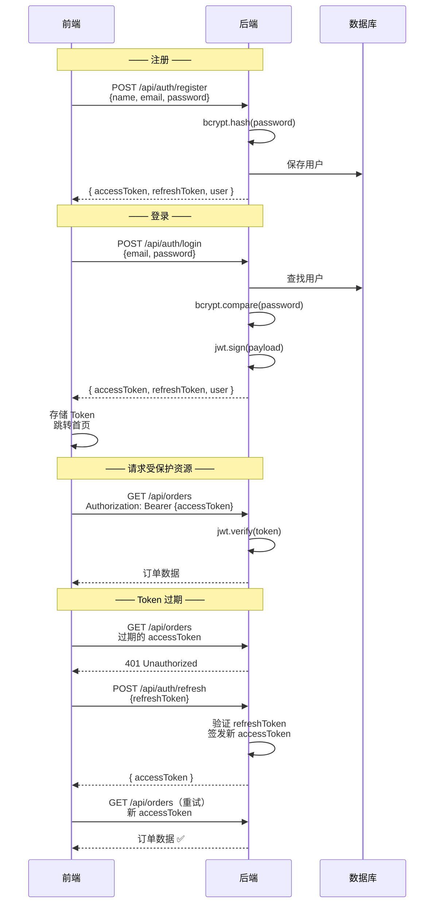
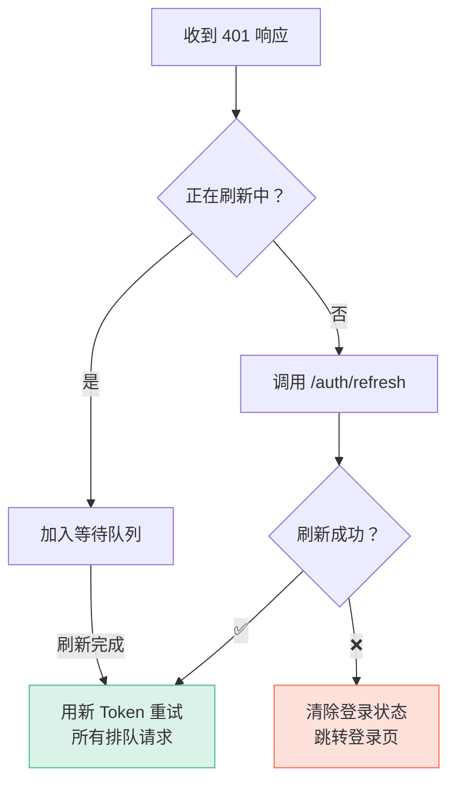

# L22 · JWT 认证：注册、登录与鉴权

```
🎯 本节目标：实现 JWT 认证全流程——注册/登录/路由守卫/Token 自动刷新
📦 本节产出：AuthStore + 登录注册页面 + 路由鉴权 + Token 刷新机制
🔗 前置钩子：L21 的 Axios 拦截器（Token 注入 + 401 处理）
🔗 后续钩子：L23 的商品列表页（部分操作需要登录）
```

---

## 1. JWT 认证流程



---

## 2. 后端：认证 API

首先安装本节依赖：

```bash
npm install bcryptjs jsonwebtoken
npm install -D @types/bcryptjs @types/jsonwebtoken
```

```typescript
// server/src/controllers/authController.ts
import { Request, Response, NextFunction } from 'express'
import bcrypt from 'bcryptjs'
import jwt from 'jsonwebtoken'
import User from '../models/User'

const ACCESS_SECRET = process.env.JWT_SECRET || 'access-secret'
const REFRESH_SECRET = process.env.JWT_REFRESH_SECRET || 'refresh-secret'
const ACCESS_EXPIRES = '15m'     // 15 分钟
const REFRESH_EXPIRES = '7d'     // 7 天

function generateTokens(userId: string) {
  const accessToken = jwt.sign({ userId }, ACCESS_SECRET, { expiresIn: ACCESS_EXPIRES })
  const refreshToken = jwt.sign({ userId }, REFRESH_SECRET, { expiresIn: REFRESH_EXPIRES })
  return { accessToken, refreshToken }
}

// POST /api/auth/register
export async function register(req: Request, res: Response, next: NextFunction) {
  try {
    const { name, email, password } = req.body

    // 验证
    if (!name || !email || !password) {
      return res.status(400).json({ success: false, message: '请填写所有必填字段' })
    }

    if (password.length < 6) {
      return res.status(400).json({ success: false, message: '密码至少 6 个字符' })
    }

    // 检查邮箱是否已注册
    const existing = await User.findOne({ email })
    if (existing) {
      return res.status(409).json({ success: false, message: '该邮箱已注册' })
    }

    // 哈希密码
    const salt = await bcrypt.genSalt(10)
    const hashedPassword = await bcrypt.hash(password, salt)

    // 创建用户
    const user = await User.create({
      name,
      email,
      password: hashedPassword,
      role: 'user',
    })

    const tokens = generateTokens(user._id.toString())

    res.status(201).json({
      success: true,
      data: {
        ...tokens,
        user: { id: user._id, name: user.name, email: user.email, role: user.role },
      },
    })
  } catch (error) {
    next(error)
  }
}

// POST /api/auth/login
export async function login(req: Request, res: Response, next: NextFunction) {
  try {
    const { email, password } = req.body

    // 查找用户（+password 因为 schema 中 select: false）
    const user = await User.findOne({ email }).select('+password')
    if (!user) {
      return res.status(401).json({ success: false, message: '邮箱或密码错误' })
    }

    // 验证密码
    const isMatch = await bcrypt.compare(password, user.password)
    if (!isMatch) {
      return res.status(401).json({ success: false, message: '邮箱或密码错误' })
    }

    const tokens = generateTokens(user._id.toString())

    res.json({
      success: true,
      data: {
        ...tokens,
        user: { id: user._id, name: user.name, email: user.email, role: user.role },
      },
    })
  } catch (error) {
    next(error)
  }
}

// POST /api/auth/refresh
export async function refreshToken(req: Request, res: Response) {
  const { refreshToken } = req.body
  if (!refreshToken) {
    return res.status(400).json({ success: false, message: '缺少 refreshToken' })
  }

  try {
    const decoded = jwt.verify(refreshToken, REFRESH_SECRET) as any
    const newTokens = generateTokens(decoded.userId)

    res.json({ success: true, data: newTokens })
  } catch {
    return res.status(401).json({ success: false, message: 'refreshToken 无效或已过期' })
  }
}
```

```typescript
// server/src/middlewares/auth.ts
import { Request, Response, NextFunction } from 'express'
import jwt from 'jsonwebtoken'

export function authMiddleware(req: Request, res: Response, next: NextFunction) {
  const header = req.headers.authorization
  if (!header?.startsWith('Bearer ')) {
    return res.status(401).json({ success: false, message: '未提供认证 Token' })
  }

  const token = header.split(' ')[1]
  try {
    const decoded = jwt.verify(token, process.env.JWT_SECRET!) as any
    req.userId = decoded.userId
    next()
  } catch {
    return res.status(401).json({ success: false, message: 'Token 无效或已过期' })
  }
}
```

---

## 3. 前端：Auth Store

> [!WARNING]
> **教学演示方案 vs 生产推荐方案**
>
> 下方代码将 `accessToken` 和 `refreshToken` 都存在 `localStorage`，便于理解 Token 流程。
> 但在生产环境中，**Refresh Token 应存储在 `httpOnly Cookie` 中**以防止 XSS 攻击。
> 详见深度专题 D14（JWT vs Session）中的存储位置对比表。

```typescript
// client/src/stores/authStore.ts
// ⚠️ 教学演示：双 Token 均存 localStorage，便于理解流程
// 🏭 生产环境：Refresh Token 改为 httpOnly Cookie（见 D14）
import { ref, computed } from 'vue'
import { defineStore } from 'pinia'
import { authApi } from '@/api/auth'
import { useRouter } from 'vue-router'

export interface User {
  id: string
  name: string
  email: string
  role: 'user' | 'admin'
}

export const useAuthStore = defineStore('auth', () => {
  const user = ref<User | null>(null)
  const accessToken = ref<string | null>(localStorage.getItem('access-token'))
  const refreshToken = ref<string | null>(localStorage.getItem('refresh-token'))

  const isLoggedIn = computed(() => !!accessToken.value)
  const isAdmin = computed(() => user.value?.role === 'admin')

  // ─── 登录 ───
  async function login(email: string, password: string) {
    const res = await authApi.login(email, password)
    setAuth(res.data)
  }

  // ─── 注册 ───
  async function register(name: string, email: string, password: string) {
    const res = await authApi.register(name, email, password)
    setAuth(res.data)
  }

  // ─── 登出 ───
  function logout() {
    user.value = null
    accessToken.value = null
    refreshToken.value = null
    localStorage.removeItem('access-token')
    localStorage.removeItem('refresh-token')
    // 🏭 生产环境还需调用 POST /api/auth/logout 让服务端吊销 refreshToken（加入黑名单）
  }

  // ─── 刷新 Token ───
  async function refresh() {
    if (!refreshToken.value) throw new Error('无 refreshToken')
    const res = await authApi.refresh(refreshToken.value)
    accessToken.value = res.data.accessToken
    refreshToken.value = res.data.refreshToken
    localStorage.setItem('access-token', res.data.accessToken)
    localStorage.setItem('refresh-token', res.data.refreshToken)
  }

  // ─── 获取用户信息 ───
  async function fetchProfile() {
    if (!accessToken.value) return
    try {
      const res = await authApi.getProfile()
      user.value = res.data
    } catch {
      logout()
    }
  }

  function setAuth(data: { accessToken: string; refreshToken: string; user: User }) {
    accessToken.value = data.accessToken
    refreshToken.value = data.refreshToken
    user.value = data.user
    localStorage.setItem('access-token', data.accessToken)
    localStorage.setItem('refresh-token', data.refreshToken)
  }

  return {
    user, accessToken, refreshToken,
    isLoggedIn, isAdmin,
    login, register, logout, refresh, fetchProfile,
  }
})
```

---

## 4. 路由守卫鉴权

```typescript
// client/src/router/index.ts
import { useAuthStore } from '@/stores/authStore'

router.beforeEach(async (to) => {
  const authStore = useAuthStore()

  // 需要登录的页面
  if (to.meta.requiresAuth && !authStore.isLoggedIn) {
    return {
      name: 'login',
      query: { redirect: to.fullPath },  // 登录后跳回原页面
    }
  }

  // 需要管理员权限
  if (to.meta.requiresAdmin && !authStore.isAdmin) {
    return { name: 'home' }
  }

  // 已登录不能访问登录页
  if (to.meta.guestOnly && authStore.isLoggedIn) {
    return { name: 'home' }
  }
})
```

```typescript
// 路由配置
{
  path: '/orders',
  component: () => import('@/views/OrderListView.vue'),
  meta: { requiresAuth: true },            // 需要登录
},
{
  path: '/admin',
  component: () => import('@/views/AdminView.vue'),
  meta: { requiresAuth: true, requiresAdmin: true },  // 需要管理员
},
{
  path: '/login',
  component: () => import('@/views/LoginView.vue'),
  meta: { guestOnly: true },                // 仅游客
},
```

---

## 5. Token 自动刷新（拦截器增强）

```typescript
// client/src/utils/request.ts  — 响应拦截器增强
import { useAuthStore } from '@/stores/authStore'

let isRefreshing = false
let pendingRequests: Array<(token: string) => void> = []

request.interceptors.response.use(
  (response) => response.data,
  async (error) => {
    const originalRequest = error.config

    // 401 且不是 refresh 请求本身 → 尝试刷新 Token
    if (
      error.response?.status === 401 &&
      !originalRequest._retry &&
      !originalRequest.url.includes('/auth/refresh')
    ) {
      originalRequest._retry = true

      if (!isRefreshing) {
        isRefreshing = true
        try {
          const authStore = useAuthStore()
          await authStore.refresh()
          isRefreshing = false

          // 用新 Token 重试所有等待中的请求
          pendingRequests.forEach(cb => cb(authStore.accessToken!))
          pendingRequests = []

          // 重试原始请求
          originalRequest.headers.Authorization = `Bearer ${authStore.accessToken}`
          return request(originalRequest)
        } catch {
          isRefreshing = false
          pendingRequests = []
          const authStore = useAuthStore()
          authStore.logout()
          window.location.href = '/login'
          return Promise.reject(error)
        }
      }

      // 其他请求等待 Token 刷新完成
      return new Promise((resolve) => {
        pendingRequests.push((token: string) => {
          originalRequest.headers.Authorization = `Bearer ${token}`
          resolve(request(originalRequest))
        })
      })
    }

    return Promise.reject(error)
  }
)
```



---

## 6. 本节总结

### 检查清单

- [ ] 能用 bcrypt 哈希密码（不能明文存储）
- [ ] 能用 jwt.sign / jwt.verify 签发和验证 Token
- [ ] 能区分 accessToken（短期）和 refreshToken（长期）
- [ ] 能实现 authStore（login / register / logout / refresh）
- [ ] 能在路由守卫中检查 `meta.requiresAuth`
- [ ] 能实现 Token 自动刷新（拦截器内 + 请求队列）
- [ ] 能处理登录后跳回原页面（redirect query）

### 本节边界

| 内容 | 本节状态 | 说明 |
|------|---------|------|
| bcrypt 密码加密 | ✅ 可用于生产 | 标准做法 |
| JWT 签发/验证 | ✅ 可用于生产 | 注意密钥管理 |
| 双 Token 策略 | ⚠️ 教学简化 | Refresh Token 应放 httpOnly Cookie |
| Token 自动刷新 | ✅ 可用于生产 | 并发队列模式是标准实践 |
| 路由守卫鉴权 | ✅ 可用于生产 | 可按实际需求扩展中间件 |

### 课后练习

**练习 1：跟做（15 min）**
按照本节代码完整实现注册→登录→路由守卫→Token 刷新全流程。

**练习 2：举一反三（20 min）**
实现"记住我"功能——勾选后 Refresh Token 过期时间从 7 天延长到 30 天。

**挑战题（30 min）**
实现 Refresh Token 轮换（Rotation）：每次 refresh 时旧 Token 失效，防止 Token 泄露后被无限续期。

### 真实项目补充

| 实践 | 说明 |
|------|------|
| Refresh Token httpOnly Cookie | 防止 XSS 窃取（见 D14） |
| Token 轮换（Rotation） | 每次 refresh 颁发全新 Refresh Token，旧 Token 立即失效 |
| 速率限制（Rate Limiting） | 登录接口限制频率，防止暴力破解 |
| CSRF 防护 | 使用 Cookie 存储 Token 时需配合 CSRF Token |
| 密码强度校验 | zxcvbn 库评估密码强度 |

### Git 提交

```bash
git add .
git commit -m "L22: JWT 认证 + Auth Store + 路由守卫 + Token 刷新"
```

### 🔗 → 下一节

L23 将实现商品列表页——分页、防抖搜索、URL 查询参数同步。

