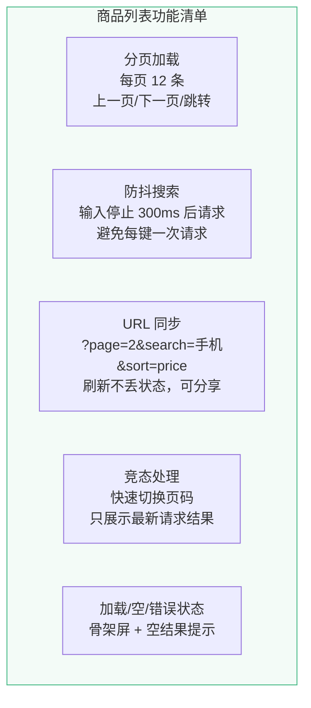
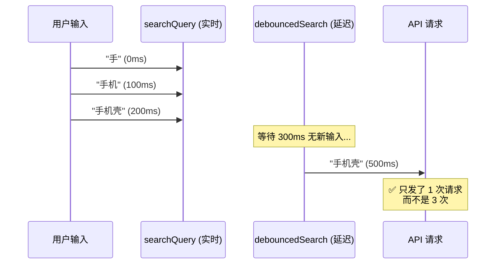
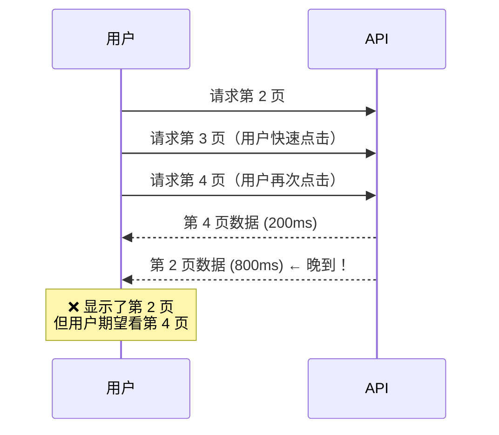

# L23 · 商品列表：分页、搜索与 URL 同步

```
🎯 本节目标：实现带分页、防抖搜索、URL 查询参数同步的商品列表页
📦 本节产出：可分享 URL 的商品列表 + 防抖搜索 + 加载状态 + 请求竞态处理
🔗 前置钩子：L21 的 Axios 封装 + useRequest、L22 的 JWT 认证
🔗 后续钩子：L24 将从商品列表添加到购物车
```

---

## 1. 需求分析



---

## 2. URL 查询参数同步

### 2.1 为什么要同步到 URL

```
用户操作：搜索「手机」→ 排序「价格从低到高」→ 翻到第 3 页
URL 变为：/products?search=手机&sort=price&page=3

好处：
✅ 刷新页面状态不丢失
✅ 复制链接发给别人，看到相同结果
✅ 浏览器前进/后退按预期工作
```

### 2.2 useRouteQuery composable

```typescript
// client/src/composables/useRouteQuery.ts
import { computed } from 'vue'
import { useRoute, useRouter } from 'vue-router'

export function useRouteQuery(key: string, defaultValue: string = '') {
  const route = useRoute()
  const router = useRouter()

  return computed({
    get() {
      return (route.query[key] as string) || defaultValue
    },
    set(value: string) {
      router.replace({
        query: {
          ...route.query,
          [key]: value || undefined,  // 空值时从 URL 移除
        },
      })
    },
  })
}

// 数字版本
export function useRouteQueryNumber(key: string, defaultValue: number = 1) {
  const route = useRoute()
  const router = useRouter()

  return computed({
    get() {
      const val = route.query[key]
      return val ? parseInt(val as string) : defaultValue
    },
    set(value: number) {
      router.replace({
        query: {
          ...route.query,
          [key]: value !== defaultValue ? String(value) : undefined,
        },
      })
    },
  })
}
```

---

## 3. 防抖搜索

### 3.1 useDebouncedRef

```typescript
// client/src/composables/useDebouncedRef.ts
import { ref, watch, type Ref } from 'vue'

export function useDebouncedRef<T>(
  source: Ref<T>,
  delay: number = 300
): Ref<T> {
  const debounced = ref(source.value) as Ref<T>
  let timer: ReturnType<typeof setTimeout>

  watch(source, (newVal) => {
    clearTimeout(timer)
    timer = setTimeout(() => {
      debounced.value = newVal
    }, delay)
  })

  return debounced
}
```



---

## 4. 完整商品列表页

```vue
<!-- client/src/views/ProductListView.vue -->
<script setup lang="ts">
import { watch, computed } from 'vue'
import { productApi, type ProductListParams } from '@/api/products'
import { useRequest } from '@/composables/useRequest'
import { useRouteQuery, useRouteQueryNumber } from '@/composables/useRouteQuery'
import { useDebouncedRef } from '@/composables/useDebouncedRef'

// ─── URL 同步状态 ───
const page = useRouteQueryNumber('page', 1)
const searchQuery = useRouteQuery('search', '')
const sortBy = useRouteQuery('sort', '-createdAt')
const category = useRouteQuery('category', '')

// ─── 防抖搜索 ───
const debouncedSearch = useDebouncedRef(searchQuery, 300)

// ─── 请求参数 ───
const params = computed<ProductListParams>(() => ({
  page: page.value,
  limit: 12,
  search: debouncedSearch.value || undefined,
  sort: sortBy.value,
  category: category.value || undefined,
}))

// ─── 数据请求 ───
const { data, loading, error, execute: fetchProducts } = useRequest(
  () => productApi.getList(params.value),
  { immediate: true }
)

// 参数变化时重新请求
watch(params, () => {
  fetchProducts()
})

// 搜索变化时重置页码
watch(debouncedSearch, () => {
  page.value = 1
})

// ─── 排序选项 ───
const sortOptions = [
  { value: '-createdAt', label: '最新上架' },
  { value: 'price', label: '价格从低到高' },
  { value: '-price', label: '价格从高到低' },
  { value: '-rating', label: '评分最高' },
]

// ─── 分页 ───
function goToPage(p: number) {
  page.value = p
  window.scrollTo({ top: 0, behavior: 'smooth' })
}
</script>

<template>
  <div class="product-page">
    <!-- 搜索和筛选栏 -->
    <div class="filter-bar">
      <div class="search-box">
        <input
          v-model="searchQuery"
          placeholder="搜索商品..."
          class="search-input"
        />
        <span v-if="loading" class="search-spinner">⏳</span>
      </div>

      <select v-model="sortBy" class="sort-select">
        <option v-for="opt in sortOptions" :key="opt.value" :value="opt.value">
          {{ opt.label }}
        </option>
      </select>
    </div>

    <!-- 加载状态 -->
    <div v-if="loading && !data" class="skeleton-grid">
      <div v-for="i in 12" :key="i" class="skeleton-card">
        <div class="skeleton-image pulse"></div>
        <div class="skeleton-text pulse"></div>
        <div class="skeleton-text short pulse"></div>
      </div>
    </div>

    <!-- 错误状态 -->
    <div v-else-if="error" class="error-state">
      <p>{{ error }}</p>
      <button @click="fetchProducts()" class="retry-btn">🔄 重试</button>
    </div>

    <!-- 空状态 -->
    <div v-else-if="data && data.data.length === 0" class="empty-state">
      <p>{{ searchQuery ? `没有找到"${searchQuery}"相关的商品` : '暂无商品' }}</p>
    </div>

    <!-- 商品列表 -->
    <div v-else-if="data" class="product-grid">
      <div
        v-for="product in data.data"
        :key="product._id"
        class="product-card"
        @click="$router.push(`/products/${product._id}`)"
      >
        <div class="card-image">
          
          <span v-if="product.stock === 0" class="sold-out-badge">售罄</span>
        </div>
        <div class="card-body">
          <h3 class="card-title">{{ product.name }}</h3>
          <div class="card-meta">
            <span class="card-price">¥{{ product.price.toLocaleString() }}</span>
            <span class="card-rating">⭐ {{ product.rating.toFixed(1) }}</span>
          </div>
        </div>
      </div>
    </div>

    <!-- 分页器 -->
    <div v-if="data && data.pagination.totalPages > 1" class="pagination">
      <button
        :disabled="page <= 1"
        @click="goToPage(page - 1)"
        class="page-btn"
      >
        ← 上一页
      </button>

      <div class="page-numbers">
        <!-- 简化版：渲染所有页码。生产环境应实现省略号分页（如 1 2 ... 8 9 10） -->
        <button
          v-for="p in data.pagination.totalPages"
          :key="p"
          :class="['page-num', { active: p === page }]"
          @click="goToPage(p)"
        >
          {{ p }}
        </button>
      </div>

      <button
        :disabled="page >= data.pagination.totalPages"
        @click="goToPage(page + 1)"
        class="page-btn"
      >
        下一页 →
      </button>
    </div>
  </div>
</template>

<style scoped>
.product-page { padding: 24px; max-width: 1200px; margin: 0 auto; }

/* 筛选栏 */
.filter-bar {
  display: flex; gap: 12px; margin-bottom: 24px;
  align-items: center; flex-wrap: wrap;
}
.search-box { position: relative; flex: 1; min-width: 200px; }
.search-input {
  width: 100%; padding: 10px 40px 10px 16px;
  border: 1px solid var(--border-color, #ddd); border-radius: 8px;
  font-size: 0.9rem;
}
.search-spinner { position: absolute; right: 12px; top: 50%; transform: translateY(-50%); }
.sort-select {
  padding: 10px 16px; border: 1px solid var(--border-color, #ddd);
  border-radius: 8px; font-size: 0.9rem; background: white;
}

/* 商品网格 */
.product-grid {
  display: grid;
  grid-template-columns: repeat(auto-fill, minmax(240px, 1fr));
  gap: 20px;
}

.product-card {
  border: 1px solid var(--border-color, #e0e0e0);
  border-radius: 12px; overflow: hidden;
  cursor: pointer; transition: box-shadow 0.2s, transform 0.2s;
}
.product-card:hover {
  box-shadow: 0 8px 24px rgba(0, 0, 0, 0.1); transform: translateY(-2px);
}

.card-image { position: relative; aspect-ratio: 1; overflow: hidden; background: #f5f5f5; }
.card-image img { width: 100%; height: 100%; object-fit: cover; }
.sold-out-badge {
  position: absolute; top: 8px; right: 8px;
  background: rgba(0,0,0,0.7); color: white;
  padding: 2px 10px; border-radius: 4px; font-size: 0.75rem;
}

.card-body { padding: 12px 14px; }
.card-title { font-size: 0.9rem; margin: 0 0 8px; line-height: 1.4; }
.card-meta { display: flex; justify-content: space-between; align-items: center; }
.card-price { font-size: 1.1rem; font-weight: 700; color: #e74c3c; }
.card-rating { font-size: 0.8rem; color: #999; }

/* 分页 */
.pagination {
  display: flex; justify-content: center; align-items: center; gap: 8px;
  margin-top: 32px; padding-top: 24px; border-top: 1px solid #eee;
}
.page-btn {
  padding: 8px 16px; border: 1px solid #ddd; border-radius: 6px;
  background: white; cursor: pointer; font-size: 0.85rem;
}
.page-btn:disabled { opacity: 0.4; cursor: not-allowed; }
.page-numbers { display: flex; gap: 4px; }
.page-num {
  width: 36px; height: 36px; border: 1px solid #ddd; border-radius: 6px;
  background: white; cursor: pointer; font-size: 0.85rem;
}
.page-num.active { background: #42b883; color: white; border-color: #42b883; }

/* 骨架屏 */
.skeleton-grid {
  display: grid; grid-template-columns: repeat(auto-fill, minmax(240px, 1fr)); gap: 20px;
}
.skeleton-card { border-radius: 12px; overflow: hidden; border: 1px solid #eee; }
.skeleton-image { aspect-ratio: 1; background: #e0e0e0; }
.skeleton-text { height: 14px; margin: 12px 14px; background: #e0e0e0; border-radius: 4px; }
.skeleton-text.short { width: 60%; }
.pulse { animation: pulse 1.5s infinite ease-in-out; }
@keyframes pulse { 0%, 100% { opacity: 1; } 50% { opacity: 0.4; } }

/* 状态 */
.empty-state, .error-state { text-align: center; padding: 60px 20px; color: #999; }
.retry-btn { padding: 8px 20px; border: none; border-radius: 6px; background: #42b883; color: white; cursor: pointer; }
</style>
```

---

## 5. 竞态处理

快速翻页时（1→2→3→4），旧请求可能比新请求晚返回，导致显示了错误的页面数据。



**解决方案：请求 ID 校验**

```typescript
// 在 useRequest 中添加竞态处理
let requestId = 0

async function execute() {
  const currentId = ++requestId  // 每次请求递增
  loading.value = true

  try {
    const result = await requestFn()

    // 只有最新的请求才更新数据
    if (currentId === requestId) {
      data.value = result
    }
  } catch (err) {
    if (currentId === requestId) {
      error.value = err.message
    }
  } finally {
    if (currentId === requestId) {
      loading.value = false
    }
  }
}
```

---

## 6. 本节总结


### 🔬 深度专题

> 📖 [D13 · 请求竞态处理](/lessons/deep-dives/D13-request-race) — 快速切换页面时如何避免数据错乱？

### 检查清单

- [ ] 能用 `useRouteQuery` 将筛选状态同步到 URL
- [ ] 能实现防抖搜索（`useDebouncedRef`），避免每键发请求
- [ ] 能实现商品列表的分页加载
- [ ] 能处理加载、错误、空结果三种状态
- [ ] 能实现骨架屏加载效果
- [ ] 能理解并解决请求竞态问题
- [ ] 理解搜索变化时需要重置页码

### Git 提交

```bash
git add .
git commit -m "L23: 商品列表 + 分页 + 防抖搜索 + URL 同步"
```

### 🔗 → 下一节

L24 将实现购物车功能——从商品列表点击"加入购物车"，在 Pinia Store 中管理购物车状态，实现数量调整和全选结算。
