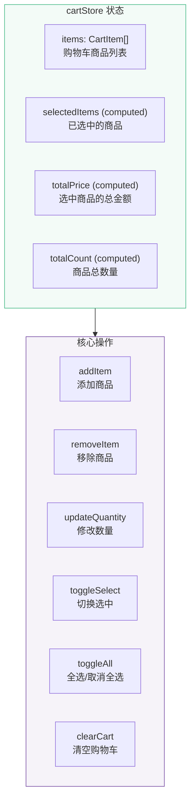
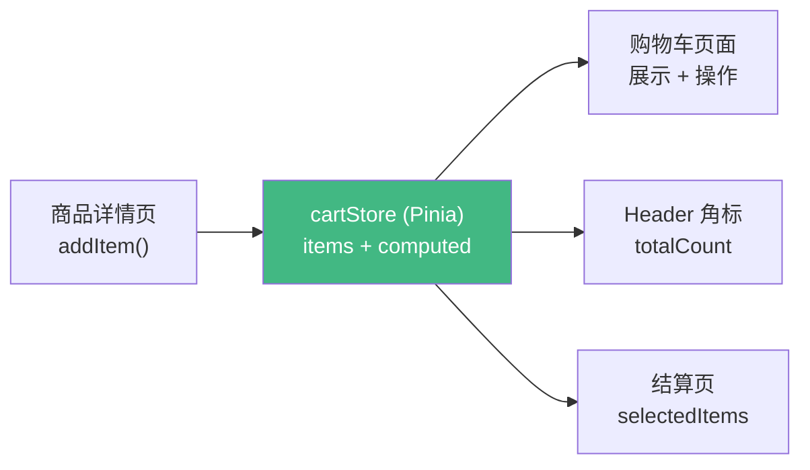

# L24 · 购物车：状态管理实战

```
🎯 本节目标：用 Pinia 实现购物车全功能——添加、数量调整、全选、结算
📦 本节产出：完整的购物车 Store + 购物车页面 + 底部结算栏
🔗 前置钩子：L23 的商品列表（点击加入购物车）
🔗 后续钩子：L25 将从购物车创建订单
```

---

## 1. 购物车数据设计

```typescript
// client/src/types/cart.ts
export interface CartItem {
  productId: string
  name: string
  price: number
  image: string
  quantity: number
  stock: number       // 库存上限
  selected: boolean   // 是否选中（用于结算）
}
```



---

## 2. Cart Store

```typescript
// client/src/stores/cartStore.ts
import { ref, computed } from 'vue'
import { defineStore } from 'pinia'
import type { CartItem } from '@/types/cart'

export const useCartStore = defineStore('cart', () => {
  const items = ref<CartItem[]>([])

  // ─── Getters ───

  // 选中的商品
  const selectedItems = computed(() =>
    items.value.filter(item => item.selected)
  )

  // 选中商品的总金额
  const totalPrice = computed(() =>
    selectedItems.value.reduce((sum, item) => sum + item.price * item.quantity, 0)
  )

  // 选中商品的总数量
  const selectedCount = computed(() =>
    selectedItems.value.reduce((sum, item) => sum + item.quantity, 0)
  )

  // 购物车商品总数
  const totalCount = computed(() =>
    items.value.reduce((sum, item) => sum + item.quantity, 0)
  )

  // 是否全选
  const isAllSelected = computed(() =>
    items.value.length > 0 && items.value.every(item => item.selected)
  )

  // ─── Actions ───

  function addItem(product: {
    _id: string
    name: string
    price: number
    images: string[]
    stock: number
  }, quantity: number = 1) {
    const existing = items.value.find(item => item.productId === product._id)

    if (existing) {
      // 已存在：增加数量（不超过库存）
      existing.quantity = Math.min(existing.quantity + quantity, existing.stock)
    } else {
      // 不存在：添加新商品
      items.value.push({
        productId: product._id,
        name: product.name,
        price: product.price,
        image: product.images[0] || '',
        quantity,
        stock: product.stock,
        selected: true,  // 默认选中
      })
    }
  }

  function removeItem(productId: string) {
    items.value = items.value.filter(item => item.productId !== productId)
  }

  function updateQuantity(productId: string, quantity: number) {
    const item = items.value.find(item => item.productId === productId)
    if (!item) return

    if (quantity <= 0) {
      removeItem(productId)
    } else {
      item.quantity = Math.min(quantity, item.stock)
    }
  }

  function toggleSelect(productId: string) {
    const item = items.value.find(item => item.productId === productId)
    if (item) item.selected = !item.selected
  }

  function toggleAll() {
    const newState = !isAllSelected.value
    items.value.forEach(item => { item.selected = newState })
  }

  function clearSelected() {
    items.value = items.value.filter(item => !item.selected)
  }

  function clearCart() {
    items.value = []
  }

  return {
    items,
    selectedItems, totalPrice, selectedCount, totalCount, isAllSelected,
    addItem, removeItem, updateQuantity, toggleSelect, toggleAll,
    clearSelected, clearCart,
  }
}, { persist: true })
```

---

## 3. 购物车页面

```vue
<!-- client/src/views/CartView.vue -->
<script setup lang="ts">
import { useCartStore } from '@/stores/cartStore'
import { useRouter } from 'vue-router'

const cartStore = useCartStore()
const router = useRouter()

function handleQuantityChange(productId: string, delta: number) {
  const item = cartStore.items.find(i => i.productId === productId)
  if (item) {
    cartStore.updateQuantity(productId, item.quantity + delta)
  }
}

function handleCheckout() {
  if (cartStore.selectedItems.length === 0) return
  router.push('/checkout')
}
</script>

<template>
  <div class="cart-page">
    <h1>🛒 购物车 <span class="count">({{ cartStore.totalCount }})</span></h1>

    <!-- 空购物车 -->
    <div v-if="cartStore.items.length === 0" class="empty-cart">
      <div class="empty-icon">🛒</div>
      <p>购物车是空的</p>
      <RouterLink to="/products" class="btn-primary">去购物</RouterLink>
    </div>

    <template v-else>
      <!-- 全选栏 -->
      <div class="select-all-bar">
        <label class="checkbox-label">
          <input
            type="checkbox"
            :checked="cartStore.isAllSelected"
            @change="cartStore.toggleAll()"
          />
          全选
        </label>
        <button
          v-if="cartStore.selectedItems.length > 0"
          @click="cartStore.clearSelected()"
          class="btn-text danger"
        >
          删除选中 ({{ cartStore.selectedItems.length }})
        </button>
      </div>

      <!-- 商品列表 -->
      <div class="cart-list">
        <div v-for="item in cartStore.items" :key="item.productId" class="cart-item">
          <!-- 选中 -->
          <input
            type="checkbox"
            :checked="item.selected"
            @change="cartStore.toggleSelect(item.productId)"
            class="item-checkbox"
          />

          <!-- 图片 -->
          

          <!-- 信息 -->
          <div class="item-info">
            <h3 class="item-name">{{ item.name }}</h3>
            <span class="item-price">¥{{ item.price.toLocaleString() }}</span>
          </div>

          <!-- 数量控制 -->
          <div class="quantity-control">
            <button
              @click="handleQuantityChange(item.productId, -1)"
              :disabled="item.quantity <= 1"
              class="qty-btn"
            >
              −
            </button>
            <span class="qty-value">{{ item.quantity }}</span>
            <button
              @click="handleQuantityChange(item.productId, 1)"
              :disabled="item.quantity >= item.stock"
              class="qty-btn"
            >
              +
            </button>
          </div>

          <!-- 小计 -->
          <div class="item-subtotal">
            ¥{{ (item.price * item.quantity).toLocaleString() }}
          </div>

          <!-- 删除 -->
          <button
            @click="cartStore.removeItem(item.productId)"
            class="delete-btn"
            title="删除"
          >
            🗑️
          </button>
        </div>
      </div>

      <!-- 底部结算栏 -->
      <div class="checkout-bar">
        <div class="checkout-info">
          <span>
            已选 <strong>{{ cartStore.selectedCount }}</strong> 件商品
          </span>
          <span class="checkout-total">
            合计：<strong class="total-price">
              ¥{{ cartStore.totalPrice.toLocaleString() }}
            </strong>
          </span>
        </div>
        <button
          class="checkout-btn"
          :disabled="cartStore.selectedItems.length === 0"
          @click="handleCheckout"
        >
          去结算 ({{ cartStore.selectedItems.length }})
        </button>
      </div>
    </template>
  </div>
</template>

<style scoped>
.cart-page { padding: 24px; max-width: 900px; margin: 0 auto; padding-bottom: 100px; }
.cart-page h1 { font-size: 1.5rem; margin-bottom: 20px; }
.count { color: #999; font-weight: 400; }

/* 空状态 */
.empty-cart { text-align: center; padding: 60px 20px; }
.empty-icon { font-size: 4rem; margin-bottom: 16px; }
.empty-cart p { color: #999; margin-bottom: 20px; }

/* 全选栏 */
.select-all-bar {
  display: flex; justify-content: space-between; align-items: center;
  padding: 12px 16px; background: var(--bg-secondary, #f8f9fa);
  border-radius: 8px; margin-bottom: 12px;
}
.checkbox-label { display: flex; align-items: center; gap: 8px; cursor: pointer; }

/* 商品项 */
.cart-item {
  display: flex; align-items: center; gap: 14px;
  padding: 16px; border-bottom: 1px solid #f0f0f0;
}
.item-checkbox { width: 18px; height: 18px; cursor: pointer; flex-shrink: 0; }
.item-image { width: 80px; height: 80px; border-radius: 8px; object-fit: cover; flex-shrink: 0; }
.item-info { flex: 1; min-width: 0; }
.item-name { font-size: 0.9rem; margin: 0 0 6px; line-height: 1.4; }
.item-price { font-size: 0.85rem; color: #e74c3c; }

/* 数量控制 */
.quantity-control { display: flex; align-items: center; gap: 0; border: 1px solid #ddd; border-radius: 6px; overflow: hidden; }
.qty-btn { width: 32px; height: 32px; border: none; background: #f5f5f5; cursor: pointer; font-size: 1rem; }
.qty-btn:disabled { opacity: 0.3; cursor: not-allowed; }
.qty-btn:hover:not(:disabled) { background: #e0e0e0; }
.qty-value { width: 40px; text-align: center; font-size: 0.9rem; font-weight: 600; }

.item-subtotal { width: 90px; text-align: right; font-weight: 600; color: #333; }

.delete-btn { background: none; border: none; cursor: pointer; font-size: 1rem; opacity: 0.4; transition: opacity 0.15s; }
.delete-btn:hover { opacity: 1; }

/* 结算栏 */
.checkout-bar {
  position: fixed; bottom: 0; left: 0; right: 0;
  display: flex; justify-content: space-between; align-items: center;
  padding: 14px 24px; background: white;
  border-top: 1px solid #e0e0e0; box-shadow: 0 -2px 10px rgba(0,0,0,0.05);
  z-index: 100;
}
.checkout-info { display: flex; gap: 20px; align-items: center; }
.total-price { font-size: 1.3rem; color: #e74c3c; }
.checkout-btn {
  padding: 12px 32px; background: #e74c3c; color: white; border: none;
  border-radius: 8px; font-size: 1rem; font-weight: 600; cursor: pointer;
}
.checkout-btn:disabled { opacity: 0.4; cursor: not-allowed; }

/* 按钮 */
.btn-primary { padding: 10px 24px; background: #42b883; color: white; border: none; border-radius: 8px; cursor: pointer; text-decoration: none; }
.btn-text { background: none; border: none; cursor: pointer; font-size: 0.85rem; }
.btn-text.danger { color: #e74c3c; }
</style>
```

---

## 4. 商品详情页添加购物车

```vue
<!-- 在 ProductDetailView.vue 中 -->
<script setup lang="ts">
import { ref } from 'vue'
import { useCartStore } from '@/stores/cartStore'

const cartStore = useCartStore()
const quantity = ref(1)

// product 来自 API 请求

function handleAddToCart() {
  cartStore.addItem(product.value!, quantity.value)
  // 显示提示
}
</script>

<template>
  <div class="add-to-cart-section">
    <div class="quantity-selector">
      <button @click="quantity = Math.max(1, quantity - 1)" class="qty-btn">−</button>
      <span class="qty-value">{{ quantity }}</span>
      <button @click="quantity = Math.min(product.stock, quantity + 1)" class="qty-btn">+</button>
    </div>
    <button
      class="add-to-cart-btn"
      :disabled="product.stock === 0"
      @click="handleAddToCart"
    >
      🛒 加入购物车
    </button>
  </div>
</template>
```

---

## 5. Header 购物车图标

```vue
<!-- AppHeader.vue 中 -->
<RouterLink to="/cart" class="cart-icon">
  🛒
  <span v-if="cartStore.totalCount > 0" class="cart-badge">
    {{ cartStore.totalCount > 99 ? '99+' : cartStore.totalCount }}
  </span>
</RouterLink>
```

```css
.cart-icon { position: relative; font-size: 1.4rem; text-decoration: none; }
.cart-badge {
  position: absolute; top: -8px; right: -12px;
  background: #e74c3c; color: white; font-size: 0.65rem;
  padding: 1px 6px; border-radius: 10px; font-weight: 700;
  min-width: 18px; text-align: center;
}
```

---

## 6. 本节总结

### 数据流



### 检查清单

- [ ] 能设计 CartItem 数据结构
- [ ] 能实现 cartStore 的添加/删除/数量调整/选中逻辑
- [ ] 能用 computed 计算总价、总数、全选状态
- [ ] 能实现数量控制组件（±按钮 + 库存上限）
- [ ] 能实现全选/取消全选
- [ ] 能实现固定底部的结算栏
- [ ] 能在 Header 显示购物车角标
- [ ] 购物车数据通过 persist 插件持久化

### Git 提交

```bash
git add .
git commit -m "L24: 购物车 Store + 购物车页面 + 结算栏"
```

### 🔗 → 下一节

L25 将从购物车的选中商品创建订单——实现订单状态机设计。
