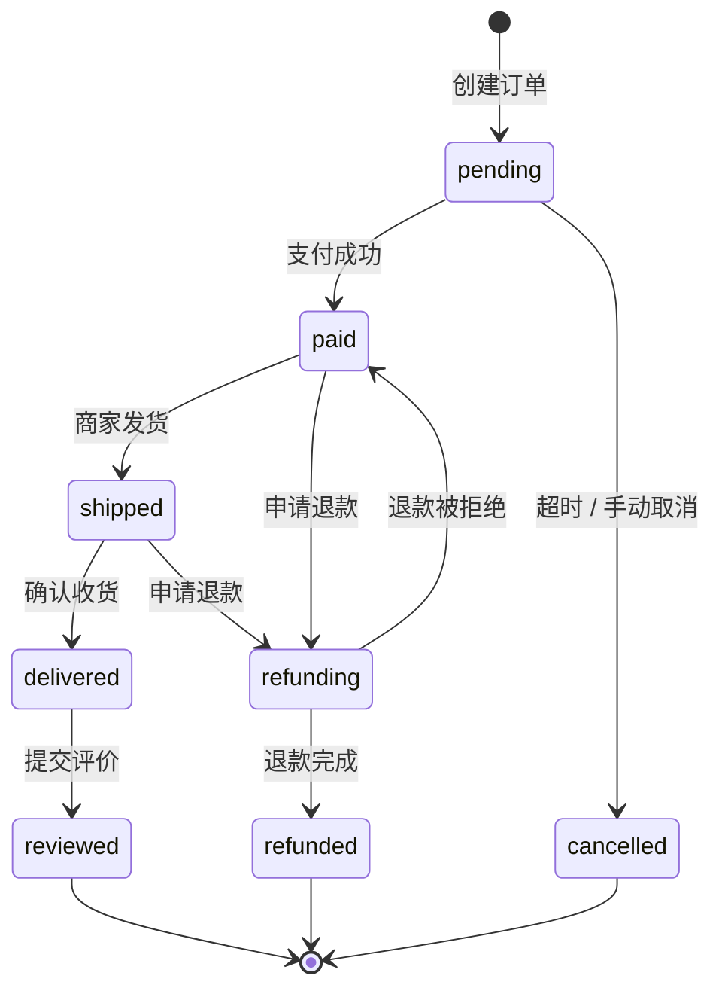
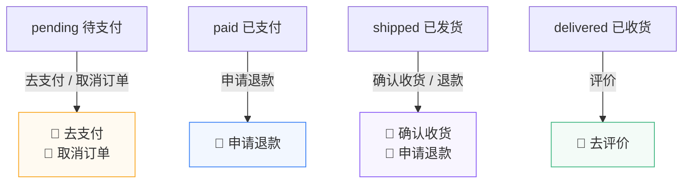
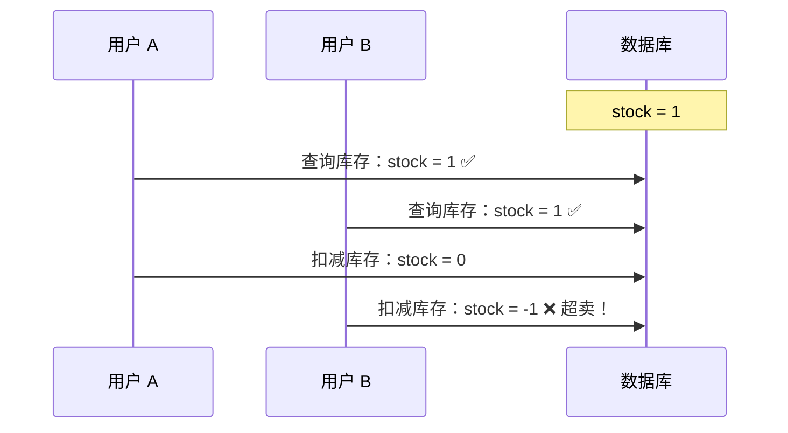

# L25 · 订单系统：状态机设计

```
🎯 本节目标：实现订单的创建和状态流转，掌握有限状态机设计模式
📦 本节产出：订单 API + 状态机 + 前端订单列表/详情页 + 状态流转可视化
🔗 前置钩子：L24 的购物车结算（订单数据来源）
🔗 后续钩子：L26 将对接支付流程
```

---

## 1. 什么是有限状态机 (FSM)

有限状态机是一种经典的设计模式：**对象在有限的状态集合中转换，每次转换由特定事件触发，且有严格的合法路径**。

订单天然适合用状态机建模——订单不可能从"已取消"变成"已发货"。



---

## 2. 后端：状态机实现

### 2.1 状态转换表

```typescript
// server/src/utils/orderStateMachine.ts

// 合法的状态转换定义
const validTransitions: Record<string, string[]> = {
  pending:    ['paid', 'cancelled'],
  paid:       ['shipped', 'refunding', 'cancelled'],
  shipped:    ['delivered', 'refunding'],
  delivered:  ['reviewed'],
  refunding:  ['refunded', 'paid'],  // paid = 退款被拒，回到已支付
  refunded:   [],    // 终态
  reviewed:   [],    // 终态
  cancelled:  [],    // 终态
}

// 状态元信息
export const STATUS_META: Record<string, {
  label: string
  color: string
  icon: string
  isFinal: boolean
}> = {
  pending:    { label: '待支付',   color: '#f59e0b', icon: '⏳', isFinal: false },
  paid:       { label: '已支付',   color: '#3b82f6', icon: '💳', isFinal: false },
  shipped:    { label: '已发货',   color: '#8b5cf6', icon: '🚚', isFinal: false },
  delivered:  { label: '已收货',   color: '#42b883', icon: '📦', isFinal: false },
  reviewed:   { label: '已评价',   color: '#059669', icon: '⭐', isFinal: true  },
  refunding:  { label: '退款中',   color: '#ef4444', icon: '↩️', isFinal: false },
  refunded:   { label: '已退款',   color: '#6b7280', icon: '💰', isFinal: true  },
  cancelled:  { label: '已取消',   color: '#9ca3af', icon: '❌', isFinal: true  },
}

// 校验状态转换是否合法
export function canTransition(from: string, to: string): boolean {
  return validTransitions[from]?.includes(to) ?? false
}

// 获取当前状态可以转换到的下一个状态列表
export function getNextStates(current: string): string[] {
  return validTransitions[current] || []
}

// 是否为终态
export function isFinalState(status: string): boolean {
  return STATUS_META[status]?.isFinal ?? false
}
```

**为什么用对象映射而不是 if/else？**
- 状态转换规则集中管理，一目了然
- 新增状态只需添加一行，不修改业务逻辑
- 可以序列化为 JSON 配置，甚至存数据库实现动态流程

### 2.2 订单控制器

```typescript
// server/src/controllers/orderController.ts
import { Request, Response, NextFunction } from 'express'
import Order from '../models/Order'
import Product from '../models/Product'
import { canTransition, getNextStates, STATUS_META } from '../utils/orderStateMachine'

// POST /api/orders — 创建订单
export async function createOrder(req: Request, res: Response, next: NextFunction) {
  try {
    const userId = (req as any).user.userId
    const { items, shippingAddress } = req.body

    if (!items?.length) {
      return res.status(400).json({ message: '订单不能为空' })
    }

    // 1. 校验商品并计算总价
    let totalAmount = 0
    const orderItems = []

    for (const item of items) {
      const product = await Product.findById(item.productId)

      if (!product) {
        return res.status(400).json({ message: `商品 ${item.productId} 不存在` })
      }
      if (!product.isActive) {
        return res.status(400).json({ message: `${product.name} 已下架` })
      }
      if (product.stock < item.quantity) {
        return res.status(400).json({
          message: `${product.name} 库存不足（剩余 ${product.stock}）`
        })
      }

      totalAmount += product.price * item.quantity

      orderItems.push({
        product: product._id,
        name: product.name,
        price: product.price,
        quantity: item.quantity,
        image: product.images[0] || '',
      })
    }

    // 2. 扣减库存（乐观锁）
    for (const item of items) {
      const result = await Product.findOneAndUpdate(
        { _id: item.productId, stock: { $gte: item.quantity } },
        { $inc: { stock: -item.quantity } },
        { new: true }
      )

      if (!result) {
        // 扣减失败（并发情况下库存已不足），需要回滚已扣的库存
        // ⚠️ 概念示意：直接返回失败。真实项目需要回滚前面已扣减的商品库存。
        return res.status(409).json({ message: '库存已被其他订单占用，请重试' })
      }
    }

    // > [!IMPORTANT]
    // > **以上库存扣减为教学简化版。** 真实项目中应使用：
    // > - MongoDB 事务（`session.startTransaction()`）保证原子性
    // > - 扣减失败时自动回滚已扣商品的库存
    // > - 幂等键防止重复创建订单

    // 3. 创建订单
    const order = await Order.create({
      user: userId,
      items: orderItems,
      totalAmount,
      shippingAddress,
      status: 'pending',
    })

    // 4. 设置超时自动取消（30 分钟未支付）
    // ⚠️ 概念示意：setTimeout 在进程重启后丢失，不可用于生产环境！
    // 🏭 生产方案：使用消息队列延迟消息（如 Bull / BullMQ）或数据库定时任务扫描
    setTimeout(async () => {
      const found = await Order.findById(order._id)
      if (found && found.status === 'pending') {
        found.status = 'cancelled'
        await found.save()
        // 恢复库存
        for (const item of found.items) {
          await Product.findByIdAndUpdate(item.product, {
            $inc: { stock: item.quantity }
          })
        }
      }
    }, 30 * 60 * 1000)

    res.status(201).json({ data: order })
  } catch (error) {
    next(error)
  }
}

// PATCH /api/orders/:id/status — 更新订单状态
export async function updateOrderStatus(req: Request, res: Response, next: NextFunction) {
  try {
    const { status: newStatus } = req.body
    const order = await Order.findById(req.params.id)

    if (!order) {
      return res.status(404).json({ message: '订单不存在' })
    }

    // 状态机校验
    if (!canTransition(order.status, newStatus)) {
      return res.status(400).json({
        message: `无法从「${STATUS_META[order.status].label}」转换到「${STATUS_META[newStatus]?.label || newStatus}」`,
        currentStatus: order.status,
        allowedTransitions: getNextStates(order.status),
      })
    }

    const oldStatus = order.status
    order.status = newStatus

    // 记录关键时间戳
    if (newStatus === 'paid') order.paidAt = new Date()
    if (newStatus === 'delivered') order.deliveredAt = new Date()

    // 退款：恢复库存
    if (newStatus === 'refunded') {
      for (const item of order.items) {
        await Product.findByIdAndUpdate(item.product, {
          $inc: { stock: item.quantity }
        })
      }
    }

    await order.save()

    res.json({
      data: order,
      message: `订单状态从「${STATUS_META[oldStatus].label}」更新为「${STATUS_META[newStatus].label}」`,
    })
  } catch (error) {
    next(error)
  }
}

// GET /api/orders/my — 获取我的订单列表
export async function getMyOrders(req: Request, res: Response, next: NextFunction) {
  try {
    const userId = (req as any).user.userId
    const { status, page = '1', limit = '10' } = req.query

    const query: any = { user: userId }
    if (status) query.status = status

    const pageNum = parseInt(page as string)
    const limitNum = parseInt(limit as string)

    const [orders, total] = await Promise.all([
      Order.find(query)
        .sort('-createdAt')
        .skip((pageNum - 1) * limitNum)
        .limit(limitNum)
        .lean(),
      Order.countDocuments(query),
    ])

    res.json({
      data: orders,
      pagination: { page: pageNum, limit: limitNum, total, totalPages: Math.ceil(total / limitNum) },
    })
  } catch (error) {
    next(error)
  }
}

// GET /api/orders/:id — 订单详情
export async function getOrderById(req: Request, res: Response, next: NextFunction) {
  try {
    const order = await Order.findById(req.params.id)
      .populate('user', 'name email')
      .lean()

    if (!order) {
      return res.status(404).json({ message: '订单不存在' })
    }

    // 附加可用操作
    const nextStates = getNextStates(order.status)

    res.json({
      data: { ...order, availableActions: nextStates }
    })
  } catch (error) {
    next(error)
  }
}
```

---

## 3. 前端：订单列表页

```vue
<!-- client/src/views/OrderListView.vue -->
<script setup lang="ts">
import { ref, onMounted, computed } from 'vue'
import { orderApi } from '@/api/orders'
import { useRequest } from '@/composables/useRequest'

const activeTab = ref('all')

const tabs = [
  { key: 'all',       label: '全部' },
  { key: 'pending',   label: '待支付' },
  { key: 'paid',      label: '已支付' },
  { key: 'shipped',   label: '待收货' },
  { key: 'delivered', label: '已收货' },
]

const statusFilter = computed(() =>
  activeTab.value === 'all' ? undefined : activeTab.value
)

const { data: orderData, loading, execute: fetchOrders } = useRequest(() =>
  orderApi.getMyOrders({ status: statusFilter.value, page: 1, limit: 20 })
)

onMounted(fetchOrders)

// 切换 tab 时重新加载
function switchTab(key: string) {
  activeTab.value = key
  fetchOrders()
}

const statusMap: Record<string, { label: string; color: string; icon: string }> = {
  pending:   { label: '待支付',  color: '#f59e0b', icon: '⏳' },
  paid:      { label: '已支付',  color: '#3b82f6', icon: '💳' },
  shipped:   { label: '已发货',  color: '#8b5cf6', icon: '🚚' },
  delivered: { label: '已收货',  color: '#42b883', icon: '📦' },
  reviewed:  { label: '已评价',  color: '#059669', icon: '⭐' },
  refunding: { label: '退款中',  color: '#ef4444', icon: '↩️' },
  refunded:  { label: '已退款',  color: '#6b7280', icon: '💰' },
  cancelled: { label: '已取消',  color: '#9ca3af', icon: '❌' },
}

// 订单操作
async function handleAction(orderId: string, action: string) {
  await orderApi.updateStatus(orderId, action)
  fetchOrders()  // 刷新列表
}
</script>

<template>
  <div class="order-page">
    <h1>📋 我的订单</h1>

    <!-- Tab 筛选栏 -->
    <div class="order-tabs">
      <button
        v-for="tab in tabs"
        :key="tab.key"
        class="tab-btn"
        :class="{ active: activeTab === tab.key }"
        @click="switchTab(tab.key)"
      >
        {{ tab.label }}
      </button>
    </div>

    <!-- 加载 & 空状态 -->
    <div v-if="loading" class="loading-state">加载中...</div>

    <div v-else-if="!orderData?.data?.length" class="empty-state">
      <p>暂无订单</p>
      <RouterLink to="/products" class="btn-primary">去购物</RouterLink>
    </div>

    <!-- 订单列表 -->
    <div v-else class="order-list">
      <div v-for="order in orderData.data" :key="order._id" class="order-card">
        <!-- 订单头部 -->
        <div class="order-header">
          <span class="order-id">订单号：{{ order._id.slice(-8).toUpperCase() }}</span>
          <span class="order-time">
            {{ new Date(order.createdAt).toLocaleString() }}
          </span>
          <span
            class="order-status"
            :style="{ color: statusMap[order.status]?.color }"
          >
            {{ statusMap[order.status]?.icon }}
            {{ statusMap[order.status]?.label }}
          </span>
        </div>

        <!-- 商品列表 -->
        <div class="order-items">
          <div v-for="item in order.items" :key="item.product" class="order-item">
            
            <div class="item-info">
              <span class="item-name">{{ item.name }}</span>
              <span class="item-qty">× {{ item.quantity }}</span>
            </div>
            <span class="item-price">¥{{ (item.price * item.quantity).toFixed(2) }}</span>
          </div>
        </div>

        <!-- 订单底部 -->
        <div class="order-footer">
          <span class="order-total">
            合计：<strong>¥{{ order.totalAmount.toFixed(2) }}</strong>
          </span>

          <div class="order-actions">
            <button
              v-if="order.status === 'pending'"
              class="btn-primary"
              @click="$router.push(`/pay/${order._id}`)"
            >
              去支付
            </button>
            <button
              v-if="order.status === 'pending'"
              class="btn-text"
              @click="handleAction(order._id, 'cancelled')"
            >
              取消订单
            </button>
            <button
              v-if="order.status === 'shipped'"
              class="btn-primary"
              @click="handleAction(order._id, 'delivered')"
            >
              确认收货
            </button>
            <button
              v-if="order.status === 'delivered'"
              class="btn-outline"
              @click="$router.push(`/review/${order._id}`)"
            >
              去评价
            </button>
            <button
              v-if="['paid', 'shipped'].includes(order.status)"
              class="btn-text danger"
              @click="handleAction(order._id, 'refunding')"
            >
              申请退款
            </button>
          </div>
        </div>
      </div>
    </div>
  </div>
</template>

<style scoped>
.order-page { padding: 24px; max-width: 800px; margin: 0 auto; }
.order-page h1 { font-size: 1.5rem; margin-bottom: 16px; }

/* Tab 栏 */
.order-tabs { display: flex; gap: 4px; margin-bottom: 20px; border-bottom: 1px solid #eee; }
.tab-btn {
  padding: 10px 20px; border: none; background: none;
  cursor: pointer; font-size: 0.9rem; color: #666;
  border-bottom: 2px solid transparent; transition: all 0.2s;
}
.tab-btn.active { color: #42b883; border-bottom-color: #42b883; font-weight: 600; }

/* 订单卡片 */
.order-card {
  border: 1px solid #e8e8e8; border-radius: 12px;
  margin-bottom: 16px; overflow: hidden;
}

.order-header {
  display: flex; align-items: center; gap: 12px;
  padding: 14px 16px; background: #fafafa;
  font-size: 0.85rem;
}
.order-id { font-family: monospace; color: #333; }
.order-time { color: #999; flex: 1; }
.order-status { font-weight: 600; }

.order-items { padding: 0 16px; }
.order-item {
  display: flex; align-items: center; gap: 12px;
  padding: 12px 0; border-bottom: 1px solid #f0f0f0;
}
.order-item:last-child { border-bottom: none; }
.item-img { width: 56px; height: 56px; border-radius: 6px; object-fit: cover; }
.item-info { flex: 1; }
.item-name { display: block; font-size: 0.9rem; }
.item-qty { font-size: 0.8rem; color: #999; }
.item-price { font-weight: 600; color: #333; }

.order-footer {
  display: flex; align-items: center; justify-content: space-between;
  padding: 14px 16px; background: #fafafa;
}
.order-total { font-size: 0.9rem; }
.order-total strong { font-size: 1.1rem; color: #e74c3c; }
.order-actions { display: flex; gap: 8px; }

.btn-primary {
  padding: 6px 18px; border: none; border-radius: 6px;
  background: #42b883; color: white; font-size: 0.85rem; cursor: pointer;
}
.btn-outline {
  padding: 6px 18px; border: 1px solid #42b883; border-radius: 6px;
  background: white; color: #42b883; font-size: 0.85rem; cursor: pointer;
}
.btn-text {
  padding: 6px 12px; border: none; background: none;
  color: #666; font-size: 0.85rem; cursor: pointer;
}
.btn-text.danger { color: #e74c3c; }
</style>
```

---

## 4. 状态机在前端的体现

### 4.1 根据状态动态显示操作按钮



**核心思想：** UI 是状态的函数。按钮不是"硬编码显示加 flag 控制"，而是从状态机的 `getNextStates()` 推导出来。

### 4.2 状态时间线组件

```vue
<!-- OrderTimeline.vue -->
<script setup lang="ts">
defineProps<{
  status: string
  createdAt: string
  paidAt?: string
  deliveredAt?: string
}>()

const steps = [
  { key: 'pending',   label: '下单' },
  { key: 'paid',      label: '支付' },
  { key: 'shipped',   label: '发货' },
  { key: 'delivered', label: '收货' },
  { key: 'reviewed',  label: '评价' },
]

const statusOrder = ['pending', 'paid', 'shipped', 'delivered', 'reviewed']
</script>

<template>
  <div class="timeline">
    <div
      v-for="(step, i) in steps"
      :key="step.key"
      class="timeline-step"
      :class="{
        active: statusOrder.indexOf(status) >= i,
        current: status === step.key,
      }"
    >
      <div class="step-dot"></div>
      <div class="step-label">{{ step.label }}</div>
    </div>
  </div>
</template>

<style scoped>
.timeline {
  display: flex;
  justify-content: space-between;
  position: relative;
  padding: 20px 0;
}

.timeline::before {
  content: '';
  position: absolute;
  top: 30px;
  left: 10%;
  right: 10%;
  height: 2px;
  background: #e0e0e0;
}

.timeline-step {
  display: flex;
  flex-direction: column;
  align-items: center;
  position: relative;
  z-index: 1;
}

.step-dot {
  width: 16px;
  height: 16px;
  border-radius: 50%;
  background: #e0e0e0;
  margin-bottom: 8px;
  transition: all 0.3s;
}

.active .step-dot {
  background: #42b883;
}

.current .step-dot {
  background: #42b883;
  box-shadow: 0 0 0 4px #42b88340;
  transform: scale(1.3);
}

.step-label {
  font-size: 0.75rem;
  color: #999;
}

.active .step-label {
  color: #42b883;
  font-weight: 600;
}
</style>
```

---

## 5. 防并发：库存扣减的乐观锁

订单创建时的库存扣减是一个经典的并发问题：



**解决方案：原子操作 + 条件更新**

```typescript
// 用 findOneAndUpdate + 条件 { stock: { $gte: quantity } }
// 保证只有库存够的时候才扣减（MongoDB 的原子操作）
const result = await Product.findOneAndUpdate(
  { _id: productId, stock: { $gte: quantity } },  // 条件
  { $inc: { stock: -quantity } },                   // 原子减
  { new: true }
)
if (!result) throw new Error('库存不足')
```

---

## 6. 本节总结

### 检查清单

- [ ] 理解有限状态机（FSM）的概念和适用场景
- [ ] 能用 `validTransitions` 对象定义合法状态转换
- [ ] 能实现 `canTransition()` 和 `getNextStates()` 工具函数
- [ ] 能实现创建订单时的库存校验和扣减
- [ ] 理解乐观锁防止并发超卖
- [ ] 能在前端根据订单状态动态渲染操作按钮
- [ ] 能实现订单状态时间线组件
- [ ] 能实现超时自动取消机制

### 本节边界

| 内容 | 本节状态 | 说明 |
|------|---------|------|
| 状态机设计模式 | ✅ 可用于生产 | 转换表 + 校验函数是标准做法 |
| 乐观锁库存扣减 | ✅ 可用于生产 | MongoDB 原子操作 |
| 多商品回滚 | ⚠️ 教学简化 | 应使用 MongoDB 事务 |
| setTimeout 超时取消 | ⚠️ 概念示意 | 进程重启后丢失，生产用消息队列 |
| 前端状态渲染 | ✅ 可用于生产 | UI 是状态的函数 |
| 时间线组件 | ✅ 可用于生产 | 可直接复用 |

### 课后练习

**练习 1：跟做（15 min）**
按照本节代码完整实现订单创建 → 状态流转 → 前端列表渲染。

**练习 2：举一反三（20 min）**
为状态机增加一个新状态 `returning`（退货中），定义从 `delivered` → `returning` → `returned` 的转换路径，并更新前端的 `statusMap` 和操作按钮。

**挑战题（30 min）**
把库存扣减改为 MongoDB 事务实现：使用 `session.startTransaction()` + `session.commitTransaction()` / `session.abortTransaction()`，在任何一个商品扣减失败时回滚已扣减的所有商品。

### 真实项目补充

| 实践 | 说明 |
|------|------|
| MongoDB 事务 | `startSession()` + `startTransaction()` 保证多文档原子性 |
| 消息队列延迟任务 | BullMQ / RabbitMQ 延迟消息替代 setTimeout |
| 幂等性 | 用唯一订单号防止重复创建（`idempotencyKey`） |
| 分布式锁 | Redis + Redlock 处理高并发场景 |
| 订单快照 | 下单时冻结商品价格/名称，防止后续商品修改影响历史订单 |

### Git 提交

```bash
git add .
git commit -m "L25: 订单系统 + 状态机 + 乐观锁 + 时间线"
```

### 🔗 → 下一节

L26 将实现支付流程——模拟支付二维码、轮询支付状态、超时处理，把异步编排做到极致。

