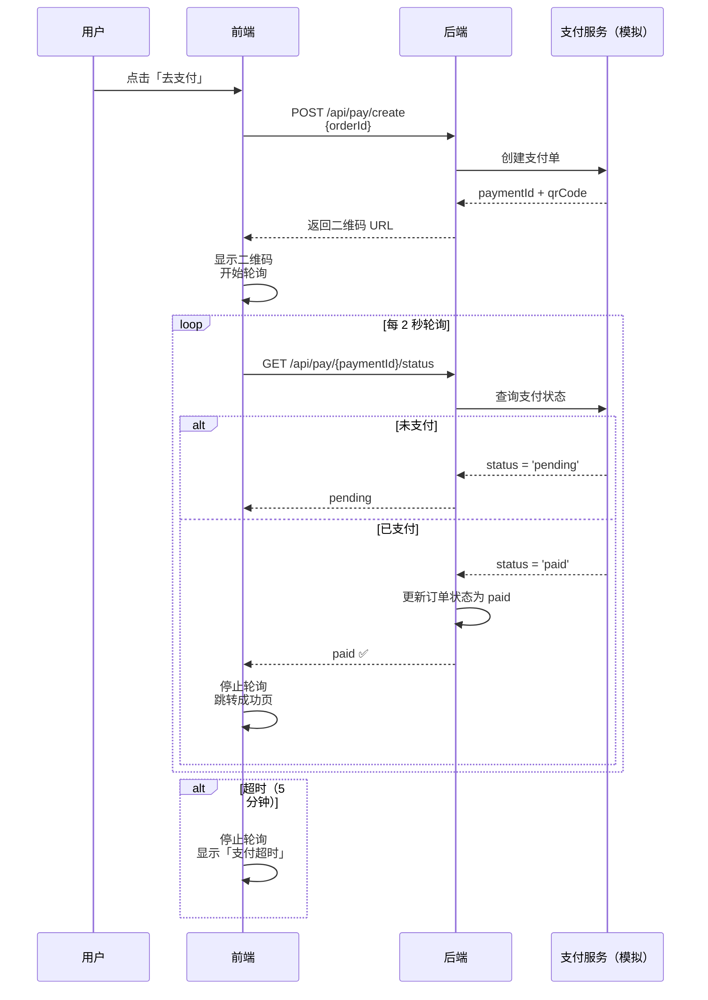

# L26 · 支付模拟：轮询与异步编排

```
🎯 本节目标：模拟支付流程——生成支付二维码、轮询支付状态、超时处理
📦 本节产出：支付页面 + usePolling composable + 支付结果页
🔗 前置钩子：L25 的订单系统（pending 状态等待支付）
🔗 后续钩子：L27 将实现商品图片上传
```

---

## 1. 支付流程概览



---

## 2. 后端：支付模拟 API

```typescript
// server/src/controllers/paymentController.ts
import { Request, Response, NextFunction } from 'express'
import Order from '../models/Order'

// 模拟支付状态存储（实际项目用数据库表）
const payments = new Map<string, {
  orderId: string
  amount: number
  status: 'pending' | 'paid' | 'failed' | 'expired'
  createdAt: Date
}>()

// POST /api/pay/create - 创建支付单
export async function createPayment(req: Request, res: Response, next: NextFunction) {
  try {
    const { orderId } = req.body
    const order = await Order.findById(orderId)

    if (!order) return res.status(404).json({ message: '订单不存在' })
    if (order.status !== 'pending') {
      return res.status(400).json({ message: '订单状态不允许支付' })
    }

    const paymentId = `pay_${Date.now()}_${Math.random().toString(36).slice(2, 8)}`

    payments.set(paymentId, {
      orderId,
      amount: order.totalAmount,
      status: 'pending',
      createdAt: new Date(),
    })

    // 模拟：5-15 秒后自动变为 paid（模拟用户扫码支付）
    const delay = 5000 + Math.random() * 10000
    setTimeout(() => {
      const payment = payments.get(paymentId)
      if (payment && payment.status === 'pending') {
        payment.status = 'paid'
        // 更新订单状态
        Order.findByIdAndUpdate(orderId, {
          status: 'paid',
          paidAt: new Date(),
        }).exec()
      }
    }, delay)

    // 5 分钟后过期
    setTimeout(() => {
      const payment = payments.get(paymentId)
      if (payment && payment.status === 'pending') {
        payment.status = 'expired'
      }
    }, 5 * 60 * 1000)

    res.json({
      data: {
        paymentId,
        amount: order.totalAmount,
        // 模拟二维码 URL（实际会是支付宝/微信的二维码链接）
        qrCodeUrl: `https://api.qrserver.com/v1/create-qr-code/?size=200x200&data=PAY:${paymentId}`,
        expiresIn: 300,  // 5 分钟过期
      },
    })
  } catch (error) {
    next(error)
  }
}

// GET /api/pay/:paymentId/status - 查询支付状态
export async function getPaymentStatus(req: Request, res: Response) {
  const payment = payments.get(req.params.paymentId)

  if (!payment) {
    return res.status(404).json({ message: '支付单不存在' })
  }

  res.json({
    data: {
      status: payment.status,
      amount: payment.amount,
      orderId: payment.orderId,
    },
  })
}
```

---

## 3. usePolling Composable

```typescript
// client/src/composables/usePolling.ts
import { ref, onUnmounted, type Ref } from 'vue'

interface UsePollingOptions<T> {
  interval?: number       // 轮询间隔（ms），默认 2000
  maxAttempts?: number    // 最大尝试次数，默认 150 (= 5min / 2s)
  shouldStop?: (data: T) => boolean  // 自定义停止条件
  onSuccess?: (data: T) => void
  onTimeout?: () => void
  onError?: (error: Error) => void
}

export function usePolling<T>(
  pollFn: () => Promise<T>,
  options: UsePollingOptions<T> = {}
) {
  const {
    interval = 2000,
    maxAttempts = 150,
    shouldStop = () => false,
    onSuccess,
    onTimeout,
    onError,
  } = options

  const data = ref<T | null>(null) as Ref<T | null>
  const isPolling = ref(false)
  const attempts = ref(0)
  const error = ref<string | null>(null)

  let timer: ReturnType<typeof setTimeout> | null = null

  async function poll() {
    try {
      const result = await pollFn()
      data.value = result
      attempts.value++

      if (shouldStop(result)) {
        // 满足停止条件
        stop()
        onSuccess?.(result)
        return
      }

      if (attempts.value >= maxAttempts) {
        // 超过最大尝试次数
        stop()
        onTimeout?.()
        return
      }

      // 继续下一次轮询
      timer = setTimeout(poll, interval)
    } catch (err) {
      error.value = (err as Error).message
      onError?.(err as Error)
      // 出错后继续轮询（可配置为停止）
      timer = setTimeout(poll, interval)
    }
  }

  function start() {
    if (isPolling.value) return
    isPolling.value = true
    attempts.value = 0
    error.value = null
    poll()
  }

  function stop() {
    isPolling.value = false
    if (timer) {
      clearTimeout(timer)
      timer = null
    }
  }

  // 组件卸载时自动停止
  onUnmounted(stop)

  return { data, isPolling, attempts, error, start, stop }
}
```

---

## 4. 支付页面

```vue
<!-- client/src/views/PaymentView.vue -->
<script setup lang="ts">
import { ref, onMounted, computed } from 'vue'
import { useRoute, useRouter } from 'vue-router'
import { usePolling } from '@/composables/usePolling'
import request from '@/utils/request'

const route = useRoute()
const router = useRouter()
const orderId = route.params.id as string

// 支付信息
const paymentInfo = ref<{
  paymentId: string
  qrCodeUrl: string
  amount: number
  expiresIn: number
} | null>(null)

const paymentStatus = ref<'idle' | 'pending' | 'paid' | 'expired' | 'failed'>('idle')

// 倒计时
const countdown = ref(300)
let countdownTimer: ReturnType<typeof setInterval>

// ─── 创建支付单 ───
async function createPayment() {
  try {
    const res = await request.post('/pay/create', { orderId })
    paymentInfo.value = res.data
    countdown.value = res.data.expiresIn
    paymentStatus.value = 'pending'

    // 开始轮询
    startPolling()

    // 开始倒计时
    countdownTimer = setInterval(() => {
      countdown.value--
      if (countdown.value <= 0) {
        clearInterval(countdownTimer)
        paymentStatus.value = 'expired'
        stopPolling()
      }
    }, 1000)
  } catch (err) {
    paymentStatus.value = 'failed'
  }
}

// ─── 轮询支付状态 ───
const { start: startPolling, stop: stopPolling, attempts } = usePolling(
  async () => {
    const res = await request.get(`/pay/${paymentInfo.value!.paymentId}/status`)
    return res.data
  },
  {
    interval: 2000,
    maxAttempts: 150,
    shouldStop: (data: any) => data.status !== 'pending',
    onSuccess: (data: any) => {
      if (data.status === 'paid') {
        paymentStatus.value = 'paid'
        clearInterval(countdownTimer)
        // 延迟跳转，让用户看到成功提示
        setTimeout(() => {
          router.push(`/orders/${orderId}`)
        }, 2000)
      } else if (data.status === 'expired') {
        paymentStatus.value = 'expired'
        clearInterval(countdownTimer)
      }
    },
    onTimeout: () => {
      paymentStatus.value = 'expired'
      clearInterval(countdownTimer)
    },
  }
)

// 格式化倒计时
const formattedCountdown = computed(() => {
  const min = Math.floor(countdown.value / 60)
  const sec = countdown.value % 60
  return `${min}:${sec.toString().padStart(2, '0')}`
})

onMounted(createPayment)
</script>

<template>
  <div class="payment-page">
    <!-- 等待支付 -->
    <div v-if="paymentStatus === 'pending' && paymentInfo" class="payment-pending">
      <h1>扫码支付</h1>
      <p class="amount">
        ¥<strong>{{ paymentInfo.amount.toLocaleString() }}</strong>
      </p>

      <div class="qr-container">
        
        <div class="qr-overlay" v-if="countdown <= 30">
          <span class="expiring">即将过期</span>
        </div>
      </div>

      <p class="countdown">
        剩余支付时间：<strong :class="{ warning: countdown <= 60 }">
          {{ formattedCountdown }}
        </strong>
      </p>

      <p class="hint">请使用支付宝或微信扫描二维码完成支付</p>
      <p class="polling-info">正在等待支付结果... (已检查 {{ attempts }} 次)</p>
    </div>

    <!-- 支付成功 -->
    <div v-else-if="paymentStatus === 'paid'" class="payment-success">
      <div class="success-icon">✅</div>
      <h1>支付成功</h1>
      <p>即将跳转到订单详情...</p>
    </div>

    <!-- 支付过期 -->
    <div v-else-if="paymentStatus === 'expired'" class="payment-expired">
      <div class="expired-icon">⏰</div>
      <h1>支付超时</h1>
      <p>二维码已过期，请返回重新发起支付</p>
      <button @click="createPayment()" class="btn-primary">重新支付</button>
      <RouterLink :to="`/orders/${orderId}`" class="btn-text">返回订单</RouterLink>
    </div>

    <!-- 初始化 / 加载 -->
    <div v-else class="payment-loading">
      <p>正在创建支付单...</p>
    </div>
  </div>
</template>

<style scoped>
.payment-page {
  display: flex; justify-content: center; align-items: center;
  min-height: 70vh; padding: 24px;
}

.payment-pending, .payment-success, .payment-expired, .payment-loading {
  text-align: center; max-width: 400px;
}

.amount {
  font-size: 1.1rem; color: #666; margin: 8px 0 24px;
}
.amount strong { font-size: 2rem; color: #e74c3c; }

.qr-container {
  position: relative; display: inline-block;
  padding: 16px; background: white;
  border: 1px solid #e0e0e0; border-radius: 12px;
  box-shadow: 0 2px 12px rgba(0,0,0,0.06);
  margin-bottom: 20px;
}
.qr-code { width: 200px; height: 200px; }
.qr-overlay {
  position: absolute; inset: 0; background: rgba(255,255,255,0.85);
  display: flex; align-items: center; justify-content: center;
  border-radius: 12px;
}
.expiring { color: #e74c3c; font-weight: 700; font-size: 1.1rem; }

.countdown { font-size: 0.9rem; color: #666; }
.countdown .warning { color: #e74c3c; }
.hint { font-size: 0.8rem; color: #999; margin-top: 12px; }
.polling-info { font-size: 0.75rem; color: #bbb; margin-top: 8px; }

.success-icon, .expired-icon { font-size: 4rem; margin-bottom: 16px; }
.payment-success h1 { color: #42b883; }
.payment-expired h1 { color: #e74c3c; }

.btn-primary {
  padding: 10px 28px; background: #42b883; color: white;
  border: none; border-radius: 8px; cursor: pointer; font-size: 0.95rem;
  margin-top: 16px;
}
.btn-text {
  display: block; margin-top: 12px; color: #666;
  text-decoration: none; font-size: 0.85rem;
}
</style>
```

---

## 5. 轮询 vs WebSocket vs SSE

| 方案 | 原理 | 优点 | 缺点 | 适用 |
|------|------|------|------|------|
| **轮询** | 定时发 HTTP 请求 | 实现简单、兼容性好 | 浪费带宽、延迟高 | 支付状态 ✅ |
| **长轮询** | 服务端 hold 请求直到有数据 | 实时性好 | 连接占用 | 消息推送 |
| **WebSocket** | 双向持久连接 | 真正实时、低延迟 | 复杂度高 | 聊天、协作 |
| **SSE** | 服务端单向推送 | 简单、自动重连 | 只能服务端→客户端 | 通知、股票 |

支付场景用轮询完全够用——因为支付状态变化不频繁（几秒到几分钟才一次）。

---

## 6. 本节总结

### 检查清单

- [ ] 能实现模拟支付 API（创建支付单 + 查询状态）
- [ ] 能封装 usePolling composable（interval / maxAttempts / shouldStop）
- [ ] 能实现支付二维码页面 + 倒计时
- [ ] 能在支付成功后自动跳转
- [ ] 能处理支付超时 + 重新支付
- [ ] 能在组件卸载时自动停止轮询
- [ ] 理解轮询 vs WebSocket vs SSE 的选型

### Git 提交

```bash
git add .
git commit -m "L26: 支付模拟 + usePolling + 倒计时 + 状态处理"
```

### 🔗 → 下一节

L27 将实现商品图片上传——拖拽上传、图片预览、上传进度条、服务端 multer 处理。
