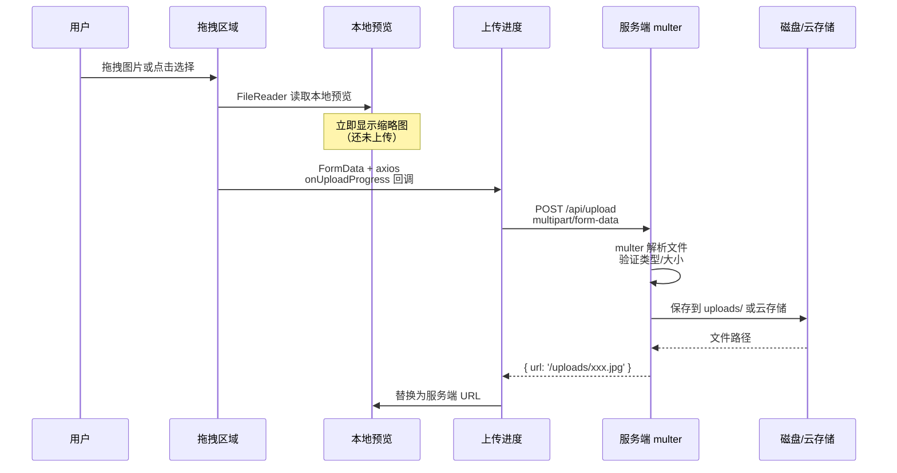

# L27 · 文件上传：拖拽 + 预览 + 进度

```
🎯 本节目标：实现图片上传（拖拽/点击）+ 预览 + 进度条 + 服务端 multer 处理
📦 本节产出：通用的 ImageUploader 组件 + 服务端上传 API
🔗 前置钩子：L26 的完整支付流程
🔗 后续钩子：L28 将实现 WebSocket 实时通知
```

---

## 1. 文件上传全流程



---

## 2. 后端：multer 文件处理

```bash
npm install multer
npm install -D @types/multer
```

```typescript
// server/src/middlewares/upload.ts
import multer from 'multer'
import path from 'path'
import { Request } from 'express'

// 存储配置
const storage = multer.diskStorage({
  destination(req, file, cb) {
    cb(null, 'uploads/')  // 保存目录
  },
  filename(req, file, cb) {
    // 生成唯一文件名：时间戳-随机数.扩展名
    const uniqueSuffix = `${Date.now()}-${Math.round(Math.random() * 1e9)}`
    const ext = path.extname(file.originalname)
    cb(null, `${uniqueSuffix}${ext}`)
  },
})

// 文件过滤
function fileFilter(req: Request, file: Express.Multer.File, cb: multer.FileFilterCallback) {
  const allowedTypes = ['image/jpeg', 'image/png', 'image/webp', 'image/gif']

  if (allowedTypes.includes(file.mimetype)) {
    cb(null, true)
  } else {
    cb(new Error(`不支持的文件类型: ${file.mimetype}。支持: jpg, png, webp, gif`))
  }
}

export const upload = multer({
  storage,
  fileFilter,
  limits: {
    fileSize: 5 * 1024 * 1024, // 最大 5MB
    files: 5,                   // 最多 5 个文件
  },
})
```

```typescript
// server/src/routes/uploadRoutes.ts
import { Router, Request, Response, NextFunction } from 'express'
import { upload } from '../middlewares/upload'
import { authMiddleware } from '../middlewares/auth'

const router = Router()

// 单文件上传
router.post('/single',
  authMiddleware,
  upload.single('file'),  // 字段名 'file'
  (req: Request, res: Response) => {
    if (!req.file) {
      return res.status(400).json({ success: false, message: '未选择文件' })
    }

    res.json({
      success: true,
      data: {
        url: `/uploads/${req.file.filename}`,
        originalName: req.file.originalname,
        size: req.file.size,
        mimetype: req.file.mimetype,
      },
    })
  }
)

// 多文件上传
router.post('/multiple',
  authMiddleware,
  upload.array('files', 5),  // 最多 5 个
  (req: Request, res: Response) => {
    const files = req.files as Express.Multer.File[]
    if (!files?.length) {
      return res.status(400).json({ success: false, message: '未选择文件' })
    }

    res.json({
      success: true,
      data: files.map(f => ({
        url: `/uploads/${f.filename}`,
        originalName: f.originalname,
        size: f.size,
      })),
    })
  }
)

// multer 错误处理（挂在 router 上，优先于全局 errorHandler 处理上传相关错误）
// 非 multer 错误会通过 next(err) 交给全局错误处理中间件
router.use((err: any, req: Request, res: Response, next: NextFunction) => {
  if (err instanceof multer.MulterError) {
    if (err.code === 'LIMIT_FILE_SIZE') {
      return res.status(400).json({ success: false, message: '文件大小不能超过 5MB' })
    }
    if (err.code === 'LIMIT_FILE_COUNT') {
      return res.status(400).json({ success: false, message: '最多上传 5 个文件' })
    }
  }
  next(err)
})

export default router
```

```typescript
// 在 app.ts 中提供静态文件访问
import express from 'express'
app.use('/uploads', express.static('uploads'))
```

---

## 3. 前端：ImageUploader 组件

```vue
<!-- client/src/components/ui/ImageUploader.vue -->
<script setup lang="ts">
import { ref, computed } from 'vue'
import request from '@/utils/request'

interface UploadedImage {
  url: string
  originalName: string
  progress: number
  status: 'pending' | 'uploading' | 'done' | 'error'
  error?: string
  file?: File
  previewUrl?: string
}

const props = withDefaults(defineProps<{
  maxFiles?: number
  maxSize?: number       // MB
  accept?: string
}>(), {
  maxFiles: 5,
  maxSize: 5,
  accept: 'image/jpeg,image/png,image/webp',
})

const emit = defineEmits<{
  uploaded: [urls: string[]]
}>()

const images = ref<UploadedImage[]>([])
const isDragOver = ref(false)

// 已完成上传的 URL 列表
const uploadedUrls = computed(() =>
  images.value.filter(i => i.status === 'done').map(i => i.url)
)

// ─── 拖拽事件 ───
function onDragEnter(e: DragEvent) {
  e.preventDefault()
  isDragOver.value = true
}

function onDragLeave(e: DragEvent) {
  e.preventDefault()
  isDragOver.value = false
}

function onDrop(e: DragEvent) {
  e.preventDefault()
  isDragOver.value = false
  const files = Array.from(e.dataTransfer?.files || [])
  handleFiles(files)
}

// ─── 点击选择 ───
const fileInputRef = ref<HTMLInputElement>()

function triggerFileInput() {
  fileInputRef.value?.click()
}

function onFileChange(e: Event) {
  const input = e.target as HTMLInputElement
  const files = Array.from(input.files || [])
  handleFiles(files)
  input.value = ''  // 允许重复选择同一文件
}

// ─── 文件处理 ───
function handleFiles(files: File[]) {
  // 检查数量限制
  const remaining = props.maxFiles - images.value.length
  if (remaining <= 0) return

  const validFiles = files
    .slice(0, remaining)
    .filter(file => {
      // 检查类型
      if (!props.accept.includes(file.type)) {
        alert(`不支持的文件类型: ${file.type}`)
        return false
      }
      // 检查大小
      if (file.size > props.maxSize * 1024 * 1024) {
        alert(`${file.name} 超过 ${props.maxSize}MB 限制`)
        return false
      }
      return true
    })

  for (const file of validFiles) {
    const image: UploadedImage = {
      url: '',
      originalName: file.name,
      progress: 0,
      status: 'pending',
      file,
      previewUrl: URL.createObjectURL(file),  // 本地预览
    }

    images.value.push(image)
    uploadFile(image)
  }
}

// ─── 上传单个文件 ───
async function uploadFile(image: UploadedImage) {
  if (!image.file) return

  const formData = new FormData()
  formData.append('file', image.file)

  image.status = 'uploading'

  try {
    const res = await request.post('/upload/single', formData, {
      headers: { 'Content-Type': 'multipart/form-data' },
      onUploadProgress(progressEvent) {
        if (progressEvent.total) {
          image.progress = Math.round(
            (progressEvent.loaded / progressEvent.total) * 100
          )
        }
      },
    })

    image.url = res.data.url
    image.status = 'done'
    image.progress = 100

    // 释放 Blob URL
    if (image.previewUrl) {
      URL.revokeObjectURL(image.previewUrl)
      image.previewUrl = undefined
    }

    emit('uploaded', uploadedUrls.value)
  } catch (err) {
    image.status = 'error'
    image.error = (err as Error).message
  }
}

// ─── 删除图片 ───
function removeImage(index: number) {
  const image = images.value[index]
  if (image.previewUrl) URL.revokeObjectURL(image.previewUrl)
  images.value.splice(index, 1)
  emit('uploaded', uploadedUrls.value)
}

// ─── 重试失败 ───
function retryUpload(image: UploadedImage) {
  image.progress = 0
  image.error = undefined
  uploadFile(image)
}
</script>

<template>
  <div class="image-uploader">
    <!-- 拖拽区域 -->
    <div
      class="drop-zone"
      :class="{ 'is-drag-over': isDragOver, 'is-full': images.length >= maxFiles }"
      @dragenter="onDragEnter"
      @dragover.prevent
      @dragleave="onDragLeave"
      @drop="onDrop"
      @click="triggerFileInput"
    >
      <input
        ref="fileInputRef"
        type="file"
        :accept="accept"
        multiple
        hidden
        @change="onFileChange"
      />
      <div class="drop-content">
        <span class="drop-icon">📁</span>
        <p class="drop-text">
          {{ isDragOver ? '释放鼠标上传' : '拖拽图片到这里，或点击选择' }}
        </p>
        <p class="drop-hint">
          支持 JPG / PNG / WebP，单个文件最大 {{ maxSize }}MB，最多 {{ maxFiles }} 张
        </p>
      </div>
    </div>

    <!-- 图片预览列表 -->
    <div v-if="images.length > 0" class="preview-list">
      <div v-for="(img, index) in images" :key="index" class="preview-item">
        <!-- 缩略图 -->
        <div class="preview-image">
          

          <!-- 上传中遮罩 -->
          <div v-if="img.status === 'uploading'" class="upload-overlay">
            <div class="progress-ring">{{ img.progress }}%</div>
          </div>

          <!-- 错误遮罩 -->
          <div v-if="img.status === 'error'" class="error-overlay" @click="retryUpload(img)">
            <span>❌</span>
            <span class="retry-text">点击重试</span>
          </div>
        </div>

        <!-- 进度条 -->
        <div v-if="img.status === 'uploading'" class="progress-bar">
          <div class="progress-fill" :style="{ width: img.progress + '%' }"></div>
        </div>

        <!-- 删除按钮 -->
        <button @click="removeImage(index)" class="remove-btn" title="删除">×</button>

        <!-- 文件名 -->
        <p class="file-name">{{ img.originalName }}</p>
      </div>
    </div>
  </div>
</template>

<style scoped>
.drop-zone {
  border: 2px dashed #d0d0d0;
  border-radius: 12px;
  padding: 40px 20px;
  text-align: center;
  cursor: pointer;
  transition: all 0.2s;
  background: #fafafa;
}

.drop-zone:hover, .drop-zone.is-drag-over {
  border-color: #42b883;
  background: #42b88308;
}

.drop-zone.is-full {
  opacity: 0.5;
  pointer-events: none;
}

.drop-icon { font-size: 2.5rem; }
.drop-text { margin: 8px 0 4px; font-size: 0.95rem; color: #555; }
.drop-hint { font-size: 0.75rem; color: #aaa; margin: 0; }

/* 预览列表 */
.preview-list {
  display: grid;
  grid-template-columns: repeat(auto-fill, minmax(120px, 1fr));
  gap: 12px;
  margin-top: 16px;
}

.preview-item {
  position: relative;
}

.preview-image {
  position: relative;
  aspect-ratio: 1;
  border-radius: 8px;
  overflow: hidden;
  border: 1px solid #e0e0e0;
}

.preview-image img {
  width: 100%;
  height: 100%;
  object-fit: cover;
}

/* 上传遮罩 */
.upload-overlay, .error-overlay {
  position: absolute;
  inset: 0;
  display: flex;
  flex-direction: column;
  align-items: center;
  justify-content: center;
  background: rgba(0, 0, 0, 0.5);
}

.progress-ring {
  color: white;
  font-weight: 700;
  font-size: 1.1rem;
}

.error-overlay {
  cursor: pointer;
  color: white;
}

.retry-text {
  font-size: 0.7rem;
  margin-top: 4px;
}

/* 进度条 */
.progress-bar {
  height: 3px;
  background: #e0e0e0;
  border-radius: 2px;
  margin-top: 4px;
  overflow: hidden;
}

.progress-fill {
  height: 100%;
  background: #42b883;
  transition: width 0.3s;
}

/* 删除按钮 */
.remove-btn {
  position: absolute;
  top: 4px;
  right: 4px;
  width: 22px;
  height: 22px;
  border-radius: 50%;
  background: rgba(0, 0, 0, 0.6);
  color: white;
  border: none;
  cursor: pointer;
  font-size: 0.8rem;
  line-height: 1;
  display: flex;
  align-items: center;
  justify-content: center;
  opacity: 0;
  transition: opacity 0.15s;
}

.preview-item:hover .remove-btn {
  opacity: 1;
}

.file-name {
  font-size: 0.65rem;
  color: #999;
  margin: 4px 0 0;
  overflow: hidden;
  text-overflow: ellipsis;
  white-space: nowrap;
}
</style>
```

---

## 4. 在商品表单中使用

```vue
<script setup lang="ts">
import ImageUploader from '@/components/ui/ImageUploader.vue'

const productImages = ref<string[]>([])

function onImagesUploaded(urls: string[]) {
  productImages.value = urls
}
</script>

<template>
  <form @submit.prevent="handleSubmit">
    <ImageUploader
      :max-files="5"
      :max-size="5"
      @uploaded="onImagesUploaded"
    />
    <!-- 其他表单字段 -->
  </form>
</template>
```

---

## 5. 本节总结

### 检查清单

- [ ] 能用 multer 配置文件上传（存储、过滤、限制）
- [ ] 能实现拖拽上传（dragenter / dragover / dragleave / drop）
- [ ] 能用 `URL.createObjectURL` 实现本地即时预览
- [ ] 能用 `onUploadProgress` 显示上传进度
- [ ] 能处理上传失败和重试
- [ ] 能用 FormData 发送 multipart/form-data 请求
- [ ] 知道 `URL.revokeObjectURL` 的必要性（防止内存泄漏）

### Git 提交

```bash
git add .
git commit -m "L27: 图片上传 - 拖拽/预览/进度/multer"
```

### 🔗 → 下一节

L28 将实现 WebSocket 实时通知——当订单状态变化时，用 Socket.IO 推送通知给用户。
