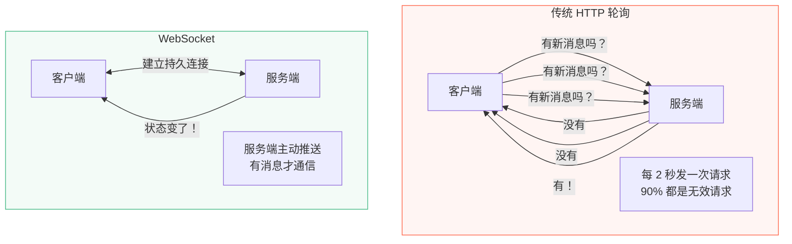
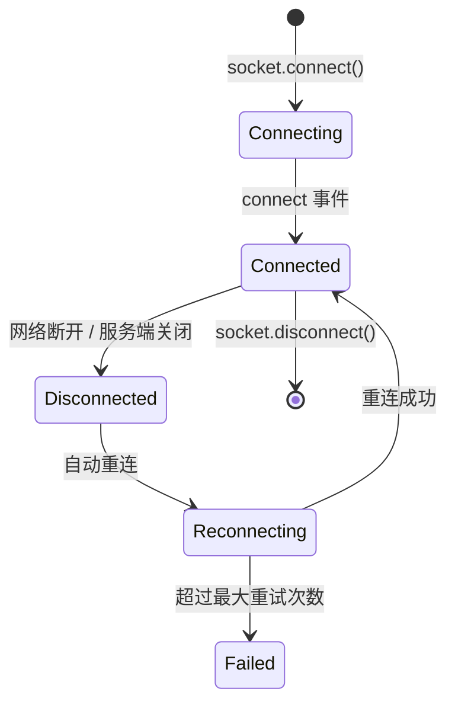

# L28 · WebSocket：实时通知

```
🎯 本节目标：用 Socket.IO 实现服务端向客户端的实时消息推送
📦 本节产出：订单状态变化实时通知 + 通知中心组件 + useSocket composable
🔗 前置钩子：L27 的完整上传功能、L25 的订单状态变化
🔗 后续钩子：L29 将用 SSR + Nuxt 优化首屏性能
```

---

## 1. 为什么需要 WebSocket



---

## 2. 后端：Socket.IO 集成

```bash
npm install socket.io
```

```typescript
// server/src/socket.ts
import { Server as HttpServer } from 'http'
import { Server, Socket } from 'socket.io'
import jwt from 'jsonwebtoken'

let io: Server

export function initSocket(httpServer: HttpServer) {
  io = new Server(httpServer, {
    cors: {
      origin: process.env.CLIENT_URL || 'http://localhost:5173',
      methods: ['GET', 'POST'],
    },
  })

  // ─── 认证中间件 ───
  io.use((socket, next) => {
    const token = socket.handshake.auth.token
    if (!token) {
      return next(new Error('未提供认证 Token'))
    }

    try {
      const decoded = jwt.verify(token, process.env.JWT_SECRET!) as any
      socket.data.userId = decoded.userId
      next()
    } catch {
      next(new Error('Token 无效'))
    }
  })

  // ─── 连接处理 ───
  io.on('connection', (socket: Socket) => {
    const userId = socket.data.userId
    console.log(`🔌 用户 ${userId} 已连接, socketId: ${socket.id}`)

    // 加入用户专属房间（用于定向推送）
    socket.join(`user:${userId}`)

    // 心跳
    socket.on('ping', () => {
      socket.emit('pong')
    })

    // 断开连接
    socket.on('disconnect', (reason) => {
      console.log(`🔌 用户 ${userId} 已断开: ${reason}`)
    })
  })

  return io
}

// 导出发送通知的工具函数
export function sendNotification(userId: string, notification: {
  type: string
  title: string
  message: string
  data?: any
}) {
  if (!io) return

  io.to(`user:${userId}`).emit('notification', {
    ...notification,
    id: Date.now().toString(),
    createdAt: new Date().toISOString(),
    read: false,
  })
}
```

```typescript
// server/src/index.ts
import http from 'http'
import app from './app'
import { initSocket } from './socket'

const server = http.createServer(app)
initSocket(server)

server.listen(3000, () => {
  console.log('🚀 Server running on port 3000')
})
```

### 在订单状态变化时发送通知

```typescript
// server/src/controllers/orderController.ts
import { sendNotification } from '../socket'

// 更新订单状态后
await order.save()

sendNotification(order.user.toString(), {
  type: 'order_status',
  title: '订单状态更新',
  message: `您的订单已${STATUS_META[newStatus].label}`,
  data: {
    orderId: order._id,
    oldStatus,
    newStatus,
  },
})
```

---

## 3. 前端：useSocket composable

```bash
npm install socket.io-client
```

```typescript
// client/src/composables/useSocket.ts
import { ref, onMounted, onUnmounted } from 'vue'
import { io, type Socket } from 'socket.io-client'

// 单例 socket 连接
let socket: Socket | null = null
let refCount = 0

function getSocket(): Socket {
  if (!socket) {
    const token = localStorage.getItem('access-token')

    socket = io(import.meta.env.VITE_API_URL?.replace('/api', '') || 'http://localhost:3000', {
      auth: { token },
      autoConnect: false,
      reconnection: true,           // 自动重连
      reconnectionAttempts: 10,     // 最多重试 10 次
      reconnectionDelay: 1000,      // 首次重连延迟 1s
      reconnectionDelayMax: 5000,   // 最大重连延迟 5s
    })
  }
  return socket
}

export function useSocket() {
  const isConnected = ref(false)
  const connectionError = ref<string | null>(null)

  const s = getSocket()

  onMounted(() => {
    refCount++
    if (!s.connected) {
      s.connect()
    }

    // 连接状态
    s.on('connect', () => {
      isConnected.value = true
      connectionError.value = null
      console.log('🔌 Socket 已连接')
    })

    s.on('disconnect', (reason) => {
      isConnected.value = false
      console.log('🔌 Socket 断开:', reason)
    })

    s.on('connect_error', (err) => {
      connectionError.value = err.message
      console.error('🔌 连接错误:', err.message)
    })
  })

  onUnmounted(() => {
    refCount--
    if (refCount === 0 && socket) {
      socket.disconnect()
      socket = null
    }
  })

  // 监听事件
  function on<T>(event: string, handler: (data: T) => void) {
    s.on(event, handler)
    // 返回取消监听函数
    onUnmounted(() => s.off(event, handler))
  }

  // 发送事件
  function emit(event: string, data?: any) {
    s.emit(event, data)
  }

  return { isConnected, connectionError, on, emit }
}
```

---

## 4. 通知中心组件

```typescript
// client/src/composables/useNotifications.ts
import { ref, computed } from 'vue'
import { useSocket } from './useSocket'

export interface Notification {
  id: string
  type: string
  title: string
  message: string
  data?: any
  createdAt: string
  read: boolean
}

// 模块级变量：所有调用 useNotifications() 的组件共享同一份通知列表（单例模式）
const notifications = ref<Notification[]>([])

export function useNotifications() {
  const { on } = useSocket()

  // 监听通知
  on<Notification>('notification', (notification) => {
    notifications.value.unshift(notification)  // 最新的在最前面
    // 可选：浏览器通知
    showBrowserNotification(notification)
  })

  const unreadCount = computed(() =>
    notifications.value.filter(n => !n.read).length
  )

  function markAsRead(id: string) {
    const n = notifications.value.find(n => n.id === id)
    if (n) n.read = true
  }

  function markAllAsRead() {
    notifications.value.forEach(n => { n.read = true })
  }

  function clearAll() {
    notifications.value = []
  }

  return { notifications, unreadCount, markAsRead, markAllAsRead, clearAll }
}

// 浏览器原生通知
async function showBrowserNotification(n: Notification) {
  // 首次需要请求用户授权
  if (Notification.permission === 'default') {
    await Notification.requestPermission()
  }
  if (Notification.permission === 'granted') {
    new Notification(n.title, { body: n.message })
  }
}
```

```vue
<!-- client/src/components/NotificationCenter.vue -->
<script setup lang="ts">
import { ref } from 'vue'
import { useNotifications } from '@/composables/useNotifications'
import { useSocket } from '@/composables/useSocket'

const { notifications, unreadCount, markAsRead, markAllAsRead } = useNotifications()
const { isConnected } = useSocket()
const isOpen = ref(false)

function togglePanel() {
  isOpen.value = !isOpen.value
}

function handleNotificationClick(notification: any) {
  markAsRead(notification.id)

  // 根据类型跳转
  if (notification.type === 'order_status' && notification.data?.orderId) {
    // router.push(`/orders/${notification.data.orderId}`)
  }
}
</script>

<template>
  <div class="notification-center">
    <!-- 触发按钮 -->
    <button @click="togglePanel" class="notify-trigger">
      🔔
      <span v-if="unreadCount > 0" class="badge">
        {{ unreadCount > 99 ? '99+' : unreadCount }}
      </span>
      <span v-if="!isConnected" class="offline-dot" title="未连接"></span>
    </button>

    <!-- 通知面板 -->
    <div v-if="isOpen" class="notify-panel">
      <div class="panel-header">
        <h3>通知</h3>
        <button v-if="unreadCount > 0" @click="markAllAsRead" class="mark-all">
          全部已读
        </button>
      </div>

      <div v-if="notifications.length === 0" class="empty">
        暂无通知
      </div>

      <div v-else class="notify-list">
        <div
          v-for="n in notifications"
          :key="n.id"
          class="notify-item"
          :class="{ unread: !n.read }"
          @click="handleNotificationClick(n)"
        >
          <div class="notify-content">
            <strong>{{ n.title }}</strong>
            <p>{{ n.message }}</p>
            <span class="notify-time">
              {{ new Date(n.createdAt).toLocaleString() }}
            </span>
          </div>
          <span v-if="!n.read" class="unread-dot"></span>
        </div>
      </div>
    </div>
  </div>
</template>

<style scoped>
.notification-center { position: relative; }

.notify-trigger {
  position: relative; background: none; border: none;
  font-size: 1.4rem; cursor: pointer; padding: 4px;
}

.badge {
  position: absolute; top: -4px; right: -8px;
  background: #e74c3c; color: white; font-size: 0.6rem;
  padding: 1px 5px; border-radius: 8px; font-weight: 700;
}

.offline-dot {
  position: absolute; bottom: 0; right: 0;
  width: 8px; height: 8px; border-radius: 50%;
  background: #aaa; border: 2px solid white;
}

.notify-panel {
  position: absolute; top: 100%; right: 0;
  width: 360px; max-height: 450px;
  background: white; border-radius: 12px;
  box-shadow: 0 8px 30px rgba(0,0,0,0.15);
  overflow: hidden; z-index: 1000;
}

.panel-header {
  display: flex; justify-content: space-between; align-items: center;
  padding: 14px 16px; border-bottom: 1px solid #f0f0f0;
}
.panel-header h3 { margin: 0; font-size: 1rem; }
.mark-all { background: none; border: none; color: #42b883; cursor: pointer; font-size: 0.8rem; }

.notify-list { max-height: 380px; overflow-y: auto; }

.notify-item {
  display: flex; align-items: flex-start; gap: 8px;
  padding: 12px 16px; cursor: pointer;
  border-bottom: 1px solid #f8f8f8;
  transition: background 0.15s;
}
.notify-item:hover { background: #f8f9fa; }
.notify-item.unread { background: #42b88308; }

.notify-content { flex: 1; }
.notify-content strong { font-size: 0.85rem; display: block; margin-bottom: 2px; }
.notify-content p { font-size: 0.8rem; color: #666; margin: 0 0 4px; }
.notify-time { font-size: 0.7rem; color: #bbb; }

.unread-dot { width: 8px; height: 8px; border-radius: 50%; background: #42b883; flex-shrink: 0; margin-top: 6px; }

.empty { text-align: center; padding: 40px; color: #999; font-size: 0.85rem; }
</style>
```

---

## 5. 连接生命周期



---

## 6. 本节总结

### 检查清单

- [ ] 能在后端集成 Socket.IO（认证中间件 + 房间分组）
- [ ] 能在业务逻辑中触发实时通知（`sendNotification`）
- [ ] 能封装 `useSocket` composable（单例连接 + 引用计数）
- [ ] 能实现通知中心组件（未读计数 + 面板 + 标记已读）
- [ ] 理解 WebSocket 的自动重连配置
- [ ] 能用浏览器 Notification API 发送桌面通知

### Git 提交

```bash
git add .
git commit -m "L28: Socket.IO 实时通知 + 通知中心"
```

### 🔗 → 下一节

L29 将用 SSR + Nuxt 3 优化商品页的首屏加载速度和 SEO。
