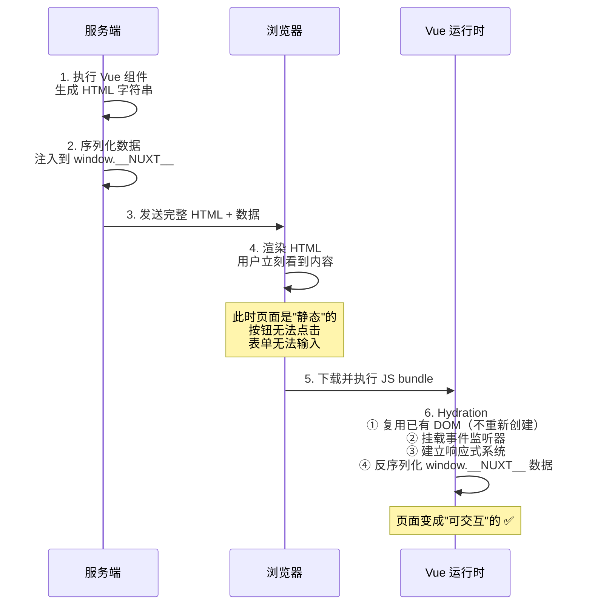
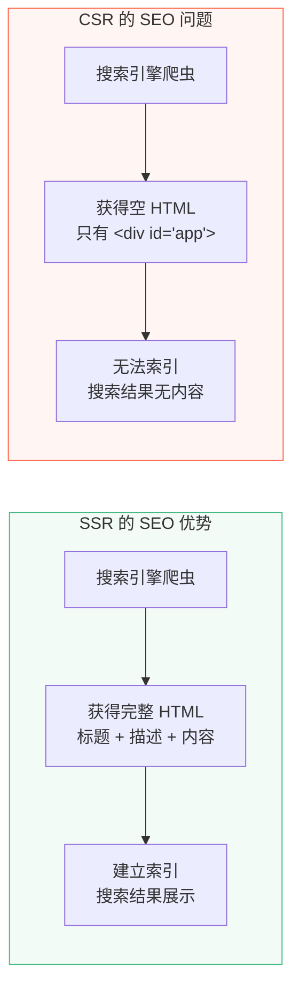
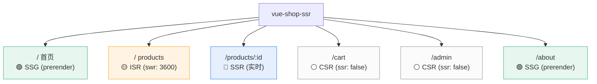

# L29 · SSR 与 Nuxt：首屏优化

```
🎯 本节目标：理解 CSR / SSR / SSG / ISR 四种渲染模式，用 Nuxt 3 实现 SSR 商品页
📦 本节产出：SSR 渲染的商品详情页 + SEO meta + useAsyncData + 混合渲染策略
🔗 前置钩子：L28 的完整全栈功能
🔗 后续钩子：L30 性能优化 + E2E 测试
```

---

## 1. 四种渲染模式

### 1.1 CSR：客户端渲染（Client-Side Rendering）

我们的应用目前就是 CSR——Vite 构建出一个空的 `index.html`，所有内容由浏览器端的 JavaScript 渲染：

```html
<!-- 浏览器收到的 HTML -->
<html>
  <body>
    <div id="app"></div>
    <script src="/assets/index-a1b2c3.js"></script>
  </body>
</html>
<!-- 爬虫看到的：空白页 -->
```

### 1.2 SSR：服务端渲染（Server-Side Rendering）

请求到达时，服务端执行 Vue 组件、fetch 数据、生成完整 HTML，然后发送给浏览器：

```html
<!-- 浏览器收到的 HTML — 已经有完整内容 -->
<html>
  <body>
    <div id="app">
      <h1>MacBook Pro 14</h1>
      <p class="price">¥14999</p>
      <p>M3 Pro 芯片，性能强劲</p>
    </div>
    <script src="/assets/index-a1b2c3.js"></script>
  </body>
</html>
<!-- 爬虫看到的：完整内容 ✅ -->
```

### 1.3 SSG：静态站点生成（Static Site Generation）

在构建时就生成所有页面的 HTML 文件，部署到 CDN。适合内容不常变的页面。

### 1.4 ISR：增量静态再生（Incremental Static Regeneration）

SSG 的升级版——首次生成静态 HTML，后续请求在后台重新生成，按配置的过期时间缓存。

```mermaid
flowchart TB
    subgraph CSR_s["CSR 客户端渲染"]
        direction LR
        browser1["浏览器收到\n空 HTML"]
        download1["下载 JS\n(200-800KB)"]
        render1["JS 执行\n才有内容"]
        browser1 --> download1 --> render1
    end

    subgraph SSR_s["SSR 服务端渲染"]
        direction LR
        request2["请求到达\n服务端"]
        render2["服务端执行 Vue\n+ 获取数据"]
        html2["返回完整\nHTML + 数据"]
        request2 --> render2 --> html2
    end

    subgraph SSG_s["SSG 静态生成"]
        direction LR
        build3["构建时"]
        generate3["生成所有页面\n的 HTML"]
        cdn3["部署到 CDN\n极快访问"]
        build3 --> generate3 --> cdn3
    end

    subgraph ISR_s["ISR 增量静态"]
        direction LR
        first4["首次请求\n返回缓存 HTML"]
        bg4["后台重新生成\n更新缓存"]
        next4["下次请求\n拿到新内容"]
        first4 --> bg4 --> next4
    end

    style CSR_s fill:#ff634710,stroke:#ff6347
    style SSR_s fill:#42b88310,stroke:#42b883
    style SSG_s fill:#764ba210,stroke:#764ba2
    style ISR_s fill:#f9a82510,stroke:#f9a825
```



### 1.5 四种模式对比

| | CSR | SSR | SSG | ISR |
|--|-----|-----|-----|-----|
| 首屏速度 | ❌ 慢（白屏） | ✅ 快 | ✅✅ 最快 | ✅ 快 |
| SEO | ❌ 爬虫看空页 | ✅ 完整 HTML | ✅ 完整 HTML | ✅ 完整 HTML |
| 服务器成本 | 无 | 需要 Node 服务 | 无（CDN） | 低（缓存 + 重生成） |
| 内容实时性 | ✅ 实时 | ✅ 实时 | ❌ 构建时固定 | ⚠️ 延迟更新 |
| 适用 | SPA 管理后台 | 电商、博客 | 文档站、营销页 | 大型内容站 |

---

## 2. Hydration 详解

SSR 最关键的概念是 **Hydration（注水/水合）**：



**通俗理解：**
- 服务端输出了"骨架"（HTML）和"血液"（数据）
- 客户端的 Hydration 注入了"灵魂"（事件 + 响应式）

---

## 3. Nuxt 3 基础

### 3.1 创建项目

```bash
npx -y nuxi@latest init vue-shop-ssr
cd vue-shop-ssr
npm install
```

### 3.2 文件路由

Nuxt 3 用 `pages/` 目录自动生成路由——不需要手写 router 配置：

```
pages/
├── index.vue              → /
├── about.vue              → /about
├── products/
│   ├── index.vue          → /products
│   └── [id].vue           → /products/:id（动态路由）
├── cart.vue               → /cart
├── orders/
│   ├── index.vue          → /orders
│   └── [id].vue           → /orders/:id
└── login.vue              → /login
```

### 3.3 布局系统

```vue
<!-- layouts/default.vue -->
<template>
  <div class="layout">
    <AppHeader />
    <main class="main-content">
      <slot />  <!-- 页面内容在这里渲染 -->
    </main>
    <AppFooter />
  </div>
</template>
```

---

## 4. SSR 数据获取

Nuxt 3 提供两个核心的数据获取 Composable：

### 4.1 useFetch

```vue
<!-- pages/products/[id].vue -->
<script setup lang="ts">
const route = useRoute()
const config = useRuntimeConfig()

// useFetch：SSR 时在服务端执行，CSR 导航时在客户端执行
// 数据自动在服务端 → 客户端传递（不会重复请求）
const { data: product, pending, error } = await useFetch(
  () => `${config.public.apiBase}/products/${route.params.id}`,
  {
    // 缓存 key：相同 key 的请求在 SSR 过程中自动去重
    key: `product-${route.params.id}`,

    // 转换响应（只取 data 字段）
    transform: (response: any) => response.data,
  }
)
</script>

<template>
  <div v-if="pending" class="loading">加载中...</div>

  <div v-else-if="error" class="error">
    <h2>加载失败</h2>
    <p>{{ error.message }}</p>
    <button @click="$router.back()">返回</button>
  </div>

  <div v-else-if="product" class="product-detail">
    <div class="product-gallery">
      
      <div class="thumbnails">
        
      </div>
    </div>

    <div class="product-info">
      <h1>{{ product.name }}</h1>
      <p class="price">¥{{ product.price.toLocaleString() }}</p>
      <p class="description">{{ product.description }}</p>

      <div class="stock-info">
        <span v-if="product.stock > 0" class="in-stock">
          有货（库存 {{ product.stock }}）
        </span>
        <span v-else class="out-of-stock">暂无库存</span>
      </div>

      <div class="rating">
        ⭐ {{ product.rating.toFixed(1) }}（{{ product.reviewCount }} 条评价）
      </div>

      <button class="add-to-cart-btn" :disabled="product.stock === 0">
        🛒 加入购物车
      </button>
    </div>
  </div>
</template>
```

### 4.2 useAsyncData

当获取逻辑更复杂时，用 `useAsyncData`：

```vue
<script setup lang="ts">
// useAsyncData 接受一个 key 和一个异步函数
const { data: dashboard } = await useAsyncData('dashboard', async () => {
  // 并行获取多个接口
  const [userRes, statsRes, recentOrdersRes] = await Promise.all([
    $fetch('/api/user/profile'),
    $fetch('/api/user/stats'),
    $fetch('/api/orders/recent'),
  ])

  return {
    user: userRes.data,
    stats: statsRes.data,
    recentOrders: recentOrdersRes.data,
  }
})
</script>
```

### 4.3 useFetch vs useAsyncData

| | useFetch | useAsyncData |
|--|---------|-------------|
| 适用 | 简单的 HTTP 请求 | 复杂的数据组合 |
| 语法 | `useFetch(url, options)` | `useAsyncData(key, handler)` |
| 底层 | 封装了 `useAsyncData` + `$fetch` | 基础 composable |
| 缓存 key | 自动从 URL 生成 | 需要手动指定 |

---

## 5. SEO 优化

```vue
<script setup lang="ts">
// 动态设置页面 meta
useHead({
  title: product.value?.name || '商品详情',
  meta: [
    { name: 'description', content: product.value?.description || '' },
    // Open Graph（社交分享预览）
    { property: 'og:title', content: product.value?.name || '' },
    { property: 'og:description', content: product.value?.description || '' },
    { property: 'og:image', content: product.value?.images?.[0] || '' },
    { property: 'og:type', content: 'product' },
    // Twitter Card
    { name: 'twitter:card', content: 'summary_large_image' },
    { name: 'twitter:title', content: product.value?.name || '' },
  ],
})

// 结构化数据（JSON-LD）— 让搜索引擎理解内容类型
useHead({
  script: [
    {
      type: 'application/ld+json',
      innerHTML: JSON.stringify({
        '@context': 'https://schema.org',
        '@type': 'Product',
        name: product.value?.name,
        description: product.value?.description,
        image: product.value?.images?.[0],
        offers: {
          '@type': 'Offer',
          price: product.value?.price,
          priceCurrency: 'CNY',
          availability: product.value?.stock > 0
            ? 'https://schema.org/InStock'
            : 'https://schema.org/OutOfStock',
        },
      }),
    },
  ],
})
</script>
```



---

## 6. 混合渲染策略（Route Rules）

Nuxt 3 的杀手特性——**同一应用内不同路由可以用不同的渲染策略**：

```typescript
// nuxt.config.ts
export default defineNuxtConfig({
  routeRules: {
    // 首页：构建时静态生成（最快）
    '/':              { prerender: true },

    // 商品列表：ISR，缓存 1 小时
    '/products':      { swr: 3600 },

    // 商品详情：SSR 实时渲染（价格/库存需要实时）
    '/products/**':   { ssr: true },

    // 用户相关：纯客户端渲染（无 SEO 需求）
    '/cart':          { ssr: false },
    '/orders/**':     { ssr: false },
    '/admin/**':      { ssr: false },

    // 静态页面：构建时生成
    '/about':         { prerender: true },
    '/help/**':       { prerender: true },
  },
})
```



---

## 7. Hydration Mismatch 常见问题

```typescript
// ❌ 服务端和客户端输出不一致 → Console Warning
const now = ref(new Date().toLocaleString())
// 服务端在 10:00:00 执行 → "10:00:00"
// 客户端在 10:00:01 执行 → "10:00:01"
// HTML 不匹配 → Hydration Mismatch!

// ✅ 修复方案 1：延迟到客户端
const now = ref('')
onMounted(() => {
  now.value = new Date().toLocaleString()
})

// ✅ 修复方案 2：ClientOnly 组件
<ClientOnly>
  <RealTimeClock />
  <template #fallback>
    <span>加载中...</span>
  </template>
</ClientOnly>

// ✅ 修复方案 3：useId() 生成一致的 ID
const id = useId()  // SSR 和 CSR 生成相同的 ID
```

---

## 8. 本节总结

### 检查清单

- [ ] 能区分 CSR / SSR / SSG / ISR 四种模式的适用场景
- [ ] 理解 Hydration（注水）的完整过程
- [ ] 能用 Nuxt 3 的文件路由创建页面
- [ ] 能用 `useFetch` / `useAsyncData` 获取 SSR 数据
- [ ] 能用 `useHead` 设置动态 SEO meta + JSON-LD 结构化数据
- [ ] 能配置 `routeRules` 实现混合渲染策略
- [ ] 知道 Hydration Mismatch 的常见原因和修复方法
- [ ] 理解 `<ClientOnly>` 的使用场景

### Git 提交

```bash
git add .
git commit -m "L29: SSR + Nuxt 3 + SEO + 混合渲染策略"
```

### 🔗 → 下一节

L30 将进行全面的性能优化（虚拟列表、图片懒加载、代码拆分分析）和 Playwright E2E 测试，为 Phase 3 收尾。
