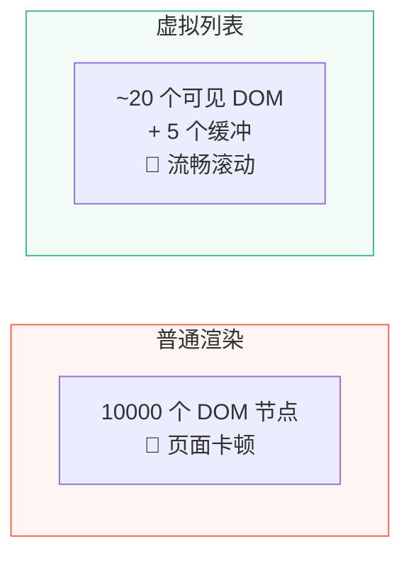
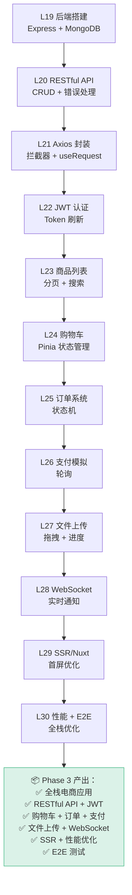

# L30 · 性能优化 + E2E 测试 + Phase 3 总结

```
🎯 本节目标：前后端性能优化 + Playwright E2E 测试 + Phase 3 完整回顾
📦 本节产出：性能优化清单 + E2E 测试套件 + Phase 3 总结
🔗 前置钩子：L29 的 SSR/Nuxt（SSR 本身就是最大性能优化）
🔗 后续钩子：Phase 4 将深入 Vue 3 内部原理
```

---

## 1. 前端性能优化

### 1.1 路由级代码拆分

```typescript
// ✅ 每个路由生成独立 chunk，首屏只加载当前页面
const routes = [
  {
    path: '/',
    component: () => import('@/views/HomeView.vue'),
    // Vite 会生成 HomeView-[hash].js
  },
  {
    path: '/products',
    component: () => import('@/views/ProductListView.vue'),
    // 只在用户访问 /products 时才加载
  },
]
```

### 1.2 组件懒加载

```typescript
import { defineAsyncComponent } from 'vue'

// 重型组件（图表、编辑器）懒加载
const ChartPanel = defineAsyncComponent(() =>
  import('@/components/ChartPanel.vue')
)

// 带骨架屏的懒加载
const ProductReviews = defineAsyncComponent({
  loader: () => import('@/components/ProductReviews.vue'),
  loadingComponent: SkeletonCard,
  delay: 200,
})
```

### 1.3 虚拟列表

当列表超过几百条时，只渲染可见区域的 DOM：

```bash
npm install @tanstack/vue-virtual
```

```vue
<script setup lang="ts">
import { useVirtualizer } from '@tanstack/vue-virtual'
import { ref, computed } from 'vue'

const parentRef = ref<HTMLDivElement>()
const items = ref(Array.from({ length: 10000 }, (_, i) => ({ id: i, name: `商品 ${i}` })))

const virtualizer = useVirtualizer({
  count: items.value.length,
  getScrollElement: () => parentRef.value!,
  estimateSize: () => 60,  // 每项预估高度
  overscan: 5,             // 额外渲染 5 项缓冲
})
</script>

<template>
  <div ref="parentRef" class="virtual-list" style="height: 500px; overflow: auto;">
    <div :style="{ height: `${virtualizer.getTotalSize()}px`, position: 'relative' }">
      <div
        v-for="item in virtualizer.getVirtualItems()"
        :key="item.key"
        :style="{
          position: 'absolute',
          top: 0,
          left: 0,
          width: '100%',
          height: `${item.size}px`,
          transform: `translateY(${item.start}px)`,
        }"
      >
        {{ items[item.index].name }}
      </div>
    </div>
  </div>
</template>
```



### 1.4 图片优化

```vue
<!-- 懒加载图片 -->


<!-- 响应式图片 -->
<picture>
  <source srcset="/images/hero.webp" type="image/webp" />
  <source srcset="/images/hero.jpg" type="image/jpeg" />
  
</picture>
```

### 1.5 性能检查清单

| 优化项 | 方法 | 效果 |
|--------|------|------|
| 代码拆分 | 路由懒加载 | 首屏 JS 减少 60%+ |
| Tree Shaking | ES Module + 按需导入 | 去掉未使用代码 |
| 虚拟列表 | @tanstack/vue-virtual | 万条数据流畅滚动 |
| 图片懒加载 | `loading="lazy"` | 首屏请求减少 |
| WebP 格式 | `<picture>` 标签 | 图片体积减少 30% |
| 缓存策略 | 文件名 hash + Cache-Control | 重复访问秒开 |
| gzip | Nginx `gzip on` | 传输体积减少 70% |

---

## 2. 后端性能优化

### 2.1 数据库索引

```typescript
// server/src/models/Product.ts
const productSchema = new Schema({
  name: { type: String, required: true, index: true },
  price: { type: Number, required: true },
  category: { type: String, index: true },
  isActive: { type: Boolean, default: true },
  createdAt: { type: Date, default: Date.now },
})

// 复合索引（常用的查询组合）
productSchema.index({ isActive: 1, category: 1, price: 1 })
productSchema.index({ name: 'text', description: 'text' })  // 全文搜索
```

### 2.2 查询优化

```typescript
// ✅ 只查需要的字段
const products = await Product.find(query)
  .select('name price images rating')  // 列表不需要 description
  .lean()                               // 返回普通对象（跳过 Mongoose 包装）

// ✅ 并行查询
const [products, total] = await Promise.all([
  Product.find(query).skip(skip).limit(limit).lean(),
  Product.countDocuments(query),
])

// ❌ 串行查询（慢一倍）
const products = await Product.find(query).skip(skip).limit(limit)
const total = await Product.countDocuments(query)
```

### 2.3 接口缓存

```typescript
// server/src/middlewares/cache.ts
const cache = new Map<string, { data: any; expires: number }>()

export function cacheMiddleware(ttl: number = 60) {
  return (req: Request, res: Response, next: NextFunction) => {
    if (req.method !== 'GET') return next()

    const key = req.originalUrl
    const cached = cache.get(key)

    if (cached && cached.expires > Date.now()) {
      return res.json(cached.data)
    }

    // 劫持 res.json
    const originalJson = res.json.bind(res)
    res.json = (data: any) => {
      cache.set(key, { data, expires: Date.now() + ttl * 1000 })
      return originalJson(data)
    }

    next()
  }
}

// 使用：商品列表缓存 30 秒
router.get('/', cacheMiddleware(30), getProducts)
```

---

## 3. E2E 测试（Playwright）

### 3.1 安装

```bash
npm install -D @playwright/test
npx playwright install
```

### 3.2 核心测试用例

```typescript
// e2e/product-flow.spec.ts
import { test, expect } from '@playwright/test'

test.describe('商品浏览流程', () => {
  test('应该能搜索商品', async ({ page }) => {
    await page.goto('/products')

    // 搜索
    await page.fill('[data-testid="search-input"]', '手机')
    // 等待防抖 + 请求完成
    await page.waitForResponse(resp =>
      resp.url().includes('/api/products') && resp.status() === 200
    )

    // 验证结果
    const cards = page.locator('.product-card')
    await expect(cards.first()).toBeVisible()
  })

  test('应该能翻页', async ({ page }) => {
    await page.goto('/products')
    await page.waitForSelector('.product-card')

    // 点击第 2 页
    await page.click('.page-num:has-text("2")')

    // URL 应该更新
    await expect(page).toHaveURL(/page=2/)

    // 商品列表应该更新
    await page.waitForSelector('.product-card')
  })
})

test.describe('购物车流程', () => {
  test('应该能添加商品到购物车并结算', async ({ page }) => {
    // 1. 打开商品详情
    await page.goto('/products')
    await page.click('.product-card:first-child')

    // 2. 添加到购物车
    await page.click('[data-testid="add-to-cart-btn"]')

    // 3. 进入购物车
    await page.click('[data-testid="cart-icon"]')

    // 4. 验证商品在购物车中
    const cartItem = page.locator('.cart-item')
    await expect(cartItem).toHaveCount(1)

    // 5. 验证价格
    const total = page.locator('.total-price')
    await expect(total).toBeVisible()
  })
})

test.describe('认证流程', () => {
  test('未登录访问订单页应该跳转登录', async ({ page }) => {
    await page.goto('/orders')
    await expect(page).toHaveURL(/\/login/)
  })

  test('登录后应该能访问订单页', async ({ page }) => {
    // 登录
    await page.goto('/login')
    await page.fill('[data-testid="email-input"]', 'test@example.com')
    await page.fill('[data-testid="password-input"]', 'password123')
    await page.click('[data-testid="login-btn"]')

    // 等待跳转
    await page.waitForURL('/')

    // 访问订单
    await page.goto('/orders')
    await expect(page).toHaveURL(/\/orders/)
  })
})
```

### 3.3 运行 E2E 测试

```bash
# 先启动开发服务器
npm run dev &

# 运行 E2E 测试
npx playwright test

# 生成报告
npx playwright test --reporter=html
npx playwright show-report
```

---

## 4. Phase 3 总结



| 技能 | 掌握标志 |
|------|---------|
| Express + MongoDB | 能独立搭建后端 |
| RESTful API | 能设计规范的 CRUD 接口 |
| Axios 封装 | 能实现拦截器 + 模块化 API |
| JWT 认证 | 能实现完整认证流程 + Token 刷新 |
| 分页搜索 | 能实现 URL 同步 + 防抖 |
| 购物车 | 能用 Pinia 管理复杂状态 |
| 订单系统 | 能设计状态机驱动的业务流程 |
| 支付 | 能实现轮询 + 超时处理 |
| 文件上传 | 能实现拖拽上传 + 进度条 |
| WebSocket | 能用 Socket.IO 推送实时通知 |
| SSR/Nuxt | 能配置 SSR + SEO 优化 |
| E2E 测试 | 能用 Playwright 测试完整流程 |

### Git 提交

```bash
git add .
git commit -m "L30: 性能优化 + E2E 测试 [Phase 3 完成]"
git tag phase-3-complete
```

---

## 🔗 → Phase 4：Vue 3 内部原理

Phase 4 将深入 Vue 3 的核心实现—— Proxy 响应式、虚拟 DOM、编译器优化、调度器原理，直到最新的 Vapor Mode。

**Phase 3 的全栈电商应用已经完整，Phase 4 是进阶的理论深度，帮你理解 Vue 3 "为什么这么设计"。**
