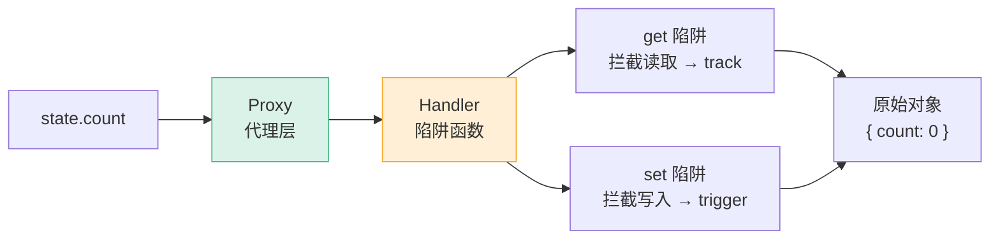
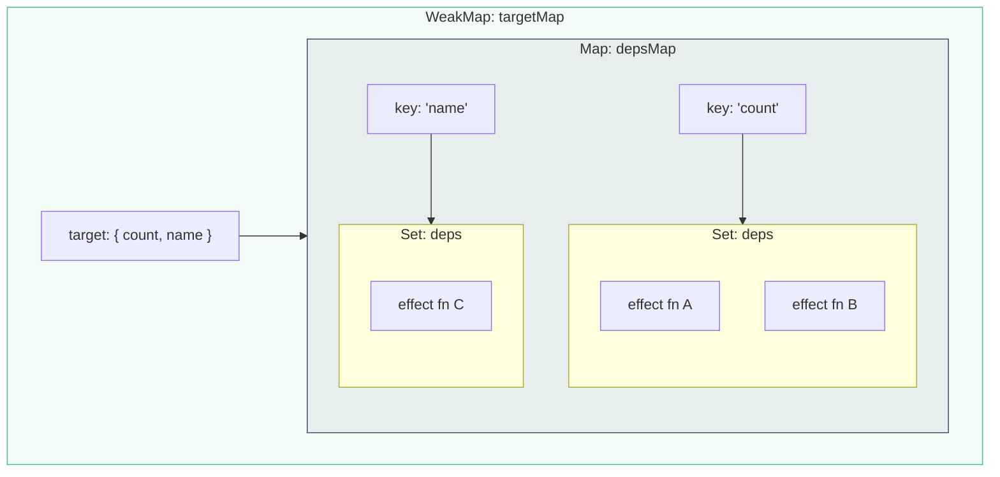
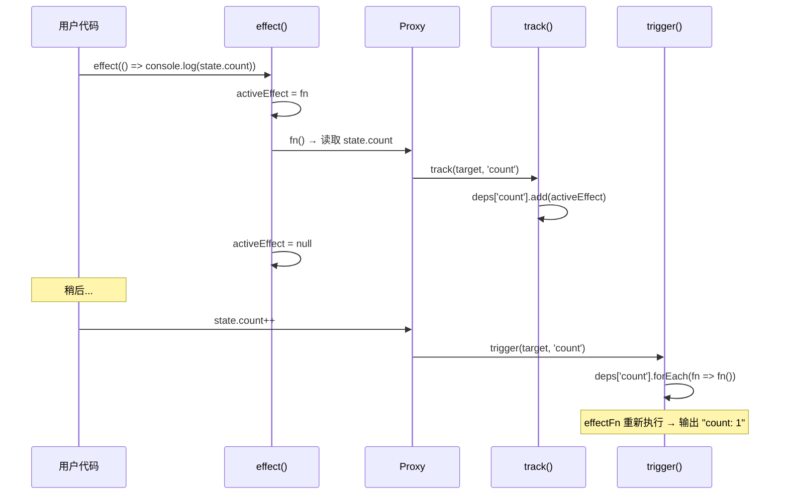
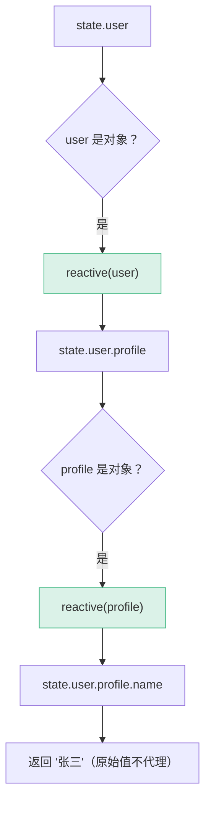

---
prev:
  text: '⬅️ Phase 3 · L30 · 性能优化'
  link: '/lessons/phase-3/L30-performance-e2e'
next:
  text: 'L32 · 依赖追踪'
  link: '/lessons/phase-4/L32-dependency-tracking'
---

# L31 · 响应式原理：Proxy 实现

```
🎯 本节目标：从零手写一个 mini 响应式系统，理解 Proxy 拦截机制
📦 本节产出：可运行的 mini-reactivity 库 + 对 Vue 3 响应式的深层理解
🔗 前置钩子：L03 的 ref/reactive 使用经验
🔗 后续钩子：L32 将在此基础上实现 cleanup、嵌套 effect、computed
```

---

## 1. 从最简单的案例出发

```javascript
// 我们想实现：数据变了，副作用函数自动重新执行
const state = reactive({ count: 0 })

effect(() => {
  console.log('count is:', state.count)  // 自动在 state.count 变化时重新执行
})

state.count++  // 控制台输出：count is: 1
state.count++  // 控制台输出：count is: 2
```

问题拆解：
1. **如何知道副作用函数读取了哪些数据？** → 拦截 getter
2. **如何在数据变化时通知那些函数重新执行？** → 拦截 setter
3. **如何建立"数据-副作用"的对应关系？** → 依赖收集的数据结构

---

## 2. Proxy 基础

### 2.1 Proxy 是什么

```javascript
const obj = { name: 'Vue', version: 3 }

const proxy = new Proxy(obj, {
  get(target, key, receiver) {
    console.log(`读取了 ${String(key)}`)
    return Reflect.get(target, key, receiver)
  },
  set(target, key, value, receiver) {
    console.log(`设置了 ${String(key)} = ${value}`)
    const result = Reflect.set(target, key, value, receiver)
    return result
  },
})

proxy.name        // 控制台：读取了 name
proxy.version = 4 // 控制台：设置了 version = 4
```



### 2.2 为什么用 Reflect

```javascript
// ❌ 直接操作 target 会丢失 receiver（this 指向问题）
get(target, key) {
  return target[key]  // 当 key 是 getter 时，this 指向 target 而不是 proxy
}

// ✅ Reflect 正确传递 receiver
get(target, key, receiver) {
  return Reflect.get(target, key, receiver)  // 确保 getter 中的 this 指向 proxy
}
```

**完整案例：**

```javascript
const obj = {
  firstName: '张',
  lastName: '三',
  get fullName() {
    return this.firstName + this.lastName  // this 应该是 proxy，才能触发 firstName 和 lastName 的 track
  }
}

const proxy = reactive(obj)
// 读取 proxy.fullName 时：
// 1. 触发 fullName 的 get trap → track('fullName')
// 2. fullName getter 中 this.firstName → 如果 this 是 proxy → 触发 firstName 的 get trap → track('firstName')
// 3. 同理 this.lastName → track('lastName')
// 如果不用 Reflect，this 指向原始 obj，firstName/lastName 的读取不会被拦截
```

### 2.3 Proxy 能拦截的所有操作

| 操作 | 陷阱 | 示例 |
|------|------|------|
| 读取属性 | `get` | `obj.key` |
| 设置属性 | `set` | `obj.key = value` |
| 删除属性 | `deleteProperty` | `delete obj.key` |
| `in` 操作符 | `has` | `'key' in obj` |
| `for...in` | `ownKeys` | 枚举属性 |
| 函数调用 | `apply` | `fn()` |
| `new` | `construct` | `new Fn()` |

Vue 3 使用了 `get`、`set`、`deleteProperty`、`has`、`ownKeys` 五种陷阱。

---

## 3. 依赖收集数据结构



```
targetMap (WeakMap) — 为什么用 WeakMap？对象被 GC 时自动清理
  └─ target → depsMap (Map)
       ├─ 'count' → Set { effectA, effectB }
       └─ 'name'  → Set { effectC }
```

**三层结构的设计很精妙：**
1. **`WeakMap<target, Map>`** — 每个代理对象一个 map，GC 友好
2. **`Map<key, Set>`** — 每个属性一个 set
3. **`Set<effect>`** — 每个属性的所有订阅者，自动去重

---

## 4. 手写 mini reactive

```typescript
// mini-reactivity.ts

// ─── 存储结构 ───
const targetMap = new WeakMap<object, Map<string | symbol, Set<Function>>>()

// ─── 当前正在执行的副作用函数 ───
let activeEffect: Function | null = null

// ─── track：在 getter 中收集依赖 ───
function track(target: object, key: string | symbol) {
  if (!activeEffect) return  // 没有正在执行的 effect → 不需要收集

  let depsMap = targetMap.get(target)
  if (!depsMap) {
    depsMap = new Map()
    targetMap.set(target, depsMap)
  }

  let deps = depsMap.get(key)
  if (!deps) {
    deps = new Set()
    depsMap.set(key, deps)
  }

  deps.add(activeEffect)  // 把当前 effect 加入订阅
}

// ─── trigger：在 setter 中触发更新 ───
function trigger(target: object, key: string | symbol) {
  const depsMap = targetMap.get(target)
  if (!depsMap) return

  const deps = depsMap.get(key)
  if (!deps) return

  deps.forEach(fn => fn())  // 执行所有订阅了这个 key 的 effect
}

// ─── reactive：创建响应式代理 ───
function reactive<T extends object>(target: T): T {
  return new Proxy(target, {
    get(target, key, receiver) {
      track(target, key)  // 👈 读取时收集依赖
      const result = Reflect.get(target, key, receiver)
      // 如果值是对象，递归代理（惰性代理）
      if (typeof result === 'object' && result !== null) {
        return reactive(result)
      }
      return result
    },
    set(target, key, value, receiver) {
      const oldValue = Reflect.get(target, key, receiver)
      const result = Reflect.set(target, key, value, receiver)
      if (oldValue !== value) {
        trigger(target, key)  // 👈 值变化时触发更新
      }
      return result
    },
    deleteProperty(target, key) {
      const hadKey = key in target
      const result = Reflect.deleteProperty(target, key)
      if (hadKey && result) {
        trigger(target, key)
      }
      return result
    },
  })
}

// ─── effect：注册副作用函数 ───
function effect(fn: Function) {
  activeEffect = fn
  fn()  // 首次执行，触发 getter → track 收集依赖
  activeEffect = null
}
```

---

## 5. 运行验证

```typescript
// 测试: 基础响应式
const state = reactive({ count: 0, name: 'Vue' })

effect(() => {
  console.log('count:', state.count)
})

effect(() => {
  console.log('name:', state.name)
})

state.count++        // 输出：count: 1（只有 countEffect 重新执行）
state.name = 'Vite'  // 输出：name: Vite（只有 nameEffect 重新执行）
state.count = 5      // 输出：count: 5
```



---

## 6. 嵌套对象的惰性代理

```typescript
const state = reactive({
  user: {
    profile: {
      name: '张三',
      age: 25,
    }
  }
})

// Vue 3 采用惰性代理（lazy proxy）：
// 访问 state.user 时才给 user 创建 Proxy
// 访问 state.user.profile 时才给 profile 创建 Proxy
// 好处：如果某个嵌套属性从未被访问，就永远不会创建 Proxy → 节省内存
```



**对比 Vue 2**：Vue 2 用 `Object.defineProperty`，初始化时就递归遍历所有嵌套属性。Vue 3 只在访问时才代理，对深层嵌套对象性能提升明显。

---

## 7. 数组的响应式

```typescript
const arr = reactive([1, 2, 3])

effect(() => {
  console.log('arr:', arr.join(', '))
})

// 这些操作都能触发更新：
arr.push(4)          // set: '3' = 4, set: 'length' = 4
arr[0] = 10          // set: '0' = 10
arr.splice(1, 1)     // deleteProperty: '2', set: 'length' = 2
arr.length = 1       // set: 'length' = 1（Proxy 能拦截 length！）
```

**Vue 2 不能通过索引或 length 修改触发更新，Vue 3 用 Proxy 完美解决。**

| 操作 | Vue 2 (defineProperty) | Vue 3 (Proxy) |
|------|----------------------|---------------|
| `arr[0] = 1` | ❌ 不触发 | ✅ 触发 |
| `arr.length = 0` | ❌ 不触发 | ✅ 触发 |
| `arr.push(1)` | ✅ 通过重写方法 | ✅ 原生支持 |
| `delete arr[0]` | ❌ 不触发 | ✅ 触发 |
| 新增属性 | ❌ 需要 `Vue.set` | ✅ 触发 |

---

## 8. 避免重复代理

```typescript
// 问题：reactive(reactive(obj)) 不应该双层代理
const reactiveMap = new WeakMap<object, object>()

function reactive<T extends object>(target: T): T {
  // 如果 target 已经被代理过，返回已有代理
  if (reactiveMap.has(target)) {
    return reactiveMap.get(target) as T
  }

  const proxy = new Proxy(target, {
    // ... handlers
  })

  reactiveMap.set(target, proxy)  // 缓存
  return proxy as T
}
```

---

## 9. Vue 3 实际实现与我们的差异

| 我们的 mini 版 | Vue 3 真实实现 |
|---------------|---------------|
| 简单 Set 存 fn | `ReactiveEffect` 类，支持 stop/scheduler |
| 无嵌套 effect | `effectStack` 处理嵌套 |
| 无条件分支清理 | `cleanup` 机制（L32 讲） |
| 无 ref | `RefImpl` 类，用 getter/setter |
| 同步触发 | `queueJob` 异步批量更新 |
| 无 readonly | `readonly()` 用同样的 Proxy 但 set 时 warn |
| 无 shallowReactive | `shallowReactive` 只代理第一层 |

---

## 10. 本节总结

### 检查清单

- [ ] 能解释 Proxy 的 get/set/deleteProperty 拦截器
- [ ] 理解为什么用 `Reflect`（正确处理 receiver/this）
- [ ] 理解 `targetMap → depsMap → deps` 三层数据结构
- [ ] 能手写 mini `reactive()` + `effect()` + `track()` + `trigger()`
- [ ] 知道为什么用 WeakMap（GC 友好）
- [ ] 理解惰性代理的优势（对比 Vue 2 递归遍历）
- [ ] 理解数组操作在 Proxy 中的表现
- [ ] 知道 reactiveMap 防止重复代理

### Git 提交

```bash
git add .
git commit -m "L31: 手写 mini 响应式系统 - Proxy + track + trigger"
```


### 🔬 深度专题

> 📖 [D03 · Proxy vs Object.defineProperty](/lessons/deep-dives/D03-proxy-vs-defineproperty) — Vue 3 为什么必须放弃 IE11？

### 🔗 → 下一节

L32 将在此基础上升级——`ReactiveEffect` 类、`cleanup` 清理条件分支依赖、嵌套 effect 的栈处理、`computed` 和 `ref` 的底层实现。
