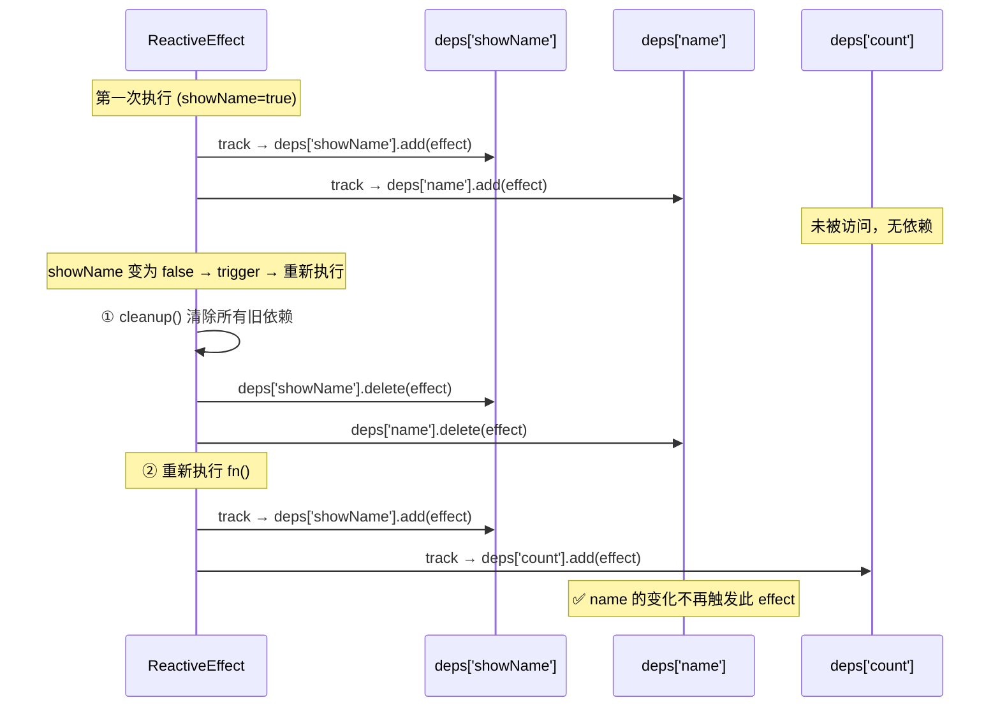
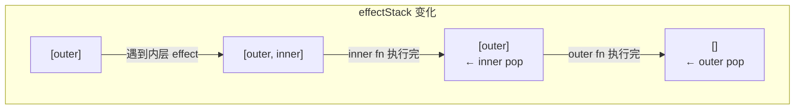
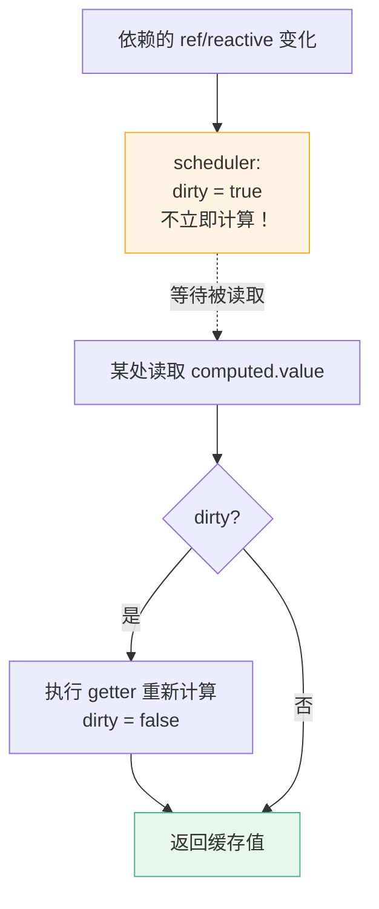
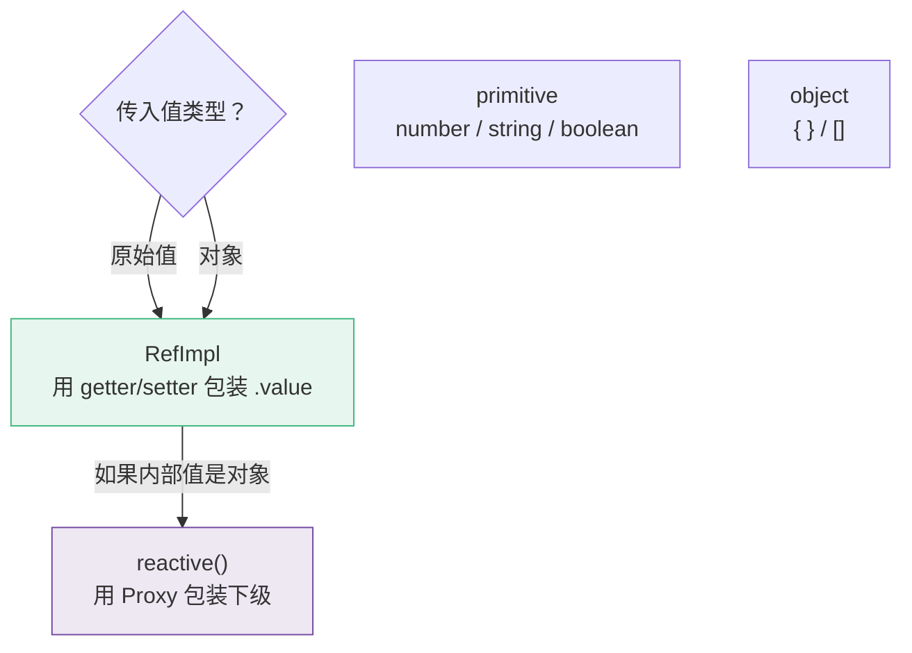

# L32 · 依赖追踪：effect / track / trigger

```
🎯 本节目标：深入 ReactiveEffect 类，理解 cleanup、嵌套 effect、调度器
📦 本节产出：升级版响应式系统 + 理解 Vue 3 真实依赖追踪 + computed/ref 原理
🔗 前置钩子：L31 的 mini reactive + effect
🔗 后续钩子：L33 将用响应式系统驱动 Virtual DOM 更新
```

---

## 1. L31 遗留问题：条件分支

```javascript
const state = reactive({ showName: true, name: 'Vue', count: 0 })

effect(() => {
  if (state.showName) {
    console.log('name:', state.name)
  } else {
    console.log('count:', state.count)
  }
})
```

第一次执行时 `showName = true`，收集了 `showName` 和 `name` 的依赖。

当 `state.showName = false` 后，`name` 的变化不应该再触发重新执行——但 L31 的 mini 版做不到，因为**旧依赖没有被清理**。

---

## 2. ReactiveEffect 类

```typescript
// 用于存储所有活跃 effect 的栈（处理嵌套）
const effectStack: ReactiveEffect[] = []
let activeEffect: ReactiveEffect | null = null

class ReactiveEffect {
  private fn: Function
  deps: Set<ReactiveEffect>[] = []  // 双向引用：存储所有使用了此 effect 的 deps 集合
  active = true

  constructor(fn: Function, public scheduler?: (effect: ReactiveEffect) => void) {
    this.fn = fn
  }

  run() {
    if (!this.active) return this.fn()

    // ① 清除旧依赖（核心！）
    this.cleanup()

    // ② 设置当前 effect 并压栈
    activeEffect = this
    effectStack.push(this)

    // ③ 执行副作用函数 → 触发 getter → 重新收集依赖
    const result = this.fn()

    // ④ 出栈，恢复上层 effect
    effectStack.pop()
    activeEffect = effectStack[effectStack.length - 1] || null

    return result
  }

  cleanup() {
    // 从所有 deps 集合中移除自己
    for (const dep of this.deps) {
      dep.delete(this)
    }
    this.deps.length = 0  // 等价于 this.deps = []，但复用同一个数组对象，避免重新分配内存
  }

  stop() {
    if (this.active) {
      this.cleanup()
      this.active = false
    }
  }
}

// 升级 track：建立双向引用
function track(target: object, key: string | symbol) {
  if (!activeEffect) return

  let depsMap = targetMap.get(target)
  if (!depsMap) {
    depsMap = new Map()
    targetMap.set(target, depsMap)
  }

  let deps = depsMap.get(key)
  if (!deps) {
    deps = new Set()
    depsMap.set(key, deps)
  }

  deps.add(activeEffect)
  activeEffect.deps.push(deps)  // 👈 双向引用：effect 也记录自己被哪些 deps 收集了
}
```

### cleanup 流程图



---

## 3. 嵌套 effect

组件嵌套时，外层组件的渲染 effect 中会创建内层组件的渲染 effect：

```javascript
const state = reactive({ a: 1, b: 2 })

effect(() => {      // outer effect
  console.log('outer:', state.a)

  effect(() => {    // inner effect
    console.log('inner:', state.b)
  })
  // inner 执行完后，activeEffect 应该恢复为 outer
  // 否则后续的 state.a 读取就无法被 outer 收集
})
```

**没有 effectStack 时的问题：**

```
activeEffect = outer
  执行 fn → 读取 state.a → track(target, 'a') → 加入 outer ✅
  activeEffect = inner
    执行 fn → 读取 state.b → track(target, 'b') → 加入 inner ✅
  activeEffect = null  ← 💀 outer 后续的 getter 无法收集！
```

**有 effectStack 后：**



---

## 4. 调度器（Scheduler）

Effect 被触发时，可以选择**不立即执行**，而是交给调度器决定何时执行：

```typescript
// 没有调度器：数据变 → 立即执行
trigger → deps.forEach(effect => effect.run())

// 有调度器：数据变 → 调度器决定
trigger → deps.forEach(effect => {
  if (effect.scheduler) {
    effect.scheduler(effect)  // 交给调度器
  } else {
    effect.run()              // 直接执行
  }
})
```

**实际用途：**

```typescript
// 1. Vue 组件渲染用调度器 → 批量异步更新（L35 详讲）
const componentEffect = new ReactiveEffect(renderFn, (effect) => {
  queueJob(effect)  // 不立即渲染，放入更新队列
})

// 2. computed 用调度器 → 标记 dirty 而不是立即计算
const computedEffect = new ReactiveEffect(getter, () => {
  dirty = true       // 依赖变化时只标记 dirty
  trigger(obj, 'value')  // 通知使用了此 computed 的 effect
})

// 3. watch 用调度器 → 异步执行回调
const watchEffect = new ReactiveEffect(source, () => {
  queuePostFlushJob(callback)  // 在 DOM 更新后执行
})
```

---

## 5. computed 的实现原理

`computed` 本质是一个**带 scheduler 的 lazy effect**：

```typescript
function computed<T>(getter: () => T) {
  let value: T
  let dirty = true  // 是否需要重新计算

  const effect = new ReactiveEffect(getter, () => {
    // scheduler：依赖变化时不立即执行 getter
    // 而是标记为 dirty，等到下次读取时才重新计算
    if (!dirty) {
      dirty = true
      trigger(obj, 'value')  // 通知依赖了此 computed 的 effect
    }
  })

  const obj = {
    get value() {
      if (dirty) {
        value = effect.run()  // 重新计算
        dirty = false
      }
      track(obj, 'value')    // 自身也被收集
      return value
    }
  }

  return obj
}
```



**computed 的两个关键特性：**
1. **惰性（lazy）**：依赖变化只标记 dirty，不立即重算。只有被读取时才计算。
2. **缓存（cached）**：结果不变时，多次读取只计算一次。

```typescript
// 验证缓存
const count = ref(1)
const double = computed(() => {
  console.log('computed 执行了！')  // 只在 count 变化且被读取时输出
  return count.value * 2
})

double.value  // 输出 "computed 执行了！" → 2
double.value  // 不输出（缓存命中）→ 2
count.value = 2
// 此时 computed 没有立即执行（只标记了 dirty）
double.value  // 输出 "computed 执行了！" → 4
```

---

## 6. ref 的实现原理

```typescript
class RefImpl<T> {
  private _value: T
  private _rawValue: T
  dep = new Set<ReactiveEffect>()

  constructor(value: T) {
    this._rawValue = value
    this._value = isObject(value) ? reactive(value) : value
  }

  get value() {
    trackRefValue(this)  // 收集依赖
    return this._value
  }

  set value(newValue: T) {
    if (hasChanged(newValue, this._rawValue)) {
      this._rawValue = newValue
      this._value = isObject(newValue) ? reactive(newValue) : newValue
      triggerRefValue(this)  // 触发更新
    }
  }
}
```

**ref 和 reactive 的关系：**



- `ref(42)` → RefImpl，`.value` 直接返回 42
- `ref({ name: 'Vue' })` → RefImpl，`.value` 返回 `reactive({ name: 'Vue' })`
- `reactive({ name: 'Vue' })` → Proxy

---

## 7. effect 的 stop 和 scope

```typescript
// stop：手动停止 effect
const runner = effect(() => {
  console.log(state.count)
})

runner.effect.stop()  // 停止追踪，后续 count 变化不再触发

// effectScope：批量管理 effect 生命周期
const scope = effectScope()

scope.run(() => {
  const count = ref(0)
  watch(count, () => { /* ... */ })
  watchEffect(() => { /* ... */ })
})

scope.stop()  // 一次性停止所有 scope 内的 effect
```

**Vue 组件卸载时，会自动 stop 组件 scope 内的所有 effect。**

---

## 8. 本节总结

### 检查清单

- [ ] 理解 cleanup 机制解决条件分支依赖清理
- [ ] 理解双向引用（effect.deps 和 dep Set 互相引用）
- [ ] 理解 effectStack 处理嵌套 effect
- [ ] 理解 scheduler 的三种用途（组件渲染/computed/watch）
- [ ] 能解释 computed 为什么是"惰性"且"缓存"的
- [ ] 能解释 ref 内部如何利用 getter/setter + reactive
- [ ] 理解 effectScope 和自动清理

### Git 提交

```bash
git add .
git commit -m "L32: 依赖追踪深入 - cleanup/嵌套/scheduler/computed/ref 原理"
```


### 🔬 深度专题

> 📖 [D06 · 依赖追踪：effect / track / trigger](/lessons/deep-dives/D06-effect-track-trigger) — computed 的缓存到底怎么实现的？

### 🔗 → 下一节

L33 将回答：数据变化后 effect 触发了，那谁来更新 DOM？答案是 Virtual DOM。
