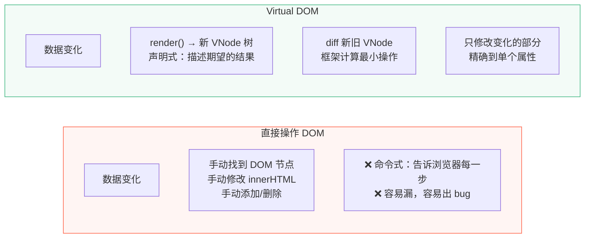
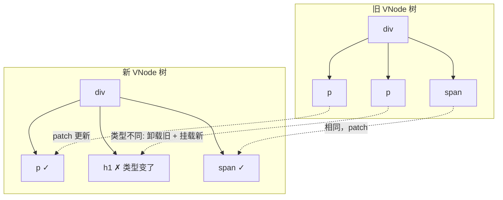
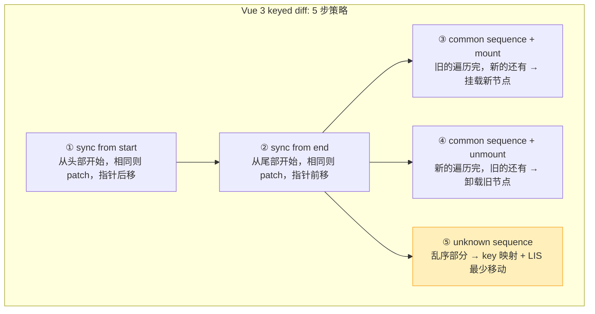
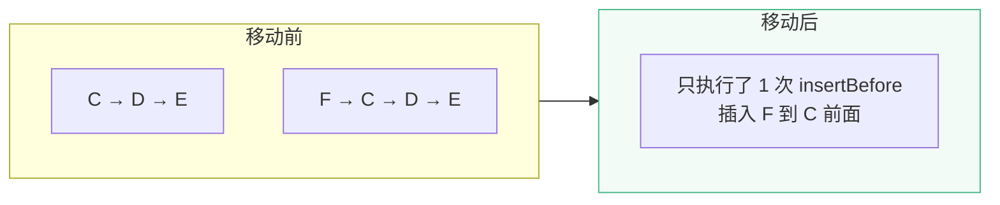

# L33 · Virtual DOM：O(n) Diff 算法

```
🎯 本节目标：理解 Virtual DOM 的工作原理和 Vue 3 的 diff 策略
📦 本节产出：手写 mini vdom (mount + patch) + 理解双端+LIS diff
🔗 前置钩子：L32 的响应式系统（触发更新后谁来更新 DOM？→ VDOM）
🔗 后续钩子：L34 将讲编译时如何标记静态节点减少 diff 范围
```

---

## 1. 为什么需要 Virtual DOM



**Virtual DOM 不是为了"更快"，而是为了"声明式 + 足够快"。** 直接操作一个 DOM 节点当然比通过 VDOM 快，但当 UI 复杂到有几百个节点时，手动管理 DOM 的开发成本和出错概率远超性能收益。

---

## 2. VNode 数据结构

```typescript
interface VNode {
  type: string | Component     // 'div' / 'span' / ComponentInstance
  props: Record<string, any> | null
  children: string | VNode[] | null
  key: string | number | null  // diff 用的唯一标识
  el: HTMLElement | null        // 对应的真实 DOM 节点

  // Vue 3 特有：编译时优化标记
  patchFlag: number             // 标记哪些部分是动态的
  dynamicChildren: VNode[] | null  // 只收集动态子节点
}
```

```javascript
// 模板 <div class="box"><p>{{ msg }}</p><span>static</span></div>
// 生成的 VNode：
{
  type: 'div',
  props: { class: 'box' },
  children: [
    { type: 'p',    props: null, children: msg,      patchFlag: 1 /* TEXT */ },
    { type: 'span', props: null, children: 'static', patchFlag: 0 },
  ],
  key: null,
  el: null
}
```

---

## 3. 手写 mini VDOM

### 3.1 创建 VNode

```typescript
function h(
  type: string,
  props: Record<string, any> | null,
  children: string | VNode[] | null
): VNode {
  return { type, props, children, key: props?.key ?? null, el: null, patchFlag: 0, dynamicChildren: null }
}
```

### 3.2 mount：首次挂载

```typescript
function mount(vnode: VNode, container: HTMLElement) {
  // 1. 创建 DOM 元素
  const el = (vnode.el = document.createElement(vnode.type as string))

  // 2. 设置属性
  if (vnode.props) {
    for (const [key, value] of Object.entries(vnode.props)) {
      if (key === 'key') continue

      if (key.startsWith('on')) {
        // 事件：onClick → click
        el.addEventListener(key.slice(2).toLowerCase(), value)
      } else if (key === 'class') {
        el.className = value
      } else if (key === 'style' && typeof value === 'object') {
        Object.assign(el.style, value)
      } else {
        el.setAttribute(key, value)
      }
    }
  }

  // 3. 挂载子节点
  if (typeof vnode.children === 'string') {
    el.textContent = vnode.children
  } else if (Array.isArray(vnode.children)) {
    vnode.children.forEach(child => mount(child, el))
  }

  // 4. 插入容器
  container.appendChild(el)
}
```

### 3.3 patch：更新已有节点

```typescript
function patch(oldVNode: VNode, newVNode: VNode) {
  // 1. 类型不同 → 整个替换
  if (oldVNode.type !== newVNode.type) {
    const parent = oldVNode.el!.parentNode!
    parent.removeChild(oldVNode.el!)
    mount(newVNode, parent as HTMLElement)
    return
  }

  // 2. 类型相同 → 复用 DOM 元素
  const el = (newVNode.el = oldVNode.el!)

  // 3. 更新 Props
  patchProps(el, oldVNode.props, newVNode.props)

  // 4. 更新 Children
  patchChildren(oldVNode, newVNode, el)
}
```

### 3.4 patchProps

```typescript
function patchProps(
  el: HTMLElement,
  oldProps: Record<string, any> | null,
  newProps: Record<string, any> | null
) {
  oldProps = oldProps || {}
  newProps = newProps || {}

  // 添加/更新新属性
  for (const key in newProps) {
    if (key === 'key') continue
    if (newProps[key] !== oldProps[key]) {
      if (key.startsWith('on')) {
        // 事件：先移除旧监听器，再添加新的
        const event = key.slice(2).toLowerCase()
        if (oldProps[key]) el.removeEventListener(event, oldProps[key])
        el.addEventListener(event, newProps[key])
      } else {
        el.setAttribute(key, newProps[key])
      }
    }
  }

  // 移除旧属性/事件
  for (const key in oldProps) {
    if (!(key in newProps)) {
      if (key.startsWith('on')) {
        el.removeEventListener(key.slice(2).toLowerCase(), oldProps[key])
      } else {
        el.removeAttribute(key)
      }
    }
  }
}
```

### 3.5 patchChildren

```typescript
function patchChildren(oldVNode: VNode, newVNode: VNode, el: HTMLElement) {
  const oldChildren = oldVNode.children
  const newChildren = newVNode.children

  // Case 1: 新 children 是文本
  if (typeof newChildren === 'string') {
    if (newChildren !== oldChildren) {
      el.textContent = newChildren
    }
    return
  }

  // Case 2: 旧 children 是文本，新是数组
  if (typeof oldChildren === 'string') {
    el.textContent = ''
    if (Array.isArray(newChildren)) {
      newChildren.forEach(child => mount(child, el))
    }
    return
  }

  // Case 3: 双方都是数组 → diff
  if (Array.isArray(oldChildren) && Array.isArray(newChildren)) {
    diffChildren(oldChildren, newChildren, el)
  }
}
```

---

## 4. Diff 算法核心

### 4.1 同级比较原则

Vue 的 diff **不跨层级比较**——只比较同一层级的节点。这把 O(n³) 降到 O(n)。



### 4.2 Vue 3 的五步 Diff



### 4.3 双端比较 + LIS 详细示例

```
旧: [A, B, C, D, E, F, G]
新: [A, B, F, C, D, E, G]

── 步骤 1: 从头比较 ──
A === A ✅ patch, i++
B === B ✅ patch, i++
F !== C → 停止

── 步骤 2: 从尾比较 ──
G === G ✅ patch, e1--, e2--
E !== E... 等等 E === E ✅ patch

── 步骤 5: 中间部分 [C, D] vs [F, C, D] ──
旧序列中间: [C, D, E]
新序列中间: [F, C, D, E]

1. 建立新序列的 key → index 映射：
   { F:2, C:3, D:4, E:5 }

2. 遍历旧序列中间部分，找到对应位置：
   C → 在新序列 index 3
   D → 在新序列 index 4
   E → 在新序列 index 5

3. 新序列位置数组: [3, 4, 5]
   最长递增子序列: [3, 4, 5] = [C, D, E]
   → C, D, E 不需要移动！

4. F 在旧序列不存在 → mount F 到正确位置
```



**LIS 的价值：找到最多「不需要移动」的节点，最小化 DOM 操作。**

---

## 5. key 的重要性

```typescript
// ❌ 没有 key：Vue 无法识别节点身份，只能按顺序 patch
// 删除第一项时，所有项都会被"更新"
<div v-for="item in list">{{ item.name }}</div>

// ✅ 有 key：Vue 用 key 映射节点身份，精确匹配
// 删除第一项时，只有该项被卸载
<div v-for="item in list" :key="item.id">{{ item.name }}</div>
```

| 无 key | 有 key |
|--------|--------|
| 按索引逐个 patch | 按 key 精确匹配 |
| 删除第 1 项 → patch 所有项 | 删除第 1 项 → unmount 1 个节点 |
| 组件状态可能错乱 | 组件实例与数据正确绑定 |

---

## 6. 本节总结

### 检查清单

- [ ] 理解 Virtual DOM 是"声明式 + 足够快"的权衡
- [ ] 能描述 VNode 数据结构
- [ ] 能手写 `h()` / `mount()` / `patch()` / `patchProps()` / `patchChildren()`
- [ ] 理解同级比较原则（O(n³) → O(n)）
- [ ] 能描述 Vue 3 的五步 diff 策略
- [ ] 理解最长递增子序列 (LIS) 如何最小化 DOM 移动
- [ ] 理解 key 在 diff 中的关键作用

### Git 提交

```bash
git add .
git commit -m "L33: Virtual DOM - mount/patch/diff + LIS 算法"
```


### 🔬 深度专题

> 📖 [D11 · Virtual DOM 的 O(n) diff](/lessons/deep-dives/D11-diff-algorithm) — 为什么 key 不能用 index？

### 🔗 → 下一节

L34 将讲编译器如何在编译时标记 PatchFlag 和 Block Tree——让 diff 从"遍历整棵树"变为"只遍历动态节点"。
