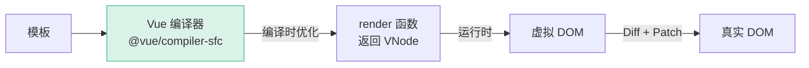
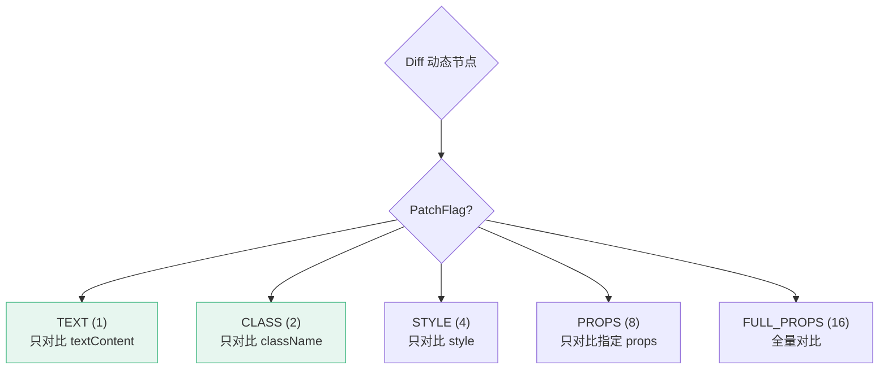
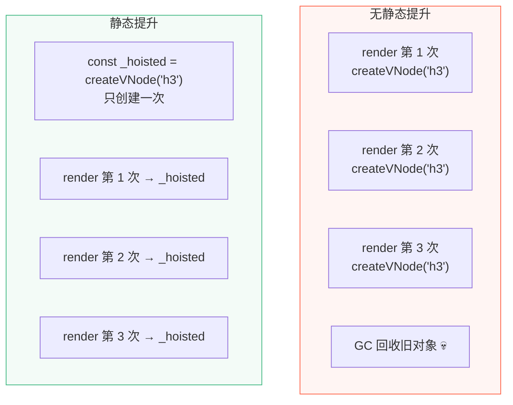
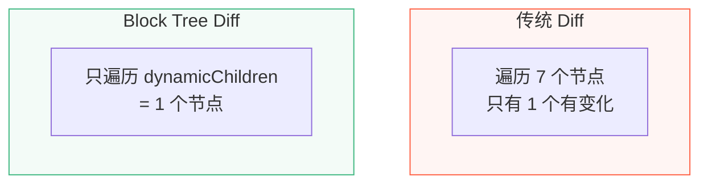

# L34 · 编译器优化：静态提升与 PatchFlag

```
🎯 本节目标：理解 Vue 3 模板编译器的优化策略——让 Diff 更快
📦 本节产出：理解 PatchFlag、静态提升、Block Tree 三大优化
🔗 前置钩子：L33 的虚拟 DOM 和 Diff 算法
🔗 后续钩子：L35 将讲调度器与批量更新
```

---

## 1. 编译 vs 运行时



Vue 3 的优势：**在编译时就知道模板结构，把运行时能省的工作提前做掉。**

React 做不到编译时优化（因为 JSX 是纯 JS，无法静态分析）。

---

## 2. PatchFlag：精准知道哪里变了

### 2.1 问题

```vue
<template>
  <div class="card">
    <h3>固定标题</h3>
    <p class="desc">这段文字永远不变</p>
    <span>{{ dynamicText }}</span>           <!-- 只有这里会变 -->
    <button :class="btnClass">确定</button>  <!-- 只有 class 会变 -->
  </div>
</template>
```

如果没有优化，Diff 算法会**遍历所有节点**，逐一对比属性。但编译器**已经知道**哪些是动态的！

### 2.2 PatchFlag 标记

编译后的 render 函数会给动态节点加上 flag：

```javascript
// 编译器输出
import { createVNode, toDisplayString, normalizeClass } from 'vue'

export function render() {
  return createVNode("div", { class: "card" }, [
    createVNode("h3", null, "固定标题"),       // 没有 flag → 静态节点，跳过
    createVNode("p", { class: "desc" }, "这段文字永远不变"),  // 静态，跳过

    createVNode("span", null,
      toDisplayString(ctx.dynamicText),
      1 /* TEXT */                              // 👈 PatchFlag = 1，只对比文本
    ),

    createVNode("button", {
      class: normalizeClass(ctx.btnClass)
    }, "确定",
      2 /* CLASS */                             // 👈 PatchFlag = 2，只对比 class
    ),
  ])
}
```

### 2.3 PatchFlag 枚举

| Flag | 值 | 含义 | Diff 范围 |
|------|----|------|----------|
| `TEXT` | 1 | 文本内容动态 | 只对比 `textContent` |
| `CLASS` | 2 | class 动态 | 只对比 `class` |
| `STYLE` | 4 | style 动态 | 只对比 `style` |
| `PROPS` | 8 | 非 class/style 的 props 动态 | 只对比指定 props |
| `FULL_PROPS` | 16 | key 可能动态变化（v-bind） | 全量对比 props |
| `NEED_HYDRATION` | 32 | SSR 注水 | 特殊处理 |
| `STABLE_FRAGMENT` | 64 | Fragment 子节点顺序稳定 | 跳过 key diff |
| `KEYED_FRAGMENT` | 128 | v-for + key | 启用完整 key diff |
| `UNKEYED_FRAGMENT` | 256 | v-for 无 key | patchUnkeyedChildren |
| `NEED_PATCH` | 512 | ref / 指令 | 需要 patch |
| `DYNAMIC_SLOTS` | 1024 | 动态插槽 | 强制更新 |
| `HOISTED` | -1 | 静态提升 | 永远跳过 |
| `BAIL` | -2 | 非模板渲染（退出优化） | 全量 diff |



---

## 3. 静态提升（Static Hoisting）

### 3.1 问题

每次渲染都重新创建静态 VNode 对象——虽然内容没变，但对象是新的，GC 压力大。

### 3.2 优化

```javascript
// ❌ 没有静态提升：每次 render 都创建
function render() {
  return createVNode("div", null, [
    createVNode("h3", null, "固定标题"),      // 每次创建新对象
    createVNode("span", null, toDisplayString(ctx.msg), 1),
  ])
}

// ✅ 静态提升：提取到 render 函数外部
const _hoisted_1 = createVNode("h3", null, "固定标题", -1 /* HOISTED */)

function render() {
  return createVNode("div", null, [
    _hoisted_1,                             // 复用同一个对象！
    createVNode("span", null, toDisplayString(ctx.msg), 1),
  ])
}
```

**效果：**
- 静态 VNode 只创建 1 次（应用初始化时）
- 后续 render 直接引用，Diff 时通过引用相等 `===` 直接跳过
- 减少 GC 压力，减少内存分配



### 3.3 静态属性提升

```javascript
// 即使整个元素不是静态的，静态 Props 也可以提升
const _hoisted_props = { class: "card-title", id: "main-title" }

function render() {
  return createVNode("h3", _hoisted_props,
    toDisplayString(ctx.title), 1 /* TEXT */
  )
}
```

---

## 4. Block Tree：跳过整棵静态子树

### 4.1 传统 Diff 的低效

```
<div>                          ← Diff ✓
  <header>                     ← Diff ✓
    <nav>                      ← Diff ✓
      <a>首页</a>              ← Diff ✓ (静态！浪费)
      <a>关于</a>              ← Diff ✓ (静态！浪费)
    </nav>
  </header>
  <main>                       ← Diff ✓
    <p>{{ message }}</p>       ← Diff ✓ (动态！需要)
  </main>
</div>
```

遍历了 7 个节点，但只有 1 个是动态的。

### 4.2 Block + dynamicChildren

编译器会把动态节点收集到 `dynamicChildren` 数组中：

```javascript
function render() {
  return openBlock(), createBlock("div", null, [
    // 静态子树 → 只在首次创建
    createVNode("header", null, [
      createVNode("nav", null, [
        _hoisted_a_home,
        _hoisted_a_about,
      ]),
    ]),

    // 动态节点
    createVNode("main", null, [
      createVNode("p", null, toDisplayString(ctx.message), 1 /* TEXT */),
    ]),
  ])
}
```

Block 的 `dynamicChildren` 只包含 `[p]`，Diff 时**只遍历动态节点**：



---

## 5. 用 Vue SFC Playground 观察编译结果

访问 [Vue SFC Playground](https://play.vuejs.org/) → 点击右上角「JS」标签，可以实时看到模板编译结果：

```vue
<template>
  <div class="wrapper">
    <h1>标题</h1>
    <p>{{ msg }}</p>
  </div>
</template>
```

编译输出中可以看到：
- `_hoisted_1` = 被静态提升的 `h1`
- `_createVNode("p", null, _toDisplayString($setup.msg), 1)` 中的 `1` = TEXT PatchFlag

---

## 6. 本节总结

### 检查清单

- [ ] 理解 PatchFlag 的作用（精确标记哪些属性是动态的）
- [ ] 能列举常见 PatchFlag（TEXT / CLASS / STYLE / PROPS）
- [ ] 理解静态提升的原理和效果（VNode 复用 + GC 压力减少）
- [ ] 理解 Block Tree 跳过整棵静态子树（只 Diff dynamicChildren）
- [ ] 知道在 Vue SFC Playground 中观察编译输出
- [ ] 理解为什么 Vue 3 的模板比 JSX 有性能优势

### Git 提交

```bash
git add .
git commit -m "L34: PatchFlag + 静态提升 + Block Tree"
```

### 🔗 → 下一节

L35 将讲解调度器原理——为什么 100 次修改只产生 1 次 DOM 更新，nextTick 到底在事件循环的哪个位置。
