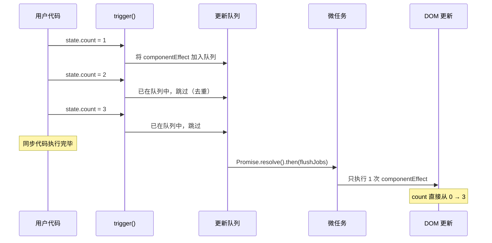
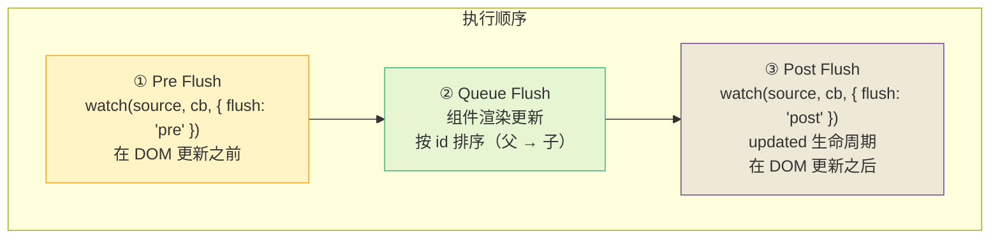
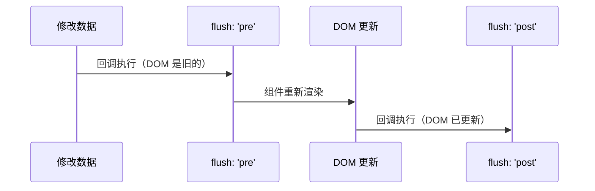
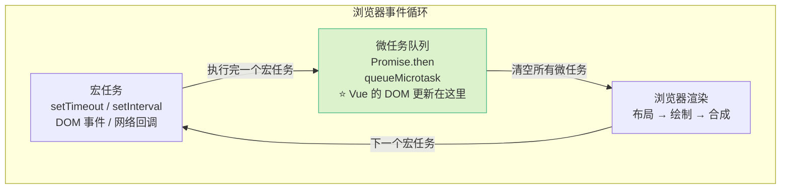

# L35 · 调度器原理：nextTick 与批量更新

```
🎯 本节目标：理解 Vue 3 的异步更新队列和 nextTick 实现
📦 本节产出：理解为什么多次修改只触发一次 DOM 更新 + 手写 mini scheduler
🔗 前置钩子：L32 的 effect scheduler + L34 编译优化
🔗 后续钩子：L36 将讲完整的组件渲染流程
```

---

## 1. 问题：同步更新太浪费

```javascript
const state = reactive({ count: 0 })

effect(() => {
  // 假设这个 effect 负责更新 DOM
  document.getElementById('counter').textContent = state.count
})

// 连续修改 100 次
for (let i = 0; i < 100; i++) {
  state.count++
}
// 如果同步触发 → effect 执行 100 次 → 更新 DOM 100 次 💀
// 实际上只需要最终值，更新 1 次就够了
```

**同步更新的代价：**

| 操作 | 同步更新 | 批量更新 |
|------|---------|---------|
| effect 执行 | 100 次 | 1 次 |
| DOM 读写 | 100 次 | 1 次 |
| 浏览器重绘 | 可能多次 | 1 次 |

---

## 2. Vue 3 的解法：异步批量更新



---

## 3. 手写 mini scheduler

```typescript
// ─── 基础版 ───
const queue: Set<Function> = new Set()  // 用 Set 自动去重
let isFlushing = false

function queueJob(job: Function) {
  queue.add(job)

  if (!isFlushing) {
    isFlushing = true
    // 在微任务中执行所有任务
    Promise.resolve().then(flushJobs)
  }
}

function flushJobs() {
  for (const job of queue) {
    job()
  }
  queue.clear()
  isFlushing = false
}
```

### 3.1 集成到响应式系统

```typescript
// effect 加上 scheduler → 延迟到微任务执行
function effect(fn: Function, options?: { scheduler?: (fn: Function) => void }) {
  const effectFn = () => {
    activeEffect = effectFn
    fn()
    activeEffect = null
  }

  effectFn.scheduler = options?.scheduler

  effectFn()  // 首次立即执行
  return effectFn
}

// trigger 时检查 scheduler
function trigger(target: object, key: string | symbol) {
  const depsMap = targetMap.get(target)
  if (!depsMap) return
  const deps = depsMap.get(key)
  if (!deps) return

  deps.forEach(effectFn => {
    if (effectFn.scheduler) {
      effectFn.scheduler(effectFn)  // 有 scheduler → 交给调度器
    } else {
      effectFn()                    // 无 scheduler → 同步执行
    }
  })
}

// 组件渲染 effect 使用调度器
const componentEffect = effect(renderFn, {
  scheduler(fn) {
    queueJob(fn)
  },
})
```

### 3.2 验证批量更新

```typescript
const state = reactive({ count: 0 })

// 使用 scheduler 的 effect
effect(() => {
  console.log('渲染:', state.count)
}, {
  scheduler(fn) { queueJob(fn) }
})

// 连续修改
state.count = 1
state.count = 2
state.count = 3
console.log('同步代码结束')

// 输出：
// 渲染: 0      ← 首次立即执行
// 同步代码结束  ← 同步代码先完成
// 渲染: 3      ← 微任务中只执行一次，拿到最终值
```

---

## 4. 完善调度器：优先级排序

Vue 3 的队列实际上有**优先级**——父组件必须在子组件之前更新：

```typescript
interface SchedulerJob extends Function {
  id?: number       // 组件 uid，用于排序
  pre?: boolean     // 是否是 pre flush job（watch 的 flush: 'pre'）
}

const queue: SchedulerJob[] = []
const pendingPreFlushJobs: SchedulerJob[] = []
const pendingPostFlushJobs: SchedulerJob[] = []

function queueJob(job: SchedulerJob) {
  // 去重检查（用 id 或引用）
  if (!queue.includes(job)) {
    queue.push(job)
    queueFlush()
  }
}

function queueFlush() {
  if (!isFlushing) {
    isFlushing = true
    Promise.resolve().then(flushJobs)
  }
}

function flushJobs() {
  // 1. 执行 pre flush jobs（如 watch flush: 'pre'）
  flushPreFlushJobs()

  // 2. 按 id 排序（确保父组件先更新）
  queue.sort((a, b) => (a.id ?? 0) - (b.id ?? 0))

  // 3. 执行队列
  for (const job of queue) {
    job()
  }
  queue.length = 0

  // 4. 执行 post flush jobs（如 watch flush: 'post'、生命周期钩子）
  flushPostFlushJobs()

  isFlushing = false
}
```



---

## 5. nextTick

```typescript
// nextTick 就是在当前更新队列清空之后执行
const resolvedPromise = Promise.resolve()

function nextTick(fn?: () => void): Promise<void> {
  return fn ? resolvedPromise.then(fn) : resolvedPromise
}
```

### 5.1 使用场景

```typescript
const count = ref(0)

count.value = 100

// ❌ 此时 DOM 还没更新
console.log(document.getElementById('counter').textContent)  // '0'

// ✅ nextTick 后 DOM 已更新
await nextTick()
console.log(document.getElementById('counter').textContent)  // '100'
```

### 5.2 在 Composition API 中

```typescript
import { ref, nextTick } from 'vue'

const listRef = ref<HTMLElement>()

async function addItem() {
  items.value.push(newItem)

  // 等待 DOM 更新后滚动到底部
  await nextTick()
  listRef.value?.scrollTo({ top: listRef.value.scrollHeight, behavior: 'smooth' })
}
```

### 5.3 常见场景

| 场景 | 为什么需要 nextTick |
|------|-------------------|
| 操作 DOM 尺寸 | 需要 DOM 更新后才能读到正确的尺寸 |
| 滚动到底部 | 新元素加入后列表高度变化 |
| focus 自动聚焦 | v-if 从 false 变 true 后 DOM 才存在 |
| 第三方库初始化 | 需要 DOM 存在后才能挂载 |

---

## 6. watch 的 flush 选项

```typescript
watch(source, callback, { flush: 'pre' })   // DOM 更新之前（默认）
watch(source, callback, { flush: 'post' })  // DOM 更新之后
watch(source, callback, { flush: 'sync' })  // 同步执行（不推荐，性能差）
```



```typescript
// 场景：watch 中需要读取更新后的 DOM
const count = ref(0)

// ❌ flush: 'pre'（默认）→ DOM 还是旧的
watch(count, () => {
  console.log(document.getElementById('counter')?.textContent) // 旧值
})

// ✅ flush: 'post' → DOM 已更新
watch(count, () => {
  console.log(document.getElementById('counter')?.textContent) // 新值
}, { flush: 'post' })

// 或者 watchPostEffect 简写
watchPostEffect(() => {
  console.log(document.getElementById('counter')?.textContent)
})
```

---

## 7. 事件循环中的位置



**关键理解：** Vue 的 DOM 更新在微任务中完成 → 在浏览器渲染之前 → 用户看不到中间状态。

---

## 8. 调试技巧

```typescript
// 1. 验证更新是否批量
watch(count, (v) => {
  console.log('watch 触发:', v)
  console.trace('调用栈')  // 查看是同步还是微任务
})

// 2. 强制同步更新（调试用）
import { flushSync } from 'vue'  // Vue 3.4+
count.value = 1
flushSync()  // 立即触发 DOM 更新

// 3. 性能监控
const start = performance.now()
state.count = 100
await nextTick()
console.log('更新耗时:', performance.now() - start, 'ms')
```

---

## 9. 本节总结

### 检查清单

- [ ] 理解同步更新的性能问题（100 次修改 → 1 次 DOM 更新）
- [ ] 能手写 `queueJob` + `Set` 去重 + `Promise.resolve()` 微任务
- [ ] 理解 Pre / Queue / Post 三阶段执行顺序
- [ ] 理解父组件先于子组件更新（id 排序）
- [ ] 能解释 nextTick 的作用和使用场景
- [ ] 理解 `watch` 的 `flush: 'pre' | 'post' | 'sync'` 区别
- [ ] 理解 Vue 更新在事件循环微任务阶段完成

### Git 提交

```bash
git add .
git commit -m "L35: 调度器 + nextTick + 批量更新原理"
```

### 🔗 → 下一节

L36 将把 reactive + effect + scheduler + vdom 串联起来，讲述一个组件从 `<script setup>` 到真实 DOM 的完整渲染流程。
