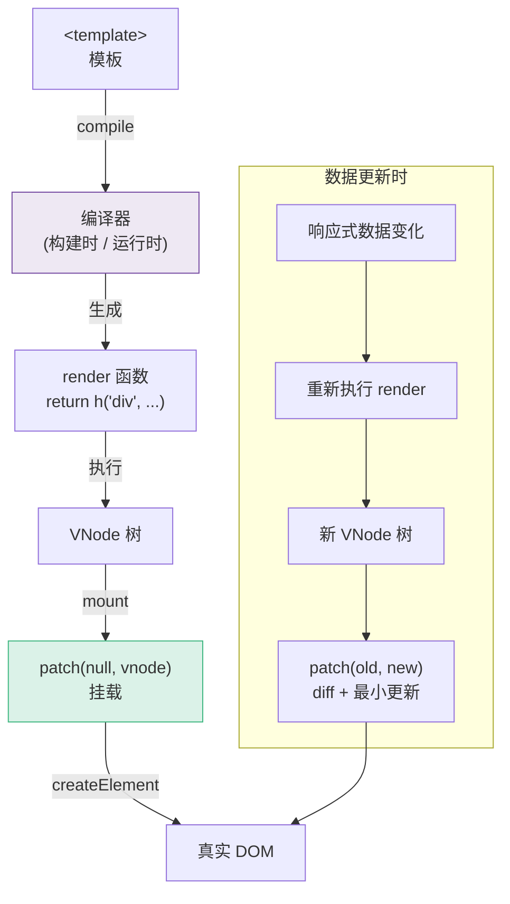
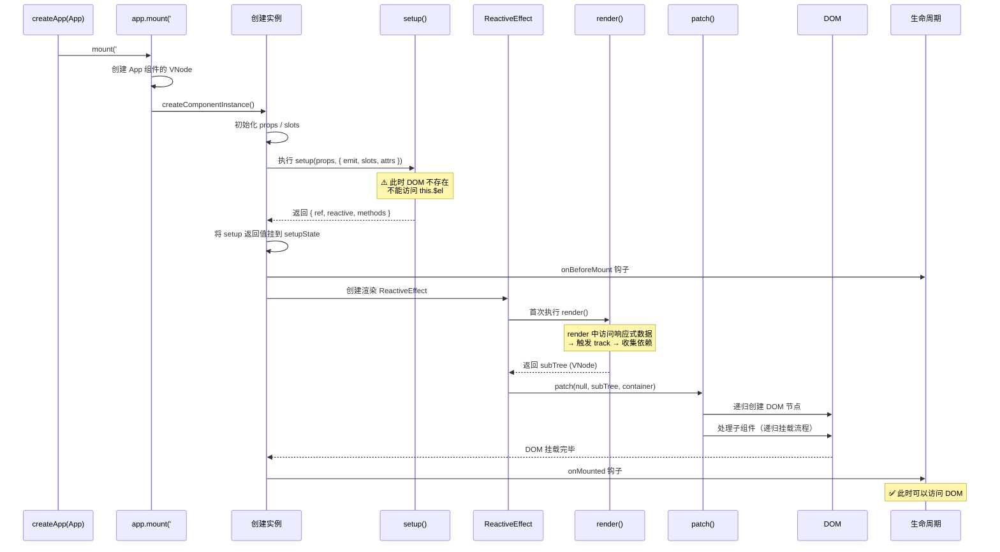
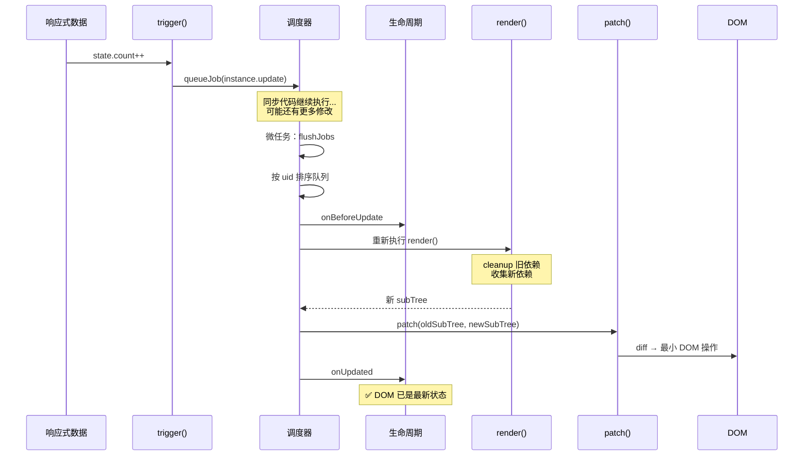
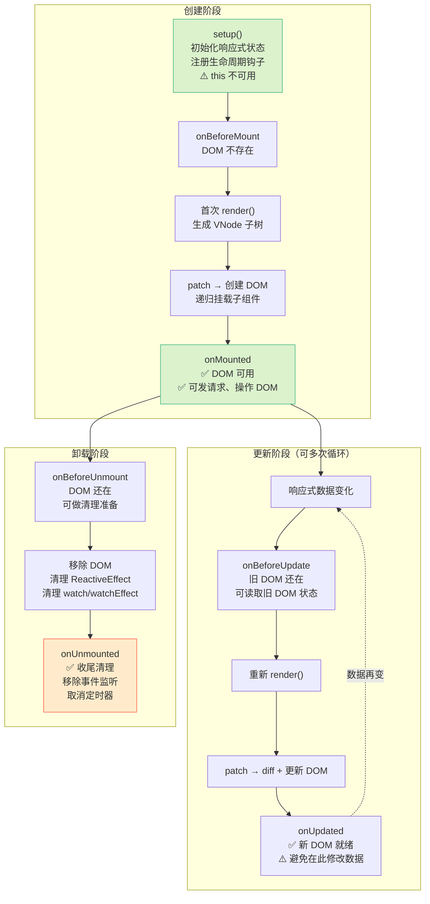
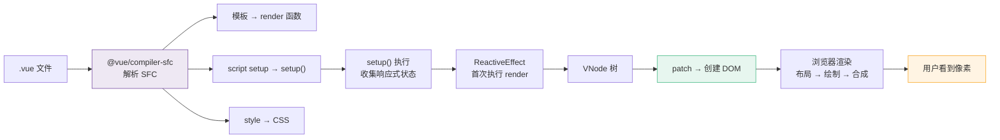

# L36 · 组件实例与渲染流程

```
🎯 本节目标：理解 Vue 3 组件从创建到挂载到更新的完整流程
📦 本节产出：完整的组件生命周期心智模型 + 理解 setup 的执行时机
🔗 前置钩子：L31-L35 的响应式 + VDOM + 调度器
🔗 后续钩子：L37 将讲 Composition API 的设计决策
```

---

## 1. 组件渲染全流程



---

## 2. 组件实例内部结构

每个组件实例 (`ComponentInternalInstance`) 包含大量信息：

```typescript
// 简化版组件实例
interface ComponentInstance {
  uid: number               // 唯一 ID，用于调度器排序（父 < 子）
  type: Component            // 组件定义（setup函数、render函数等）
  parent: ComponentInstance | null

  // VNode
  vnode: VNode              // 组件自身的 VNode
  subTree: VNode            // render() 返回的 VNode 子树

  // 状态
  props: Record<string, any>
  setupState: Record<string, any>  // setup() 返回的状态
  data: Record<string, any>        // Options API 的 data（如果有）

  // 插槽和事件
  slots: Record<string, Function>
  emit: (event: string, ...args: any[]) => void

  // 生命周期钩子（数组是因为 mixin 可能注册多个）
  bm: Function[] | null   // beforeMount
  m: Function[] | null     // mounted
  bu: Function[] | null    // beforeUpdate
  u: Function[] | null     // updated
  bum: Function[] | null   // beforeUnmount
  um: Function[] | null    // unmounted

  // 渲染
  effect: ReactiveEffect   // 组件的渲染 effect
  update: () => void        // 触发重新渲染的函数

  // Composition API
  provides: Record<string | symbol, any>  // provide 的值
  refs: Record<string, any>               // template refs
}
```

**为什么 uid 很重要？** 调度器按 uid 排序更新队列，确保父组件先于子组件渲染。L35 中讲的 `queue.sort((a, b) => a.id - b.id)` 就是用这个 uid。

---

## 3. 挂载流程详解



### 关键细节

1. **setup 只执行一次**（不像 React hooks 每次渲染都重新执行）
2. **render 函数在 ReactiveEffect 中执行**，所以 render 中读取的响应式数据会被自动 track
3. **子组件在递归 patch 中挂载**，所以子组件的 `onMounted` 先于父组件的 `onMounted` 执行

```
挂载顺序（嵌套组件）：
Parent setup()
  → Child setup()
  → Child onBeforeMount
  → Child render + mount
  → Child onMounted        ← 子先 mounted
Parent onMounted             ← 父后 mounted
```

---

## 4. 更新流程详解



### 更新避免

```typescript
// Vue 3 的优化：如果 props 没变，子组件不会重新渲染
// 这是通过编译器 + runtime 的协作实现的

// 编译器判断：这个子组件的 props 是否是动态的
<ChildComp :msg="staticString" />    // 静态 prop → 不会触发子组件更新
<ChildComp :msg="dynamicRef" />      // 动态 prop → 数据变化时才更新子组件
```

---

## 5. 生命周期完整图



### 各钩子的使用建议

| 钩子 | 典型用途 | 注意事项 |
|------|---------|---------|
| `setup` | 初始化状态、注册钩子 | 不能访问 DOM |
| `onMounted` | 发请求、操作 DOM、初始化第三方库 | 子组件已 mounted |
| `onBeforeUpdate` | 读取旧 DOM 状态（如滚动位置） | 很少用 |
| `onUpdated` | DOM 已更新后的操作 | **不要修改数据**（会死循环） |
| `onBeforeUnmount` | 清理准备 | DOM 还在 |
| `onUnmounted` | 移除事件监听、定时器、WebSocket | |

---

## 6. setup 的特殊地位

```typescript
// Options API 两个钩子 → Composition API 一个 setup
//
// beforeCreate() — 在 setup 之前（props 未初始化）
// setup()        — ← 就是这个时间点
// created()      — 在 setup 之后
//
// Composition API 中没有 beforeCreate/created
// 因为 setup 本身就是那个阶段

export default {
  setup(props, context) {
    // props 已初始化 ✅
    // DOM 不存在 ❌
    // this 不可用 ❌（Composition API 不依赖 this）

    const count = ref(0)

    // 注册生命周期钩子
    onMounted(() => {
      console.log('DOM 已挂载')
    })

    // 返回给模板使用的值
    return { count }
  }
}
```

### `<script setup>` 的编译原理

```vue
<!-- 开发者写的 -->
<script setup>
const count = ref(0)
onMounted(() => { /* ... */ })
</script>

<!-- 编译器转换为 -->
<script>
export default {
  setup() {
    const count = ref(0)
    onMounted(() => { /* ... */ })
    return { count }  // 自动收集顶层变量作为返回值
  }
}
</script>
```

---

## 7. 从代码到像素：完整链路



---

## 8. 本节总结

### 检查清单

- [ ] 能画出组件从 setup → render → mount 的完整流程
- [ ] 理解组件实例包含的核心属性（uid、subTree、effect、hooks）
- [ ] 理解更新流程：数据变化 → queueJob → render → patch → DOM
- [ ] 知道嵌套组件的 mounted 顺序（子先于父）
- [ ] 理解每个生命周期钩子的调用时机和适用场景
- [ ] 理解 setup 在生命周期中的位置（= beforeCreate + created）
- [ ] 理解 `<script setup>` 的编译原理

### Git 提交

```bash
git add .
git commit -m "L36: 组件实例 + 渲染流程 + 生命周期 + script setup 编译"
```

### 🔗 → 下一节

L37 将回答一个设计哲学问题：为什么 Vue 3 要从 Options API 转向 Composition API？它解决了什么问题？
